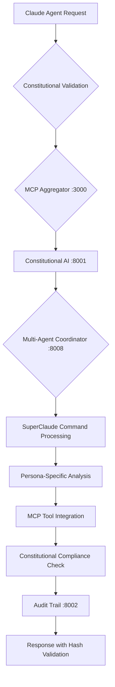
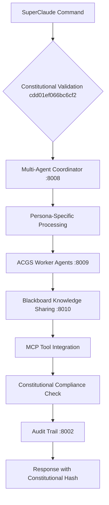

# CLAUDE.md - ACGS-SuperClaude Integration for Warp Drive

This file provides enhanced guidance to Claude integrating SuperClaude's specialized development framework with ACGS's constitutional AI governance, optimized for Warp Drive knowledge sharing and collaboration.

## Warp Drive Integration Overview

This configuration enables seamless integration with Warp Drive's knowledge and collaboration features:
- **Shareable Knowledge**: All command patterns and personas are documented for team sharing
- **Collaborative Workflows**: Multi-agent coordination patterns designed for team environments
- **Knowledge Base**: Constitutional compliance framework serves as reusable organizational knowledge
- **Team Onboarding**: Standardized commands and personas for consistent team development practices

## Constitutional Compliance (CRITICAL)
**IMMUTABLE REQUIREMENTS:**
- **ALWAYS** validate constitutional hash `cdd01ef066bc6cf2` in all agent communications
- **NEVER** bypass constitutional compliance validation for any operation
- **ALWAYS** implement pre-execution, runtime, and post-execution compliance checks
- **ESCALATE** to human oversight immediately for constitutional violations

## Multi-Agent Coordination Guidelines

### Agent Communication Patterns
- Use hierarchical coordination: Claude agents for strategic planning, OpenCode agents for execution
- Implement document-based communication following MetaGPT assembly line paradigm
- Use MCP (Model Context Protocol) for Claude agent integration with services
- Follow A2A (Agent2Agent) protocol for external framework interoperability
- Maintain complete audit trail for all agent interactions
- **ALL COMMUNICATIONS MUST INCLUDE constitutional hash `cdd01ef066bc6cf2`**

### Warp Drive Collaboration Patterns
- **Knowledge Blocks**: Each SuperClaude command is documented as a reusable knowledge block
- **Team Templates**: Constitutional personas serve as shareable team development templates
- **Workflow Documentation**: All coordination patterns are documented for team knowledge sharing
- **Best Practices Library**: Constitutional compliance framework provides organizational standards
- **Onboarding Guides**: Standardized command patterns facilitate new team member integration

### Performance Requirements (NON-NEGOTIABLE)
- **P99 Latency**: <5ms for coordination operations, <2ms for cached decisions
- **Throughput**: >100 RPS for task handoffs between agents
- **Cache Hit Rate**: >85% for constitutional decisions and agent capabilities
- **Constitutional Compliance Rate**: 100% (no exceptions)
- **Escalation Response**: <30 seconds for human-in-the-loop triggers

## SuperClaude Integration

### Core Configuration
@include shared/superclaude-core.yml#Core_Philosophy
@include shared/acgs-constitutional-compliance.yml#Constitutional_Framework

### Enhanced Command Framework for Warp Drive
SuperClaude provides 19 specialized commands with constitutional compliance integration, designed for team knowledge sharing:

#### Development Commands (Shareable Knowledge Blocks)
- `/build` - Project builder with constitutional validation | **Team Benefit**: Standardized build processes
- `/dev-setup` - Environment setup with ACGS compliance | **Team Benefit**: Consistent dev environments
- `/test` - Testing framework with audit integration | **Team Benefit**: Unified testing standards

#### Analysis & Quality Commands (Collaborative Workflows)
- `/review` - Code review with constitutional compliance checks | **Team Benefit**: Standardized review process
- `/analyze` - System analysis with governance validation | **Team Benefit**: Consistent analysis methodology
- `/troubleshoot` - Debugging with audit trail | **Team Benefit**: Shared debugging approaches
- `/improve` - Optimization with compliance verification | **Team Benefit**: Team optimization standards
- `/explain` - Documentation with constitutional context | **Team Benefit**: Consistent documentation format

#### Operations & Security Commands (Team Safety Standards)
- `/deploy` - Deployment with constitutional validation | **Team Benefit**: Safe deployment practices
- `/migrate` - Migrations with compliance checks | **Team Benefit**: Risk-mitigated migrations
- `/scan` - Security audits with governance integration | **Team Benefit**: Team security standards
- `/estimate` - Planning with constitutional context | **Team Benefit**: Consistent estimation methods
- `/cleanup` - Maintenance with audit trail | **Team Benefit**: Shared maintenance practices
- `/git` - Git operations with compliance tracking | **Team Benefit**: Standardized Git workflows

#### Design & Workflow Commands (Knowledge Collaboration)
- `/design` - Architecture with constitutional principles | **Team Benefit**: Consistent design patterns
- `/spawn` - Parallel execution with governance oversight | **Team Benefit**: Team coordination patterns
- `/document` - Documentation with compliance validation | **Team Benefit**: Documentation standards
- `/load` - Context loading with audit integration | **Team Benefit**: Shared context management
- `/task` - Task management with constitutional tracking | **Team Benefit**: Team task coordination

### Cognitive Personas with Constitutional Compliance

#### Available Personas (Team Knowledge Templates)
| Persona | Constitutional Focus | ACGS Integration | Use Cases | **Warp Drive Benefit** |
|---------|---------------------|------------------|-----------|------------------------|
| **architect** | Constitutional system design | Governance framework integration | Architecture with compliance | Shareable architecture patterns |
| **frontend** | Constitutional UX principles | Audit-enabled UI | Compliant user interfaces | Consistent UI/UX standards |
| **backend** | Constitutional API design | Service governance | Compliant backend systems | Standardized API development |
| **security** | Constitutional security | ACGS security framework | Security with governance | Team security best practices |
| **analyzer** | Constitutional analysis | Audit trail integration | Compliant debugging | Shared debugging methodologies |
| **qa** | Constitutional quality | Compliance testing | Quality with governance | Team quality standards |
| **performance** | Constitutional optimization | Performance governance | Compliant optimization | Performance optimization guides |
| **refactorer** | Constitutional code quality | Governance-aware refactoring | Compliant code improvement | Code quality standards |
| **mentor** | Constitutional knowledge sharing | Audit-enabled documentation | Compliant knowledge transfer | Team knowledge transfer protocols |

### Persona Activation with Constitutional Validation
```bash
# All personas automatically include constitutional compliance
/analyze --code --persona-architect     # Constitutional systems thinking
/build --react --persona-frontend       # Constitutional UX development  
/scan --security --persona-security     # Constitutional security analysis
/troubleshoot --prod --persona-analyzer # Constitutional root cause analysis
```

## Warp Drive Quick Start Guide

### For New Team Members
1. **Load Project Context**: `/load` - Establishes constitutional context and project understanding
2. **Choose Your Persona**: Select from available personas based on your role and task
3. **Start with Analysis**: `/analyze --code --persona-[your-role]` - Get oriented with constitutional compliance
4. **Build with Standards**: Use `/build` or `/dev-setup` for consistent development environment

### For Team Leads
1. **Share Knowledge Blocks**: Document successful command patterns in Warp Drive knowledge base
2. **Establish Team Personas**: Standardize persona usage across team members
3. **Monitor Compliance**: Use constitutional hash validation for team accountability
4. **Create Workflows**: Document multi-command workflows for common team tasks

### Knowledge Sharing Patterns
- **Command Templates**: Save successful command combinations as team templates
- **Persona Workflows**: Document role-specific command sequences
- **Constitutional Standards**: Share compliance patterns across projects
- **Best Practice Libraries**: Build reusable knowledge blocks for common tasks

### Constitutional MCP Integration

#### Enhanced MCP Architecture
@include commands/shared/flag-inheritance.yml#Universal Flags (All Commands)
@include commands/shared/execution-patterns.yml#Servers
@include shared/acgs-mcp-integration.yml#Constitutional_MCP_Framework

#### MCP Services with Constitutional Compliance
- **Context7**: Library documentation with constitutional validation
- **Sequential**: Multi-step reasoning with audit trails
- **Magic**: AI components with governance oversight
- **Puppeteer**: Browser automation with compliance tracking

#### Constitutional MCP Workflow


### Advanced Token Economy with Constitutional Oversight
@include shared/superclaude-core.yml#Advanced_Token_Economy
@include shared/acgs-constitutional-compliance.yml#Token_Economy_Governance

### Thinking Modes with Constitutional Context
@include commands/shared/flag-inheritance.yml#Universal Flags (All Commands)

#### Constitutional Thinking Depth Control
```bash
# Standard constitutional analysis
/analyze --think --constitutional-hash cdd01ef066bc6cf2

# Deep constitutional analysis  
/design --think-hard --constitutional-compliance

# Maximum constitutional depth
/troubleshoot --ultrathink --constitutional-oversight
```

### Evidence-Based Development with Constitutional Compliance
@include shared/superclaude-core.yml#Evidence_Based_Standards
@include shared/acgs-constitutional-compliance.yml#Evidence_Framework

SuperClaude with ACGS encourages:
- Constitutional documentation for all design decisions
- Compliance testing for all quality improvements
- Governance metrics for all performance work
- Constitutional validation for all deployments
- Constitutional analysis for all architectural choices

### Performance Standards with Constitutional Compliance
@include shared/superclaude-core.yml#Performance_Standards
@include commands/shared/compression-performance-patterns.yml#Performance_Baselines

**Constitutional Performance Targets:**
- **Throughput**: ≥1000 RPS with 100% constitutional compliance
- **Latency**: P99 ≤ 5ms with constitutional validation
- **Cache Hit Rate**: 85%+ with constitutional cache validation
- **Constitutional Compliance**: 100% (no exceptions)
- **Audit Trail Completeness**: 100% for all operations

### Security Standards with Constitutional Framework
@include shared/superclaude-rules.yml#Security_Standards
@include commands/shared/security-patterns.yml#OWASP_Top_10
@include commands/shared/security-patterns.yml#Validation_Levels
@include shared/acgs-constitutional-compliance.yml#Security_Framework

### Constitutional Error Recovery
@include shared/superclaude-mcp.yml#Error_Recovery
@include shared/acgs-constitutional-compliance.yml#Error_Handling

### Session Management with Constitutional Tracking
@include shared/superclaude-core.yml#Session_Management
@include commands/shared/system-config.yml#Session_Settings
@include shared/acgs-constitutional-compliance.yml#Session_Governance

## ACGS Service Architecture Integration

### Production-Grade Services with SuperClaude Integration

- **Constitutional AI Service** (port 8001): SuperClaude command validation
- **Integrity Service** (port 8002): SuperClaude audit integration
- **Multi-Agent Coordinator** (port 8008): SuperClaude persona coordination
- **Worker Agents** (port 8009): SuperClaude specialized agent integration
- **Blackboard Service** (port 8010): SuperClaude knowledge sharing

### SuperClaude-ACGS Coordination Workflow



## Team Collaboration Examples

### Frontend Team Workflow
```bash
# Frontend developer onboarding
/load                                    # Load project context
/dev-setup --frontend --persona-frontend # Setup frontend environment
/analyze --ui --persona-frontend         # Analyze UI components
/build --react --persona-frontend        # Build with frontend standards
/test --frontend --persona-qa           # Test with QA standards
```

### Backend Team Workflow
```bash
# Backend developer onboarding  
/load                                    # Load project context
/dev-setup --backend --persona-backend  # Setup backend environment
/analyze --api --persona-backend         # Analyze API structure
/scan --security --persona-security      # Security validation
/deploy --staging --persona-backend      # Deploy with standards
```

### Architecture Review Workflow
```bash
# Team architecture review
/load                                      # Load project context
/analyze --architecture --persona-architect # Architecture analysis
/design --system --persona-architect       # System design review
/document --architecture --persona-mentor  # Document decisions
/review --design --persona-architect       # Peer review process
```

## Development Environment Setup

```bash
# Initial setup with SuperClaude integration
python -m venv .venv
source .venv/bin/activate
pip install -r requirements.txt

# Start ACGS infrastructure with SuperClaude support
docker compose -f infrastructure/docker/docker-compose.acgs.yml up -d

# Validate SuperClaude-ACGS integration
curl http://localhost:8001/health  # Constitutional AI
curl http://localhost:8008/health  # Multi-Agent Coordinator
curl http://localhost:3000/health  # MCP Aggregator

# Test SuperClaude commands with constitutional compliance
/load                              # Load project with constitutional context
/analyze --code --constitutional-hash cdd01ef066bc6cf2  # Constitutional analysis
/analyze --persona-architect --constitutional-compliance  # Constitutional architecture
```

## Testing Commands with Constitutional Compliance

```bash
# Constitutional compliance testing
make test-constitutional
make test-superclaude-integration

# Multi-agent coordination with SuperClaude
python tests/multi_agent_test_runner.py --superclaude --constitutional-hash cdd01ef066bc6cf2
pytest tests/unit/superclaude_acgs_coordination/ -v
pytest tests/integration/constitutional_superclaude/ -v

# SuperClaude performance validation
python tests/performance/test_superclaude_performance.py --constitutional-compliance
```

## Constitutional Compliance Validation

All SuperClaude operations must:
1. Include constitutional hash `cdd01ef066bc6cf2` in requests
2. Validate constitutional compliance pre-execution
3. Monitor constitutional adherence during execution
4. Log constitutional compliance post-execution
5. Escalate constitutional violations immediately

## Command Categories with Constitutional Context

### Development (Constitutional Framework)
- `/build` - Constitutional project development
- `/dev-setup` - Constitutional environment setup
- `/test` - Constitutional testing framework

### Analysis & Improvement (Constitutional Governance)
- `/review` - Constitutional code review
- `/analyze` - Constitutional system analysis
- `/troubleshoot` - Constitutional debugging
- `/improve` - Constitutional optimization
- `/explain` - Constitutional documentation

### Operations (Constitutional Security)
- `/deploy` - Constitutional deployment
- `/migrate` - Constitutional migrations
- `/scan` - Constitutional security validation
- `/estimate` - Constitutional project planning
- `/cleanup` - Constitutional maintenance
- `/git` - Constitutional version control

### Design & Workflow (Constitutional Architecture)
- `/design` - Constitutional system design
- `/spawn` - Constitutional parallel execution
- `/document` - Constitutional documentation
- `/load` - Constitutional context management
- `/task` - Constitutional task coordination

## Warp Drive Knowledge Management

### Creating Shareable Knowledge Blocks
1. **Command Patterns**: Document successful command combinations
   ```bash
   # Example: Full-stack development workflow
   /load → /dev-setup --fullstack → /analyze --code → /build → /test → /deploy
   ```

2. **Persona Workflows**: Create role-specific templates
   ```bash
   # Security Review Template
   /load → /scan --security --persona-security → /analyze --vulnerabilities → /document --security
   ```

3. **Constitutional Standards**: Share compliance patterns
   ```bash
   # Constitutional Validation Template
   /constitutional-validate --hash cdd01ef066bc6cf2 → /analyze → /deploy
   ```

### Team Knowledge Base Structure
```
Warp Drive Knowledge Base/
├── Command Templates/
│   ├── Frontend Development/
│   ├── Backend Development/
│   ├── Security Reviews/
│   └── Architecture Planning/
├── Persona Guides/
│   ├── Architect Workflows/
│   ├── Security Patterns/
│   └── QA Procedures/
└── Constitutional Standards/
    ├── Compliance Checks/
    ├── Audit Procedures/
    └── Governance Patterns/
```

### Knowledge Sharing Best Practices
- **Tag Commands**: Use consistent tags for discoverability
- **Document Context**: Include when and why to use specific patterns
- **Version Control**: Track evolution of team practices
- **Feedback Loops**: Collect team input on knowledge block effectiveness

## Research Context

This integration demonstrates constitutional AI governance with SuperClaude's specialized development framework, providing production-ready multi-agent coordination while maintaining 100% constitutional compliance with hash `cdd01ef066bc6cf2`.

The Warp Drive integration enables teams to:
- Share standardized development workflows
- Maintain consistent quality standards
- Onboard new team members efficiently
- Build organizational knowledge assets
- Ensure constitutional compliance across teams

---
*ACGS-SuperClaude Integration v2.0 | Constitutional AI Governance | Evidence-based methodology | Warp Drive Knowledge Collaboration*
*Constitutional Hash: cdd01ef066bc6cf2 - ALWAYS VALIDATE*
