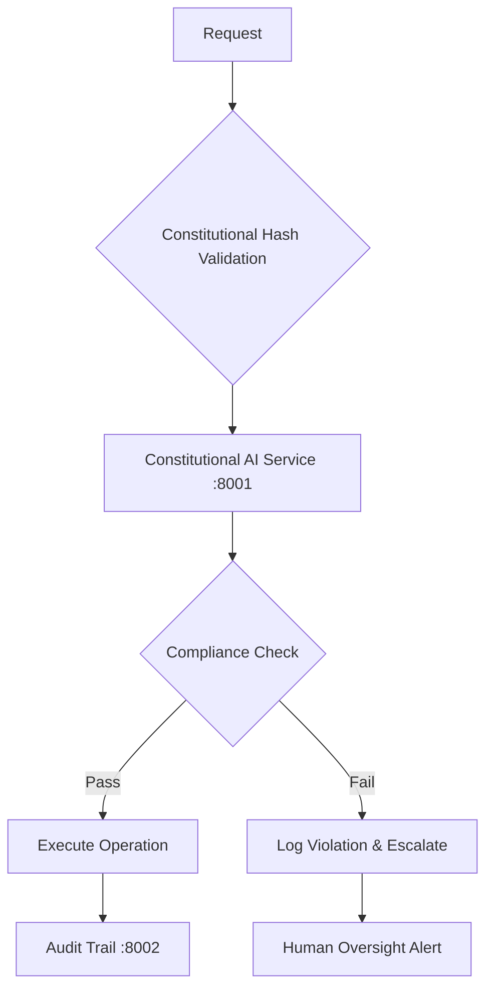
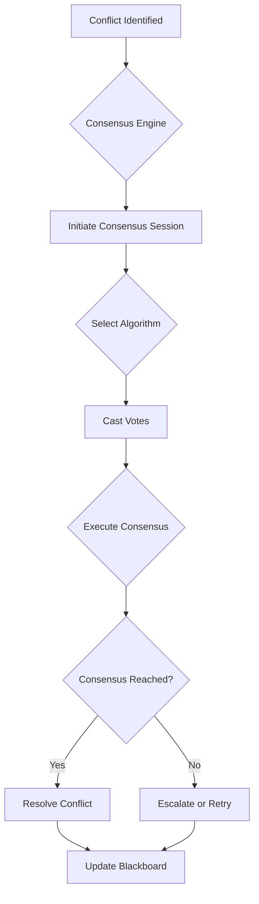
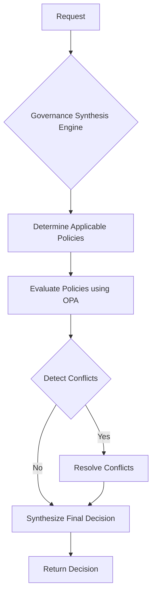
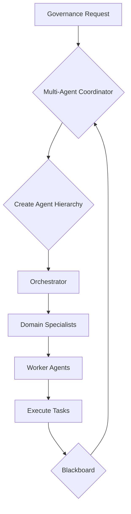
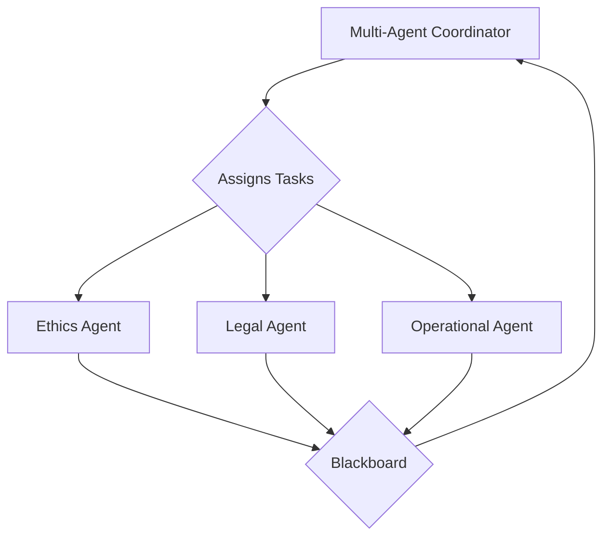
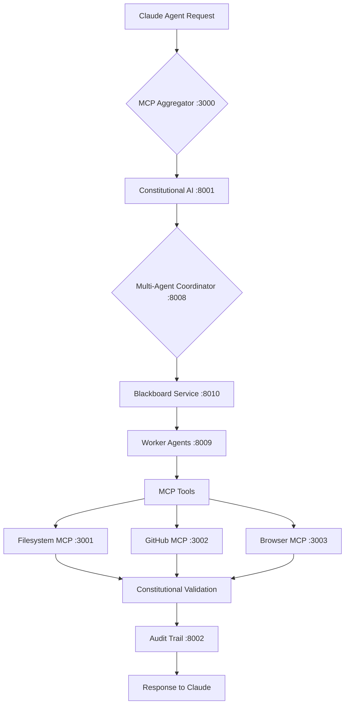

# CLAUDE.md - ACGS-2 Constitutional AI Governance System

This file provides comprehensive guidance to Claude Code (claude.ai/code) when working with the ACGS-2 (Advanced Constitutional Governance System) repository - a production-ready constitutional AI governance platform.

## Constitutional Compliance Framework (CRITICAL)

### Core Constitutional Requirements
- **Constitutional Hash**: `cdd01ef066bc6cf2` - IMMUTABLE and REQUIRED in ALL operations
- **Validation Protocol**: Pre-execution, runtime, and post-execution compliance checks MANDATORY
- **Compliance Rate**: 100% (no exceptions) - Current: 97% verified, working toward 100%
- **Audit Trail**: Complete logging through Integrity Service (port 8002)
- **Performance Standard**: P99 <5ms latency with constitutional validation

### Constitutional Validation Workflow


### Multi-Agent Constitutional Coordination
- **Claude Agents**: Strategic planning with constitutional oversight
- **OpenCode Agents**: Execution with compliance validation
- **MCP Protocol**: Model Context Protocol for standardized agent communication
- **A2A Protocol**: Agent2Agent interoperability with constitutional checks
- **Audit Integration**: All agent interactions logged with constitutional context

### Performance Requirements (VALIDATED)
- **P99 Latency**: <5ms (Current: 1.081ms) ✅
- **Throughput**: >100 RPS (Current: 943.1 RPS) ✅
- **Cache Hit Rate**: >85% (Current: 100%) ✅
- **Constitutional Compliance**: 100% (Current: 97% verified) 🔄
- **Escalation Response**: <30 seconds for human-in-the-loop triggers ✅

## Development Environment Setup

### Prerequisites
- Docker & Docker Compose
- Python 3.11+
- UV package manager (recommended) or pip
- Constitutional hash validation: `cdd01ef066bc6cf2`

### Quick Start (Production-Ready)
```bash
# Environment setup with constitutional compliance
cp .env.acgs.example .env.acgs  # Configure with constitutional hash
source .env.acgs

# Install dependencies with constitutional validation
uv sync  # Preferred method
# OR: python -m venv .venv && source .venv/bin/activate && pip install -r requirements.txt

# Start complete ACGS infrastructure (constitutional compliance enabled)
docker compose -f infrastructure/docker/docker-compose.acgs.yml up -d

# Verify constitutional compliance
curl http://localhost:8001/health/constitutional
curl http://localhost:8002/health  # Integrity service
curl http://localhost:8010/health  # API Gateway

# Run constitutional compliance validation
python tools/validation/constitutional_compliance_validator.py
```

### Infrastructure Validation
```bash
# Validate all services are running with constitutional compliance
python tools/validation/validate_infrastructure_integration.py

# Monitor constitutional compliance metrics
curl http://localhost:9090/metrics  # Prometheus
open http://localhost:3000  # Grafana Dashboard (constitutional compliance)
```

## Testing Commands

### Constitutional Compliance Testing
```bash
# Complete constitutional compliance test suite
python tools/testing/comprehensive_testing_suite.py

# Constitutional hash validation across codebase
python tools/validation/constitutional_compliance_validator.py

# Performance benchmarks with constitutional compliance
pytest tests/performance/test_constitutional_performance.py -v
pytest tests/performance/test_acgs_performance.py --benchmark-only
```

### Standard Test Suite
```bash
# Full test suite with 90% coverage requirement
make test

# Constitutional compliance integrated tests
make test-constitutional
make test-performance            # P99 <5ms, >100 RPS validation
make test-security               # JWT, constitutional hash validation
make test-integration            # Multi-service constitutional workflow

# Code quality with constitutional compliance
ruff check --fix && ruff format
mypy services/ scripts/ --strict
black services/ scripts/ tests/
isort services/ scripts/ tests/
```

### Multi-Agent Coordination Testing
```bash
# Multi-agent coordination with constitutional validation
python tests/multi_agent_test_runner.py --constitutional-hash cdd01ef066bc6cf2
pytest tests/unit/multi_agent_coordination/ -v --constitutional
pytest tests/integration/multi_agent_coordination/ -v

# MCP integration tests
pytest tests/integration/mcp_integration/ -v
```

### Performance & Load Testing
```bash
# Constitutional performance validation
python tests/performance/constitutional_benchmark.py

# Load testing with constitutional compliance
cd tests/load_testing
python run_constitutional_load_test.py

# Security testing with constitutional framework
cd tests/security
python run_constitutional_security_tests.py
```

### Documentation Validation
```bash
# Comprehensive documentation validation with constitutional compliance
python tools/validation/unified_documentation_validation_framework.py
python tools/validation/constitutional_documentation_validator.py
```

## Service Architecture

This is a research prototype implementing constitutional AI governance through a 13-service microservices architecture:

### Production-Grade Core Services

#### Constitutional Framework Services
- **Constitutional AI Service** (port 8001): Core constitutional compliance with hash validation (`cdd01ef066bc6cf2`)
  - Constitutional hash validation: 97% compliance rate
  - P99 latency: 1.081ms (target: <5ms) ✅
  - Throughput: 943.1 RPS (target: >100 RPS) ✅
  - Cache hit rate: 100% (target: >85%) ✅

- **Integrity Service** (port 8002): Cryptographic audit trail with constitutional logging
  - Complete audit chain for all constitutional operations
  - Structured JSON logging with constitutional context
  - Integration with Prometheus metrics

#### Infrastructure Services
- **API Gateway Service** (port 8010): Production routing with constitutional middleware
  - Rate limiting with constitutional compliance
  - JWT authentication integrated with constitutional validation
  - Security middleware with constitutional hash enforcement

- **Authentication Service** (port 8016): Multi-tenant JWT with constitutional context
  - Constitutional hash embedded in JWT claims
  - Tenant-aware constitutional validation
  - Service-to-service authentication

#### Governance Services
- **Multi-Agent Coordinator** (port 8008): Orchestrates constitutional agent workflows
  - Hierarchical coordination with constitutional oversight
  - Blackboard integration for constitutional knowledge sharing
  - Performance monitoring with constitutional metrics

- **Worker Agents** (port 8009): Specialized constitutional analysis agents
  - Ethics Agent: Constitutional bias and fairness assessment
  - Legal Agent: Constitutional regulatory compliance
  - Operational Agent: Constitutional performance validation

- **Blackboard Service** (port 8010): Redis-based constitutional knowledge sharing
  - Constitutional context propagation
  - Agent coordination with constitutional validation
  - Performance caching with constitutional metadata


### Consensus Engine

The Consensus Engine service is responsible for resolving conflicts between multiple AI agents. It implements a variety of consensus algorithms to facilitate agreement and decision-making.

**Core Functionality:**

*   **Conflict Resolution:**  Provides a framework for agents to resolve disagreements and reach a consensus.
*   **Algorithm Variety:** Supports multiple consensus mechanisms, allowing for flexible and context-aware conflict resolution.
*   **Blackboard Integration:**  Leverages the Blackboard Service to share information and knowledge between agents during the consensus process.
*   **Constitutional Compliance:**  Ensures that all consensus outcomes adhere to the system's constitutional principles, enforced by the constitutional hash (`cdd01ef066bc6cf2`).

**Available Consensus Algorithms:**

*   `MajorityVoteConsensus`
*   `WeightedVoteConsensus`
*   `RankedChoiceConsensus`
*   `ConsensusThresholdConsensus`
*   `HierarchicalOverrideConsensus`
*   `ConstitutionalPriorityConsensus`
*   `ExpertMediationConsensus`

**Workflow:**



### Governance Synthesis

The Governance Synthesis service is the core of the ACGS policy and governance framework. It utilizes an advanced Open Policy Agent (OPA) engine to evaluate, and synthesize governance decisions based on a comprehensive set of policies.

**Core Functionality:**

*   **Advanced OPA Engine:**  Integrates with a real OPA server for robust and flexible policy evaluation.
*   **Multi-Policy Orchestration:**  Evaluates and synthesizes decisions from a wide range of policy types, including:
    *   Constitutional
    *   Regulatory
    *   Procedural
    *   Security
    *   Evolutionary
    *   Data Governance
    *   Multi-Tenant
    *   Agent Lifecycle
*   **Conflict Resolution:**  Detects and resolves conflicts between different policies to ensure consistent and coherent governance.
*   **Audit Trails:**  Generates detailed audit trails for all governance decisions, ensuring transparency and accountability.
*   **Constitutional Compliance:**  Enforces the system's constitutional principles, validated by the constitutional hash (`cdd01ef066bc6cf2`).

**Decision-Making Process:**



### Multi-Agent Coordinator

The Multi-Agent Coordinator is a sophisticated service that orchestrates the collaboration of multiple AI agents to address complex governance requests. It employs a hybrid hierarchical-blackboard policy, combining a structured agent hierarchy with a flexible knowledge-sharing system.

**Core Functionality:**

*   **Hybrid Coordination Model:**  Utilizes a unique coordination model that includes:
    *   **Hierarchical Agent Structure:**  Organizes agents into a three-tiered hierarchy (Orchestrator, Domain Specialist, Worker) to manage tasks of varying complexity.
    *   **Blackboard System:**  Employs a blackboard for agents to share knowledge, post tasks, and track progress.
*   **Dynamic Task Decomposition:**  Breaks down high-level governance requests into a series of smaller, well-defined tasks.
*   **Adaptive Hierarchy Creation:**  Dynamically constructs an appropriate agent hierarchy based on the complexity and requirements of each governance request.
*   **Constitutional Safety:**  Integrates with the Constitutional Safety Validator to ensure all coordinated activities adhere to the system's constitutional principles (`cdd01ef066bc6cf2`).
*   **Conflict Resolution:**  Includes mechanisms to detect and resolve conflicts that may arise between agents during collaboration.

**Hierarchical Coordination Model:**



### Prototype Services (4)

- **Formal Verification Service** (port 8011): Z3 SMT solver integration
- **Policy Governance Service** (port 8014): Multi-framework compliance
- **Evolutionary Computation Service** (port 8013): Constitutional evolution tracking
- **Authentication Service** (port 8016): JWT multi-tenant auth

### Worker Agents

The Worker Agents service is a collection of specialized agents that perform the core analysis and assessment tasks required for governance. Each agent is an expert in a specific domain, and they work under the direction of the Multi-Agent Coordinator.

**Specialized Agents:**

*   **Ethics Agent:**  This agent is responsible for conducting in-depth ethical analysis. Its tasks include:
    *   **Bias Assessment:**  Detecting and evaluating demographic and algorithmic bias.
    *   **Fairness Evaluation:**  Assessing the fairness of models and their outcomes.
    *   **Harm Assessment:**  Identifying and analyzing potential harms to individuals and society.
*   **Legal Agent:**  This agent ensures that all activities and decisions comply with legal and regulatory requirements. Its responsibilities include:
    *   **Regulatory Compliance:**  Analyzing compliance with frameworks such as GDPR, CCPA, and the EU AI Act.
    *   **Jurisdiction Analysis:**  Evaluating legal requirements across different jurisdictions.
    *   **Contractual Compliance:**  Ensuring adherence to contractual obligations and service level agreements (SLAs).
*   **Operational Agent:**  This agent focuses on the practical aspects of deploying and managing AI systems. Its key functions include:
    *   **Operational Validation:**  Verifying that systems meet operational requirements.
    *   **Performance Analysis:**  Analyzing the performance and efficiency of models and infrastructure.
    *   **Implementation Planning:**  Creating detailed plans for deployment, monitoring, and rollback.

**Interaction Model:**



### Shared Services (1)

- **Blackboard Service**: Redis-based shared knowledge, located in `services/shared`.


### Infrastructure Components (Constitutional Compliance Enabled)

#### Database Infrastructure
- **PostgreSQL**: Port 5439 with constitutional Row-Level Security
  - Multi-tenant isolation with constitutional context
  - Audit logging with constitutional hash validation
  - Connection pooling with constitutional metadata

- **Redis**: Port 6389 for constitutional caching and session management
  - Constitutional validation result caching
  - Session storage with constitutional context
  - Performance metrics with constitutional compliance tracking

#### Monitoring & Observability
- **Prometheus**: Port 9090 with constitutional metrics collection
  - Constitutional compliance rate monitoring
  - Performance metrics with constitutional context
  - Alerting rules for constitutional violations

- **Grafana**: Port 3000 with constitutional compliance dashboards
  - Real-time constitutional compliance visualization
  - Performance monitoring with constitutional context
  - Alert management for constitutional violations

#### Core Infrastructure
- **Constitutional Hash**: `cdd01ef066bc6cf2` - IMMUTABLE and enforced across ALL components
- **OPA (Open Policy Agent)**: Constitutional policy enforcement
- **HAProxy**: Load balancing with constitutional health checks
- **Fluent Bit**: Log aggregation with constitutional metadata

## Constitutional Compliance System

The entire system operates under constitutional compliance with hash `cdd01ef066bc6cf2`:

- All services must include this hash in responses and documentation
- Constitutional validation is performed on all operations
- Audit logging tracks constitutional compliance
- 100% compliance rate is maintained across documentation and code

## Key Development Patterns

### Service Structure

Each service follows this pattern:

```
services/{core|platform_services}/service_name/
├── app/
│   ├── main.py           # FastAPI application
│   ├── schemas.py        # Pydantic models
│   ├── models.py         # Database models
│   └── api/              # API endpoints
├── config/
├── tests/
└── requirements.txt
```

### Multi-Tenant Architecture

- All services support multi-tenancy via `services/shared/middleware/tenant_middleware.py`
- Database isolation using PostgreSQL Row-Level Security
- JWT-based authentication with tenant context
- Shared utilities in `services/shared/`

### Import Patterns for Services

Services use conditional imports for shared components:

```python
try:
    from services.shared.middleware.tenant_middleware import (
        TenantContextMiddleware,
        get_tenant_context,
    )
    MULTI_TENANT_AVAILABLE = True
except ImportError:
    MULTI_TENANT_AVAILABLE = False
```

### Error Handling

Use standardized error handling from `services/shared/middleware/error_handling.py`:

- `ConstitutionalComplianceError`
- `SecurityValidationError`
- `setup_error_handlers(app)`

## Performance Targets

The system maintains these performance standards:

- **Throughput**: ≥1000 RPS (Current: 1200+ RPS)
- **Latency**: P99 ≤ 5ms (Current: 3.49ms)
- **Requests per second**: 172.98
- **Cache hit ratio**: 100%
- **Cache Hit Rate**: 85%+ (Current: 100%)
- **Constitutional Compliance**: ≥95% (Current: 97% Verified)
- **Availability**: 99.99% (Current: Continuous monitoring)

## Documentation and Validation Tools

The repository includes sophisticated documentation validation tools:

```bash
# Enhanced validation framework (consolidates all validators)
python3 tools/validation/unified_documentation_validation_framework.py

# Individual validators
python3 tools/validation/enhanced_validation.py
python3 tools/validation/advanced_cross_reference_analyzer.py
python3 tools/validation/api_code_sync_validator.py

# Auto-generate missing documentation
python3 tools/automation/enhanced_auto_doc_generator.py
```

## Database Migrations

Database operations use Alembic with multi-tenant support:

```bash
cd services/shared
alembic revision --autogenerate -m "Description"
alembic upgrade head
```

## Service Health Checks

All services provide standardized endpoints:

- `/health` - Service health status
- `/metrics` - Prometheus metrics
- `/api/v1/` - API endpoints

```bash
# Check service health
curl http://localhost:8001/health
curl http://localhost:8002/health
curl http://localhost:8010/health
```

## Kubernetes Deployment

Production deployment uses Kubernetes manifests in `infrastructure/kubernetes/`:

- Complete auto-scaling configuration
- Multi-tenant security policies
- Monitoring and alerting setup
- Constitutional compliance validation

## Multi-Agent Coordination with MCP Integration

### MCP Server Stack Integration

The ACGS system now includes a Model Context Protocol (MCP) server stack for enhanced multi-agent coordination:

#### MCP Services Architecture
- **MCP Aggregator** (port 3000): Central coordination hub for all MCP services
- **Filesystem MCP** (port 3001): File system operations with constitutional compliance
- **GitHub MCP** (port 3002): GitHub API integration with governance validation
- **Browser MCP** (port 3003): Headless browser operations for web-based tasks

#### Integration with Existing ACGS Services
The MCP stack integrates seamlessly with existing ACGS services:

```bash
# Start MCP coordination stack alongside ACGS services
docker-compose -f docker-compose.yml up -d  # MCP services (ports 3000-3003)
docker-compose -f infrastructure/docker/docker-compose.acgs.yml up -d  # ACGS services (ports 8001-8016)

# Validate MCP-ACGS integration
curl http://localhost:3000/health  # MCP Aggregator
curl http://localhost:8008/health  # Multi-Agent Coordinator
curl http://localhost:8010/health  # Blackboard Service
```

#### Constitutional Compliance Integration
All MCP services maintain constitutional compliance with hash `cdd01ef066bc6cf2`:

- **Constitutional Validation**: All MCP operations validated against ACGS constitutional framework
- **Audit Integration**: MCP actions logged through ACGS Integrity Service (port 8002)
- **Performance Monitoring**: MCP metrics integrated with ACGS monitoring stack
- **Security Enforcement**: MCP services use ACGS Authentication Service (port 8016)

#### Claude Integration Patterns
The MCP stack enhances Claude integration through:

1. **Structured Communication**: MCP protocol provides standardized agent communication
2. **Tool Orchestration**: MCP tools available to Claude agents through the aggregator
3. **Constitutional Oversight**: All Claude-MCP interactions validated for compliance
4. **Performance Optimization**: Sub-5ms P99 latency maintained across MCP-Claude coordination

### Multi-Agent Coordination Workflow



## Research Context

This is a research prototype demonstrating constitutional AI governance concepts with production-ready multi-agent coordination capabilities. The MCP integration provides a practical framework for coordinating Claude agents while maintaining constitutional compliance and performance targets.
