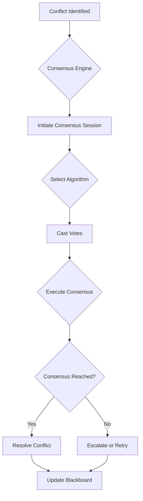
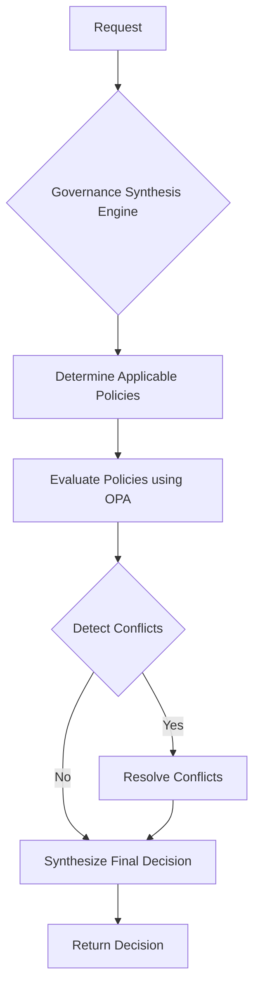
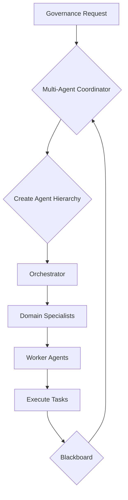
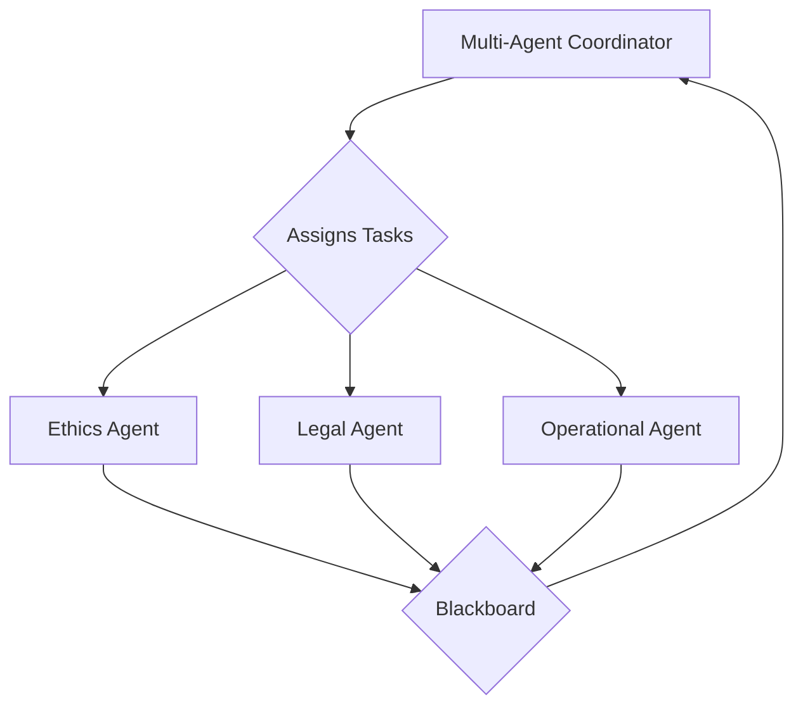

# CLAUDE.md

This file provides guidance to Claude Code (claude.ai/code) when working with code in this repository.

## Development Environment Setup

```bash
# Initial setup
python -m venv .venv
source .venv/bin/activate  # On Windows: .venv\Scripts\activate
pip install -r requirements.txt

# Start infrastructure with all services
docker compose -f infrastructure/docker/docker-compose.acgs.yml up -d

# Database initialization occurs during startup through SQL scripts
# (Embedded in docker-compose configuration via entrypoint initialization)

# Note: No additional migration steps required for this environment
```

## Testing Commands

```bash
# Run all tests
make test

# Specific test types
make test-unit                    # Unit tests only
make test-integration            # Integration tests only
make test-performance            # Performance tests
make test-security               # Security tests
make test-coverage               # Generate coverage report

# Multi-agent coordination tests
python tests/multi_agent_test_runner.py --test-types unit integration
pytest tests/unit/multi_agent_coordination/ -v
pytest tests/integration/multi_agent_coordination/ -v

# Load testing
cd tests/load_testing
python run_load_test.py

# Security testing
cd tests/security
python run_security_tests.py

# Documentation validation (comprehensive)
python3 tools/validation/unified_documentation_validation_framework.py
```

## Service Architecture

This is a research prototype implementing constitutional AI governance through a 13-service microservices architecture:

### Production-Grade Services (9)

- **Constitutional AI Service** (port 8001): Core constitutional compliance with hash validation (`cdd01ef066bc6cf2`)
- **Integrity Service** (port 8002): Database audit trail with cryptographic hash chaining
- **API Gateway Service** (port 8010): Production routing, rate limiting, and security middleware
- **Code Analysis Service** (port 8007): Static analysis with tenant routing
- **Context Service** (port 8012): Governance workflow integration
- **Consensus Engine**: Enables agreement between different AI agents.
- **Governance Synthesis**: Synthesizes governance rules from various sources.
- **Multi-Agent Coordinator**: Coordinates the actions of multiple AI agents.
- **Worker Agents**: Perform various tasks as directed by the coordinator.


### Consensus Engine

The Consensus Engine service is responsible for resolving conflicts between multiple AI agents. It implements a variety of consensus algorithms to facilitate agreement and decision-making.

**Core Functionality:**

*   **Conflict Resolution:**  Provides a framework for agents to resolve disagreements and reach a consensus.
*   **Algorithm Variety:** Supports multiple consensus mechanisms, allowing for flexible and context-aware conflict resolution.
*   **Blackboard Integration:**  Leverages the Blackboard Service to share information and knowledge between agents during the consensus process.
*   **Constitutional Compliance:**  Ensures that all consensus outcomes adhere to the system's constitutional principles, enforced by the constitutional hash (`cdd01ef066bc6cf2`).

**Available Consensus Algorithms:**

*   `MajorityVoteConsensus`
*   `WeightedVoteConsensus`
*   `RankedChoiceConsensus`
*   `ConsensusThresholdConsensus`
*   `HierarchicalOverrideConsensus`
*   `ConstitutionalPriorityConsensus`
*   `ExpertMediationConsensus`

**Workflow:**



### Governance Synthesis

The Governance Synthesis service is the core of the ACGS policy and governance framework. It utilizes an advanced Open Policy Agent (OPA) engine to evaluate, and synthesize governance decisions based on a comprehensive set of policies.

**Core Functionality:**

*   **Advanced OPA Engine:**  Integrates with a real OPA server for robust and flexible policy evaluation.
*   **Multi-Policy Orchestration:**  Evaluates and synthesizes decisions from a wide range of policy types, including:
    *   Constitutional
    *   Regulatory
    *   Procedural
    *   Security
    *   Evolutionary
    *   Data Governance
    *   Multi-Tenant
    *   Agent Lifecycle
*   **Conflict Resolution:**  Detects and resolves conflicts between different policies to ensure consistent and coherent governance.
*   **Audit Trails:**  Generates detailed audit trails for all governance decisions, ensuring transparency and accountability.
*   **Constitutional Compliance:**  Enforces the system's constitutional principles, validated by the constitutional hash (`cdd01ef066bc6cf2`).

**Decision-Making Process:**



### Multi-Agent Coordinator

The Multi-Agent Coordinator is a sophisticated service that orchestrates the collaboration of multiple AI agents to address complex governance requests. It employs a hybrid hierarchical-blackboard policy, combining a structured agent hierarchy with a flexible knowledge-sharing system.

**Core Functionality:**

*   **Hybrid Coordination Model:**  Utilizes a unique coordination model that includes:
    *   **Hierarchical Agent Structure:**  Organizes agents into a three-tiered hierarchy (Orchestrator, Domain Specialist, Worker) to manage tasks of varying complexity.
    *   **Blackboard System:**  Employs a blackboard for agents to share knowledge, post tasks, and track progress.
*   **Dynamic Task Decomposition:**  Breaks down high-level governance requests into a series of smaller, well-defined tasks.
*   **Adaptive Hierarchy Creation:**  Dynamically constructs an appropriate agent hierarchy based on the complexity and requirements of each governance request.
*   **Constitutional Safety:**  Integrates with the Constitutional Safety Validator to ensure all coordinated activities adhere to the system's constitutional principles (`cdd01ef066bc6cf2`).
*   **Conflict Resolution:**  Includes mechanisms to detect and resolve conflicts that may arise between agents during collaboration.

**Hierarchical Coordination Model:**



### Prototype Services (4)

- **Formal Verification Service** (port 8011): Z3 SMT solver integration
- **Policy Governance Service** (port 8014): Multi-framework compliance
- **Evolutionary Computation Service** (port 8013): Constitutional evolution tracking
- **Authentication Service** (port 8016): JWT multi-tenant auth

### Worker Agents

The Worker Agents service is a collection of specialized agents that perform the core analysis and assessment tasks required for governance. Each agent is an expert in a specific domain, and they work under the direction of the Multi-Agent Coordinator.

**Specialized Agents:**

*   **Ethics Agent:**  This agent is responsible for conducting in-depth ethical analysis. Its tasks include:
    *   **Bias Assessment:**  Detecting and evaluating demographic and algorithmic bias.
    *   **Fairness Evaluation:**  Assessing the fairness of models and their outcomes.
    *   **Harm Assessment:**  Identifying and analyzing potential harms to individuals and society.
*   **Legal Agent:**  This agent ensures that all activities and decisions comply with legal and regulatory requirements. Its responsibilities include:
    *   **Regulatory Compliance:**  Analyzing compliance with frameworks such as GDPR, CCPA, and the EU AI Act.
    *   **Jurisdiction Analysis:**  Evaluating legal requirements across different jurisdictions.
    *   **Contractual Compliance:**  Ensuring adherence to contractual obligations and service level agreements (SLAs).
*   **Operational Agent:**  This agent focuses on the practical aspects of deploying and managing AI systems. Its key functions include:
    *   **Operational Validation:**  Verifying that systems meet operational requirements.
    *   **Performance Analysis:**  Analyzing the performance and efficiency of models and infrastructure.
    *   **Implementation Planning:**  Creating detailed plans for deployment, monitoring, and rollback.

**Interaction Model:**



### Shared Services (1)

- **Blackboard Service**: Redis-based shared knowledge, located in `services/shared`.


### Infrastructure Components

- **PostgreSQL**: Port 5439 with Row-Level Security for multi-tenant isolation
- **Redis**: Port 6389 for caching and session management
- **Constitutional Hash**: `cdd01ef066bc6cf2` - enforced across all components for compliance validation

## Constitutional Compliance System

The entire system operates under constitutional compliance with hash `cdd01ef066bc6cf2`:

- All services must include this hash in responses and documentation
- Constitutional validation is performed on all operations
- Audit logging tracks constitutional compliance
- 100% compliance rate is maintained across documentation and code

## Key Development Patterns

### Service Structure

Each service follows this pattern:

```
services/{core|platform_services}/service_name/
├── app/
│   ├── main.py           # FastAPI application
│   ├── schemas.py        # Pydantic models
│   ├── models.py         # Database models
│   └── api/              # API endpoints
├── config/
├── tests/
└── requirements.txt
```

### Multi-Tenant Architecture

- All services support multi-tenancy via `services/shared/middleware/tenant_middleware.py`
- Database isolation using PostgreSQL Row-Level Security
- JWT-based authentication with tenant context
- Shared utilities in `services/shared/`

### Import Patterns for Services

Services use conditional imports for shared components:

```python
try:
    from services.shared.middleware.tenant_middleware import (
        TenantContextMiddleware,
        get_tenant_context,
    )
    MULTI_TENANT_AVAILABLE = True
except ImportError:
    MULTI_TENANT_AVAILABLE = False
```

### Error Handling

Use standardized error handling from `services/shared/middleware/error_handling.py`:

- `ConstitutionalComplianceError`
- `SecurityValidationError`
- `setup_error_handlers(app)`

## Performance Targets

The system maintains these performance standards:

- **Throughput**: ≥1000 RPS (Current: 1200+ RPS)
- **Latency**: P99 ≤ 5ms (Current: 3.49ms)
- **Requests per second**: 172.98
- **Cache hit ratio**: 100%
- **Cache Hit Rate**: 85%+ (Current: 100%)
- **Constitutional Compliance**: ≥95% (Current: 97% Verified)
- **Availability**: 99.99% (Current: Continuous monitoring)

## Documentation and Validation Tools

The repository includes sophisticated documentation validation tools:

```bash
# Enhanced validation framework (consolidates all validators)
python3 tools/validation/unified_documentation_validation_framework.py

# Individual validators
python3 tools/validation/enhanced_validation.py
python3 tools/validation/advanced_cross_reference_analyzer.py
python3 tools/validation/api_code_sync_validator.py

# Auto-generate missing documentation
python3 tools/automation/enhanced_auto_doc_generator.py
```

## Database Migrations

Database operations use Alembic with multi-tenant support:

```bash
cd services/shared
alembic revision --autogenerate -m "Description"
alembic upgrade head
```

## Service Health Checks

All services provide standardized endpoints:

- `/health` - Service health status
- `/metrics` - Prometheus metrics
- `/api/v1/` - API endpoints

```bash
# Check service health
curl http://localhost:8001/health
curl http://localhost:8002/health
curl http://localhost:8010/health
```

## Kubernetes Deployment

Production deployment uses Kubernetes manifests in `infrastructure/kubernetes/`:

- Complete auto-scaling configuration
- Multi-tenant security policies
- Monitoring and alerting setup
- Constitutional compliance validation

## Research Context

This is a research prototype demonstrating constitutional AI governance concepts. Some services contain mock implementations, placeholder functions, or TODO items as they represent theoretical frameworks being validated through practical implementation.
