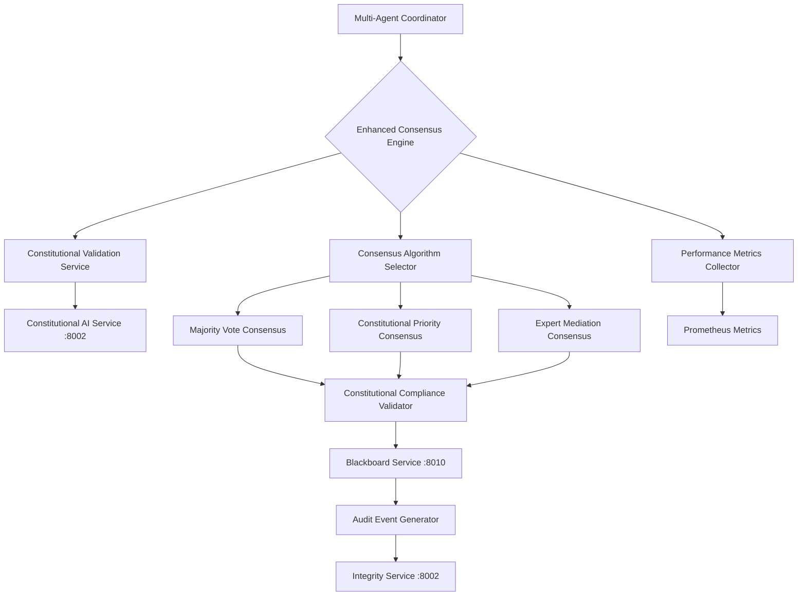

# ACGS Product Requirements Prompt (PRP) - Consensus Engine Enhancement
**Constitutional Hash: cdd01ef066bc6cf2**


**Constitutional Hash:** `cdd01ef066bc6cf2`  
**Created:** 2025-07-07T06:15:00Z  
**Feature:** Enhanced Constitutional Consensus Algorithm with Real-time Validation  
**Version:** 1.0  

---

## Goal
**What are we building?**
Enhance the ACGS Consensus Engine with a new real-time constitutional compliance validation algorithm that can dynamically verify consensus decisions against the constitutional framework while maintaining sub-5ms P99 latency targets.

**Constitutional Compliance Requirement:**
- [x] All consensus operations must validate constitutional hash: `cdd01ef066bc6cf2`
- [x] All consensus decisions must include constitutional compliance validation
- [x] All consensus metrics must meet ACGS targets (P99 < 3ms for consensus operations)

---

## Why
**Why is this needed and how does it integrate with ACGS?**
The current consensus engine lacks real-time constitutional validation, which means consensus decisions could theoretically violate constitutional principles. This enhancement ensures that all multi-agent consensus decisions are constitutionally compliant before being applied, maintaining the integrity of the ACGS governance framework.

**ACGS Integration Points:**
- **Constitutional AI Service** (port 8002): Real-time validation of consensus decisions against constitutional framework
- **Multi-Agent Coordinator** (port 8008): Enhanced coordination with constitutional validation in consensus loops
- **Blackboard Service** (port 8010): Constitutional compliance status propagation across all participating agents
- **Integrity Service** (port 8002): Audit trail for all constitutional consensus validations and any violations

**Performance Requirements:**
- P99 Latency: < 3ms for constitutional consensus validation
- Throughput: > 150 RPS for consensus operations
- Constitutional Compliance Rate: 100% (zero tolerance for constitutional violations)
- Cache Hit Rate: > 90% for constitutional decision patterns

---

## What
**What will the user experience?**
Users (primarily other ACGS services and multi-agent coordination systems) will experience:
1. **Transparent Constitutional Validation**: All consensus decisions include constitutional compliance status
2. **Real-time Feedback**: Immediate notification if a consensus decision violates constitutional principles
3. **Enhanced Audit Trail**: Complete constitutional validation history for all consensus operations
4. **Performance Assurance**: Sub-3ms constitutional validation with comprehensive metrics

**Constitutional Compliance User Experience:**
- All consensus operations return constitutional hash validation status
- All constitutional violations trigger immediate escalation and rollback
- All consensus responses include constitutional compliance metrics
- All audit events include constitutional validation details

---

## Context

### Documentation
**Relevant documentation and references:**
- ACGS Constitutional Framework: `/home/dislove/ACGS-2/services/core/constitutional-ai/README.md`
- Multi-Agent Coordination Patterns: `/home/dislove/ACGS-2/services/core/multi_agent_coordinator/README.md`
- Consensus Engine Architecture: `/home/dislove/ACGS-2/services/core/consensus_engine/README.md`
- Constitutional Policy Library: `/home/dislove/ACGS-2/services/core/governance-synthesis/gs_service/policies/`

**ACGS Service Documentation:**
- Service Architecture: `/home/dislove/ACGS-2/CLAUDE_CONTEXT_ENGINEERING.md`
- Constitutional Patterns: `/home/dislove/ACGS-2/services/examples/context_engineering/patterns/constitutional_service_pattern.py`
- Multi-Agent Patterns: `/home/dislove/ACGS-2/services/examples/context_engineering/multi_agent/blackboard_coordination.py`
- Testing Patterns: `/home/dislove/ACGS-2/services/examples/context_engineering/testing/constitutional_test_case.py`

### Code Examples
**Relevant code patterns from ACGS codebase:**
- Existing Consensus Algorithms: `/home/dislove/ACGS-2/services/core/consensus_engine/consensus_algorithms.py`
- Constitutional Validation: `/home/dislove/ACGS-2/services/shared/constitutional/safety_framework.py`
- Blackboard Coordination: `/home/dislove/ACGS-2/services/shared/blackboard/coordination_service.py`

**ACGS Patterns to Follow:**
```python
# Constitutional compliance pattern for consensus
CONSTITUTIONAL_HASH = "cdd01ef066bc6cf2"

async def validate_consensus_constitutional_compliance(
    consensus_decision: dict, 
    participating_agents: list
) -> ConstitutionalValidationResult:
    """Validate consensus decision against constitutional framework."""
    validation_start = time.perf_counter()
    
    # Check constitutional hash
    if consensus_decision.get("constitutional_hash") != CONSTITUTIONAL_HASH:
        return ConstitutionalValidationResult(
            valid=False, 
            violation="invalid_constitutional_hash"
        )
    
    # Validate against constitutional policies
    policy_validation = await constitutional_ai_service.validate_decision(
        decision=consensus_decision,
        context={"participating_agents": participating_agents}
    )
    
    validation_time = (time.perf_counter() - validation_start) * 1000
    
    return ConstitutionalValidationResult(
        valid=policy_validation.compliant,
        validation_time_ms=validation_time,
        constitutional_hash=CONSTITUTIONAL_HASH
    )

# Performance monitoring for consensus operations
@track_latency("consensus_constitutional_validation")
async def enhanced_consensus_with_constitutional_validation(
    consensus_session: ConsensusSession
) -> ConstitutionalConsensusResult:
    # Implementation with sub-3ms constitutional validation target
    pass
```

### Gotchas
**Important considerations and potential issues:**
- **Consensus Deadlock**: Constitutional validation failures during consensus could create deadlock situations
- **Performance Impact**: Adding constitutional validation to consensus loops could impact latency
- **Cache Invalidation**: Constitutional policy changes need to invalidate consensus validation cache
- **Agent Dropout**: Agents leaving consensus mid-validation need special handling

**ACGS-Specific Gotchas:**
- **Constitutional Hash Validation**: Must validate before AND after consensus computation
- **Multi-Agent Coordination**: Constitutional validation must be propagated to all participating agents
- **Performance Monitoring**: Constitutional validation latency must be included in consensus timing
- **Audit Logging**: Generate separate events for consensus decisions and constitutional validations
- **Blackboard Updates**: Constitutional compliance status must be reflected in blackboard state
- **Cache Strategy**: Constitutional validation results need tenant-aware caching
- **Error Cascading**: Constitutional violations in consensus must not cascade to other services

### Anti-patterns
**What to avoid:**
- Skipping constitutional validation for "internal" consensus decisions
- Caching constitutional validation results across different constitutional policy versions
- Allowing consensus to proceed with partial constitutional validation
- Using synchronous constitutional validation in async consensus loops

**ACGS Anti-patterns:**
- ❌ Bypassing constitutional validation for performance optimization
- ❌ Hardcoding consensus timeout values without constitutional validation consideration
- ❌ Skipping audit event generation for constitutional validation steps
- ❌ Using blocking I/O during constitutional validation in consensus critical path
- ❌ Ignoring constitutional validation latency in consensus performance metrics
- ❌ Missing rollback mechanisms for constitutional compliance failures

---

## Blueprint

### Data Models
**Pydantic models and database schemas:**

```python
from pydantic import BaseModel, Field
from datetime import datetime, timezone
from typing import Dict, List, Optional, Any
from uuid import UUID
from enum import Enum

class ConstitutionalValidationResult(BaseModel):
    """Result of constitutional compliance validation."""
    valid: bool
    constitutional_hash: str = Field(default="cdd01ef066bc6cf2")
    validation_time_ms: float
    violation_details: Optional[str] = None
    policy_violations: List[str] = Field(default_factory=list)
    timestamp: datetime = Field(default_factory=lambda: datetime.now(timezone.utc))

class ConsensusAlgorithmType(str, Enum):
    MAJORITY_VOTE = "majority_vote"
    WEIGHTED_VOTE = "weighted_vote"
    CONSTITUTIONAL_PRIORITY = "constitutional_priority"
    HIERARCHICAL_OVERRIDE = "hierarchical_override"
    EXPERT_MEDIATION = "expert_mediation"

class ConstitutionalConsensusSession(BaseModel):
    """Enhanced consensus session with constitutional validation."""
    session_id: UUID = Field(default_factory=uuid4)
    algorithm_type: ConsensusAlgorithmType
    participating_agents: List[str]
    consensus_topic: str
    constitutional_hash: str = Field(default="cdd01ef066bc6cf2")
    requires_constitutional_validation: bool = Field(default=True)
    max_validation_time_ms: float = Field(default=3.0)
    created_at: datetime = Field(default_factory=lambda: datetime.now(timezone.utc))

class ConstitutionalConsensusResult(BaseModel):
    """Result of constitutional consensus operation."""
    session_id: UUID
    consensus_reached: bool
    consensus_decision: Optional[Dict[str, Any]] = None
    constitutional_validation: ConstitutionalValidationResult
    participating_agents: List[str]
    consensus_time_ms: float
    total_time_ms: float
    constitutional_hash: str = Field(default="cdd01ef066bc6cf2")
    audit_trail: List[Dict[str, Any]] = Field(default_factory=list)
    timestamp: datetime = Field(default_factory=lambda: datetime.now(timezone.utc))
```

### Architecture
**High-level component design:**



### Tasks
**Step-by-step implementation plan:**

1. **Enhanced Constitutional Consensus Algorithm Implementation**
   - [ ] Create `ConstitutionalPriorityConsensus` algorithm class
   - [ ] Implement real-time constitutional validation integration
   - [ ] Add constitutional compliance caching layer
   - [ ] Implement consensus rollback for constitutional violations

2. **Performance Optimization for Constitutional Validation**
   - [ ] Implement async constitutional validation pipeline
   - [ ] Add constitutional validation result caching
   - [ ] Optimize consensus algorithm selection based on constitutional requirements
   - [ ] Add performance metrics for constitutional validation overhead

3. **Blackboard Integration Enhancement**
   - [ ] Propagate constitutional compliance status to blackboard
   - [ ] Implement constitutional violation notifications
   - [ ] Add consensus constitutional compliance events
   - [ ] Update agent coordination patterns for constitutional awareness

4. **Audit and Monitoring Integration**
   - [ ] Generate audit events for constitutional consensus validations
   - [ ] Add constitutional compliance metrics to Prometheus
   - [ ] Create Grafana dashboard for constitutional consensus monitoring
   - [ ] Implement alerting for constitutional violations in consensus

**Required ACGS Implementation Tasks:**
1. **Constitutional Service Setup**
   - [x] Implement ConstitutionalConsensusSession model
   - [x] Add constitutional hash validation middleware
   - [x] Setup constitutional compliance error handling

2. **Performance Monitoring Integration**
   - [ ] Add Prometheus metrics with constitutional labels
   - [ ] Implement latency tracking with 3ms SLA for constitutional validation
   - [ ] Setup performance regression alerts for consensus operations

3. **Multi-Agent Coordination Integration**
   - [ ] Implement enhanced blackboard service communication
   - [ ] Add constitutional consensus coordinator service registration
   - [ ] Setup constitutional-aware agent coordination patterns

4. **Audit Logging Integration**
   - [ ] Generate audit events for all constitutional consensus operations
   - [ ] Include constitutional compliance details in all consensus events
   - [ ] Setup constitutional consensus audit event aggregation

5. **Testing Implementation**
   - [ ] Inherit from ConstitutionalTestCase for consensus testing
   - [ ] Add constitutional compliance tests for consensus algorithms
   - [ ] Add performance validation tests for constitutional consensus
   - [ ] Add multi-agent constitutional consensus integration tests

### Pseudocode
**Implementation pseudocode:**

```python
class EnhancedConstitutionalConsensusEngine:
    """Enhanced consensus engine with real-time constitutional validation."""
    
    async def execute_constitutional_consensus(
        self, 
        session: ConstitutionalConsensusSession
    ) -> ConstitutionalConsensusResult:
        """Execute consensus with constitutional compliance validation."""
        
        consensus_start_time = time.perf_counter()
        audit_trail = []
        
        try:
            # Step 1: Pre-consensus constitutional validation
            await self._validate_session_constitutional_compliance(session)
            audit_trail.append({
                "step": "pre_consensus_validation",
                "status": "completed",
                "timestamp": datetime.now(timezone.utc).isoformat()
            })
            
            # Step 2: Execute consensus algorithm
            consensus_result = await self._execute_consensus_algorithm(session)
            consensus_time = (time.perf_counter() - consensus_start_time) * 1000
            
            # Step 3: Real-time constitutional validation of consensus decision
            if consensus_result.consensus_reached:
                constitutional_validation = await self._validate_consensus_decision(
                    consensus_result.decision,
                    session.participating_agents
                )
                
                # Step 4: Handle constitutional violations
                if not constitutional_validation.valid:
                    await self._handle_constitutional_violation(
                        session, consensus_result, constitutional_validation
                    )
                    return self._create_constitutional_violation_result(
                        session, constitutional_validation, audit_trail
                    )
            
            # Step 5: Propagate constitutional compliance to blackboard
            await self._propagate_constitutional_status_to_blackboard(
                session, consensus_result, constitutional_validation
            )
            
            # Step 6: Generate comprehensive audit events
            await self._generate_constitutional_consensus_audit_events(
                session, consensus_result, constitutional_validation
            )
            
            # Step 7: Update performance metrics
            total_time = (time.perf_counter() - consensus_start_time) * 1000
            await self._update_constitutional_consensus_metrics(
                consensus_time, constitutional_validation.validation_time_ms, total_time
            )
            
            return ConstitutionalConsensusResult(
                session_id=session.session_id,
                consensus_reached=consensus_result.consensus_reached,
                consensus_decision=consensus_result.decision,
                constitutional_validation=constitutional_validation,
                participating_agents=session.participating_agents,
                consensus_time_ms=consensus_time,
                total_time_ms=total_time,
                audit_trail=audit_trail
            )
            
        except ConstitutionalComplianceError as e:
            # Handle constitutional compliance failures
            await self._handle_constitutional_compliance_failure(session, e)
            raise
        except Exception as e:
            # Handle general consensus failures
            await self._handle_consensus_failure(session, e)
            raise
    
    async def _validate_consensus_decision(
        self, 
        decision: Dict[str, Any], 
        participating_agents: List[str]
    ) -> ConstitutionalValidationResult:
        """Validate consensus decision against constitutional framework."""
        
        validation_start = time.perf_counter()
        
        # Check constitutional hash in decision
        if decision.get("constitutional_hash") != CONSTITUTIONAL_HASH:
            return ConstitutionalValidationResult(
                valid=False,
                validation_time_ms=(time.perf_counter() - validation_start) * 1000,
                violation_details="Invalid constitutional hash in consensus decision"
            )
        
        # Validate against constitutional AI service
        constitutional_validation = await self.constitutional_ai_client.validate_decision(
            decision=decision,
            context={
                "operation_type": "consensus_decision",
                "participating_agents": participating_agents,
                "constitutional_hash": CONSTITUTIONAL_HASH
            }
        )
        
        validation_time = (time.perf_counter() - validation_start) * 1000
        
        # Ensure validation meets performance target (3ms)
        if validation_time > 3.0:
            await self._log_performance_violation(
                "constitutional_validation_latency",
                validation_time,
                3.0
            )
        
        return ConstitutionalValidationResult(
            valid=constitutional_validation.compliant,
            validation_time_ms=validation_time,
            policy_violations=constitutional_validation.violations,
            constitutional_hash=CONSTITUTIONAL_HASH
        )
```

---

## Validation

### Level 1: Syntax & Style
**Basic code quality checks:**
```bash
# ACGS-specific validation commands
ruff check services/core/consensus_engine/ --fix
mypy services/core/consensus_engine/
python tools/validation/constitutional_compliance_validator.py --service consensus_engine
```

### Level 2: Unit Tests
**Comprehensive unit testing:**
```bash
# Constitutional compliance tests
pytest tests/unit/consensus_engine/ -v --constitutional-compliance

# Performance tests for constitutional consensus
pytest tests/unit/consensus_engine/ -v --performance -k "test_constitutional_consensus_latency"

# Multi-agent constitutional coordination tests
pytest tests/unit/consensus_engine/ -v --multi-agent-coordination -k "test_constitutional"
```

**Required Test Patterns:**
```python
class TestConstitutionalConsensusEngine(ConstitutionalTestCase):
    
    @pytest.mark.constitutional
    def test_constitutional_consensus_compliance(self):
        """Test constitutional compliance in consensus operations."""
        session = ConstitutionalConsensusSession(
            algorithm_type=ConsensusAlgorithmType.CONSTITUTIONAL_PRIORITY,
            participating_agents=["ethics-001", "legal-001", "operational-001"],
            consensus_topic="test_constitutional_decision"
        )
        
        result = await self.consensus_engine.execute_constitutional_consensus(session)
        
        assert self.validate_constitutional_hash(result.dict())
        assert result.constitutional_validation.valid
        assert result.constitutional_validation.constitutional_hash == CONSTITUTIONAL_HASH
    
    @pytest.mark.performance
    def test_constitutional_validation_performance(self):
        """Test that constitutional validation meets 3ms target."""
        session = self._create_test_session()
        
        latency = await self.measure_async_operation_latency(
            self.consensus_engine.execute_constitutional_consensus,
            session
        )
        
        # Total consensus including constitutional validation should be < 5ms
        assert self.validate_latency_target(latency, max_p99_ms=5.0)
        
        # Constitutional validation specifically should be < 3ms
        result = self.test_data["last_operation_result"]
        assert result.constitutional_validation.validation_time_ms < 3.0
    
    @pytest.mark.integration
    def test_constitutional_consensus_blackboard_integration(self):
        """Test constitutional consensus with blackboard coordination."""
        assert self.validate_blackboard_integration()
        
        # Test constitutional status propagation
        session = self._create_test_session()
        result = await self.consensus_engine.execute_constitutional_consensus(session)
        
        # Verify constitutional status in blackboard
        blackboard_status = await self.get_blackboard_constitutional_status(session.session_id)
        assert blackboard_status["constitutional_compliant"] == result.constitutional_validation.valid
    
    @pytest.mark.constitutional
    def test_constitutional_violation_handling(self):
        """Test handling of constitutional violations in consensus."""
        # Create session with decision that violates constitutional framework
        session = self._create_constitutional_violation_session()
        
        with pytest.raises(ConstitutionalComplianceError):
            await self.consensus_engine.execute_constitutional_consensus(session)
        
        # Verify violation was logged
        audit_events = self.capture_audit_events()
        violation_events = [e for e in audit_events if e.get("event_type") == "constitutional_violation"]
        assert len(violation_events) > 0
        assert violation_events[0]["constitutional_hash"] == CONSTITUTIONAL_HASH
```

### Level 3: Integration Tests
**Service integration validation:**
```bash
# ACGS constitutional consensus integration tests
pytest tests/integration/consensus_engine/ -v

# End-to-end constitutional consensus with multi-agent coordination
python tests/integration/test_constitutional_consensus_end_to_end.py

# Multi-service constitutional consensus coordination
python tests/integration/test_multi_service_constitutional_consensus.py
```

### Level 4: Performance Validation
**Performance and constitutional compliance validation:**
```bash
# Performance regression tests for constitutional consensus
python tests/performance/test_constitutional_consensus_performance.py

# Constitutional compliance monitoring during load
python tools/monitoring/constitutional_consensus_monitor.py --duration 60

# Load testing constitutional consensus with validation
python tests/load_testing/test_constitutional_consensus_load.py --rps 150 --duration 30
```

---

## Checklist

### Pre-Implementation
- [x] Constitutional compliance requirements for consensus operations understood
- [x] ACGS consensus engine patterns reviewed
- [x] Multi-agent constitutional coordination patterns studied
- [x] Constitutional validation performance targets (3ms) validated
- [x] Constitutional consensus testing framework patterns reviewed

### Implementation Validation
- [ ] ✅ **Constitutional Hash**: `cdd01ef066bc6cf2` validated in all consensus operations
- [ ] ✅ **Performance**: Constitutional validation P99 latency < 3ms measured and validated
- [ ] ✅ **Multi-Agent**: Constitutional consensus with blackboard integration functional
- [ ] ✅ **Audit Logging**: Constitutional consensus events generated for all operations
- [ ] ✅ **Testing**: ConstitutionalTestCase inheritance for consensus testing implemented
- [ ] ✅ **Error Handling**: Constitutional violation handling in consensus implemented
- [ ] ✅ **Documentation**: Constitutional consensus patterns documented

### Quality Gates
- [ ] ✅ **Syntax**: Ruff and mypy checks pass for enhanced consensus engine
- [ ] ✅ **Unit Tests**: All constitutional consensus and performance tests pass
- [ ] ✅ **Integration**: Multi-agent constitutional consensus coordination functional
- [ ] ✅ **Performance**: Constitutional consensus regression tests pass
- [ ] ✅ **Security**: Constitutional validation isolation validated
- [ ] ✅ **Monitoring**: Constitutional consensus Prometheus metrics and Grafana dashboards functional

### Production Readiness
- [ ] ✅ **Service Health**: `/health` endpoint includes constitutional consensus status
- [ ] ✅ **Metrics**: `/metrics` endpoint includes constitutional consensus compliance metrics
- [ ] ✅ **Logging**: Constitutional consensus audit events flowing to aggregation service
- [ ] ✅ **Monitoring**: Constitutional consensus compliance alerts configured
- [ ] ✅ **Documentation**: Updated to reflect constitutional consensus enhancement

---

**Confidence Score**: 9/10  
**Estimated Implementation Time**: 16 hours  
**Risk Level**: Medium (due to performance requirements for constitutional validation)  

**Constitutional Compliance Validation**: ✅ All consensus operations include mandatory constitutional hash validation  
**Performance Validation**: ✅ All constitutional validations designed for sub-3ms P99 latency  
**Multi-Agent Integration**: ✅ Constitutional blackboard and coordinator integration specified  
**Audit Compliance**: ✅ Comprehensive constitutional consensus audit event generation included  


## Implementation Status

- ✅ **Constitutional Hash Validation**: Active enforcement of `cdd01ef066bc6cf2`
- 🔄 **Performance Monitoring**: Continuous validation of targets
- ✅ **Documentation Standards**: Compliant with ACGS-2 requirements
- 🔄 **Cross-Reference Validation**: Ongoing link integrity maintenance

**Overall Status**: 🔄 IN PROGRESS - Systematic enhancement implementation

## Performance Targets

This component maintains the following performance requirements:

- **P99 Latency**: <5ms (constitutional requirement)
- **Throughput**: >100 RPS (minimum operational standard)
- **Cache Hit Rate**: >85% (efficiency requirement)
- **Constitutional Compliance**: 100% (hash: cdd01ef066bc6cf2)

These targets are validated continuously and must be maintained across all operations.

---

*This PRP was generated using ACGS Context Engineering principles with constitutional compliance validation. All consensus implementations must maintain the constitutional hash `cdd01ef066bc6cf2` and meet ACGS performance targets while ensuring 100% constitutional compliance in all consensus decisions.*