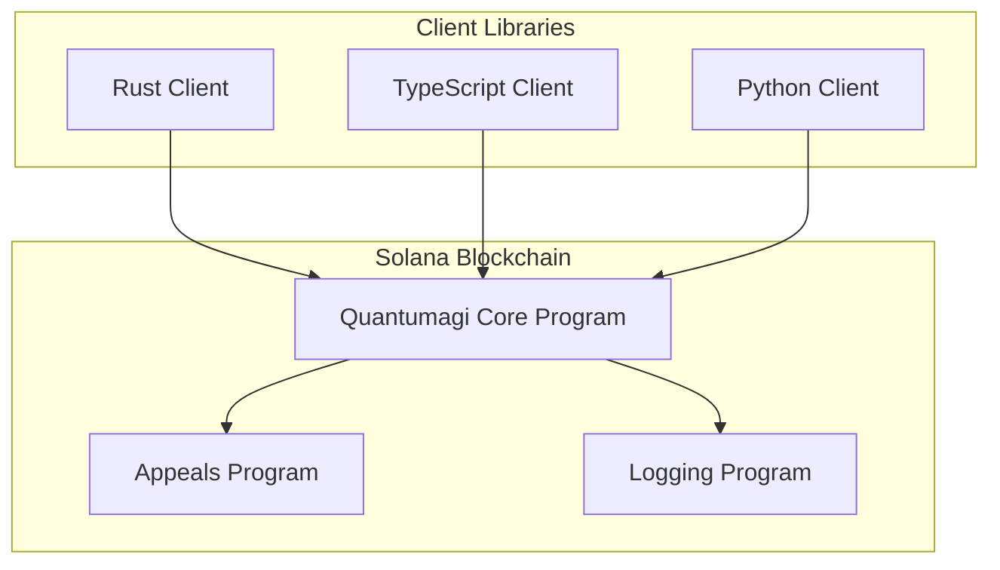
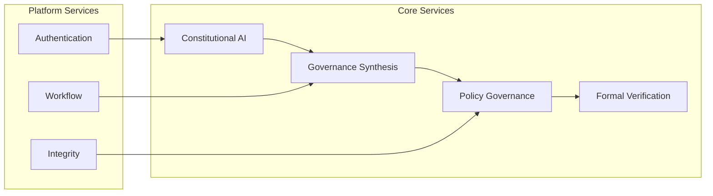
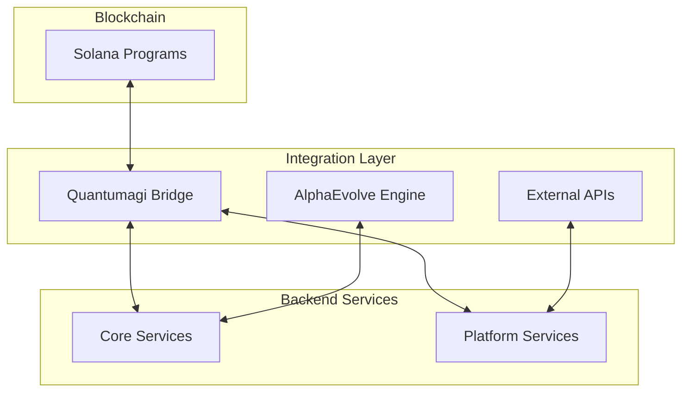
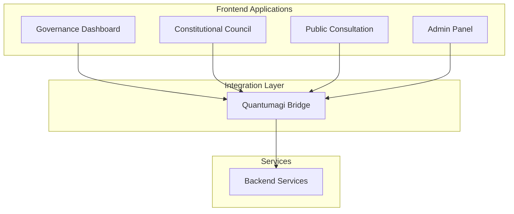
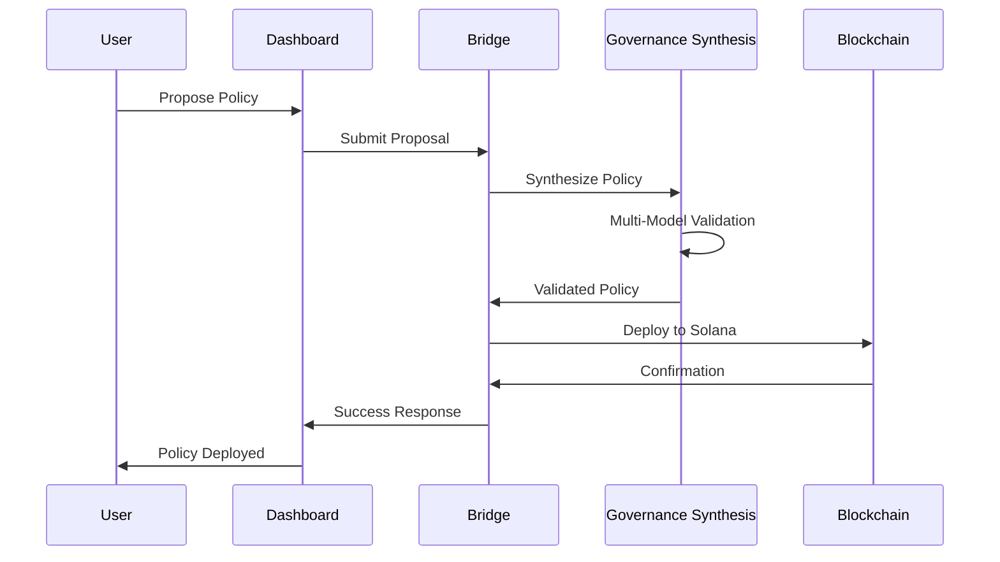
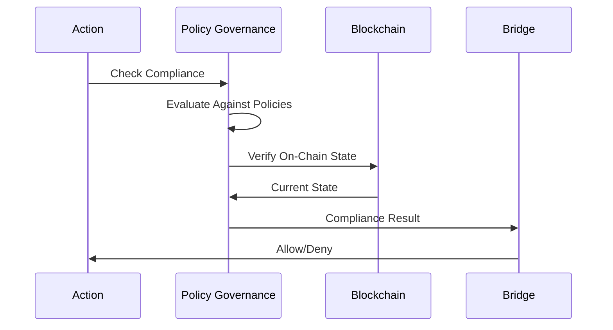
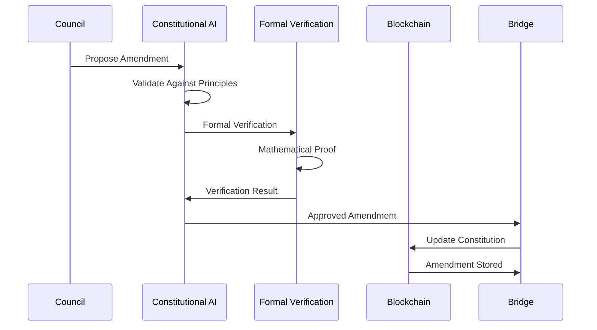
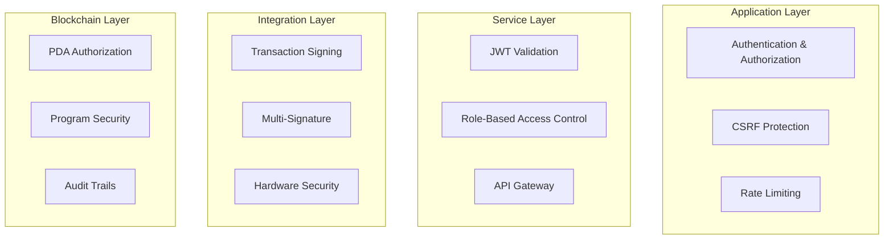

# ACGS-1 Reorganized Architecture

## Overview

The ACGS-1 reorganization implements a clean separation of concerns with blockchain-first architecture, following Solana and Rust ecosystem best practices while maintaining integration with the AlphaEvolve constitutional AI framework.

## Architecture Principles

### 1. **Blockchain-First Design**
- Solana programs as the source of truth for governance state
- Off-chain services provide synthesis and validation
- On-chain enforcement ensures immutable governance

### 2. **Microservices Architecture**
- Domain-driven service boundaries
- Independent deployment and scaling
- Clear API contracts between services

### 3. **Event-Driven Integration**
- Blockchain events drive off-chain processing
- Asynchronous communication between services
- Real-time governance state synchronization

## Component Architecture

### Blockchain Layer (`blockchain/`)

**Quantumagi Core Program**:
- **Constitution Account**: Stores constitutional hash and metadata
- **Policy Accounts**: Individual policy storage with PDA derivation
- **Voting Accounts**: Democratic voting state and results
- **Compliance Functions**: Real-time PGC validation

**Program Interactions**:
- Cross-Program Invocation (CPI) for appeals and logging
- Event emission for off-chain service integration
- PDA-based account derivation for deterministic addressing

### Core Services Layer (`services/core/`)

**Service Responsibilities**:

**Constitutional AI Service**:
- Constitutional principle management and versioning
- Human-in-the-loop uncertainty sampling
- Collective Constitutional AI integration
- Democratic participation coordination

**Governance Synthesis Service**:
- LLM-powered policy synthesis from principles
- Multi-model validation pipeline (99.92% reliability)
- QEC-inspired error correction mechanisms
- Bias detection and mitigation

**Policy Governance Service**:
- Real-time policy enforcement using Open Policy Agent
- Sub-5ms policy decisions with hardware acceleration
- Incremental compilation and hot-swapping
- Constitutional amendment integration

**Formal Verification Service**:
- Z3 SMT solver integration for mathematical verification
- Safety property checking and formal validation
- Policy correctness proofs against constitutional principles

### Integration Layer (`integrations/`)

**Quantumagi Bridge**:
- Event monitoring and real-time blockchain synchronization
- Transaction building and submission coordination
- Cross-chain governance state management
- Service discovery and health monitoring

### Application Layer (`applications/`)

**Application Responsibilities**:
- **Governance Dashboard**: Main interface for governance participation
- **Constitutional Council**: Council member interface for principle management
- **Public Consultation**: Public participation and feedback collection
- **Admin Panel**: System administration and monitoring

## Data Flow Architecture

### 1. **Policy Synthesis Flow**

### 2. **Compliance Checking Flow**

### 3. **Constitutional Amendment Flow**

## Security Architecture

### 1. **Multi-Layer Security**

### 2. **Cryptographic Security**
- **Ed25519 Signatures**: Solana-native cryptographic signatures
- **Multi-Signature Governance**: Constitutional changes require multiple approvals
- **Hardware Security Modules**: Key protection for critical operations
- **Zero-Knowledge Proofs**: Privacy-preserving governance participation

### 3. **Audit and Compliance**
- **Comprehensive Logging**: All governance actions logged immutably
- **Real-Time Monitoring**: Continuous security monitoring and alerting
- **Formal Verification**: Mathematical proofs of policy correctness
- **Regular Security Audits**: Automated and manual security assessments

## Scalability Architecture

### 1. **Horizontal Scaling**
- **Microservices**: Independent scaling of individual services
- **Load Balancing**: Distributed request handling
- **Database Sharding**: Horizontal database scaling
- **CDN Integration**: Global content delivery

### 2. **Performance Optimization**
- **Caching Layers**: Redis for high-performance caching
- **Connection Pooling**: Efficient database connections
- **Async Processing**: Non-blocking I/O operations
- **Hardware Acceleration**: GPU/TPU for policy evaluation

### 3. **Blockchain Scalability**
- **Program Optimization**: Efficient Solana program design
- **Account Compression**: Reduced on-chain storage costs
- **State Compression**: Merkle tree-based state management
- **Cross-Program Invocation**: Efficient inter-program communication

## Monitoring and Observability

### 1. **Metrics Collection**
- **Prometheus**: Time-series metrics collection
- **Custom Metrics**: Governance-specific KPIs
- **SLA Monitoring**: Service level agreement tracking
- **Resource Utilization**: Infrastructure monitoring

### 2. **Distributed Tracing**
- **Jaeger**: End-to-end request tracing
- **Correlation IDs**: Request correlation across services
- **Performance Profiling**: Bottleneck identification
- **Error Tracking**: Comprehensive error monitoring

### 3. **Logging Strategy**
- **Structured Logging**: JSON-formatted log entries
- **Centralized Logging**: ELK stack for log aggregation
- **Log Correlation**: Trace ID correlation across services
- **Audit Trails**: Immutable governance action logs

## Deployment Architecture

### 1. **Environment Strategy**
- **Development**: Local development with Docker Compose
- **Staging**: Production-like environment for testing
- **Production**: High-availability production deployment
- **Disaster Recovery**: Multi-region backup and recovery

### 2. **Container Orchestration**
- **Kubernetes**: Container orchestration and management
- **Helm Charts**: Templated Kubernetes deployments
- **Service Mesh**: Istio for service-to-service communication
- **Auto-Scaling**: Horizontal pod autoscaling

### 3. **CI/CD Pipeline**
- **GitHub Actions**: Automated testing and deployment
- **Multi-Stage Builds**: Optimized container images
- **Security Scanning**: Automated vulnerability assessment
- **Blue-Green Deployment**: Zero-downtime deployments

## Future Architecture Considerations

### 1. **Quantum Resistance**
- **Post-Quantum Cryptography**: Preparation for quantum computing threats
- **Quantum Key Distribution**: Quantum-safe key exchange
- **Lattice-Based Signatures**: Quantum-resistant signature schemes

### 2. **Cross-Chain Integration**
- **Bridge Protocols**: Integration with other blockchain networks
- **Interoperability Standards**: Cross-chain governance protocols
- **Multi-Chain Deployment**: Governance across multiple blockchains

### 3. **AI/ML Enhancement**
- **Federated Learning**: Distributed model training
- **Edge Computing**: Decentralized governance processing
- **Autonomous Governance**: Self-improving governance systems
