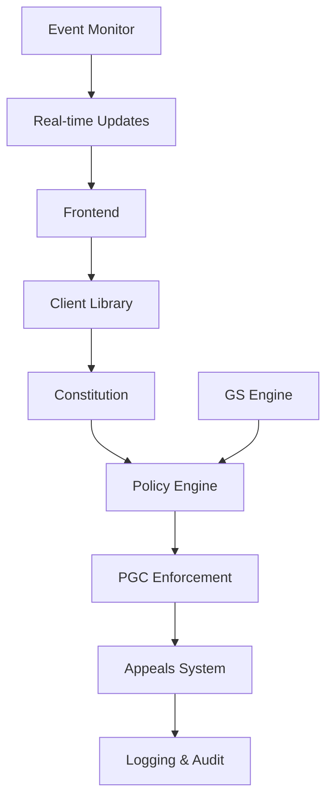

# 🏛️ Quantumagi Developer Guide

**Version:** 1.0.0  
**Last Updated:** June 7, 2025  
**Status:** Production Ready

---

## 📖 **Table of Contents**

1. [Quick Start](#quick-start)
2. [Architecture Overview](#architecture-overview)
3. [Smart Contract API](#smart-contract-api)
4. [Client Libraries](#client-libraries)
5. [Integration Guide](#integration-guide)
6. [Testing Framework](#testing-framework)
7. [Deployment Guide](#deployment-guide)
8. [Best Practices](#best-practices)

---

## 🚀 **Quick Start**

### **Prerequisites**
```bash
# Required tools
- Node.js 18+
- Python 3.9+
- Rust 1.70+
- Anchor CLI 0.29.0
- Solana CLI 1.18.22
```

### **Installation**
```bash
# Clone the repository
git clone https://github.com/your-org/quantumagi.git
cd quantumagi/quantumagi_core

# Install dependencies
npm install
pip install -r gs_engine/requirements.txt

# Build smart contracts
anchor build

# Run tests
anchor test
python scripts/demo_end_to_end.py
```

### **Basic Usage**
```typescript
import { QuantumagiClient } from './client/quantumagi-client';

// Initialize client
const client = new QuantumagiClient({
  cluster: 'devnet',
  wallet: yourWallet
});

// Create constitution
const constitution = await client.initializeConstitution({
  hash: constitutionHash,
  authority: authorityPubkey
});

// Propose policy
const policy = await client.proposePolicy({
  rule: "DENY unauthorized_actions",
  category: "Safety",
  priority: "Critical"
});

// Check compliance
const result = await client.checkCompliance({
  action: "transfer_funds",
  context: { amount: 1000, authorized: true }
});
```

---

## 🏗️ **Architecture Overview**

### **System Components**



### **Core Principles**

1. **Constitutional Supremacy**: All policies derive from constitutional principles
2. **Democratic Governance**: Community voting on policy proposals
3. **Real-time Enforcement**: PGC validates actions against active policies
4. **Transparent Appeals**: Multi-tier review process with human oversight
5. **Comprehensive Audit**: Complete transaction and decision logging

### **Data Flow**

```
Constitutional Principle → GS Engine → Policy Proposal → 
Community Vote → Policy Enactment → PGC Enforcement → 
Compliance Check → Appeal (if needed) → Resolution
```

---

## 📡 **Smart Contract API**

### **Core Program (`quantumagi_core`)**

#### **Initialize Constitution**
```rust
pub fn initialize(
    ctx: Context<Initialize>, 
    constitution_hash: [u8; 32]
) -> Result<()>
```

**Parameters:**
- `constitution_hash`: SHA-256 hash of constitutional document

**Example:**
```typescript
await program.methods
  .initialize(constitutionHash)
  .accounts({
    constitution: constitutionPDA,
    authority: wallet.publicKey,
    systemProgram: SystemProgram.programId,
  })
  .rpc();
```

#### **Propose Policy**
```rust
pub fn propose_policy(
    ctx: Context<ProposePolicy>,
    policy_id: u64,
    rule: String,
    category: PolicyCategory,
    priority: PolicyPriority
) -> Result<()>
```

**Policy Categories:**
- `PromptConstitution`: PC-001 type rules
- `Safety`: Safety-critical policies  
- `Governance`: DAO governance rules
- `Financial`: Treasury and financial policies

**Example:**
```typescript
await program.methods
  .proposePolicy(
    new BN(1),
    "DENY unauthorized_state_mutations",
    { promptConstitution: {} },
    { critical: {} }
  )
  .accounts({
    policy: policyPDA,
    authority: wallet.publicKey,
    systemProgram: SystemProgram.programId,
  })
  .rpc();
```

#### **Check Compliance (PGC)**
```rust
pub fn check_compliance(
    ctx: Context<CheckCompliance>,
    action_to_check: String,
    action_context: ActionContext
) -> Result<()>
```

**Action Context:**
```rust
pub struct ActionContext {
    pub requires_governance: bool,
    pub has_governance_approval: bool,
    pub involves_funds: bool,
    pub amount: u64,
    pub authorized_limit: u64,
    pub caller: Pubkey,
}
```

### **Appeals Program (`appeals`)**

#### **Submit Appeal**
```rust
pub fn submit_appeal(
    ctx: Context<SubmitAppeal>,
    policy_id: u64,
    violation_details: String,
    evidence_hash: [u8; 32],
    appeal_type: AppealType
) -> Result<()>
```

#### **Review Appeal**
```rust
pub fn review_appeal(
    ctx: Context<ReviewAppeal>,
    reviewer_decision: ReviewDecision,
    review_evidence: String,
    confidence_score: u8
) -> Result<()>
```

---

## 🐍 **Client Libraries**

### **Python Client**

```python
from quantumagi.client import QuantumagiClient
from quantumagi.gs_engine import GovernanceSynthesis

# Initialize client
client = QuantumagiClient(
    cluster="devnet",
    keypair_path="~/.config/solana/id.json"
)

# Initialize GS Engine
gs_engine = GovernanceSynthesis(
    acgs_endpoint="https://api.acgs.example.com",
    models=["gpt-4", "claude-3", "llama-2", "palm-2", "gemini"]
)

# Synthesize policy from principle
principle = "Ensure system resilience under adversarial conditions"
policy = gs_engine.synthesize_policy(principle)

# Deploy to blockchain
result = client.propose_policy(
    rule=policy.rule,
    category=policy.category,
    priority=policy.priority
)
```

### **TypeScript Client**

```typescript
import { QuantumagiSDK } from '@quantumagi/sdk';
import { Connection, Keypair } from '@solana/web3.js';

const connection = new Connection('https://api.devnet.solana.com');
const wallet = Keypair.fromSecretKey(secretKey);

const quantumagi = new QuantumagiSDK({
  connection,
  wallet,
  programId: QUANTUMAGI_PROGRAM_ID
});

// Real-time event monitoring
quantumagi.onPolicyProposed((event) => {
  console.log('New policy proposed:', event);
});

quantumagi.onComplianceCheck((event) => {
  console.log('Compliance check:', event);
});
```

---

## 🔗 **Integration Guide**

### **Integrating with Existing DAOs**

```typescript
// Example: Realms integration
import { RealmGovernance } from '@solana/governance';
import { QuantumagiCompliance } from '@quantumagi/compliance';

class RealmQuantumagiIntegration {
  async proposeWithCompliance(proposal: Proposal) {
    // Check constitutional compliance first
    const compliance = await QuantumagiCompliance.check({
      action: proposal.instruction,
      context: proposal.context
    });
    
    if (!compliance.isCompliant) {
      throw new Error(`Proposal violates policy: ${compliance.violation}`);
    }
    
    // Proceed with Realms proposal
    return await RealmGovernance.createProposal(proposal);
  }
}
```

### **Custom Policy Categories**

```rust
// Extend PolicyCategory enum
#[derive(AnchorSerialize, AnchorDeserialize, Clone, Debug, PartialEq)]
pub enum PolicyCategory {
    PromptConstitution,
    Safety,
    Governance,
    Financial,
    // Custom categories
    DeFiProtocol,
    NFTGovernance,
    CrossChain,
}
```

---

## 🧪 **Testing Framework**

### **Unit Tests**
```bash
# Run Anchor tests
anchor test

# Run Python tests
cd gs_engine && python -m pytest tests/

# Run integration tests
python scripts/test_quantumagi_implementation.py
```

### **End-to-End Testing**
```bash
# Full system demonstration
python scripts/demo_end_to_end.py

# Advanced features testing
python scripts/advanced_features_demo.py
```

### **Custom Test Scenarios**
```typescript
describe('Custom Governance Scenarios', () => {
  it('should handle complex policy conflicts', async () => {
    // Test policy conflict resolution
    const policy1 = await createPolicy("ALLOW treasury_access");
    const policy2 = await createPolicy("DENY treasury_access");
    
    const resolution = await quantumagi.resolveConflict([policy1, policy2]);
    expect(resolution.strategy).toBe('democratic_vote');
  });
});
```

---

## 🚀 **Deployment Guide**

### **Local Development**
```bash
# Start local validator
solana-test-validator

# Deploy programs
anchor deploy

# Initialize constitution
python scripts/deploy_quantumagi.py --network localnet
```

### **Devnet Deployment**
```bash
# Configure for devnet
solana config set --url https://api.devnet.solana.com

# Deploy to devnet
anchor deploy --provider.cluster devnet

# Initialize system
python scripts/deploy_quantumagi.py --network devnet
```

### **Production Deployment**
```bash
# Security audit checklist
- [ ] Smart contract audit completed
- [ ] Multi-signature setup for authority
- [ ] Emergency pause mechanisms tested
- [ ] Governance token distribution planned
- [ ] Community onboarding materials ready

# Deploy to mainnet
anchor deploy --provider.cluster mainnet-beta
```

---

## ✅ **Best Practices**

### **Security**
1. **Always validate inputs** in smart contract instructions
2. **Use PDAs** for deterministic account derivation
3. **Implement emergency pause** mechanisms for critical functions
4. **Multi-signature approval** for constitutional changes
5. **Regular security audits** of policy synthesis logic

### **Performance**
1. **Batch operations** when possible to reduce transaction costs
2. **Use event compression** for high-frequency logging
3. **Implement caching** for frequently accessed policies
4. **Optimize account sizes** to minimize rent costs
5. **Monitor gas usage** and optimize instruction layout

### **Governance**
1. **Start with simple policies** and gradually increase complexity
2. **Ensure broad community participation** in voting processes
3. **Provide clear appeal mechanisms** for disputed decisions
4. **Maintain transparency** through comprehensive logging
5. **Regular constitutional reviews** to adapt to changing needs

---

## 📚 **Additional Resources**

- [API Reference](./API_REFERENCE.md)
- [Deployment Guide](./DEPLOYMENT_GUIDE.md)
- [Security Best Practices](./SECURITY.md)
- [Community Guidelines](./COMMUNITY.md)
- [Contributing Guide](./CONTRIBUTING.md)

---

## 🔗 **Integration Examples**

### **Realms DAO Integration**
```typescript
import { QuantumagiCompliance } from '@quantumagi/compliance';
import { RealmGovernance } from '@solana/governance';

class RealmQuantumagiDAO {
  async createProposalWithCompliance(proposal: GovernanceProposal) {
    // Pre-check constitutional compliance
    const compliance = await QuantumagiCompliance.validateProposal({
      instruction: proposal.instruction,
      accounts: proposal.accounts,
      context: proposal.governanceContext
    });

    if (!compliance.isCompliant) {
      throw new ConstitutionalViolationError(compliance.violations);
    }

    // Create Realms proposal with Quantumagi oversight
    const realmProposal = await RealmGovernance.createProposal({
      ...proposal,
      quantumagiCompliance: compliance.attestation
    });

    return realmProposal;
  }
}
```

### **Serum DEX Integration**
```rust
// Custom instruction wrapper with constitutional compliance
#[program]
pub mod serum_quantumagi {
    use super::*;

    pub fn place_order_with_compliance(
        ctx: Context<PlaceOrderCompliance>,
        order: OrderParams
    ) -> Result<()> {
        // Check constitutional compliance first
        let compliance_ctx = ActionContext {
            requires_governance: order.size > LARGE_ORDER_THRESHOLD,
            has_governance_approval: ctx.accounts.governance_approval.is_some(),
            involves_funds: true,
            amount: order.size,
            authorized_limit: ctx.accounts.user_limits.max_order_size,
            caller: ctx.accounts.user.key(),
        };

        quantumagi_core::cpi::check_compliance(
            CpiContext::new(
                ctx.accounts.quantumagi_program.to_account_info(),
                quantumagi_core::cpi::accounts::CheckCompliance {
                    policy: ctx.accounts.trading_policy.to_account_info(),
                }
            ),
            "place_large_order".to_string(),
            compliance_ctx
        )?;

        // Proceed with Serum order placement
        serum_dex::cpi::new_order_v3(
            CpiContext::new(
                ctx.accounts.serum_program.to_account_info(),
                serum_dex::cpi::accounts::NewOrderV3 {
                    market: ctx.accounts.market.to_account_info(),
                    // ... other accounts
                }
            ),
            order
        )?;

        Ok(())
    }
}
```

---

**🏛️ Quantumagi: Pioneering On-Chain Constitutional Governance**

*For support, join our [Discord](https://discord.gg/quantumagi) or visit [docs.quantumagi.org](https://docs.quantumagi.org)*
