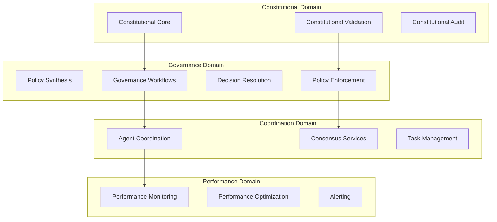

# Domain-Driven Design for Constitutional Governance Workflows

**Constitutional Hash**: `cdd01ef066bc6cf2`

## Overview

This document defines the domain-driven design (DDD) architecture for ACGS-2 governance workflows, establishing clear bounded contexts, domain models, and interaction patterns for constitutional AI governance.

## Domain Model Overview

### Bounded Contexts



## 1. Constitutional Domain

### Core Responsibilities
- Constitutional principle validation
- Compliance scoring and assessment
- Audit trail management
- Constitutional policy enforcement

### Domain Entities

#### Constitutional Decision
```python
@dataclass
class ConstitutionalDecision:
    """Core aggregate for constitutional decision-making"""
    id: DecisionId
    description: str
    context: DecisionContext
    constitutional_hash: ConstitutionalHash
    compliance_assessment: ComplianceAssessment
    audit_trail: List[AuditEvent]
    created_at: datetime
    updated_at: datetime
    
    def validate_constitutional_compliance(
        self, 
        validator: ConstitutionalValidator
    ) -> ComplianceResult:
        """Validate decision against constitutional principles"""
        return validator.validate(self, self.constitutional_hash)
    
    def add_audit_event(self, event: AuditEvent) -> None:
        """Add constitutional audit event"""
        if event.constitutional_hash != self.constitutional_hash:
            raise ConstitutionalHashMismatchError()
        
        self.audit_trail.append(event)
        self.updated_at = datetime.utcnow()
    
    def is_compliant(self, threshold: float = 0.95) -> bool:
        """Check if decision meets constitutional compliance threshold"""
        return self.compliance_assessment.overall_score >= threshold
```

#### Compliance Assessment
```python
@dataclass
class ComplianceAssessment:
    """Value object for constitutional compliance scoring"""
    overall_score: float
    principle_scores: Dict[ConstitutionalPrinciple, float]
    violations: List[ConstitutionalViolation]
    recommendations: List[ComplianceRecommendation]
    validation_timestamp: datetime
    
    def __post_init__(self):
        if not 0.0 <= self.overall_score <= 1.0:
            raise ValueError("Compliance score must be between 0.0 and 1.0")
    
    @classmethod
    def create_from_principles(
        cls,
        principle_scores: Dict[ConstitutionalPrinciple, float]
    ) -> 'ComplianceAssessment':
        """Create assessment from individual principle scores"""
        overall_score = sum(principle_scores.values()) / len(principle_scores)
        
        violations = [
            ConstitutionalViolation.from_principle(principle, score)
            for principle, score in principle_scores.items()
            if score < 0.95
        ]
        
        return cls(
            overall_score=overall_score,
            principle_scores=principle_scores,
            violations=violations,
            recommendations=[],
            validation_timestamp=datetime.utcnow()
        )
```

#### Constitutional Audit Event
```python
@dataclass
class AuditEvent:
    """Domain event for constitutional audit trail"""
    id: AuditEventId
    event_type: AuditEventType
    constitutional_hash: ConstitutionalHash
    tenant_id: TenantId
    user_id: Optional[UserId]
    decision_id: DecisionId
    event_data: Dict[str, Any]
    timestamp: datetime
    hash_chain: str
    
    def verify_integrity(self, previous_event: Optional['AuditEvent']) -> bool:
        """Verify audit event integrity using hash chain"""
        expected_hash = self._calculate_hash(previous_event)
        return self.hash_chain == expected_hash
    
    def _calculate_hash(self, previous_event: Optional['AuditEvent']) -> str:
        """Calculate hash chain for audit integrity"""
        import hashlib
        
        content = f"{self.id}:{self.constitutional_hash}:{self.timestamp}"
        if previous_event:
            content = f"{previous_event.hash_chain}:{content}"
        
        return hashlib.sha256(content.encode()).hexdigest()
```

### Domain Services

#### Constitutional Validator Service
```python
class ConstitutionalValidatorService:
    """Domain service for constitutional compliance validation"""
    
    def __init__(
        self,
        principle_validators: Dict[ConstitutionalPrinciple, PrincipleValidator],
        audit_repository: AuditRepository,
        performance_monitor: PerformanceMonitor
    ):
        self.principle_validators = principle_validators
        self.audit_repository = audit_repository
        self.performance_monitor = performance_monitor
    
    async def validate_decision(
        self,
        decision: ConstitutionalDecision,
        context: ValidationContext
    ) -> ComplianceResult:
        """Validate decision against all constitutional principles"""
        
        start_time = time.time()
        
        # Validate against each constitutional principle
        principle_results = {}
        for principle, validator in self.principle_validators.items():
            principle_results[principle] = await validator.validate(
                decision,
                context
            )
        
        # Create compliance assessment
        compliance_assessment = ComplianceAssessment.create_from_principles(
            {p: r.score for p, r in principle_results.items()}
        )
        
        # Create audit event
        audit_event = AuditEvent(
            id=AuditEventId.generate(),
            event_type=AuditEventType.CONSTITUTIONAL_VALIDATION,
            constitutional_hash=decision.constitutional_hash,
            tenant_id=context.tenant_id,
            user_id=context.user_id,
            decision_id=decision.id,
            event_data={
                "compliance_score": compliance_assessment.overall_score,
                "principle_scores": compliance_assessment.principle_scores,
                "violations": [v.to_dict() for v in compliance_assessment.violations]
            },
            timestamp=datetime.utcnow(),
            hash_chain=""
        )
        
        # Store audit event
        await self.audit_repository.store_event(audit_event)
        
        # Record performance metrics
        validation_time = (time.time() - start_time) * 1000
        await self.performance_monitor.record_validation_latency(validation_time)
        
        return ComplianceResult(
            decision_id=decision.id,
            assessment=compliance_assessment,
            audit_event_id=audit_event.id,
            validation_time_ms=validation_time
        )
```

## 2. Governance Domain

### Core Responsibilities
- Policy synthesis and management
- Governance workflow orchestration
- Decision conflict resolution
- Governance monitoring and reporting

### Domain Entities

#### Governance Workflow
```python
@dataclass
class GovernanceWorkflow:
    """Aggregate for governance workflow orchestration"""
    id: WorkflowId
    name: str
    description: str
    workflow_type: WorkflowType
    steps: List[WorkflowStep]
    current_step: int
    status: WorkflowStatus
    context: WorkflowContext
    constitutional_requirements: ConstitutionalRequirements
    created_at: datetime
    updated_at: datetime
    
    def execute_next_step(
        self,
        executor: WorkflowExecutor,
        context: ExecutionContext
    ) -> WorkflowStepResult:
        """Execute the next step in the governance workflow"""
        
        if self.is_completed():
            raise WorkflowAlreadyCompletedException()
        
        current_step = self.steps[self.current_step]
        
        # Validate constitutional compliance before execution
        if not self._validate_step_compliance(current_step, context):
            raise ConstitutionalComplianceViolationError()
        
        # Execute step
        result = executor.execute_step(current_step, context)
        
        # Update workflow state
        if result.success:
            self.current_step += 1
            if self.current_step >= len(self.steps):
                self.status = WorkflowStatus.COMPLETED
        else:
            self.status = WorkflowStatus.FAILED
        
        self.updated_at = datetime.utcnow()
        
        return result
    
    def add_step(self, step: WorkflowStep) -> None:
        """Add step to governance workflow"""
        step.validate_constitutional_requirements(
            self.constitutional_requirements
        )
        self.steps.append(step)
    
    def is_completed(self) -> bool:
        """Check if workflow is completed"""
        return self.status == WorkflowStatus.COMPLETED
    
    def _validate_step_compliance(
        self,
        step: WorkflowStep,
        context: ExecutionContext
    ) -> bool:
        """Validate step meets constitutional requirements"""
        return step.constitutional_hash == context.constitutional_hash
```

#### Policy Aggregate
```python
@dataclass
class Policy:
    """Aggregate for governance policy management"""
    id: PolicyId
    name: str
    description: str
    policy_type: PolicyType
    rules: List[PolicyRule]
    constitutional_basis: ConstitutionalBasis
    applicable_domains: List[Domain]
    version: PolicyVersion
    status: PolicyStatus
    created_at: datetime
    updated_at: datetime
    
    def evaluate_decision(
        self,
        decision: ConstitutionalDecision,
        context: PolicyEvaluationContext
    ) -> PolicyEvaluationResult:
        """Evaluate decision against policy rules"""
        
        rule_results = []
        for rule in self.rules:
            if rule.is_applicable(decision, context):
                result = rule.evaluate(decision, context)
                rule_results.append(result)
        
        # Aggregate rule results
        overall_result = self._aggregate_rule_results(rule_results)
        
        return PolicyEvaluationResult(
            policy_id=self.id,
            decision_id=decision.id,
            overall_result=overall_result,
            rule_results=rule_results,
            constitutional_compliance=self._check_constitutional_compliance(
                overall_result
            )
        )
    
    def synthesize_with_policy(
        self,
        other_policy: 'Policy',
        synthesizer: PolicySynthesizer
    ) -> 'Policy':
        """Synthesize this policy with another policy"""
        
        if not self._compatible_for_synthesis(other_policy):
            raise IncompatiblePolicyError()
        
        return synthesizer.synthesize(self, other_policy)
    
    def _compatible_for_synthesis(self, other_policy: 'Policy') -> bool:
        """Check if policies can be synthesized"""
        return (
            self.constitutional_basis.is_compatible_with(
                other_policy.constitutional_basis
            ) and
            bool(set(self.applicable_domains) & set(other_policy.applicable_domains))
        )
```

### Domain Services

#### Governance Orchestrator Service
```python
class GovernanceOrchestratorService:
    """Domain service for governance workflow orchestration"""
    
    def __init__(
        self,
        workflow_repository: WorkflowRepository,
        policy_repository: PolicyRepository,
        constitutional_validator: ConstitutionalValidatorService,
        coordination_service: CoordinationDomainService
    ):
        self.workflow_repository = workflow_repository
        self.policy_repository = policy_repository
        self.constitutional_validator = constitutional_validator
        self.coordination_service = coordination_service
    
    async def orchestrate_governance_decision(
        self,
        decision_request: GovernanceDecisionRequest,
        context: GovernanceContext
    ) -> GovernanceDecisionResult:
        """Orchestrate complete governance decision workflow"""
        
        # 1. Create governance workflow
        workflow = await self._create_workflow_for_request(
            decision_request,
            context
        )
        
        # 2. Execute constitutional validation
        constitutional_result = await self.constitutional_validator.validate_decision(
            decision_request.decision,
            context.validation_context
        )
        
        if not constitutional_result.assessment.is_compliant():
            return GovernanceDecisionResult.create_violation_result(
                constitutional_result
            )
        
        # 3. Evaluate applicable policies
        applicable_policies = await self.policy_repository.find_applicable_policies(
            decision_request.decision,
            context
        )
        
        policy_results = []
        for policy in applicable_policies:
            result = policy.evaluate_decision(
                decision_request.decision,
                context.policy_context
            )
            policy_results.append(result)
        
        # 4. Resolve policy conflicts if any
        if self._has_policy_conflicts(policy_results):
            conflict_resolution = await self._resolve_policy_conflicts(
                policy_results,
                context
            )
            workflow.add_step(WorkflowStep.create_conflict_resolution_step(
                conflict_resolution
            ))
        
        # 5. Execute workflow
        workflow_result = await self._execute_workflow(workflow, context)
        
        # 6. Create final governance decision
        return GovernanceDecisionResult(
            decision_id=decision_request.decision.id,
            workflow_id=workflow.id,
            constitutional_result=constitutional_result,
            policy_results=policy_results,
            workflow_result=workflow_result,
            final_decision=self._synthesize_final_decision(
                constitutional_result,
                policy_results,
                workflow_result
            )
        )
    
    async def _create_workflow_for_request(
        self,
        request: GovernanceDecisionRequest,
        context: GovernanceContext
    ) -> GovernanceWorkflow:
        """Create appropriate workflow for governance request"""
        
        workflow_type = self._determine_workflow_type(request, context)
        
        workflow = GovernanceWorkflow(
            id=WorkflowId.generate(),
            name=f"Governance Decision: {request.decision.description}",
            description=f"Workflow for {workflow_type} governance decision",
            workflow_type=workflow_type,
            steps=[],
            current_step=0,
            status=WorkflowStatus.CREATED,
            context=WorkflowContext.from_governance_context(context),
            constitutional_requirements=ConstitutionalRequirements.from_decision(
                request.decision
            ),
            created_at=datetime.utcnow(),
            updated_at=datetime.utcnow()
        )
        
        # Add standard workflow steps
        workflow.add_step(WorkflowStep.create_validation_step())
        workflow.add_step(WorkflowStep.create_policy_evaluation_step())
        workflow.add_step(WorkflowStep.create_decision_synthesis_step())
        
        # Add domain-specific steps based on workflow type
        if workflow_type == WorkflowType.MULTI_AGENT_COORDINATION:
            workflow.add_step(WorkflowStep.create_agent_coordination_step())
            workflow.add_step(WorkflowStep.create_consensus_step())
        
        await self.workflow_repository.save(workflow)
        return workflow
```

## 3. Coordination Domain

### Core Responsibilities
- Multi-agent task coordination
- Consensus building and conflict resolution
- Agent lifecycle management
- Coordination performance optimization

### Domain Entities

#### Agent Coordination Session
```python
@dataclass
class AgentCoordinationSession:
    """Aggregate for multi-agent coordination"""
    id: CoordinationSessionId
    task: CoordinationTask
    participating_agents: List[Agent]
    coordination_strategy: CoordinationStrategy
    consensus_requirements: ConsensusRequirements
    session_state: CoordinationSessionState
    messages: List[CoordinationMessage]
    decisions: List[AgentDecision]
    constitutional_oversight: ConstitutionalOversight
    created_at: datetime
    updated_at: datetime
    
    def add_agent(self, agent: Agent) -> None:
        """Add agent to coordination session"""
        if not agent.is_capable_of_task(self.task):
            raise AgentIncompatibleError()
        
        if not self._verify_constitutional_clearance(agent):
            raise ConstitutionalClearanceError()
        
        self.participating_agents.append(agent)
        self.updated_at = datetime.utcnow()
    
    def submit_agent_decision(
        self,
        agent_id: AgentId,
        decision: AgentDecision
    ) -> None:
        """Submit decision from participating agent"""
        
        if not self._is_participating_agent(agent_id):
            raise AgentNotParticipatingError()
        
        # Validate constitutional compliance of decision
        if not decision.meets_constitutional_requirements(
            self.constitutional_oversight.requirements
        ):
            raise ConstitutionalViolationError()
        
        self.decisions.append(decision)
        self.updated_at = datetime.utcnow()
        
        # Check if consensus can be reached
        if self._can_reach_consensus():
            self.session_state = CoordinationSessionState.CONSENSUS_PENDING
    
    def attempt_consensus(
        self,
        consensus_builder: ConsensusBuilder
    ) -> ConsensusResult:
        """Attempt to reach consensus among agent decisions"""
        
        if self.session_state != CoordinationSessionState.CONSENSUS_PENDING:
            raise InvalidSessionStateError()
        
        consensus_result = consensus_builder.build_consensus(
            self.decisions,
            self.consensus_requirements,
            self.constitutional_oversight
        )
        
        if consensus_result.achieved:
            self.session_state = CoordinationSessionState.CONSENSUS_REACHED
        else:
            self.session_state = CoordinationSessionState.CONSENSUS_FAILED
        
        self.updated_at = datetime.utcnow()
        return consensus_result
    
    def _verify_constitutional_clearance(self, agent: Agent) -> bool:
        """Verify agent has constitutional clearance for this session"""
        return agent.constitutional_clearance_level >= \
               self.constitutional_oversight.required_clearance_level
```

#### Consensus Algorithm
```python
class ConsensusAlgorithm:
    """Base class for consensus algorithms with constitutional oversight"""
    
    def __init__(self, constitutional_validator: ConstitutionalValidatorService):
        self.constitutional_validator = constitutional_validator
    
    async def reach_consensus(
        self,
        decisions: List[AgentDecision],
        requirements: ConsensusRequirements,
        oversight: ConstitutionalOversight
    ) -> ConsensusResult:
        """Reach consensus while maintaining constitutional compliance"""
        
        # Validate all decisions meet constitutional requirements
        valid_decisions = []
        for decision in decisions:
            validation_result = await self.constitutional_validator.validate_decision(
                decision.underlying_decision,
                oversight.validation_context
            )
            
            if validation_result.assessment.is_compliant():
                valid_decisions.append(decision)
        
        # Apply consensus algorithm to valid decisions
        consensus_decision = await self._apply_consensus_algorithm(
            valid_decisions,
            requirements
        )
        
        # Final constitutional validation of consensus
        final_validation = await self.constitutional_validator.validate_decision(
            consensus_decision,
            oversight.validation_context
        )
        
        return ConsensusResult(
            achieved=final_validation.assessment.is_compliant(),
            consensus_decision=consensus_decision if final_validation.assessment.is_compliant() else None,
            participating_decisions=valid_decisions,
            constitutional_compliance=final_validation.assessment,
            algorithm_used=self.__class__.__name__
        )
    
    async def _apply_consensus_algorithm(
        self,
        decisions: List[AgentDecision],
        requirements: ConsensusRequirements
    ) -> ConstitutionalDecision:
        """Apply specific consensus algorithm - to be implemented by subclasses"""
        raise NotImplementedError()

class WeightedVoteConsensus(ConsensusAlgorithm):
    """Weighted voting consensus algorithm"""
    
    async def _apply_consensus_algorithm(
        self,
        decisions: List[AgentDecision],
        requirements: ConsensusRequirements
    ) -> ConstitutionalDecision:
        """Apply weighted voting algorithm"""
        
        # Weight decisions by agent expertise and constitutional compliance score
        weighted_scores = {}
        for decision in decisions:
            weight = (
                decision.agent.expertise_score * 
                decision.constitutional_compliance_score
            )
            
            for option in decision.options:
                if option.id not in weighted_scores:
                    weighted_scores[option.id] = 0
                weighted_scores[option.id] += weight * option.preference_score
        
        # Select option with highest weighted score
        winning_option_id = max(weighted_scores, key=weighted_scores.get)
        winning_option = next(
            option for decision in decisions
            for option in decision.options
            if option.id == winning_option_id
        )
        
        # Create consensus decision
        return ConstitutionalDecision(
            id=DecisionId.generate(),
            description=f"Consensus decision from {len(decisions)} agents",
            context=DecisionContext.create_consensus_context(decisions),
            constitutional_hash=decisions[0].constitutional_hash,
            compliance_assessment=ComplianceAssessment.create_consensus_assessment(
                decisions
            ),
            audit_trail=[],
            created_at=datetime.utcnow(),
            updated_at=datetime.utcnow()
        )
```

### Domain Services

#### Coordination Orchestrator Service
```python
class CoordinationOrchestratorService:
    """Domain service for multi-agent coordination orchestration"""
    
    def __init__(
        self,
        agent_registry: AgentRegistry,
        coordination_repository: CoordinationRepository,
        consensus_algorithms: Dict[str, ConsensusAlgorithm],
        performance_monitor: PerformanceMonitor
    ):
        self.agent_registry = agent_registry
        self.coordination_repository = coordination_repository
        self.consensus_algorithms = consensus_algorithms
        self.performance_monitor = performance_monitor
    
    async def coordinate_multi_agent_decision(
        self,
        coordination_request: CoordinationRequest,
        context: CoordinationContext
    ) -> CoordinationResult:
        """Orchestrate multi-agent decision coordination"""
        
        start_time = time.time()
        
        # 1. Create coordination session
        session = AgentCoordinationSession(
            id=CoordinationSessionId.generate(),
            task=coordination_request.task,
            participating_agents=[],
            coordination_strategy=coordination_request.strategy,
            consensus_requirements=coordination_request.consensus_requirements,
            session_state=CoordinationSessionState.CREATED,
            messages=[],
            decisions=[],
            constitutional_oversight=ConstitutionalOversight.from_context(context),
            created_at=datetime.utcnow(),
            updated_at=datetime.utcnow()
        )
        
        # 2. Select and recruit appropriate agents
        suitable_agents = await self.agent_registry.find_agents_for_task(
            coordination_request.task,
            context.constitutional_requirements
        )
        
        for agent in suitable_agents[:coordination_request.max_agents]:
            session.add_agent(agent)
        
        # 3. Distribute task to agents
        await self._distribute_task_to_agents(session, context)
        
        # 4. Collect agent decisions
        agent_decisions = await self._collect_agent_decisions(
            session,
            timeout=coordination_request.timeout_seconds
        )
        
        # 5. Build consensus
        consensus_algorithm = self.consensus_algorithms[
            coordination_request.consensus_algorithm
        ]
        
        consensus_result = await session.attempt_consensus(
            ConsensusBuilder(consensus_algorithm)
        )
        
        # 6. Record performance metrics
        coordination_time = (time.time() - start_time) * 1000
        await self.performance_monitor.record_coordination_latency(
            coordination_time
        )
        
        # 7. Save session and return result
        await self.coordination_repository.save_session(session)
        
        return CoordinationResult(
            session_id=session.id,
            task=coordination_request.task,
            participating_agents=session.participating_agents,
            consensus_result=consensus_result,
            coordination_time_ms=coordination_time,
            constitutional_compliance=consensus_result.constitutional_compliance
        )
```

## 4. Performance Domain

### Core Responsibilities
- Performance monitoring and metrics
- Performance optimization recommendations
- Alerting and notification
- Performance trend analysis

### Domain Entities

#### Performance Metric
```python
@dataclass
class PerformanceMetric:
    """Value object for performance measurements"""
    metric_name: str
    value: float
    unit: str
    timestamp: datetime
    constitutional_context: ConstitutionalContext
    service_context: ServiceContext
    
    def meets_target(self, target: PerformanceTarget) -> bool:
        """Check if metric meets performance target"""
        return target.evaluate(self.value)
    
    def is_constitutional_compliant_metric(self) -> bool:
        """Check if this metric relates to constitutional compliance"""
        return self.constitutional_context.hash == "cdd01ef066bc6cf2"

@dataclass
class PerformanceTarget:
    """Target performance thresholds"""
    metric_name: str
    target_value: float
    operator: str  # "<=", ">=", "==", etc.
    constitutional_requirement: bool = False
    
    def evaluate(self, actual_value: float) -> bool:
        """Evaluate if actual value meets target"""
        if self.operator == "<=":
            return actual_value <= self.target_value
        elif self.operator == ">=":
            return actual_value >= self.target_value
        elif self.operator == "==":
            return abs(actual_value - self.target_value) < 0.001
        else:
            raise ValueError(f"Unknown operator: {self.operator}")

# Constitutional performance targets
CONSTITUTIONAL_PERFORMANCE_TARGETS = [
    PerformanceTarget("p99_latency_ms", 5.0, "<=", constitutional_requirement=True),
    PerformanceTarget("throughput_rps", 100.0, ">=", constitutional_requirement=True),
    PerformanceTarget("cache_hit_rate", 0.85, ">=", constitutional_requirement=True),
    PerformanceTarget("constitutional_compliance_rate", 0.95, ">=", constitutional_requirement=True)
]
```

## Domain Interaction Patterns

### 1. Constitutional Decision Workflow

```python
class ConstitutionalDecisionWorkflow:
    """Workflow orchestrating constitutional decision across domains"""
    
    def __init__(
        self,
        constitutional_service: ConstitutionalValidatorService,
        governance_service: GovernanceOrchestratorService,
        coordination_service: CoordinationOrchestratorService,
        performance_service: PerformanceMonitoringService
    ):
        self.constitutional_service = constitutional_service
        self.governance_service = governance_service
        self.coordination_service = coordination_service
        self.performance_service = performance_service
    
    async def execute_constitutional_decision(
        self,
        decision_request: ConstitutionalDecisionRequest,
        context: ConstitutionalDecisionContext
    ) -> ConstitutionalDecisionResult:
        """Execute complete constitutional decision workflow"""
        
        workflow_start = time.time()
        
        # 1. Constitutional Domain: Validate constitutional compliance
        constitutional_result = await self.constitutional_service.validate_decision(
            decision_request.decision,
            context.constitutional_context
        )
        
        if not constitutional_result.assessment.is_compliant():
            # Early exit for constitutional violations
            return ConstitutionalDecisionResult.create_violation_result(
                constitutional_result
            )
        
        # 2. Governance Domain: Orchestrate governance workflow
        governance_result = await self.governance_service.orchestrate_governance_decision(
            GovernanceDecisionRequest.from_constitutional_request(decision_request),
            context.governance_context
        )
        
        # 3. Coordination Domain: Multi-agent coordination if required
        coordination_result = None
        if decision_request.requires_multi_agent_coordination():
            coordination_result = await self.coordination_service.coordinate_multi_agent_decision(
                CoordinationRequest.from_governance_result(governance_result),
                context.coordination_context
            )
        
        # 4. Performance Domain: Record metrics and check targets
        workflow_time = (time.time() - workflow_start) * 1000
        await self.performance_service.record_workflow_metrics(
            workflow_time,
            constitutional_result,
            governance_result,
            coordination_result
        )
        
        # 5. Synthesize final result
        return ConstitutionalDecisionResult(
            decision_id=decision_request.decision.id,
            constitutional_result=constitutional_result,
            governance_result=governance_result,
            coordination_result=coordination_result,
            workflow_time_ms=workflow_time,
            final_decision=self._synthesize_final_decision(
                constitutional_result,
                governance_result,
                coordination_result
            )
        )
```

### 2. Event-Driven Domain Communication

```python
class DomainEventBus:
    """Event bus for inter-domain communication"""
    
    def __init__(self):
        self.subscribers: Dict[str, List[Callable]] = {}
    
    async def publish_domain_event(
        self,
        event: DomainEvent,
        constitutional_context: ConstitutionalContext
    ):
        """Publish domain event with constitutional validation"""
        
        # Validate event has constitutional compliance
        if not event.constitutional_hash == constitutional_context.hash:
            raise ConstitutionalEventViolationError()
        
        # Publish to subscribers
        if event.event_type in self.subscribers:
            for subscriber in self.subscribers[event.event_type]:
                await subscriber(event)
    
    def subscribe_to_domain_events(
        self,
        event_type: str,
        handler: Callable[[DomainEvent], None]
    ):
        """Subscribe to domain events"""
        if event_type not in self.subscribers:
            self.subscribers[event_type] = []
        self.subscribers[event_type].append(handler)

# Domain events
@dataclass
class ConstitutionalValidationCompleted(DomainEvent):
    """Event published when constitutional validation completes"""
    decision_id: DecisionId
    compliance_result: ComplianceResult
    constitutional_hash: ConstitutionalHash = "cdd01ef066bc6cf2"
    event_type: str = "constitutional.validation.completed"

@dataclass
class GovernanceWorkflowCompleted(DomainEvent):
    """Event published when governance workflow completes"""
    workflow_id: WorkflowId
    decision_id: DecisionId
    governance_result: GovernanceDecisionResult
    constitutional_hash: ConstitutionalHash = "cdd01ef066bc6cf2"
    event_type: str = "governance.workflow.completed"

@dataclass
class MultiAgentConsensusReached(DomainEvent):
    """Event published when multi-agent consensus is reached"""
    session_id: CoordinationSessionId
    consensus_result: ConsensusResult
    constitutional_hash: ConstitutionalHash = "cdd01ef066bc6cf2"
    event_type: str = "coordination.consensus.reached"
```

## Repository Patterns

### Constitutional Domain Repository
```python
class ConstitutionalDecisionRepository:
    """Repository for constitutional decisions with audit trail"""
    
    def __init__(
        self,
        db_session_factory: Callable[[], AsyncSession],
        cache_manager: ConstitutionalCacheManager
    ):
        self.db_session_factory = db_session_factory
        self.cache_manager = cache_manager
    
    async def save_decision(
        self,
        decision: ConstitutionalDecision,
        tenant_id: TenantId
    ) -> None:
        """Save constitutional decision with audit trail"""
        
        async with self.db_session_factory() as session:
            # Set tenant context for RLS
            await session.execute(
                text("SET app.current_tenant_id = :tenant_id"),
                {"tenant_id": str(tenant_id)}
            )
            
            # Save decision
            decision_model = ConstitutionalDecisionModel.from_domain(decision)
            session.add(decision_model)
            
            # Save audit events
            for event in decision.audit_trail:
                audit_model = AuditEventModel.from_domain(event)
                session.add(audit_model)
            
            await session.commit()
            
            # Cache decision for fast retrieval
            await self.cache_manager.cache_decision(decision, tenant_id)
    
    async def find_by_id(
        self,
        decision_id: DecisionId,
        tenant_id: TenantId
    ) -> Optional[ConstitutionalDecision]:
        """Find constitutional decision by ID"""
        
        # Try cache first
        cached_decision = await self.cache_manager.get_cached_decision(
            decision_id,
            tenant_id
        )
        if cached_decision:
            return cached_decision
        
        # Query database
        async with self.db_session_factory() as session:
            await session.execute(
                text("SET app.current_tenant_id = :tenant_id"),
                {"tenant_id": str(tenant_id)}
            )
            
            decision_model = await session.get(
                ConstitutionalDecisionModel,
                str(decision_id)
            )
            
            if decision_model:
                decision = decision_model.to_domain()
                await self.cache_manager.cache_decision(decision, tenant_id)
                return decision
        
        return None
```

## Implementation Guidelines

### 1. Domain Separation
- Each domain maintains its own bounded context
- Cross-domain communication through domain events
- Shared kernel limited to constitutional hash and basic value objects

### 2. Aggregate Design
- Keep aggregates small and focused
- Maintain constitutional compliance at aggregate boundaries
- Use eventual consistency between aggregates

### 3. Performance Considerations
- Cache frequently accessed constitutional decisions
- Use event sourcing for audit trail requirements
- Implement CQRS for read-heavy operations

### 4. Testing Strategy
```python
class TestConstitutionalDomain:
    """Domain tests for constitutional compliance"""
    
    async def test_constitutional_decision_workflow(self):
        """Test complete constitutional decision workflow"""
        
        # Arrange
        decision = ConstitutionalDecision(
            id=DecisionId("test-decision"),
            description="Test AI deployment",
            context=DecisionContext.create_test_context(),
            constitutional_hash=ConstitutionalHash("cdd01ef066bc6cf2"),
            compliance_assessment=ComplianceAssessment.create_empty(),
            audit_trail=[],
            created_at=datetime.utcnow(),
            updated_at=datetime.utcnow()
        )
        
        validator = MockConstitutionalValidator()
        
        # Act
        result = decision.validate_constitutional_compliance(validator)
        
        # Assert
        assert result.assessment.overall_score >= 0.95
        assert result.constitutional_hash == "cdd01ef066bc6cf2"
        assert len(decision.audit_trail) > 0
```

---

**Constitutional Hash**: `cdd01ef066bc6cf2`  
**Last Updated**: 2025-01-08  
**Design Version**: 2.0.0

This domain-driven design provides clear separation of concerns while maintaining constitutional compliance across all governance workflows in the ACGS-2 system.