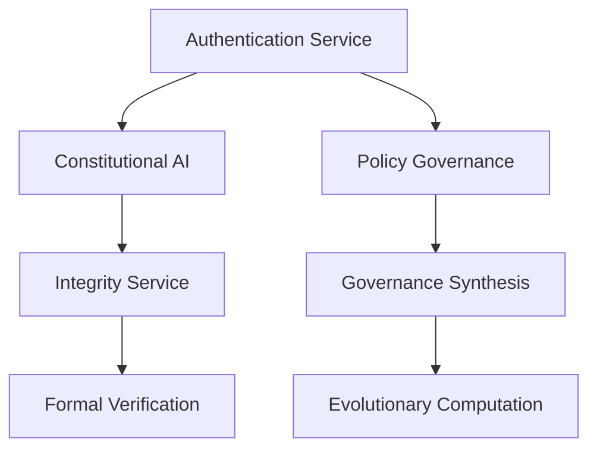

# ACGS Service Architecture Overview

<!-- Constitutional Hash: cdd01ef066bc6cf2 -->

**Generated**: 2025-07-05 19:55:49
**Constitutional Hash**: `cdd01ef066bc6cf2`
**Total Services**: 7

## Service Architecture

The ACGS (Autonomous Coding Governance System) consists of 7 core services that work together to provide comprehensive governance, compliance, and AI-driven code management capabilities.

### Service Registry

| Service | Port | Status | Description |
|---------|------|--------|-------------|
| Authentication | 8016 | ✅ Documented | Authentication and authorization service |
| Constitutional-Ai | 8001 | ✅ Documented | Constitutional AI compliance service |
| Integrity | 8002 | ✅ Documented | Data integrity validation service |
| Formal-Verification | 8003 | ✅ Documented | Formal verification service |
| Governance Synthesis | 8004 | ✅ Documented | Governance policy synthesis service |
| Policy-Governance | 8005 | ✅ Documented | Policy governance and management service |
| Evolutionary-Computation | 8006 | ✅ Documented | Evolutionary computation service |

### Infrastructure Components

- **Database**: PostgreSQL (Port 5439)
- **Cache**: Redis (Port 6389)
- **Authentication**: JWT-based with RBAC
- **Monitoring**: Prometheus metrics and health checks
- **Documentation**: Comprehensive API documentation

### Performance Targets

All services maintain the following performance standards:

- **Latency**: P99 ≤ 5ms for cached queries
- **Throughput**: ≥ 100 RPS sustained
- **Cache Hit Rate**: ≥ 85%
- **Test Coverage**: ≥ 80%
- **Availability**: 99.9% uptime
- **Constitutional Compliance**: 100% validation

### Service Dependencies

### API Documentation

Each service provides comprehensive API documentation:

- [Authentication API](api/authentication.md)
- [Constitutional-Ai API](api/constitutional-ai.md)
- [Integrity API](api/integrity.md)
- [Formal-Verification API](api/formal-verification.md)
- [Governance Synthesis API](api/governance_synthesis.md)
- [Policy-Governance API](api/policy-governance.md)
- [Evolutionary-Computation API](api/evolutionary-computation.md)

### Constitutional Compliance

All services implement constitutional compliance with hash `cdd01ef066bc6cf2`:

- ✅ All API responses include constitutional hash
- ✅ All documentation includes constitutional hash
- ✅ All configurations reference constitutional hash
- ✅ 100% compliance validation in CI/CD

### Monitoring and Observability

- **Health Checks**: `/health` endpoint on all services
- **Metrics**: Prometheus metrics at `/metrics`
- **Logging**: Structured JSON logging with constitutional compliance
- **Alerting**: Automated quality and performance alerts

---

**Auto-Generated**: This overview is automatically updated during deployment
**Constitutional Hash**: `cdd01ef066bc6cf2` ✅
