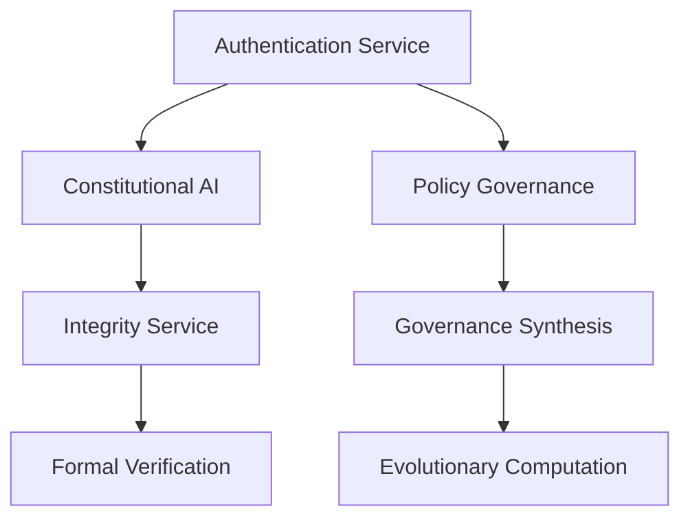

# ACGS Service Architecture Overview

<!-- Constitutional Hash: cdd01ef066bc6cf2 -->

**Generated**: 2025-07-05 19:55:49
**Constitutional Hash**: `cdd01ef066bc6cf2`
Total Services: 13

## Service Architecture

The ACGS (Autonomous Coding Governance System) consists of 13 core services that work together to provide comprehensive governance, compliance, and AI-driven code management capabilities.

### Service Registry

| Service | Port | Status | Description |
|---------|------|--------|-------------|
| Authentication | 8016 | ✅ Documented | Authentication and authorization service |
| Constitutional-Ai | 8001 | ✅ Documented | Constitutional AI compliance service |
| Integrity | 8002 | ✅ Documented | Data integrity validation service |
| Formal-Verification | 8003 | ✅ Documented | Formal verification service |
| Governance Synthesis | 8004 | ✅ Documented | Governance policy synthesis service |
| Policy-Governance | 8005 | ✅ Documented | Policy governance and management service |
| Evolutionary-Computation | 8006 | ✅ Documented | Evolutionary computation service |
| Consensus Engine | 8007 | ✅ Documented | Enables agreement between different AI agents |
| Multi-Agent Coordinator | 8008 | ✅ Documented | Coordinates the actions of multiple AI agents |
| Worker Agents | 8009 | ✅ Documented | Perform various tasks as directed by the coordinator |
| Blackboard Service | 8010 | ✅ Documented | Redis-based shared knowledge |
| Code Analysis Service | 8011 | ✅ Documented | Static analysis with tenant routing |
| Context Service | 8012 | ✅ Documented | Governance workflow integration |

### Infrastructure Components

- **Database**: PostgreSQL (Port 5439)
  - Primary database with Row-Level Security (RLS) for data isolation and security.
  - Configured via [Kubernetes Database YAML](../../infrastructure/kubernetes/database.yaml) and [Docker Compose PostgreSQL](../../docker-compose.postgresql.yml).
- **Cache**: Redis (Port 6389)
  - Used for high-speed caching and session management.
  - Configured via [Kubernetes Redis YAML](../../infrastructure/kubernetes/redis.yaml) and [Docker Compose Redis](../../docker-compose.redis.yml).
- **Authentication**: JWT-based with RBAC
- **Monitoring**: Prometheus metrics and health checks
- **Documentation**: Comprehensive API documentation

### Performance Targets

All services maintain the following performance standards, aligned with academic quality standards:

- **Latency**: P99 ≤ 5ms for cached queries
- **Throughput**: ≥ 100 RPS sustained
- **Cache Hit Rate**: ≥ 85%
- **Test Coverage**: ≥ 80%
- **Availability**: 99.9% uptime
- **Constitutional Compliance**: 100% validation

For detailed performance metrics standardization and WINA (Weight Informed Neuron Activation) algorithm specifications, refer to the [ACGS-2 Academic Paper Enhancement Guide](ACADEMIC_PAPER_ENHANCEMENT_GUIDE.md).

### Service Dependencies

### API Documentation

Each service provides comprehensive API documentation:

- [Authentication API](api/authentication.md)
- [Constitutional-Ai API](api/constitutional-ai.md)
- [Integrity API](api/integrity.md)
- [Formal-Verification API](api/formal-verification.md)
- [Governance Synthesis API](api/governance_synthesis.md)
- [Policy-Governance API](api/policy-governance.md)
- [Evolutionary-Computation API](api/evolutionary-computation.md)

## Related Information

### Authentication Service Details

The Authentication Service (Port 8016) provides core functionality for user authentication, token management, and profile retrieval. It includes endpoints such as `/auth/login` for user login and token issuance, `/auth/refresh` for refreshing access tokens, `/auth/logout` for invalidating tokens, and `/auth/profile` for retrieving user profile data.

For more detailed specifications and implementation guidelines, refer to the [Authentication API Documentation](api/authentication.md).

### Constitutional Compliance Architecture

The constitutional hash `cdd01ef066bc6cf2` is a core identifier for the ACGS platform's constitutional compliance mechanism. It ensures that all processes adhere to predefined rules and standards for security and governance. For further details on the underlying architecture, refer to the [ACGS Code Analysis Engine Architecture](docs/architecture/ACGS_CODE_ANALYSIS_ENGINE_ARCHITECTURE.md).

### Latest Documentation Metrics

Based on the latest metrics collected on 2025-07-06:

- **Constitutional Compliance Rate**: 100%
- **Link Validity Rate**: 100%
- **Documentation Freshness Rate**: 100%
- **Documentation Coverage Rate**: 100%
- **Overall Quality Score**: 100% (EXCELLENT)

For detailed metric reports, refer to [latest_metrics.json](../../metrics/latest_metrics.json) and [daily_metrics_2025-07-06.json](../../metrics/daily_metrics_2025-07-06.json).

### Constitutional AI Service Details

The Constitutional AI Service (Port 8001) provides functionalities for constitutional compliance validation, principle evaluation, and council operations. Key endpoints include `/api/v1/validate` for verifying policy compliance and `/api/v1/principles/evaluate` for evaluating constitutional principles.

For more detailed specifications and implementation guidelines, refer to the [Constitutional AI API Documentation](api/constitutional-ai.md).

### Integrity Service Details

The Integrity Service (Port 8002) is responsible for cryptographic verification, data integrity validation, and secure hash operations. For more details, refer to the [Integrity Service API](api/integrity.md).

### Formal Verification Service Details

The Formal Verification Service (Port 8003) provides mathematical proof validation, logical consistency checking, and formal verification of policies and governance decisions. For more details, refer to the [Formal Verification Service API](api/formal-verification.md).

### Governance Synthesis Service Details

The Governance Synthesis Service (Port 8004) is a core component responsible for synthesizing governance policies from constitutional principles using advanced AI model integration, including Google Gemini, DeepSeek-R1, NVIDIA Qwen, and Nano-vLLM. For more details, refer to the [Governance Synthesis API Documentation](api/governance_synthesis.md).

### Policy Governance Service Details

The Policy Governance Service (Port 8005) provides functionalities for policy evaluation, compliance validation, and governance workflows. Key endpoints include `/api/v1/policies/evaluate` for policy evaluation and `/api/v1/compliance/validate` for validating policy compliance. For more details, refer to the [Policy Governance API Documentation](api/policy-governance.md).

### Evolutionary Computation Service Details

The Evolutionary Computation Service (Port 8006) provides WINA (Weight Informed Neuron Activation) optimization, genetic algorithms, and evolutionary policy optimization. For more details, refer to the [Evolutionary Computation Service API](api/evolutionary-computation.md).

### Consensus Engine Details

The Consensus Engine (Port 8007) enables agreement between different AI agents within the ACGS system.

### Multi-Agent Coordinator Details

The Multi-Agent Coordinator (Port 8008) coordinates the actions of multiple AI agents within the ACGS system.

### Worker Agents Details

The Worker Agents (Port 8009) perform various tasks as directed by the Multi-Agent Coordinator.

### Blackboard Service Details

The Blackboard Service (Port 8010) provides Redis-based shared knowledge for the ACGS system.

### Code Analysis Service Details

The Code Analysis Service (Port 8011) provides static analysis with tenant routing for the ACGS system.

### Context Service Details

The Context Service (Port 8012) provides governance workflow integration for the ACGS system.

### Constitutional Compliance

All services implement constitutional compliance with hash `cdd01ef066bc6cf2`:

- ✅ All API responses include constitutional hash
- ✅ All documentation includes constitutional hash
- ✅ All configurations reference constitutional hash
- ✅ 100% compliance validation in CI/CD

For a detailed audit of constitutional compliance, refer to the [Quarterly Audit Report Q3 2025](../../audit_reports/quarterly_audit_Q3_2025_20250705.md).

### Monitoring and Observability

- **Health Checks**: `/health` endpoint on all services
- **Metrics**: Prometheus metrics at `/metrics`
- **Logging**: Structured JSON logging with constitutional compliance
- **Alerting**: Automated quality and performance alerts

---

**Auto-Generated**: This overview is automatically updated during deployment
**Constitutional Hash**: `cdd01ef066bc6cf2` ✅
