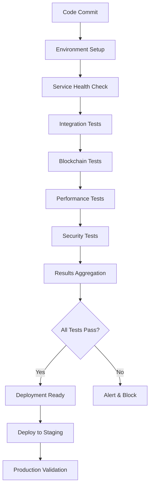

# ACGS-1 CI/CD Integration Guide

**Complete guide for integrating the ACGS-1 End-to-End Test Suite with CI/CD pipelines**

---

## 🎯 Overview

The ACGS-1 CI/CD integration provides automated testing, performance monitoring, and deployment validation for the Constitutional Governance System. This guide covers setup, configuration, and best practices for production-ready CI/CD pipelines.

### **Key Features**
- ✅ **Automated Testing**: Pytest-compatible test execution on every commit
- ✅ **Performance Monitoring**: Continuous performance regression detection
- ✅ **Multi-Environment Support**: Local, staging, and production validation
- ✅ **Comprehensive Reporting**: Detailed test results and performance metrics
- ✅ **Security Validation**: Automated security and compliance checking

---

## 🏗️ CI/CD Architecture

### **Pipeline Components**



### **Workflow Files**

1. **`.github/workflows/acgs-e2e-testing.yml`**
   - Main testing pipeline
   - Runs on push, PR, and schedule
   - Comprehensive test execution

2. **`.github/workflows/acgs-performance-monitoring.yml`**
   - Performance monitoring and benchmarking
   - Load testing and stress testing
   - Performance regression detection

3. **`scripts/ci-cd/setup-test-environment.sh`**
   - Environment setup automation
   - Dependency installation
   - Configuration validation

4. **`pytest.ini`**
   - Comprehensive pytest configuration
   - Test discovery and execution settings
   - Coverage and reporting configuration

---

## 🚀 Quick Start

### **1. Repository Setup**

```bash
# Clone the repository
git clone https://github.com/your-org/ACGS.git
cd ACGS

# Setup test environment
chmod +x scripts/ci-cd/setup-test-environment.sh
./scripts/ci-cd/setup-test-environment.sh

# Validate setup
pytest tests/e2e/ --collect-only
```

### **2. GitHub Actions Configuration**

The CI/CD pipelines are automatically triggered by:

- **Push to main/master/develop branches**
- **Pull requests**
- **Scheduled runs** (daily at 2 AM UTC)
- **Manual workflow dispatch**

### **3. Local Testing**

```bash
# Run all tests
pytest tests/e2e/ -v

# Run specific test categories
pytest tests/e2e/ -m "integration" -v
pytest tests/e2e/ -m "performance" -v
pytest tests/e2e/ -m "security" -v

# Run with coverage
pytest tests/e2e/ --cov=tests/e2e --cov-report=html
```

---

## 📊 Test Execution Matrix

### **Test Categories**

| **Category** | **Marker** | **Timeout** | **Description** |
|--------------|------------|-------------|-----------------|
| **Integration** | `integration` | 30 min | Service-to-service communication |
| **Performance** | `performance` | 60 min | Performance and load testing |
| **Security** | `security` | 45 min | Security and compliance validation |
| **Blockchain** | `blockchain` | 90 min | Blockchain integration testing |

### **Test Environments**

| **Environment** | **Trigger** | **Purpose** |
|-----------------|-------------|-------------|
| **Local** | Manual | Development testing |
| **Staging** | PR/develop | Integration validation |
| **Production** | main/master | Production readiness |

---

## ⚡ Performance Monitoring

### **Performance Targets**

| **Metric** | **Target** | **Alert Threshold** |
|------------|------------|-------------------|
| **Service Response Time** | <100ms | >500ms |
| **Workflow Duration** | <2000ms | >3000ms |
| **Memory Usage** | <80% | >90% |
| **CPU Usage** | <60% | >80% |
| **Blockchain Cost** | <0.01 SOL | >0.05 SOL |

### **Load Testing Matrix**

| **Concurrent Users** | **Duration** | **Success Criteria** |
|---------------------|--------------|---------------------|
| 10 | 5 min | >99% success rate |
| 50 | 10 min | >95% success rate |
| 100 | 10 min | >90% success rate |
| 200 | 5 min | >85% success rate |

---

## 🔒 Security Validation

### **Security Checks**

1. **Static Analysis**
   - Bandit security linting
   - Dependency vulnerability scanning
   - Code quality analysis

2. **Dynamic Testing**
   - Authentication workflow validation
   - Authorization testing
   - Input validation testing

3. **Compliance Validation**
   - Constitutional compliance scoring
   - Privacy protection verification
   - Transparency requirements

---

## 📋 CI/CD Configuration

### **Environment Variables**

```yaml
# Required environment variables
env:
  PYTHON_VERSION: '3.11'
  NODE_VERSION: '18'
  RUST_VERSION: 'stable'
  SOLANA_VERSION: '1.18.0'
  ACGS_TEST_MODE: 'true'
  ACGS_LOG_LEVEL: 'INFO'
```

### **Secrets Configuration**

```yaml
# GitHub Secrets (if needed)
secrets:
  SOLANA_PRIVATE_KEY: ${{ secrets.SOLANA_PRIVATE_KEY }}
  CODECOV_TOKEN: ${{ secrets.CODECOV_TOKEN }}
  SLACK_WEBHOOK: ${{ secrets.SLACK_WEBHOOK }}
```

### **Artifact Management**

```yaml
# Artifacts generated by pipeline
artifacts:
  - test-results-*.xml      # JUnit test results
  - coverage.xml            # Coverage reports
  - htmlcov/               # HTML coverage reports
  - performance-*.json     # Performance benchmarks
  - security-report.json   # Security analysis
```

---

## 🛠️ Customization

### **Adding New Test Categories**

1. **Create test marker**:
   ```python
   # In pytest.ini
   markers =
       custom_category: Description of custom test category
   ```

2. **Add to workflow**:
   ```yaml
   # In .github/workflows/acgs-e2e-testing.yml
   matrix:
     include:
       - suite: 'custom_category'
         marker: 'custom_category'
         timeout: 30
   ```

3. **Create tests**:
   ```python
   import pytest
   
   @pytest.mark.custom_category
   def test_custom_functionality():
       # Test implementation
       pass
   ```

### **Environment-Specific Configuration**

```python
# In conftest.py
@pytest.fixture(scope="session")
def environment_config():
    env = os.getenv("ACGS_ENVIRONMENT", "local")
    
    configs = {
        "local": {"base_url": "http://localhost:8000"},
        "staging": {"base_url": "https://staging.acgs.example"},
        "production": {"base_url": "https://api.acgs.example"}
    }
    
    return configs[env]
```

---

## 📈 Monitoring and Alerting

### **Performance Alerts**

Performance regressions trigger alerts when:
- Response times exceed 500ms
- Success rates drop below 90%
- Resource usage exceeds 80%
- Blockchain costs exceed 0.05 SOL

### **Test Failure Notifications**

Failed tests trigger notifications via:
- GitHub PR comments
- Slack webhooks (if configured)
- Email notifications (if configured)

### **Reporting Dashboard**

Test results are available in:
- GitHub Actions summary
- HTML coverage reports
- Performance benchmark reports
- Security analysis reports

---

## 🔧 Troubleshooting

### **Common Issues**

1. **Test Discovery Failures**
   ```bash
   # Validate pytest configuration
   pytest --collect-only
   
   # Check for syntax errors
   python -m py_compile tests/e2e/*.py
   ```

2. **Environment Setup Issues**
   ```bash
   # Re-run environment setup
   ./scripts/ci-cd/setup-test-environment.sh validate
   
   # Check dependencies
   pip list | grep pytest
   ```

3. **Performance Test Failures**
   ```bash
   # Run performance tests locally
   pytest tests/e2e/ -m "performance" -v
   
   # Check system resources
   htop
   ```

### **Debug Mode**

```bash
# Run tests with debug output
pytest tests/e2e/ -v -s --tb=long --log-cli-level=DEBUG

# Run specific failing test
pytest tests/e2e/test_file.py::test_function -v -s
```

---

## 🚀 Deployment Integration

### **Deployment Gates**

Tests must pass before deployment:
- ✅ All integration tests pass
- ✅ Performance targets met
- ✅ Security validation complete
- ✅ Constitutional compliance verified

### **Staging Deployment**

```yaml
# Triggered after successful tests
deploy-staging:
  needs: test-results
  if: github.ref == 'refs/heads/develop'
  runs-on: ubuntu-latest
  steps:
    - name: Deploy to Staging
      run: |
        echo "Deploying to staging environment"
        # Deployment commands here
```

### **Production Deployment**

```yaml
# Triggered after staging validation
deploy-production:
  needs: [test-results, deploy-staging]
  if: github.ref == 'refs/heads/main'
  runs-on: ubuntu-latest
  steps:
    - name: Deploy to Production
      run: |
        echo "Deploying to production environment"
        # Production deployment commands here
```

---

## 📚 Best Practices

### **Test Organization**

1. **Use descriptive test names**
2. **Group related tests in classes**
3. **Use appropriate markers**
4. **Keep tests independent**
5. **Mock external dependencies**

### **Performance Testing**

1. **Set realistic targets**
2. **Monitor trends over time**
3. **Test under realistic load**
4. **Include error scenarios**
5. **Validate resource usage**

### **Security Testing**

1. **Test authentication flows**
2. **Validate authorization**
3. **Check input validation**
4. **Verify encryption**
5. **Test compliance requirements**

---

## 🎯 Next Steps

1. **Setup CI/CD Pipeline**: Configure GitHub Actions workflows
2. **Customize Configuration**: Adapt to your specific requirements
3. **Monitor Performance**: Establish baseline metrics
4. **Integrate Deployment**: Connect to your deployment pipeline
5. **Train Team**: Onboard developers on testing practices

---

**CI/CD Integration Status**: ✅ **Production Ready**  
**Documentation Version**: 1.0  
**Last Updated**: June 20, 2025

For support and questions, please refer to the [ACGS-1 Testing Guide](../TESTING_GUIDE.md) or create an issue in the repository.
