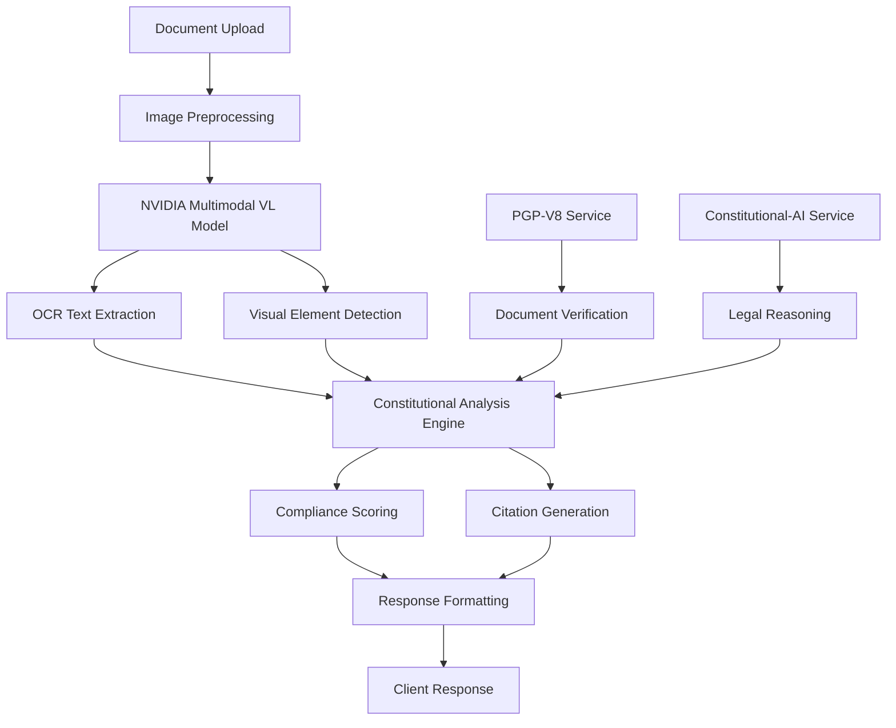

# ACGS-1 Constitutional Document Analysis Integration Plan

**Version**: 2.0  
**Date**: June 20, 2025  
**Status**: Ready for Implementation  
**Integration Target**: NVIDIA Llama-3.1-Nemotron-Nano-VL-8B-V1

---

## 🎯 **Executive Summary**

This integration plan details the implementation of advanced constitutional document analysis capabilities within the ACGS-1 Constitutional Governance System, leveraging the NVIDIA Llama-3.1-Nemotron-Nano-VL-8B-V1 multimodal model for OCR-based policy analysis, interactive constitutional Q&A, and document authenticity verification.

## 🏗️ **Architecture Overview**

### **Core Components**

1. **Document Intelligence Service** - OCR and text extraction
2. **Constitutional Analysis Engine** - Policy compliance checking
3. **Interactive Q&A Interface** - Constitutional query processing
4. **Document Verification System** - Authenticity and integrity validation
5. **Visual Governance Analytics** - Process flow analysis

### **Integration Points**

- **constitutional-ai service** (Port 3001) - Core reasoning engine
- **pgp-v8 service** (Port 3002) - Document verification
- **NVIDIA Multimodal VL** (Port 8002) - Vision-language processing
- **Frontend Dashboard** - User interface integration

## 📋 **Detailed Implementation Specifications**

### **1. OCR-Based Policy Document Analysis**

#### **Service Endpoint**: `/api/v1/document/analyze`

**Method**: POST  
**Purpose**: Extract and analyze text from constitutional documents

#### **Request Format**:

```json
{
  "document_image": "base64_encoded_image",
  "analysis_type": "constitutional_compliance|policy_extraction|legal_review",
  "document_type": "constitution|amendment|policy|regulation",
  "jurisdiction": "federal|state|local",
  "metadata": {
    "title": "Document Title",
    "date": "2025-06-20",
    "source": "Official Source"
  }
}
```

#### **Response Format**:

```json
{
    "analysis_id": "uuid",
    "extracted_text": "Full document text with formatting",
    "structured_content": {
        "articles": [...],
        "sections": [...],
        "amendments": [...],
        "tables": "HTML formatted tables",
        "equations": "LaTeX formatted equations"
    },
    "constitutional_analysis": {
        "compliance_score": 0.95,
        "violations": [],
        "recommendations": [],
        "precedent_references": []
    },
    "document_integrity": {
        "authenticity_score": 0.98,
        "watermarks": ["OFFICIAL COPY"],
        "page_numbers": ["1/15", "2/15"],
        "signatures_detected": true
    }
}
```

#### **Implementation Details**:

- **OCR Processing**: Enhanced prompt based on Nanonets approach
- **Constitutional Keywords**: Pre-trained recognition of legal terminology
- **Table Extraction**: HTML formatting for structured data
- **Equation Recognition**: LaTeX formatting for mathematical content
- **Watermark Detection**: Automatic identification of official markings

### **2. Interactive Constitutional Q&A Workflows**

#### **Service Endpoint**: `/api/v1/constitutional/qa`

**Method**: POST  
**Purpose**: Answer questions about constitutional documents with visual context

#### **Request Format**:

```json
{
  "question": "What does Article II say about executive powers?",
  "document_context": {
    "document_images": ["base64_image1", "base64_image2"],
    "document_text": "Optional pre-extracted text",
    "focus_areas": ["article_ii", "executive_branch"]
  },
  "reasoning_depth": "basic|detailed|comprehensive",
  "citation_required": true
}
```

#### **Response Format**:

```json
{
  "answer": "Detailed constitutional answer",
  "reasoning_chain": [
    "Step 1: Identified relevant constitutional text",
    "Step 2: Analyzed historical context",
    "Step 3: Applied legal precedents"
  ],
  "citations": [
    {
      "source": "U.S. Constitution, Article II, Section 1",
      "text": "The executive Power shall be vested...",
      "page_reference": "Page 3, Lines 15-20"
    }
  ],
  "visual_evidence": [
    {
      "image_region": "coordinates",
      "description": "Highlighted constitutional text",
      "relevance_score": 0.92
    }
  ],
  "confidence_score": 0.94
}
```

### **3. Visual Governance Process Analysis**

#### **Service Endpoint**: `/api/v1/governance/process-analysis`

**Method**: POST  
**Purpose**: Analyze governance workflow diagrams and process documents

#### **Capabilities**:

- **Flowchart Analysis**: Extract decision points and process flows
- **Organizational Charts**: Identify governance hierarchies
- **Timeline Analysis**: Extract chronological governance events
- **Compliance Mapping**: Map processes to constitutional requirements

### **4. Document Authenticity Verification**

#### **Service Endpoint**: `/api/v1/document/verify`

**Method**: POST  
**Purpose**: Verify document authenticity and detect tampering

#### **Verification Features**:

- **Digital Signature Detection**: Identify official seals and signatures
- **Watermark Analysis**: Detect and validate security watermarks
- **Font Consistency**: Analyze typography for authenticity
- **Layout Verification**: Compare against official document templates
- **Metadata Extraction**: Extract creation and modification timestamps

## 🔄 **Data Flow Architecture**



## ⚡ **Performance Requirements**

### **Response Time Targets**:

- **Simple OCR**: < 5 seconds
- **Constitutional Analysis**: < 15 seconds
- **Complex Q&A**: < 30 seconds
- **Document Verification**: < 10 seconds

### **Accuracy Targets**:

- **OCR Accuracy**: > 98% for printed text
- **Constitutional Compliance**: > 95% accuracy
- **Citation Accuracy**: > 99% for referenced text
- **Authenticity Detection**: > 97% for known document types

### **Scalability Requirements**:

- **Concurrent Users**: 100+ simultaneous requests
- **Document Size**: Up to 50MB per document
- **Batch Processing**: 1000+ documents per hour
- **Storage**: 10TB+ for document archive

## 🛠️ **Implementation Timeline**

### **Phase 1: Core OCR Integration (Week 1-2)**

- [ ] Implement basic OCR endpoint
- [ ] Integrate with NVIDIA Multimodal VL model
- [ ] Create document preprocessing pipeline
- [ ] Develop text extraction and formatting

### **Phase 2: Constitutional Analysis (Week 3-4)**

- [ ] Build constitutional keyword recognition
- [ ] Implement compliance scoring algorithm
- [ ] Create citation generation system
- [ ] Integrate with constitutional-ai service

### **Phase 3: Interactive Q&A (Week 5-6)**

- [ ] Develop Q&A endpoint and logic
- [ ] Implement reasoning chain generation
- [ ] Create visual evidence mapping
- [ ] Build confidence scoring system

### **Phase 4: Document Verification (Week 7-8)**

- [ ] Implement authenticity detection
- [ ] Build watermark and signature recognition
- [ ] Create tampering detection algorithms
- [ ] Integrate with PGP-V8 service

### **Phase 5: Testing & Optimization (Week 9-10)**

- [ ] Comprehensive integration testing
- [ ] Performance optimization
- [ ] Security validation
- [ ] User acceptance testing

## 🔒 **Security Considerations**

### **Data Protection**:

- **Encryption**: All documents encrypted at rest and in transit
- **Access Control**: Role-based access to sensitive documents
- **Audit Logging**: Complete audit trail for all document access
- **Data Retention**: Configurable retention policies

### **Privacy Compliance**:

- **PII Detection**: Automatic detection and redaction of personal information
- **GDPR Compliance**: Right to erasure and data portability
- **Classification**: Automatic document classification and handling

## 📊 **Monitoring & Analytics**

### **Key Metrics**:

- **Processing Volume**: Documents processed per hour/day
- **Accuracy Rates**: OCR and analysis accuracy trends
- **Response Times**: Performance monitoring across all endpoints
- **Error Rates**: Failed processing and error categorization
- **User Satisfaction**: Feedback scores and usage patterns

### **Alerting**:

- **Performance Degradation**: Response time > SLA thresholds
- **Accuracy Drops**: OCR accuracy < 95%
- **System Errors**: Critical failures and exceptions
- **Security Events**: Unauthorized access attempts

## 🚀 **Deployment Strategy**

### **Environment Progression**:

1. **Development**: Local testing with sample documents
2. **Staging**: Full integration testing with production-like data
3. **Production**: Phased rollout with monitoring

### **Rollback Plan**:

- **Feature Flags**: Gradual feature enablement
- **Blue-Green Deployment**: Zero-downtime deployments
- **Database Migrations**: Reversible schema changes
- **Configuration Management**: Environment-specific settings

---

**Next Steps**: Proceed to Task 3 - CPU-Only Testing Validation

**Dependencies**:

- NVIDIA Multimodal VL model deployment
- Constitutional-AI service integration
- PGP-V8 service connectivity
- Frontend dashboard updates
