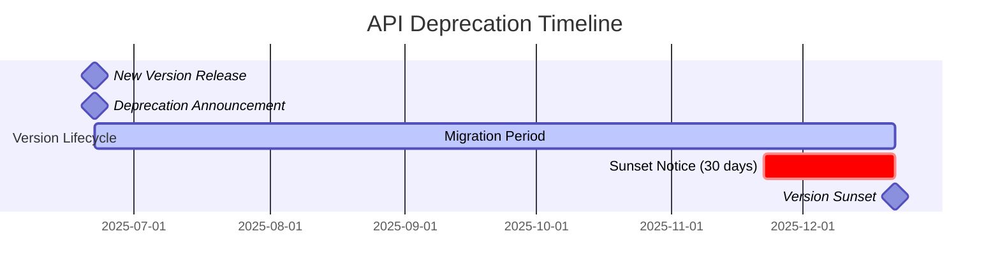

# ACGS-1 API Deprecation Policy

**Version:** 1.0  
**Date:** 2025-06-22  
**Status:** Active  
**Compliance:** RFC 8594, RFC 7234

## Overview

This document establishes the official deprecation policy for all ACGS-1 APIs, ensuring predictable lifecycle management, clear migration paths, and minimal disruption to client applications.

## 🎯 Deprecation Principles

### Core Principles

1. **Predictability**: Clear timelines and advance notice
2. **Transparency**: Open communication about changes
3. **Support**: Migration assistance and documentation
4. **Stability**: Maintained functionality during transition
5. **Compliance**: RFC 8594 and industry standards

### Policy Objectives

- Minimize client disruption during API evolution
- Provide sufficient time for migration planning
- Maintain backward compatibility where possible
- Enable continuous improvement of API design
- Ensure security and performance standards

## 📅 Deprecation Timeline

### Standard Deprecation Schedule



### Timeline Details

| Phase             | Duration    | Description            | Actions                                                                                        |
| ----------------- | ----------- | ---------------------- | ---------------------------------------------------------------------------------------------- |
| **Release**       | Day 0       | New version available  | • New version deployed<br>• Documentation updated<br>• Migration guide published               |
| **Deprecation**   | Day 0-150   | Old version deprecated | • Deprecation headers added<br>• Client notifications sent<br>• Migration support available    |
| **Sunset Notice** | Day 150-180 | Final warning period   | • Intensive client outreach<br>• Migration deadline reminders<br>• Emergency support available |
| **Sunset**        | Day 180     | Old version removed    | • Version no longer supported<br>• Requests return 410 Gone<br>• Post-sunset support available |

## 🚨 Deprecation Categories

### Category 1: Patch Deprecation

- **Timeline**: 30 days
- **Scope**: Bug fixes, security patches
- **Impact**: Minimal to none
- **Example**: v1.0.1 → v1.0.2

### Category 2: Minor Deprecation

- **Timeline**: 90 days
- **Scope**: New features, backward compatible
- **Impact**: Low
- **Example**: v1.0.0 → v1.1.0

### Category 3: Major Deprecation

- **Timeline**: 180 days (6 months)
- **Scope**: Breaking changes
- **Impact**: High
- **Example**: v1.x.x → v2.0.0

### Category 4: Emergency Deprecation

- **Timeline**: 7-14 days
- **Scope**: Critical security issues
- **Impact**: Variable
- **Example**: Security vulnerability fixes

## 📢 Communication Strategy

### Notification Channels

1. **API Response Headers** (RFC 8594 compliant)
2. **Developer Portal Announcements**
3. **Email Notifications** to registered developers
4. **Slack/Discord Channels** for real-time updates
5. **GitHub Issues** for technical discussions
6. **Documentation Updates** with migration guides

### Header Implementation

```http
HTTP/1.1 200 OK
API-Version: v1.5.0
Deprecation: Wed, 22 Jun 2025 00:00:00 GMT
Sunset: Mon, 22 Dec 2025 00:00:00 GMT
Link: <https://docs.acgs.ai/migration/v2.0>; rel="successor-version"
Warning: 299 - "API version v1.5.0 is deprecated. Migrate to v2.0.0 by 2025-12-22"
```

### Response Body Warnings

```json
{
  "status": "success",
  "data": { ... },
  "metadata": {
    "api_version": "v1.5.0",
    "deprecation": {
      "is_deprecated": true,
      "deprecated_since": "2025-06-22T00:00:00Z",
      "sunset_date": "2025-12-22T00:00:00Z",
      "days_until_sunset": 183,
      "migration_guide": "https://docs.acgs.ai/migration/v2.0",
      "breaking_changes": [
        "Field 'user_id' renamed to 'userId'",
        "Removed 'legacy_field' from response"
      ]
    }
  }
}
```

## 🛠️ Migration Support

### Migration Resources

1. **Migration Guides**: Step-by-step instructions
2. **Code Examples**: Before/after comparisons
3. **SDK Updates**: Automatic compatibility handling
4. **Testing Tools**: Validation utilities
5. **Support Team**: Direct assistance

### Migration Guide Template

````markdown
# Migration Guide: v1.x → v2.0

## Overview

Brief description of changes and impact.

## Breaking Changes

- Field name changes: `user_id` → `userId`
- Removed fields: `legacy_field`
- New required fields: `api_version`

## Step-by-Step Migration

1. Update client libraries
2. Modify field mappings
3. Test against v2.0 endpoints
4. Deploy with v2.0 headers

## Code Examples

### Before (v1.x)

```json
{
  "user_id": 123,
  "legacy_field": "deprecated"
}
```
````

### After (v2.0)

```json
{
  "userId": 123,
  "api_version": "v2.0.0"
}
```

## Testing Checklist

- [ ] All endpoints return expected data
- [ ] Error handling works correctly
- [ ] Performance meets requirements
- [ ] Security validation passes

````

### SDK Migration Support

```python
# Automatic version handling in SDK
from acgs_sdk import ACGSClient

client = ACGSClient(
    version="v2.0.0",
    auto_migrate=True,  # Handles v1.x → v2.0 automatically
    warn_deprecated=True  # Logs deprecation warnings
)

# SDK handles version compatibility transparently
response = client.users.get(user_id=123)
````

## 🔍 Monitoring & Metrics

### Deprecation Metrics

- **Version Usage Distribution**: Track adoption rates
- **Migration Progress**: Monitor client transitions
- **Error Rates**: Identify migration issues
- **Performance Impact**: Measure transformation overhead

### Grafana Dashboard Queries

```promql
# Version usage over time
sum by (api_version) (rate(http_requests_total[5m]))

# Deprecated version usage
sum by (api_version) (rate(http_requests_total{deprecated="true"}[5m]))

# Migration progress (percentage)
(
  sum(rate(http_requests_total{api_version="v2.0.0"}[5m])) /
  sum(rate(http_requests_total[5m]))
) * 100
```

### Alerting Rules

```yaml
groups:
  - name: api_deprecation
    rules:
      - alert: HighDeprecatedVersionUsage
        expr: |
          (
            sum(rate(http_requests_total{deprecated="true"}[5m])) /
            sum(rate(http_requests_total[5m]))
          ) * 100 > 50
        for: 5m
        labels:
          severity: warning
        annotations:
          summary: 'High usage of deprecated API versions'

      - alert: SunsetDeadlineApproaching
        expr: |
          (sunset_date - time()) / 86400 < 30
        labels:
          severity: critical
        annotations:
          summary: 'API version sunset deadline in less than 30 days'
```

## 🚫 Sunset Process

### Pre-Sunset Checklist

- [ ] All clients notified (multiple channels)
- [ ] Migration guides published and tested
- [ ] Support team prepared for increased requests
- [ ] Monitoring dashboards configured
- [ ] Rollback plan documented
- [ ] Emergency contact list updated

### Sunset Implementation

1. **Soft Sunset** (Day 180-187)

   - Return 410 Gone for deprecated endpoints
   - Include migration information in response
   - Log all sunset requests for analysis

2. **Hard Sunset** (Day 187+)
   - Remove deprecated endpoints completely
   - Update load balancer configurations
   - Archive deprecated documentation

### Post-Sunset Response

```http
HTTP/1.1 410 Gone
Content-Type: application/json
Link: <https://docs.acgs.ai/migration/v2.0>; rel="successor-version"

{
  "error": {
    "code": "VERSION_SUNSET",
    "message": "API version v1.5.0 has been sunset",
    "details": {
      "sunset_date": "2025-12-22T00:00:00Z",
      "successor_version": "v2.0.0",
      "migration_guide": "https://docs.acgs.ai/migration/v2.0"
    }
  }
}
```

## 🆘 Emergency Procedures

### Emergency Deprecation

For critical security vulnerabilities:

1. **Immediate Assessment** (0-2 hours)

   - Evaluate security impact
   - Determine affected versions
   - Plan emergency response

2. **Emergency Deprecation** (2-6 hours)

   - Deploy security fix
   - Deprecate vulnerable version
   - Send emergency notifications

3. **Accelerated Timeline** (7-14 days)
   - Shortened migration period
   - Intensive support provided
   - Daily progress monitoring

### Rollback Procedures

If sunset causes critical issues:

1. **Immediate Rollback** (0-1 hour)

   - Restore deprecated endpoints
   - Update monitoring alerts
   - Notify affected clients

2. **Root Cause Analysis** (1-24 hours)

   - Identify rollback triggers
   - Document lessons learned
   - Update procedures

3. **Revised Timeline** (24+ hours)
   - Extend deprecation period
   - Address identified issues
   - Communicate new timeline

## 📋 Compliance & Governance

### RFC Compliance

- **RFC 8594**: Sunset HTTP Header
- **RFC 7234**: HTTP Caching (Deprecation header)
- **RFC 7231**: HTTP/1.1 Semantics (410 Gone status)

### Governance Process

1. **Deprecation Proposal**: Technical review and approval
2. **Impact Assessment**: Client impact analysis
3. **Timeline Approval**: Stakeholder sign-off
4. **Communication Plan**: Multi-channel notification strategy
5. **Migration Support**: Resource allocation and planning
6. **Success Metrics**: KPIs and monitoring setup

---

**Document Owner**: ACGS-1 API Team  
**Review Cycle**: Quarterly  
**Next Review**: 2025-09-22  
**Approval**: CTO, Head of Engineering
