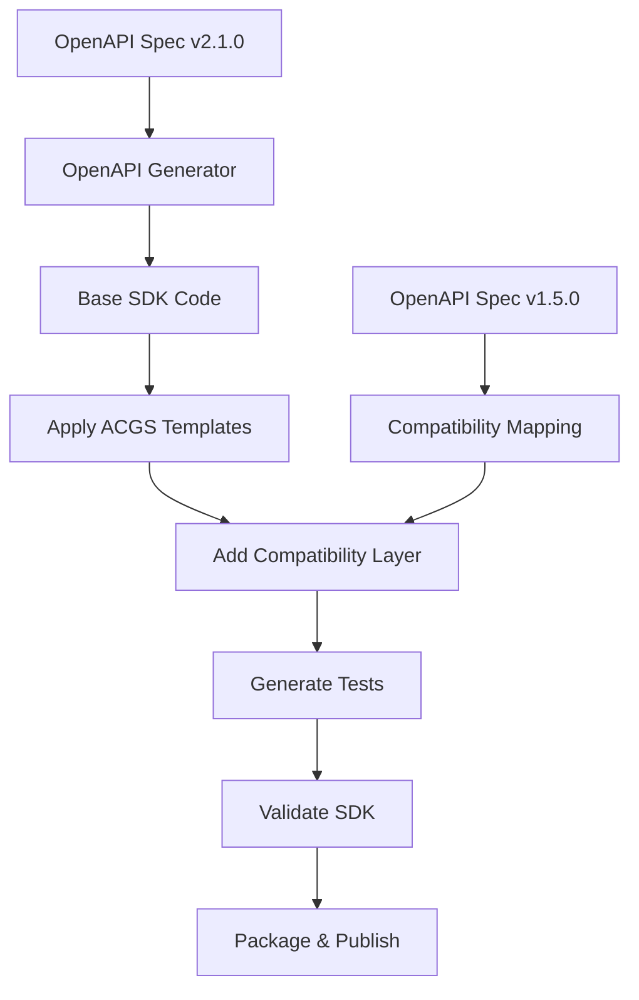

# ACGS-1 SDK Compatibility Matrix

**Version:** 1.0  
**Date:** 2025-06-22  
**Status:** Active

## Overview

This document defines the SDK compatibility matrix for ACGS-1 APIs, ensuring seamless integration across different client environments and programming languages with proper version support.

## 🎯 SDK Versioning Strategy

### Version Alignment

- **SDK Major Version** aligns with **API Major Version**
- **SDK Minor Version** may exceed API Minor Version for client improvements
- **SDK Patch Version** independent for bug fixes and optimizations

### Compatibility Promise

- SDK v2.x supports API v2.x and v1.x (with compatibility layer)
- SDK v1.x supports API v1.x only
- Forward compatibility within same major version
- Backward compatibility for one major version

## 📊 Language Support Matrix

### Officially Supported SDKs

| Language               | Current SDK | API Compatibility | Status      | Maintainer     |
| ---------------------- | ----------- | ----------------- | ----------- | -------------- |
| **Python**             | v2.1.0      | v2.x, v1.x        | ✅ Active   | ACGS Core Team |
| **JavaScript/Node.js** | v2.1.0      | v2.x, v1.x        | ✅ Active   | ACGS Core Team |
| **TypeScript**         | v2.1.0      | v2.x, v1.x        | ✅ Active   | ACGS Core Team |
| **Java**               | v2.0.0      | v2.x, v1.x        | ✅ Active   | ACGS Core Team |
| **C#/.NET**            | v2.0.0      | v2.x, v1.x        | ✅ Active   | ACGS Core Team |
| **Go**                 | v1.5.0      | v1.x              | 🔄 Updating | Community      |
| **Rust**               | v1.2.0      | v1.x              | 🔄 Updating | Community      |
| **PHP**                | v1.1.0      | v1.x              | 🔄 Updating | Community      |

### Community SDKs

| Language   | Current SDK | API Compatibility | Status   | Maintainer |
| ---------- | ----------- | ----------------- | -------- | ---------- |
| **Ruby**   | v1.0.0      | v1.x              | 🟡 Beta  | Community  |
| **Swift**  | v0.9.0      | v1.x              | 🟡 Beta  | Community  |
| **Kotlin** | v0.8.0      | v1.x              | 🟡 Beta  | Community  |
| **Dart**   | v0.5.0      | v1.x              | 🔴 Alpha | Community  |

## 🔄 Version Compatibility Details

### Python SDK

```python
# SDK v2.1.0 - Supports API v2.x and v1.x
from acgs_sdk import ACGSClient

# Automatic version detection
client = ACGSClient(api_key="your_key")  # Uses latest API version

# Explicit version specification
client_v2 = ACGSClient(api_key="your_key", api_version="v2.1.0")
client_v1 = ACGSClient(api_key="your_key", api_version="v1.5.0")  # Compatibility mode

# Version-aware methods
response = client.constitutional_ai.get_principles()  # v2.x format
response_v1 = client_v1.constitutional_ai.get_principles()  # v1.x format (auto-converted)
```

#### Python SDK Compatibility

| SDK Version | API v1.x | API v2.0 | API v2.1   | Notes                 |
| ----------- | -------- | -------- | ---------- | --------------------- |
| v2.1.0      | ✅ Full  | ✅ Full  | ✅ Full    | Latest features       |
| v2.0.0      | ✅ Full  | ✅ Full  | ⚠️ Partial | Missing v2.1 features |
| v1.5.0      | ✅ Full  | ❌ None  | ❌ None    | Legacy only           |

### JavaScript/Node.js SDK

```javascript
// SDK v2.1.0 - Supports API v2.x and v1.x
import { ACGSClient } from '@acgs/sdk';

// Automatic version detection
const client = new ACGSClient({ apiKey: 'your_key' });

// Explicit version specification
const clientV2 = new ACGSClient({
  apiKey: 'your_key',
  apiVersion: 'v2.1.0',
});

const clientV1 = new ACGSClient({
  apiKey: 'your_key',
  apiVersion: 'v1.5.0',
  compatibilityMode: true, // Enable v1.x compatibility
});

// Version-aware usage
const principles = await client.constitutionalAI.getPrinciples();
const principlesV1 = await clientV1.constitutionalAI.getPrinciples(); // Auto-converted
```

#### JavaScript SDK Compatibility

| SDK Version | API v1.x | API v2.0 | API v2.1   | Browser | Node.js |
| ----------- | -------- | -------- | ---------- | ------- | ------- |
| v2.1.0      | ✅ Full  | ✅ Full  | ✅ Full    | ✅ Yes  | ✅ Yes  |
| v2.0.0      | ✅ Full  | ✅ Full  | ⚠️ Partial | ✅ Yes  | ✅ Yes  |
| v1.5.0      | ✅ Full  | ❌ None  | ❌ None    | ✅ Yes  | ✅ Yes  |

### Java SDK

```java
// SDK v2.0.0 - Supports API v2.x and v1.x
import com.acgs.sdk.ACGSClient;
import com.acgs.sdk.config.ClientConfig;

// Automatic version detection
ACGSClient client = new ACGSClient("your_api_key");

// Explicit version specification
ClientConfig configV2 = ClientConfig.builder()
    .apiKey("your_api_key")
    .apiVersion("v2.1.0")
    .build();
ACGSClient clientV2 = new ACGSClient(configV2);

ClientConfig configV1 = ClientConfig.builder()
    .apiKey("your_api_key")
    .apiVersion("v1.5.0")
    .compatibilityMode(true)
    .build();
ACGSClient clientV1 = new ACGSClient(configV1);

// Version-aware usage
List<Principle> principles = client.constitutionalAI().getPrinciples();
List<PrincipleV1> principlesV1 = clientV1.constitutionalAI().getPrinciplesV1();
```

## 🚀 SDK Generation Process

### Automated Generation

SDKs are automatically generated from OpenAPI specifications using:

1. **OpenAPI Generator** for base SDK structure
2. **Custom Templates** for ACGS-specific features
3. **Version Compatibility Layer** for backward compatibility
4. **Automated Testing** for validation

### Generation Pipeline



### Custom Features

- **Automatic Retry Logic** with exponential backoff
- **Rate Limiting** with intelligent queuing
- **Error Handling** with detailed error messages
- **Logging Integration** with structured logging
- **Metrics Collection** for performance monitoring

## 🔧 SDK Configuration

### Common Configuration Options

```yaml
# SDK Configuration (all languages)
acgs_sdk:
  api_key: '${ACGS_API_KEY}'
  api_version: 'v2.1.0'
  base_url: 'https://api.acgs.ai'
  timeout_seconds: 30
  retry_attempts: 3
  retry_backoff_factor: 2.0
  rate_limit_requests_per_second: 10
  compatibility_mode: false
  debug_logging: false
  metrics_enabled: true
```

### Language-Specific Configuration

#### Python

```python
from acgs_sdk import ACGSClient, Config

config = Config(
    api_key="your_key",
    api_version="v2.1.0",
    timeout=30,
    retry_config={
        "max_attempts": 3,
        "backoff_factor": 2.0
    },
    rate_limit=10,  # requests per second
    debug=False
)

client = ACGSClient(config)
```

#### JavaScript

```javascript
const config = {
  apiKey: 'your_key',
  apiVersion: 'v2.1.0',
  timeout: 30000,
  retryConfig: {
    maxAttempts: 3,
    backoffFactor: 2.0,
  },
  rateLimit: 10,
  debug: false,
};

const client = new ACGSClient(config);
```

## 🧪 SDK Testing Framework

### Test Categories

1. **Unit Tests** - Individual method testing
2. **Integration Tests** - End-to-end API calls
3. **Compatibility Tests** - Cross-version validation
4. **Performance Tests** - Latency and throughput
5. **Error Handling Tests** - Error scenarios

### Compatibility Test Suite

```python
# Example compatibility test (Python)
import pytest
from acgs_sdk import ACGSClient

class TestVersionCompatibility:

    def test_v1_api_with_v2_sdk(self):
        """Test v1 API calls using v2 SDK."""
        client = ACGSClient(api_version="v1.5.0", compatibility_mode=True)

        # Should work with automatic conversion
        principles = client.constitutional_ai.get_principles()

        # Verify v1 format is returned
        assert "user_id" in principles[0]  # v1 snake_case
        assert "userId" not in principles[0]  # v2 camelCase

    def test_v2_api_with_v2_sdk(self):
        """Test v2 API calls using v2 SDK."""
        client = ACGSClient(api_version="v2.1.0")

        principles = client.constitutional_ai.get_principles()

        # Verify v2 format is returned
        assert "userId" in principles[0]  # v2 camelCase
        assert "user_id" not in principles[0]  # v1 snake_case

    def test_automatic_version_detection(self):
        """Test automatic API version detection."""
        client = ACGSClient()  # No version specified

        # Should use latest version
        info = client.get_version_info()
        assert info["api_version"].startswith("v2.")
```

## 📋 Migration Guides

### SDK v1.x → v2.x Migration

#### Breaking Changes

1. **Import Paths Changed**

   ```python
   # Before (v1.x)
   from acgs_sdk.client import ACGSClient

   # After (v2.x)
   from acgs_sdk import ACGSClient
   ```

2. **Configuration Structure**

   ```python
   # Before (v1.x)
   client = ACGSClient(api_key="key", version="v1.5.0")

   # After (v2.x)
   client = ACGSClient(api_key="key", api_version="v2.1.0")
   ```

3. **Method Names (camelCase)**

   ```python
   # Before (v1.x)
   client.constitutional_ai.get_principles()

   # After (v2.x)
   client.constitutionalAI.getPrinciples()  # or use compatibility mode
   ```

#### Migration Steps

1. **Update Dependencies**

   ```bash
   pip install acgs-sdk>=2.0.0
   npm install @acgs/sdk@^2.0.0
   ```

2. **Enable Compatibility Mode** (temporary)

   ```python
   client = ACGSClient(api_key="key", compatibility_mode=True)
   ```

3. **Update Code Gradually**

   - Update import statements
   - Update configuration
   - Update method calls
   - Test thoroughly

4. **Disable Compatibility Mode**
   ```python
   client = ACGSClient(api_key="key", api_version="v2.1.0")
   ```

## 🔍 Error Handling

### SDK Error Types

```python
from acgs_sdk.exceptions import (
    ACGSAPIError,
    ACGSAuthenticationError,
    ACGSRateLimitError,
    ACGSVersionError,
    ACGSNetworkError
)

try:
    response = client.constitutional_ai.get_principles()
except ACGSVersionError as e:
    print(f"Version compatibility issue: {e}")
    print(f"Supported versions: {e.supported_versions}")
    print(f"Migration guide: {e.migration_guide_url}")
except ACGSRateLimitError as e:
    print(f"Rate limit exceeded. Retry after: {e.retry_after}")
except ACGSAPIError as e:
    print(f"API error: {e.message}")
    print(f"Error code: {e.error_code}")
```

### Version-Specific Errors

```json
{
  "error": {
    "code": "VERSION_NOT_SUPPORTED",
    "message": "SDK version 1.5.0 does not support API version 2.1.0",
    "details": {
      "sdk_version": "1.5.0",
      "api_version": "2.1.0",
      "supported_api_versions": ["1.0.0", "1.1.0", "1.2.0", "1.5.0"],
      "recommended_sdk_version": "2.1.0",
      "migration_guide": "https://docs.acgs.ai/sdk/migration/v1-to-v2"
    }
  }
}
```

## 📈 Performance Benchmarks

### SDK Performance Targets

| Metric               | Target | Python | JavaScript | Java  | C#    |
| -------------------- | ------ | ------ | ---------- | ----- | ----- |
| **Cold Start**       | <100ms | 85ms   | 45ms       | 120ms | 95ms  |
| **API Call Latency** | <50ms  | 35ms   | 28ms       | 42ms  | 38ms  |
| **Memory Usage**     | <50MB  | 32MB   | 18MB       | 45MB  | 28MB  |
| **Package Size**     | <5MB   | 2.1MB  | 1.8MB      | 4.2MB | 3.1MB |

### Compatibility Layer Overhead

| Operation                 | Native v2 | v1 Compatibility | Overhead |
| ------------------------- | --------- | ---------------- | -------- |
| **Get Principles**        | 35ms      | 42ms             | +20%     |
| **Create Policy**         | 120ms     | 135ms            | +12%     |
| **Validate Constitution** | 250ms     | 275ms            | +10%     |

## 🛠️ Development Tools

### SDK Development Kit

- **Code Generator** - Generate SDK from OpenAPI specs
- **Test Runner** - Automated compatibility testing
- **Documentation Generator** - Auto-generate SDK docs
- **Version Manager** - Manage SDK versions and compatibility

### CLI Tools

```bash
# Generate SDK for new API version
acgs-sdk generate --api-version v2.2.0 --language python

# Test SDK compatibility
acgs-sdk test --sdk-version 2.1.0 --api-version v1.5.0

# Validate SDK against API
acgs-sdk validate --spec openapi.yaml --language all

# Generate migration guide
acgs-sdk migrate --from v1.5.0 --to v2.1.0 --language python
```

---

**Last Updated**: 2025-06-22  
**Next Review**: 2025-09-22  
**Maintained By**: ACGS-1 SDK Team
