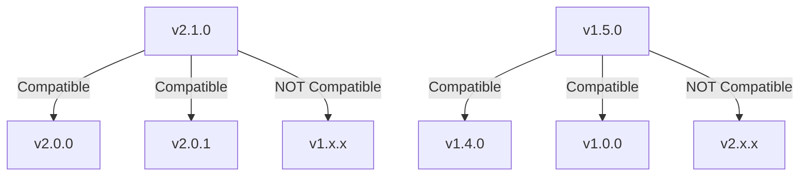

# ACGS-1 API Version Compatibility Matrix

**Version:** 1.0  
**Date:** 2025-06-22  
**Status:** Active

## Overview

This document defines the API version compatibility matrix for all ACGS-1 services, establishing clear guidelines for version support, deprecation timelines, and migration paths.

## 🎯 Versioning Strategy

### Semantic Versioning (SemVer)

All ACGS-1 APIs follow semantic versioning: `v{MAJOR}.{MINOR}.{PATCH}`

- **MAJOR**: Breaking changes that require client updates
- **MINOR**: New features, backward compatible
- **PATCH**: Bug fixes, backward compatible

### Version Support Policy

- **Current Version**: Latest stable version with full support
- **Previous Major**: Supported for 6 months after new major release
- **Deprecation Period**: 30-day advance notice before sunset
- **Maximum Concurrent Versions**: 2 major versions supported simultaneously

## 📊 Service Version Matrix

### Core Services

| Service                      | Current Version | Previous Version | Deprecation Date | Sunset Date | Status    |
| ---------------------------- | --------------- | ---------------- | ---------------- | ----------- | --------- |
| **Constitutional AI**        | v2.1.0          | v1.5.0           | 2025-07-22       | 2025-08-22  | ✅ Active |
| **Authentication**           | v2.1.0          | v1.4.0           | 2025-07-22       | 2025-08-22  | ✅ Active |
| **Formal Verification**      | v1.5.0          | v1.4.0           | -                | -           | ✅ Active |
| **Governance Synthesis**     | v2.0.0          | v1.3.0           | 2025-07-15       | 2025-08-15  | ✅ Active |
| **Policy Governance**        | v8.0.0          | v7.2.0           | 2025-07-20       | 2025-08-20  | ✅ Active |
| **Evolutionary Computation** | v1.2.0          | v1.1.0           | -                | -           | ✅ Active |
| **Darwin Gödel Machine**     | v1.0.0          | -                | -                | -           | ✅ Active |
| **Integrity Service**        | v1.1.0          | v1.0.0           | -                | -           | ✅ Active |

### Platform Services

| Service                     | Current Version | Previous Version | Deprecation Date | Sunset Date | Status    |
| --------------------------- | --------------- | ---------------- | ---------------- | ----------- | --------- |
| **Authentication Platform** | v2.1.0          | v2.0.0           | -                | -           | ✅ Active |
| **Workflow Engine**         | v1.0.0          | -                | -                | -           | ✅ Active |
| **NVIDIA LLM Router**       | v1.0.0          | -                | -                | -           | ✅ Active |

## 🔄 Version Compatibility Rules

### Backward Compatibility



### Version Detection Priority

1. **API-Version Header**: `API-Version: v2.1.0`
2. **Accept Header**: `Accept: application/json; version=v2.1.0`
3. **URL Path**: `/api/v2/endpoint`
4. **Query Parameter**: `?version=v2.1.0`
5. **Default**: Current service version

### Response Headers

All API responses include version information:

```http
API-Version: v2.1.0
X-API-Version: v2.1.0
X-Service-Name: constitutional-ai-service
X-Supported-Versions: v2.1.0,v2.0.0
```

## ⚠️ Deprecation Handling

### RFC 8594 Compliance

Deprecated versions include standard headers:

```http
Deprecation: Wed, 22 Jul 2025 00:00:00 GMT
Sunset: Mon, 22 Aug 2025 00:00:00 GMT
Link: <https://docs.acgs.ai/migration/v2.1>; rel="successor-version"
```

### Deprecation Warnings

```json
{
  "status": "success",
  "data": { ... },
  "metadata": {
    "api_version": "v2.0.0",
    "deprecation": {
      "is_deprecated": true,
      "deprecated_since": "2025-07-22T00:00:00Z",
      "sunset_date": "2025-08-22T00:00:00Z",
      "days_until_sunset": 31,
      "migration_guide": "https://docs.acgs.ai/migration/v2.1",
      "breaking_changes": [
        "Field 'user_id' renamed to 'userId'",
        "Removed 'legacy_field' from response"
      ]
    }
  }
}
```

## 🚀 Migration Paths

### v1.x → v2.x Migration

#### Breaking Changes

- **Field Naming**: snake_case → camelCase
- **Response Structure**: Unified response format
- **Authentication**: Enhanced JWT validation
- **Error Handling**: Standardized error codes

#### Migration Steps

1. Update client libraries to handle new response format
2. Implement dual-version support during transition
3. Update field name mappings
4. Test against v2.x endpoints
5. Switch to v2.x headers
6. Remove v1.x compatibility code

### v2.0 → v2.1 Migration

#### New Features (Backward Compatible)

- Enhanced metadata in responses
- Additional validation rules
- Performance optimizations
- New optional fields

#### Migration Steps

1. Update to latest client SDK
2. Test new features in development
3. Deploy with v2.1 headers
4. Utilize new capabilities

## 🔧 Implementation Guidelines

### Client Implementation

```javascript
// Version-aware API client
const apiClient = {
  version: 'v2.1.0',

  async request(endpoint, options = {}) {
    const headers = {
      'API-Version': this.version,
      Accept: `application/json; version=${this.version}`,
      ...options.headers,
    };

    const response = await fetch(`/api/v2/${endpoint}`, {
      ...options,
      headers,
    });

    // Check for deprecation warnings
    if (response.headers.get('Deprecation')) {
      console.warn('API version deprecated:', response.headers.get('Sunset'));
    }

    return response.json();
  },
};
```

### Server Implementation

```python
from fastapi import FastAPI
from services.shared.middleware.version_routing_middleware import (
    create_version_routing_middleware
)

app = FastAPI()

# Add version routing middleware
version_middleware = create_version_routing_middleware(
    app=app,
    service_name="constitutional-ai-service",
    current_version="v2.1.0",
    supported_versions=["v2.0.0", "v1.5.0"]
)

app.add_middleware(type(version_middleware), **version_middleware.__dict__)
```

## 📈 Monitoring & Metrics

### Version Usage Tracking

- **Active Versions**: Monitor usage per version
- **Deprecation Compliance**: Track migration progress
- **Performance Impact**: Monitor version middleware latency (<5ms target)
- **Error Rates**: Track version-related errors

### Grafana Dashboard Queries

```promql
# Version usage distribution
sum by (api_version) (rate(http_requests_total[5m]))

# Deprecated version usage
sum by (api_version) (rate(http_requests_total{deprecated="true"}[5m]))

# Version middleware latency
histogram_quantile(0.95, rate(version_middleware_duration_seconds_bucket[5m]))
```

## 🔒 Security Considerations

### Version-Based Security

- **Version Validation**: Strict validation prevents version injection
- **Deprecation Security**: Deprecated versions maintain security patches
- **Audit Logging**: All version changes logged for compliance
- **Rate Limiting**: Version-aware rate limiting

### Security Headers

```http
X-Content-Type-Options: nosniff
X-Frame-Options: DENY
X-XSS-Protection: 1; mode=block
Strict-Transport-Security: max-age=31536000; includeSubDomains
```

## 📚 Resources

### Documentation Links

- [API Migration Guide](./API_MIGRATION_GUIDE.md)
- [Client SDK Documentation](./CLIENT_SDK_GUIDE.md)
- [Version Testing Guide](./VERSION_TESTING_GUIDE.md)
- [Deprecation Policy](./DEPRECATION_POLICY.md)

### Support Channels

- **Technical Support**: support@acgs.ai
- **Migration Assistance**: migration@acgs.ai
- **Documentation**: docs@acgs.ai

---

**Last Updated**: 2025-06-22  
**Next Review**: 2025-07-22  
**Maintained By**: ACGS-1 API Team
