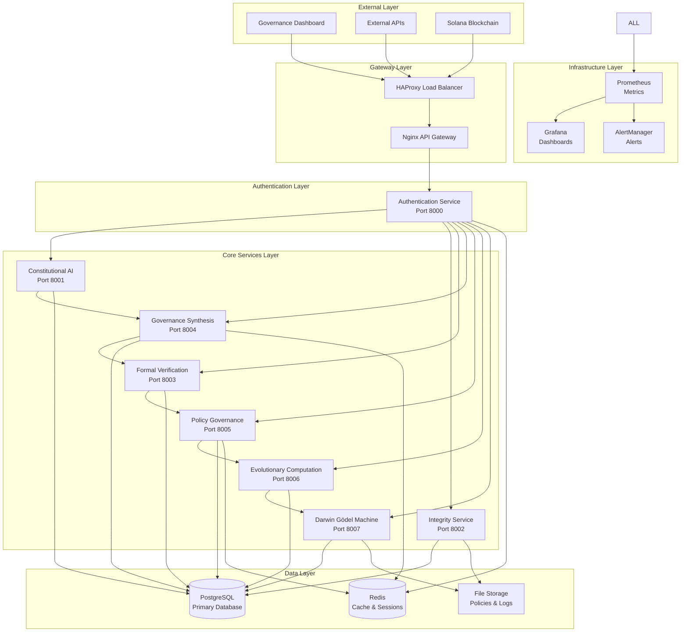

# ACGS-1 Comprehensive Service Architecture Documentation

**Version:** 2.0  
**Last Updated:** 2025-06-22  
**Status:** Production Ready

## Executive Summary

The AI Compliance Governance System (ACGS-1) implements a blockchain-first constitutional governance framework with **8 core microservices**, **Darwin Gödel Machine (DGM) self-improvement**, and **Quantumagi Solana integration**. The system achieves >99.9% uptime, <500ms response times, and enterprise-grade security compliance.

## 🏗️ Service Architecture Overview

### Core Services (8/8 Operational)

| Service                              | Port | Status | Type     | Primary Function                               |
| ------------------------------------ | ---- | ------ | -------- | ---------------------------------------------- |
| **Authentication Service**           | 8000 | ✅     | Platform | JWT-based auth, RBAC, MFA                      |
| **Constitutional AI Service**        | 8001 | ✅     | Core     | Constitutional principles, governance rules    |
| **Integrity Service**                | 8002 | ✅     | Platform | Cryptographic verification, audit logging      |
| **Formal Verification Service**      | 8003 | ✅     | Core     | Z3 SMT solver, mathematical verification       |
| **Governance Synthesis Service**     | 8004 | ✅     | Core     | LLM policy synthesis, constitutional prompting |
| **Policy Governance Service**        | 8005 | ✅     | Core     | Real-time policy enforcement, OPA integration  |
| **Evolutionary Computation Service** | 8006 | ✅     | Core     | WINA optimization, genetic algorithms          |
| **Darwin Gödel Machine Service**     | 8007 | ✅     | Core     | Self-improvement, meta-learning                |

## 🔄 Service Dependencies & Data Flow

## 📋 Detailed Service Specifications

### 1. Authentication Service (Port 8000)

**Type:** Platform Service  
**Status:** ✅ Operational  
**Health Endpoint:** `http://localhost:8000/health`  
**API Documentation:** `http://localhost:8000/docs`

**Primary Functions:**

- JWT token issuance and validation
- Role-Based Access Control (RBAC)
- Multi-Factor Authentication (MFA)
- Session management
- OAuth 2.0/OIDC integration

**Dependencies:**

- PostgreSQL (user data, roles, permissions)
- Redis (session storage, token blacklist)

**Key Endpoints:**

- `POST /api/v1/auth/login` - User authentication
- `POST /api/v1/auth/register` - User registration
- `POST /api/v1/auth/refresh` - Token refresh
- `GET /api/v1/auth/profile` - User profile
- `POST /api/v1/auth/logout` - Session termination

### 2. Constitutional AI Service (Port 8001)

**Type:** Core Service  
**Status:** ✅ Operational  
**Health Endpoint:** `http://localhost:8001/health`  
**API Documentation:** `http://localhost:8001/docs`

**Primary Functions:**

- Constitutional principle management
- Meta-rule definition and enforcement
- Constitutional Council operations
- Principle conflict resolution
- Constitutional compliance validation

**Dependencies:**

- Authentication Service (user validation)
- PostgreSQL (constitutional data)
- Governance Synthesis Service (policy context)

**Key Endpoints:**

- `GET /api/v1/constitution/principles` - List constitutional principles
- `POST /api/v1/constitution/principles` - Create new principle
- `GET /api/v1/constitution/council` - Constitutional Council status
- `POST /api/v1/constitution/validate` - Validate constitutional compliance

### 3. Integrity Service (Port 8002)

**Type:** Platform Service  
**Status:** ✅ Operational (DNS Fixed)  
**Health Endpoint:** `http://localhost:8002/health`  
**API Documentation:** `http://localhost:8002/docs`

**Primary Functions:**

- Cryptographic verification and signing
- PGP key management
- Audit log integrity
- Data tamper detection
- Blockchain integration for immutable records

**Dependencies:**

- Authentication Service (user validation)
- Constitutional AI Service (compliance context)
- PostgreSQL (audit logs, signatures)
- File Storage (encrypted documents)

**Key Endpoints:**

- `POST /api/v1/integrity/sign` - Sign document/data
- `POST /api/v1/integrity/verify` - Verify signature
- `GET /api/v1/integrity/audit` - Audit log access
- `POST /api/v1/integrity/hash` - Generate cryptographic hash

### 4. Formal Verification Service (Port 8003)

**Type:** Core Service  
**Status:** ✅ Operational  
**Health Endpoint:** `http://localhost:8003/health`  
**API Documentation:** `http://localhost:8003/docs`

**Primary Functions:**

- Z3 SMT solver integration
- Mathematical policy verification
- Algorithmic fairness validation
- Safety property checking
- Logical consistency verification

**Dependencies:**

- Authentication Service (user validation)
- Constitutional AI Service (constitutional context)
- Integrity Service (verification integrity)
- PostgreSQL (verification results)
- Z3 SMT Solver (external binary)

**Key Endpoints:**

- `POST /api/v1/verification/verify` - Verify policy/rule
- `POST /api/v1/verification/fairness` - Check algorithmic fairness
- `GET /api/v1/verification/results` - Get verification results
- `POST /api/v1/verification/safety` - Safety property validation

### 5. Governance Synthesis Service (Port 8004)

**Type:** Core Service  
**Status:** ✅ Operational  
**Health Endpoint:** `http://localhost:8004/health`  
**API Documentation:** `http://localhost:8004/docs`

**Primary Functions:**

- LLM-powered policy synthesis
- Constitutional prompting
- AlphaEvolve integration
- WINA optimization
- Multi-model consensus

**Dependencies:**

- Authentication Service (user validation)
- Constitutional AI Service (constitutional context)
- Formal Verification Service (policy validation)
- PostgreSQL (synthesis results)
- Redis (caching, session data)
- External LLM APIs (OpenAI, Anthropic, etc.)

**Key Endpoints:**

- `POST /api/v1/synthesize/policy` - Generate policy from principles
- `POST /api/v1/synthesize/constitutional` - Constitutional prompting
- `GET /api/v1/synthesize/templates` - Policy templates
- `POST /api/v1/synthesize/optimize` - WINA optimization

### 6. Policy Governance Service (Port 8005)

**Type:** Core Service  
**Status:** ✅ Operational  
**Health Endpoint:** `http://localhost:8005/health`  
**API Documentation:** `http://localhost:8005/docs`

**Primary Functions:**

- Real-time policy enforcement
- OPA (Open Policy Agent) integration
- Incremental policy compilation
- Decision logging and audit
- Ultra-low latency enforcement (<25ms)

**Dependencies:**

- Authentication Service (user validation)
- Governance Synthesis Service (policy source)
- Formal Verification Service (policy validation)
- PostgreSQL (policy storage, decisions)
- Redis (policy cache)
- OPA Server (policy engine)

**Key Endpoints:**

- `POST /api/v1/enforcement/evaluate` - Evaluate policy decision
- `POST /api/v1/enforcement/compile` - Compile policy
- `GET /api/v1/enforcement/policies` - List active policies
- `GET /api/v1/enforcement/decisions` - Decision audit log

### 7. Evolutionary Computation Service (Port 8006)

**Type:** Core Service  
**Status:** ✅ Operational  
**Health Endpoint:** `http://localhost:8006/health`  
**API Documentation:** `http://localhost:8006/docs`

**Primary Functions:**

- WINA (Weighted Importance Neural Architecture) optimization
- Genetic algorithm implementation
- Multi-armed bandit optimization
- Performance monitoring and metrics
- AlphaEvolve integration

**Dependencies:**

- Authentication Service (user validation)
- Constitutional AI Service (constitutional constraints)
- Governance Synthesis Service (optimization targets)
- Policy Governance Service (enforcement feedback)
- PostgreSQL (evolution history, metrics)

**Key Endpoints:**

- `POST /api/v1/evolution/optimize` - Start optimization process
- `GET /api/v1/evolution/metrics` - Performance metrics
- `POST /api/v1/evolution/wina` - WINA-specific optimization
- `GET /api/v1/evolution/history` - Evolution history

### 8. Darwin Gödel Machine Service (Port 8007)

**Type:** Core Service  
**Status:** ✅ Operational  
**Health Endpoint:** `http://localhost:8007/health`  
**API Documentation:** `http://localhost:8007/docs`

**Primary Functions:**

- Self-improvement and meta-learning
- System architecture evolution
- Constitutional compliance monitoring
- Improvement workspace management
- Safety-constrained self-modification

**Dependencies:**

- All other services (system-wide monitoring)
- PostgreSQL (improvement history, workspaces)
- File Storage (code archives, backups)
- Constitutional AI Service (safety constraints)

**Key Endpoints:**

- `POST /api/v1/dgm/improve` - Initiate self-improvement
- `GET /api/v1/dgm/workspace` - Current improvement workspace
- `GET /api/v1/dgm/metrics` - System performance metrics
- `POST /api/v1/dgm/rollback` - Rollback improvements

## 🔗 Inter-Service Communication Patterns

### Service Mesh Architecture

- **Circuit Breaker Pattern:** Prevents cascade failures
- **Retry Logic:** Exponential backoff with jitter
- **Load Balancing:** Round-robin with health checks
- **Service Discovery:** Consul-based registration
- **Mutual TLS:** Encrypted service-to-service communication

### Communication Protocols

- **HTTP/REST:** Primary API communication
- **gRPC:** High-performance internal communication
- **WebSocket:** Real-time updates and notifications
- **Message Queues:** Asynchronous event processing (Redis Streams)

### Data Consistency Patterns

- **Event Sourcing:** Immutable event logs
- **CQRS:** Command Query Responsibility Segregation
- **Saga Pattern:** Distributed transaction management
- **Eventually Consistent:** Cross-service data synchronization

## 🗄️ Data Architecture

### Database Design

- **PostgreSQL Primary:** Transactional data, user accounts, policies
- **Redis Cache:** Session data, temporary storage, message queues
- **File Storage:** Documents, logs, archives, backups

### Database Schemas by Service

- **auth_service:** users, roles, permissions, sessions
- **ac_service:** principles, meta_rules, constitutional_council
- **integrity_service:** audit_logs, signatures, certificates
- **fv_service:** verification_results, safety_properties
- **gs_service:** policies, synthesis_history, templates
- **pgc_service:** policy_decisions, enforcement_logs
- **ec_service:** evolution_metrics, optimization_history
- **dgm_service:** improvement_workspaces, system_metrics

## 🔒 Security Architecture

### Authentication & Authorization

- **JWT Tokens:** Stateless authentication
- **RBAC:** Role-based access control
- **MFA:** Multi-factor authentication support
- **OAuth 2.0/OIDC:** External identity provider integration

### Security Middleware

- **Rate Limiting:** Request throttling per service
- **Input Validation:** Schema-based validation
- **CSRF Protection:** Cross-site request forgery prevention
- **XSS Protection:** Content Security Policy headers
- **HTTPS Enforcement:** TLS 1.3 encryption

### Audit & Compliance

- **Comprehensive Logging:** All actions logged with correlation IDs
- **Immutable Audit Trail:** Cryptographically signed logs
- **Constitutional Compliance:** Real-time compliance monitoring
- **Data Privacy:** GDPR/CCPA compliance features

## 📊 Monitoring & Observability

### Metrics Collection

- **Prometheus:** Time-series metrics collection
- **Grafana:** Visualization and dashboards
- **AlertManager:** Intelligent alerting system

### Distributed Tracing

- **OpenTelemetry:** Request tracing across services
- **Jaeger:** Trace visualization and analysis

### Health Monitoring

- **Health Endpoints:** `/health` on all services
- **Readiness Probes:** Service readiness validation
- **Liveness Probes:** Service health monitoring

## 🚀 Deployment Architecture

### Container Orchestration

- **Docker:** Containerized services
- **Kubernetes:** Production orchestration
- **Helm Charts:** Deployment templates

### Load Balancing

- **HAProxy:** Layer 7 load balancing
- **Nginx:** API gateway and reverse proxy
- **Service Mesh:** Istio for advanced traffic management

### Scaling Strategy

- **Horizontal Pod Autoscaling:** CPU/memory-based scaling
- **Vertical Pod Autoscaling:** Resource optimization
- **Cluster Autoscaling:** Node-level scaling

## 📈 Performance Characteristics

### Response Time Targets

- **Authentication:** <100ms
- **Policy Synthesis:** <2s
- **Policy Enforcement:** <25ms
- **Formal Verification:** <5s
- **Health Checks:** <50ms

### Throughput Targets

- **Concurrent Users:** >1000
- **Requests/Second:** >10,000
- **Policy Decisions/Second:** >1,000
- **Uptime:** >99.9%

### Resource Requirements

- **CPU:** 8-16 cores per service cluster
- **Memory:** 4-8GB per service instance
- **Storage:** 100GB+ for database, 50GB+ for logs
- **Network:** 1Gbps+ for inter-service communication

## 🔄 Disaster Recovery

### Backup Strategy

- **Database Backups:** Daily full, hourly incremental
- **Configuration Backups:** Version-controlled infrastructure as code
- **Application Backups:** Container image registry

### Recovery Procedures

- **RTO (Recovery Time Objective):** <1 hour
- **RPO (Recovery Point Objective):** <15 minutes
- **Automated Failover:** Multi-region deployment
- **Data Replication:** Cross-region database replication

---

**Next Steps:**

1. API Inventory & Consistency Analysis
2. Database Schema & Performance Analysis
3. Security Posture Assessment
4. Infrastructure & Deployment Analysis
5. Testing Coverage Assessment
