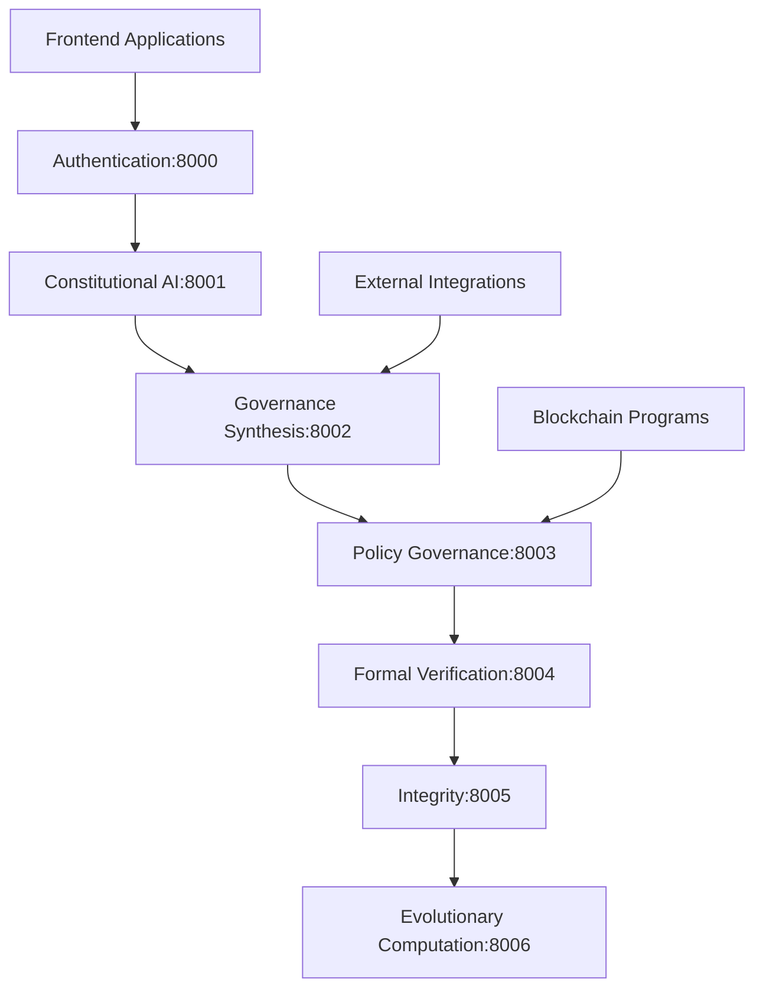

# ACGS-1 Architecture Overview

## Blockchain-Focused Directory Structure

The ACGS-1 system follows a blockchain-first architecture with clear separation of concerns:

```
ACGS-1/
├── blockchain/                          # 🔗 Solana/Anchor Programs
│   ├── programs/                        # On-chain smart contracts
│   │   ├── blockchain/            # Main governance program
│   │   ├── appeals/                    # Appeals handling program
│   │   └── logging/                    # Event logging program
│   ├── client/                         # Blockchain client libraries
│   ├── tests/                          # Anchor program tests
│   ├── scripts/                        # Deployment & management scripts
│   └── quantumagi-deployment/          # Deployment artifacts & configs
│
├── services/                           # 🏗️ Backend Microservices
│   ├── core/                           # Core governance services
│   │   ├── constitutional-ai/          # Constitutional principles & compliance
│   │   ├── governance-synthesis/       # Policy synthesis & management
│   │   ├── policy-governance/          # Real-time policy enforcement (PGC)
│   │   └── formal-verification/        # Mathematical policy validation
│   ├── platform/                       # Platform infrastructure services
│   │   ├── authentication/             # User authentication & authorization
│   │   ├── integrity/                  # Data integrity & audit trails
│   │   └── workflow/                   # Process orchestration
│   ├── research/                       # Research & experimentation services
│   │   ├── federated-evaluation/       # Federated learning evaluation
│   │   └── research-platform/          # Research infrastructure
│   └── shared/                         # Shared libraries & utilities
│
├── applications/                       # 🖥️ Frontend Applications
│   ├── governance-dashboard/           # Main governance interface
│   ├── constitutional-council/         # Council management interface
│   ├── public-consultation/            # Public participation portal
│   └── admin-panel/                    # Administrative interface
│
├── integrations/                       # 🔗 Integration Layer
│   ├── quantumagi-bridge/             # Blockchain-backend bridge
│   └── alphaevolve-engine/            # AlphaEvolve AI integration
│
├── infrastructure/                     # 🏗️ Infrastructure & Operations
│   ├── docker/                        # Container configurations
│   ├── kubernetes/                    # Orchestration manifests
│   └── monitoring/                    # Observability setup
│
├── tools/                             # 🛠️ Development Tools
├── tests/                             # 🧪 Comprehensive Test Suites
├── docs/                              # 📚 Documentation
└── scripts/                           # 📜 Automation Scripts
```

## Service Communication Architecture

### Core Service Mesh (Ports 8000-8006)



### Data Flow Architecture

1. **Authentication Layer**: All requests authenticated via port 8000
2. **Constitutional AI**: Manages principles and compliance (port 8001)
3. **Governance Synthesis**: Generates policies from principles (port 8002)
4. **Policy Governance**: Real-time enforcement via PGC (port 8003)
5. **Formal Verification**: Mathematical validation (port 8004)
6. **Integrity Service**: Audit trails and data consistency (port 8005)
7. **Evolutionary Computation**: WINA optimization and oversight (port 8006)

## Blockchain Integration

### Quantumagi Programs on Solana Devnet

- **Quantumagi Core**: `8eRUCnQsDxqK7vjp5XsYs7C3NGpdhzzaMW8QQGzfTUV4`
- **Appeals Program**: `CXKCLqyzxqyqTbEgpNbYR5qkC691BdiKMAB1nk6BMoFJ`
- **Logging Program**: Ready for deployment

### Constitutional Governance Workflow

1. **Policy Creation**: Draft → Review → Voting → Implementation
2. **Constitutional Compliance**: Real-time validation against principles
3. **Policy Enforcement**: On-chain enforcement via PGC
4. **WINA Oversight**: Continuous monitoring and optimization
5. **Audit & Transparency**: Complete audit trails and public transparency

## Performance Targets

- **Response Times**: <2s for 95% of requests
- **Availability**: >99.5% uptime
- **Governance Costs**: <0.01 SOL per governance action
- **Test Coverage**: >80% for Anchor programs
- **Concurrent Users**: >1000 simultaneous governance actions

## Development Workflow

1. **Blockchain Development**: Use `blockchain/` directory with Anchor framework
2. **Service Development**: Use `services/core/` or `services/platform/`
3. **Frontend Development**: Use `applications/` directory
4. **Integration Development**: Use `integrations/` directory
5. **Testing**: Use `tests/` with unit, integration, and e2e suites
6. **Deployment**: Use `infrastructure/docker/` for containerization

This architecture ensures scalability, maintainability, and clear separation of blockchain and off-chain components while maintaining constitutional governance principles.
