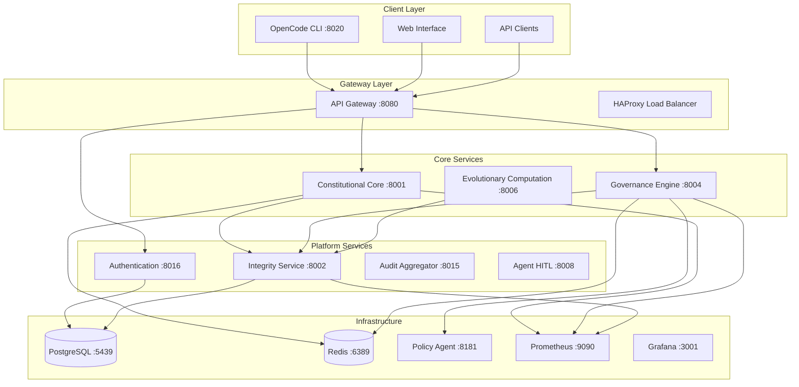

# ACGS-2 Service Architecture Patterns

**Constitutional Hash**: `cdd01ef066bc6cf2`

## Overview

This document describes the architectural patterns, design principles, and implementation strategies used across the ACGS-2 (Advanced Constitutional Governance System) microservices architecture.

## Core Architectural Principles

### 1. Constitutional Compliance by Design

Every component in the ACGS-2 system is designed with constitutional compliance as a foundational requirement:

- **Constitutional Hash Enforcement**: All services must include `cdd01ef066bc6cf2` in responses
- **Audit Trail Integration**: Every operation generates immutable audit records
- **Policy Validation**: All decisions pass through constitutional validation layers
- **Performance with Compliance**: Sub-5ms latency maintained even with constitutional checks

### 2. Multi-Tenant Isolation

The system provides complete tenant isolation at multiple layers:

- **Database Level**: PostgreSQL Row-Level Security (RLS)
- **Application Level**: Middleware-enforced tenant context
- **Cache Level**: Redis key namespacing per tenant
- **API Level**: JWT claims include tenant context

### 3. Performance-First Design

All services are optimized for high-performance operation:

- **P99 Latency Target**: <5ms for core operations
- **Throughput Target**: >100 RPS sustained load
- **Cache Efficiency**: >85% hit rate for cached operations
- **Resource Optimization**: Memory and CPU efficiency patterns

## Service Architecture Overview

### Microservices Topology



## Service Design Patterns

### 1. FastAPI Service Template

All Python services follow a standardized FastAPI structure:

```python
# services/core/service-name/app/main.py
from fastapi import FastAPI, Depends
from contextlib import asynccontextmanager
from services.shared.middleware.tenant_middleware import TenantContextMiddleware
from services.shared.middleware.error_handling import setup_error_handlers
from services.shared.monitoring.prometheus import PrometheusMetrics

@asynccontextmanager
async def lifespan(app: FastAPI):
    # Startup
    await initialize_service()
    yield
    # Shutdown
    await cleanup_service()

app = FastAPI(
    title="Service Name",
    version="2.0.0",
    lifespan=lifespan
)

# Constitutional compliance middleware
app.add_middleware(TenantContextMiddleware)
setup_error_handlers(app)

# Monitoring
metrics = PrometheusMetrics(app)

@app.get("/health")
async def health_check():
    return {
        "status": "healthy",
        "constitutional_hash": "cdd01ef066bc6cf2",
        "service": "service-name",
        "version": "2.0.0"
    }

@app.get("/metrics")
async def metrics_endpoint():
    return metrics.generate_latest()
```

### 2. Multi-Tenant Context Pattern

All services implement consistent tenant isolation:

```python
# services/shared/middleware/tenant_middleware.py
from fastapi import Request, HTTPException
from starlette.middleware.base import BaseHTTPMiddleware

class TenantContextMiddleware(BaseHTTPMiddleware):
    async def dispatch(self, request: Request, call_next):
        # Extract tenant from JWT or header
        tenant_id = self.extract_tenant_id(request)
        
        if not tenant_id:
            raise HTTPException(status_code=401, detail="Tenant context required")
        
        # Set tenant context for the request
        request.state.tenant_id = tenant_id
        request.state.constitutional_hash = "cdd01ef066bc6cf2"
        
        response = await call_next(request)
        
        # Add constitutional hash to response
        response.headers["X-Constitutional-Hash"] = "cdd01ef066bc6cf2"
        response.headers["X-Tenant-Context"] = tenant_id
        
        return response
```

### 3. Database Access Pattern

Consistent database access with multi-tenant support:

```python
# services/shared/database/connection.py
from sqlalchemy.ext.asyncio import AsyncSession, create_async_engine
from sqlalchemy.orm import sessionmaker
from contextlib import asynccontextmanager

class DatabaseManager:
    def __init__(self, database_url: str):
        self.engine = create_async_engine(
            database_url,
            echo=False,
            pool_size=20,
            max_overflow=0
        )
        self.SessionLocal = sessionmaker(
            self.engine, 
            class_=AsyncSession, 
            expire_on_commit=False
        )
    
    @asynccontextmanager
    async def get_session(self, tenant_id: str):
        async with self.SessionLocal() as session:
            # Enable Row-Level Security for tenant
            await session.execute(
                text("SET app.current_tenant_id = :tenant_id"),
                {"tenant_id": tenant_id}
            )
            yield session

# Usage in service endpoints
@app.post("/api/v1/resource")
async def create_resource(
    data: ResourceCreate,
    tenant_id: str = Depends(get_tenant_context),
    db_manager: DatabaseManager = Depends(get_db_manager)
):
    async with db_manager.get_session(tenant_id) as session:
        # Database operations are automatically tenant-scoped
        resource = Resource(**data.dict(), tenant_id=tenant_id)
        session.add(resource)
        await session.commit()
        return resource
```

### 4. Caching Pattern

Redis-based caching with tenant isolation:

```python
# services/shared/cache/redis_client.py
import redis.asyncio as redis
from typing import Optional, Any
import json

class TenantAwareCache:
    def __init__(self, redis_url: str):
        self.redis = redis.from_url(redis_url)
    
    def _tenant_key(self, tenant_id: str, key: str) -> str:
        """Generate tenant-scoped cache key"""
        return f"tenant:{tenant_id}:constitutional:{key}"
    
    async def get(self, tenant_id: str, key: str) -> Optional[Any]:
        """Get value with constitutional context"""
        cache_key = self._tenant_key(tenant_id, key)
        value = await self.redis.get(cache_key)
        
        if value:
            data = json.loads(value)
            # Verify constitutional hash
            if data.get("constitutional_hash") != "cdd01ef066bc6cf2":
                await self.delete(tenant_id, key)  # Invalid cache entry
                return None
            return data.get("value")
        return None
    
    async def set(
        self, 
        tenant_id: str, 
        key: str, 
        value: Any, 
        expire: int = 3600
    ) -> bool:
        """Set value with constitutional context"""
        cache_key = self._tenant_key(tenant_id, key)
        cache_data = {
            "value": value,
            "constitutional_hash": "cdd01ef066bc6cf2",
            "tenant_id": tenant_id,
            "timestamp": time.time()
        }
        
        return await self.redis.setex(
            cache_key, 
            expire, 
            json.dumps(cache_data)
        )
```

### 5. Error Handling Pattern

Standardized error handling across all services:

```python
# services/shared/middleware/error_handling.py
from fastapi import HTTPException, Request
from fastapi.responses import JSONResponse
from typing import Any, Dict

class ConstitutionalComplianceError(Exception):
    def __init__(self, message: str, violations: list = None):
        self.message = message
        self.violations = violations or []

class SecurityValidationError(Exception):
    def __init__(self, message: str, details: dict = None):
        self.message = message
        self.details = details or {}

def setup_error_handlers(app: FastAPI):
    @app.exception_handler(ConstitutionalComplianceError)
    async def constitutional_error_handler(
        request: Request, 
        exc: ConstitutionalComplianceError
    ):
        return JSONResponse(
            status_code=400,
            content={
                "constitutional_hash": "cdd01ef066bc6cf2",
                "error": {
                    "code": "CONSTITUTIONAL_VIOLATION",
                    "message": exc.message,
                    "details": {"violations": exc.violations},
                    "timestamp": time.time(),
                    "request_id": getattr(request.state, 'request_id', None)
                }
            }
        )
    
    @app.exception_handler(SecurityValidationError)
    async def security_error_handler(
        request: Request, 
        exc: SecurityValidationError
    ):
        return JSONResponse(
            status_code=401,
            content={
                "constitutional_hash": "cdd01ef066bc6cf2",
                "error": {
                    "code": "SECURITY_VALIDATION_FAILED",
                    "message": exc.message,
                    "details": exc.details,
                    "timestamp": time.time()
                }
            }
        )
```

## Communication Patterns

### 1. Service-to-Service Communication

ACGS services use HTTP-based communication with constitutional validation:

```python
# services/shared/clients/service_client.py
import httpx
from typing import Optional, Dict, Any

class ConstitutionalServiceClient:
    def __init__(self, base_url: str, service_token: str):
        self.base_url = base_url
        self.headers = {
            "Authorization": f"Bearer {service_token}",
            "X-Constitutional-Hash": "cdd01ef066bc6cf2"
        }
    
    async def call_service(
        self, 
        method: str, 
        endpoint: str, 
        data: Optional[Dict[str, Any]] = None,
        tenant_id: Optional[str] = None
    ) -> Dict[str, Any]:
        """Make constitutional-compliant service call"""
        
        headers = self.headers.copy()
        if tenant_id:
            headers["X-Tenant-ID"] = tenant_id
        
        async with httpx.AsyncClient() as client:
            response = await client.request(
                method=method,
                url=f"{self.base_url}{endpoint}",
                json=data,
                headers=headers,
                timeout=5.0  # Maintain <5ms target
            )
            
            # Verify constitutional compliance in response
            response_data = response.json()
            if response_data.get("constitutional_hash") != "cdd01ef066bc6cf2":
                raise ConstitutionalComplianceError(
                    "Service response missing constitutional compliance"
                )
            
            return response_data

# Usage example
integrity_client = ConstitutionalServiceClient(
    "http://localhost:8002", 
    service_token
)

audit_result = await integrity_client.call_service(
    "POST",
    "/api/v1/audit/create",
    data={"event_type": "validation", "event_data": {...}},
    tenant_id="tenant-123"
)
```

### 2. Event-Driven Architecture

Asynchronous event processing with constitutional compliance:

```python
# services/shared/events/event_bus.py
from typing import Any, Dict, Callable
from asyncio import Queue
import asyncio
import json

class ConstitutionalEventBus:
    def __init__(self):
        self.subscribers: Dict[str, list[Callable]] = {}
        self.event_queue = Queue()
        
    async def publish(
        self, 
        event_type: str, 
        data: Dict[str, Any], 
        tenant_id: str
    ):
        """Publish constitutional-compliant event"""
        event = {
            "event_type": event_type,
            "data": data,
            "tenant_id": tenant_id,
            "constitutional_hash": "cdd01ef066bc6cf2",
            "timestamp": time.time()
        }
        
        await self.event_queue.put(event)
        
        # Process immediately for subscribers
        if event_type in self.subscribers:
            for subscriber in self.subscribers[event_type]:
                asyncio.create_task(subscriber(event))
    
    def subscribe(self, event_type: str, handler: Callable):
        """Subscribe to constitutional events"""
        if event_type not in self.subscribers:
            self.subscribers[event_type] = []
        self.subscribers[event_type].append(handler)

# Usage in services
event_bus = ConstitutionalEventBus()

# Subscribe to constitutional validation events
@event_bus.subscribe("constitutional_validation_completed")
async def handle_validation_complete(event):
    # Automatically create audit entry
    await integrity_client.call_service(
        "POST",
        "/api/v1/audit/create",
        data={
            "event_type": "constitutional_validation",
            "event_data": event["data"],
            "tenant_id": event["tenant_id"]
        }
    )
```

## Data Management Patterns

### 1. Multi-Tenant Database Schema

PostgreSQL Row-Level Security implementation:

```sql
-- services/shared/database/migrations/001_multi_tenant_setup.sql

-- Create tenant table
CREATE TABLE tenants (
    id UUID PRIMARY KEY DEFAULT gen_random_uuid(),
    tenant_id VARCHAR(255) UNIQUE NOT NULL,
    constitutional_hash VARCHAR(255) NOT NULL DEFAULT 'cdd01ef066bc6cf2',
    created_at TIMESTAMP WITH TIME ZONE DEFAULT NOW(),
    updated_at TIMESTAMP WITH TIME ZONE DEFAULT NOW()
);

-- Create example resource table with tenant isolation
CREATE TABLE resources (
    id UUID PRIMARY KEY DEFAULT gen_random_uuid(),
    tenant_id VARCHAR(255) NOT NULL REFERENCES tenants(tenant_id),
    name VARCHAR(255) NOT NULL,
    constitutional_hash VARCHAR(255) NOT NULL DEFAULT 'cdd01ef066bc6cf2',
    created_at TIMESTAMP WITH TIME ZONE DEFAULT NOW(),
    updated_at TIMESTAMP WITH TIME ZONE DEFAULT NOW()
);

-- Enable Row-Level Security
ALTER TABLE resources ENABLE ROW LEVEL SECURITY;

-- Create policy for tenant isolation
CREATE POLICY tenant_isolation_policy ON resources
    FOR ALL
    TO application_role
    USING (tenant_id = current_setting('app.current_tenant_id'));

-- Create audit table with constitutional compliance
CREATE TABLE audit_log (
    id UUID PRIMARY KEY DEFAULT gen_random_uuid(),
    tenant_id VARCHAR(255) NOT NULL,
    event_type VARCHAR(255) NOT NULL,
    event_data JSONB NOT NULL,
    constitutional_hash VARCHAR(255) NOT NULL DEFAULT 'cdd01ef066bc6cf2',
    hash_chain VARCHAR(255) NOT NULL,
    created_at TIMESTAMP WITH TIME ZONE DEFAULT NOW()
);

-- Audit table RLS
ALTER TABLE audit_log ENABLE ROW LEVEL SECURITY;

CREATE POLICY audit_tenant_isolation ON audit_log
    FOR SELECT
    TO application_role
    USING (tenant_id = current_setting('app.current_tenant_id'));
```

### 2. Configuration Management Pattern

Centralized configuration with constitutional compliance:

```python
# services/shared/configuration/settings.py
from pydantic import BaseSettings, Field
from typing import Optional, Dict, Any
import json

class ConstitutionalSettings(BaseSettings):
    """Base settings with constitutional compliance"""
    
    constitutional_hash: str = Field(
        default="cdd01ef066bc6cf2",
        description="Immutable constitutional hash"
    )
    
    environment: str = Field(
        default="development",
        description="Environment (development, staging, production)"
    )
    
    database_url: str = Field(
        ...,
        description="PostgreSQL connection URL"
    )
    
    redis_url: str = Field(
        default="redis://localhost:6389/0",
        description="Redis connection URL"
    )
    
    # Performance targets
    target_p99_latency_ms: float = Field(
        default=5.0,
        description="P99 latency target in milliseconds"
    )
    
    target_throughput_rps: int = Field(
        default=100,
        description="Target throughput in requests per second"
    )
    
    target_cache_hit_rate: float = Field(
        default=0.85,
        description="Target cache hit rate (0.0-1.0)"
    )
    
    # Cache optimization registry
    cache_optimization_config: Optional[Dict[str, Any]] = None
    
    def load_cache_optimization(self):
        """Load cache optimization configuration"""
        try:
            with open("services/shared/config/cache_optimization_registry.json") as f:
                self.cache_optimization_config = json.load(f)
        except FileNotFoundError:
            self.cache_optimization_config = {}
    
    class Config:
        env_file = ".env.acgs"
        case_sensitive = False
```

## Performance Optimization Patterns

### 1. Caching Strategy

Multi-level caching with constitutional compliance:

```python
# services/shared/performance/caching.py
from typing import Any, Optional, Callable
import asyncio
import time

class ConstitutionalCacheManager:
    def __init__(self, redis_client, local_cache_size: int = 1000):
        self.redis = redis_client
        self.local_cache = {}  # L1 cache
        self.local_cache_size = local_cache_size
        self.cache_stats = {
            "l1_hits": 0,
            "l2_hits": 0,
            "misses": 0,
            "total_requests": 0
        }
    
    async def get_or_compute(
        self,
        tenant_id: str,
        key: str,
        compute_func: Callable,
        expire: int = 3600
    ) -> Any:
        """Get from cache or compute with constitutional compliance"""
        
        self.cache_stats["total_requests"] += 1
        cache_key = f"{tenant_id}:{key}"
        
        # L1 Cache (local memory)
        if cache_key in self.local_cache:
            entry = self.local_cache[cache_key]
            if entry["expires"] > time.time():
                self.cache_stats["l1_hits"] += 1
                return entry["value"]
            else:
                del self.local_cache[cache_key]
        
        # L2 Cache (Redis)
        redis_value = await self.redis.get(tenant_id, key)
        if redis_value is not None:
            self.cache_stats["l2_hits"] += 1
            # Store in L1 for next time
            self._store_local(cache_key, redis_value, expire)
            return redis_value
        
        # Cache miss - compute value
        self.cache_stats["misses"] += 1
        computed_value = await compute_func()
        
        # Store in both caches
        await self.redis.set(tenant_id, key, computed_value, expire)
        self._store_local(cache_key, computed_value, expire)
        
        return computed_value
    
    def _store_local(self, key: str, value: Any, expire: int):
        """Store in local cache with LRU eviction"""
        if len(self.local_cache) >= self.local_cache_size:
            # Simple LRU - remove oldest
            oldest_key = min(
                self.local_cache.keys(),
                key=lambda k: self.local_cache[k]["accessed"]
            )
            del self.local_cache[oldest_key]
        
        self.local_cache[key] = {
            "value": value,
            "expires": time.time() + expire,
            "accessed": time.time()
        }
    
    def get_cache_stats(self) -> dict:
        """Get cache performance statistics"""
        total = self.cache_stats["total_requests"]
        if total == 0:
            return {"hit_rate": 0.0, **self.cache_stats}
        
        hit_rate = (
            self.cache_stats["l1_hits"] + self.cache_stats["l2_hits"]
        ) / total
        
        return {
            "hit_rate": hit_rate,
            "target_met": hit_rate >= 0.85,  # 85% target
            **self.cache_stats
        }
```

### 2. Performance Monitoring Pattern

Real-time performance tracking with constitutional compliance:

```python
# services/shared/monitoring/performance.py
import time
import asyncio
from contextlib import asynccontextmanager
from typing import Dict, Any, Optional

class ConstitutionalPerformanceMonitor:
    def __init__(self):
        self.metrics = {
            "request_count": 0,
            "total_latency": 0.0,
            "p99_latency": 0.0,
            "constitutional_compliance_rate": 0.0,
            "cache_hit_rate": 0.0,
            "error_rate": 0.0
        }
        self.latency_samples = []
        self.compliance_checks = []
    
    @asynccontextmanager
    async def track_request(self, operation: str, tenant_id: str):
        """Track request performance with constitutional compliance"""
        start_time = time.time()
        
        try:
            yield
            
            # Request succeeded
            latency = (time.time() - start_time) * 1000  # Convert to ms
            self._record_success(latency)
            
        except Exception as e:
            # Request failed
            latency = (time.time() - start_time) * 1000
            self._record_error(latency, str(e))
            raise
    
    def _record_success(self, latency_ms: float):
        """Record successful request"""
        self.metrics["request_count"] += 1
        self.metrics["total_latency"] += latency_ms
        
        # Update latency samples for P99 calculation
        self.latency_samples.append(latency_ms)
        if len(self.latency_samples) > 1000:  # Keep last 1000 samples
            self.latency_samples.pop(0)
        
        # Calculate P99
        if self.latency_samples:
            sorted_samples = sorted(self.latency_samples)
            p99_index = int(len(sorted_samples) * 0.99)
            self.metrics["p99_latency"] = sorted_samples[p99_index]
    
    def _record_error(self, latency_ms: float, error: str):
        """Record failed request"""
        self.metrics["request_count"] += 1
        self.metrics["total_latency"] += latency_ms
        # Error rate calculation handled separately
    
    def record_constitutional_compliance(self, compliant: bool):
        """Record constitutional compliance check result"""
        self.compliance_checks.append(compliant)
        if len(self.compliance_checks) > 1000:
            self.compliance_checks.pop(0)
        
        if self.compliance_checks:
            self.metrics["constitutional_compliance_rate"] = (
                sum(self.compliance_checks) / len(self.compliance_checks)
            )
    
    def get_performance_report(self) -> Dict[str, Any]:
        """Generate performance report against targets"""
        avg_latency = (
            self.metrics["total_latency"] / self.metrics["request_count"]
            if self.metrics["request_count"] > 0 else 0
        )
        
        return {
            "constitutional_hash": "cdd01ef066bc6cf2",
            "performance_metrics": {
                "request_count": self.metrics["request_count"],
                "average_latency_ms": round(avg_latency, 2),
                "p99_latency_ms": round(self.metrics["p99_latency"], 2),
                "constitutional_compliance_rate": round(
                    self.metrics["constitutional_compliance_rate"], 3
                ),
                "cache_hit_rate": round(self.metrics["cache_hit_rate"], 3)
            },
            "target_compliance": {
                "p99_latency_target_met": self.metrics["p99_latency"] < 5.0,
                "compliance_rate_target_met": (
                    self.metrics["constitutional_compliance_rate"] >= 0.95
                ),
                "cache_hit_rate_target_met": (
                    self.metrics["cache_hit_rate"] >= 0.85
                )
            },
            "timestamp": time.time()
        }

# Usage in service endpoints
performance_monitor = ConstitutionalPerformanceMonitor()

@app.post("/api/v1/constitutional/validate")
async def validate_decision(
    request: ValidationRequest,
    tenant_id: str = Depends(get_tenant_context)
):
    async with performance_monitor.track_request("constitutional_validation", tenant_id):
        # Perform constitutional validation
        result = await constitutional_validator.validate(request.decision)
        
        # Record compliance
        performance_monitor.record_constitutional_compliance(result.compliant)
        
        return result
```

## Security Patterns

### 1. JWT Authentication with Constitutional Context

```python
# services/shared/security/jwt_handler.py
import jwt
from datetime import datetime, timedelta
from typing import Dict, Any, Optional

class ConstitutionalJWTHandler:
    def __init__(self, secret_key: str, algorithm: str = "HS256"):
        self.secret_key = secret_key
        self.algorithm = algorithm
    
    def create_token(
        self,
        user_id: str,
        tenant_id: str,
        permissions: list[str],
        expires_delta: Optional[timedelta] = None
    ) -> str:
        """Create JWT with constitutional context"""
        
        if expires_delta is None:
            expires_delta = timedelta(hours=1)
        
        payload = {
            "sub": user_id,
            "tenant_id": tenant_id,
            "constitutional_hash": "cdd01ef066bc6cf2",
            "constitutional_compliance_verified": True,
            "permissions": permissions,
            "iat": datetime.utcnow(),
            "exp": datetime.utcnow() + expires_delta
        }
        
        return jwt.encode(payload, self.secret_key, algorithm=self.algorithm)
    
    def verify_token(self, token: str) -> Dict[str, Any]:
        """Verify JWT and constitutional compliance"""
        try:
            payload = jwt.decode(
                token, 
                self.secret_key, 
                algorithms=[self.algorithm]
            )
            
            # Verify constitutional compliance
            if payload.get("constitutional_hash") != "cdd01ef066bc6cf2":
                raise jwt.InvalidTokenError("Constitutional compliance not verified")
            
            return payload
            
        except jwt.ExpiredSignatureError:
            raise jwt.InvalidTokenError("Token has expired")
        except jwt.InvalidTokenError:
            raise jwt.InvalidTokenError("Invalid token")
```

## Deployment Patterns

### 1. Health Check Pattern

Comprehensive health checks with constitutional compliance verification:

```python
# services/shared/health/health_checker.py
import asyncio
import time
from typing import Dict, Any, List

class ConstitutionalHealthChecker:
    def __init__(self, service_name: str, version: str):
        self.service_name = service_name
        self.version = version
        self.dependencies = []
    
    def add_dependency(self, name: str, check_func):
        """Add dependency health check"""
        self.dependencies.append({"name": name, "check": check_func})
    
    async def comprehensive_health_check(self) -> Dict[str, Any]:
        """Perform comprehensive health check"""
        start_time = time.time()
        
        # Basic service health
        health_status = {
            "status": "healthy",
            "constitutional_hash": "cdd01ef066bc6cf2",
            "service": self.service_name,
            "version": self.version,
            "timestamp": time.time(),
            "checks": {}
        }
        
        # Check dependencies
        for dependency in self.dependencies:
            try:
                check_result = await dependency["check"]()
                health_status["checks"][dependency["name"]] = {
                    "status": "healthy",
                    "details": check_result
                }
            except Exception as e:
                health_status["status"] = "degraded"
                health_status["checks"][dependency["name"]] = {
                    "status": "unhealthy",
                    "error": str(e)
                }
        
        # Performance check
        check_duration = (time.time() - start_time) * 1000
        health_status["check_duration_ms"] = round(check_duration, 2)
        health_status["performance_target_met"] = check_duration < 100  # Health check should be fast
        
        return health_status

# Usage in service
health_checker = ConstitutionalHealthChecker("constitutional-core", "2.0.0")

# Add database dependency check
async def check_database():
    async with db_manager.get_session("health-check") as session:
        result = await session.execute(text("SELECT 1"))
        return {"connection": "ok"}

health_checker.add_dependency("database", check_database)

@app.get("/health/detailed")
async def detailed_health():
    return await health_checker.comprehensive_health_check()
```

## Summary

The ACGS-2 architecture implements several key patterns that ensure constitutional compliance, multi-tenant isolation, and high performance:

### Core Patterns
1. **Constitutional Compliance by Design** - Every component enforces constitutional principles
2. **Multi-Tenant Isolation** - Database, application, and cache-level tenant separation
3. **Performance-First Design** - Sub-5ms latency with >85% cache hit rates
4. **Standardized Service Structure** - Consistent FastAPI patterns across all services

### Advanced Patterns
1. **Event-Driven Architecture** - Asynchronous processing with constitutional compliance
2. **Multi-Level Caching** - L1/L2 caching with constitutional validation
3. **Performance Monitoring** - Real-time tracking against constitutional targets
4. **Comprehensive Health Checks** - Dependency monitoring with constitutional verification

These patterns ensure that the ACGS-2 system maintains its constitutional governance principles while delivering enterprise-grade performance and reliability.

---

**Constitutional Hash**: `cdd01ef066bc6cf2`  
**Last Updated**: 2025-01-08  
**Architecture Version**: 2.0.0