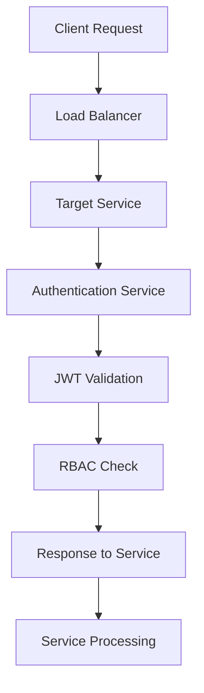
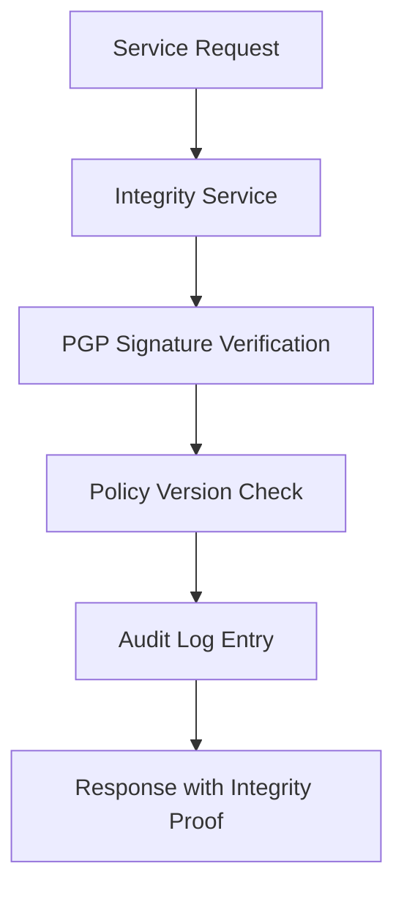
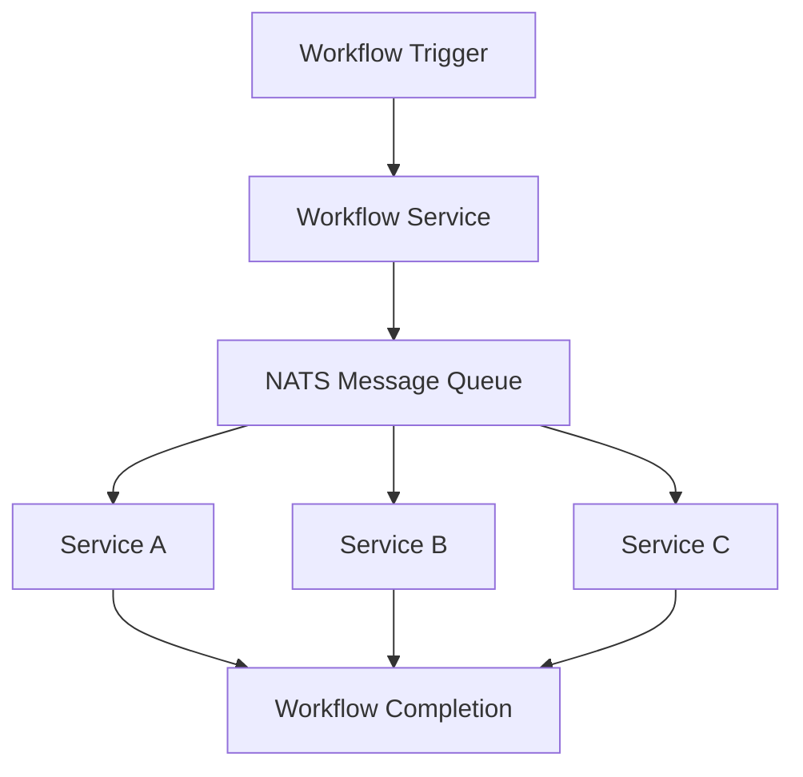

# ACGS-1 Service Boundary Analysis

## Overview

This document outlines the service structure of ACGS-1, including ports, functionality, dependencies, and inter-service communication patterns. It identifies potential tight couplings and boundary issues to ensure proper microservices architecture and constitutional governance compliance.

**Last Updated:** 2025-01-14  
**Version:** 2.0  
**Architecture:** Blockchain-First Microservices

## Service Inventory

### Core Services

| Service                   | Port | Function                                            | Dependencies                        | SLA Target |
|---------------------------|------|-----------------------------------------------------|-------------------------------------|------------|
| **Constitutional AI**     | 8001 | Principle management, compliance checks             | PostgreSQL DB, LLM models, Integrity Service | <500ms |
| **Governance Synthesis**  | 8002 | Policy generation (LLMs, bias checks)              | LLM APIs, Constitutional AI Service | <500ms |
| **Policy Governance**     | 8003 | Real-time policy enforcement (OPA)                 | OPA engine, PostgreSQL DB, Redis cache | <25ms |
| **Formal Verification**   | 8004 | Mathematical policy verification (Z3 SMT)          | Z3 solver library, DB/cache for proofs | <2s |

### Platform Services

| Service                   | Port | Function                                            | Dependencies                        | SLA Target |
|---------------------------|------|-----------------------------------------------------|-------------------------------------|------------|
| **Authentication**        | 8005 | User auth and RBAC (login, JWT)                   | PostgreSQL DB, Redis cache, OAuth providers, HSM | <200ms |
| **Integrity**             | 8006 | Data cryptographic integrity (PGP), audit logging | PostgreSQL DB, File storage, Crypto libs | <300ms |
| **Workflow**              | 8007 | Business process orchestration                     | NATS message queue, PostgreSQL DB   | <1s |

### Blockchain Services

| Service                   | Port | Function                                            | Dependencies                        | SLA Target |
|---------------------------|------|-----------------------------------------------------|-------------------------------------|------------|
| **Quantumagi Bridge**     | N/A  | Blockchain-offchain integration (Solana)          | Solana node, Smart contracts         | <5s |
| **Logging Program**       | N/A  | On-chain governance audit trail (Solana)          | Blockchain state, Off-chain storage  | <10s |

### Supporting Services

| Service                   | Port | Function                                            | Dependencies                        | SLA Target |
|---------------------------|------|-----------------------------------------------------|-------------------------------------|------------|
| **Service Registry**      | 8500 | Service discovery and health monitoring            | Consul/etcd, Health check endpoints | <100ms |
| **Load Balancer**         | 80/443| Traffic distribution and SSL termination          | Nginx/HAProxy, SSL certificates     | <50ms |
| **Monitoring**            | 9090 | Metrics collection and alerting                    | Prometheus, Grafana, AlertManager   | <1s |

## Inter-Service Communication Patterns

### Authentication Flow (Platform-Wide)

**Pattern:** Every request to core services is validated via Auth service
- **Coupling Risk:** Single point of failure
- **Mitigation:** JWT token caching, Auth service clustering

### Core Services Pipeline (Constitutional Governance)

**Pattern:** Linear pipeline for policy lifecycle
- **Coupling Risk:** Sequential dependency chain
- **Mitigation:** Async processing, event-driven architecture

### Data Integrity Flow

**Pattern:** Centralized integrity verification
- **Coupling Risk:** All services depend on Integrity service
- **Mitigation:** Local caching, integrity proof caching

### Workflow Orchestration

**Pattern:** Event-driven orchestration via message queue
- **Coupling Risk:** Complex workflow dependencies
- **Mitigation:** Saga pattern, compensation transactions

## Service Boundary Analysis

### 1. Authentication Boundary

**Scope:** User identity, authorization, session management

**Interfaces:**
- REST API: `/auth/login`, `/auth/validate`, `/auth/refresh`
- Internal: JWT validation, RBAC checks

**Coupling Issues:**
- ❌ **High Coupling:** All services depend on Auth for every request
- ❌ **Single Point of Failure:** Auth service downtime affects entire system
- ✅ **Mitigation:** JWT token caching, distributed Auth instances

**Recommendations:**
- Implement JWT token caching in each service
- Deploy Auth service in high-availability configuration
- Consider service mesh for authentication

### 2. Constitutional AI Boundary

**Scope:** Constitutional principles, compliance checking, governance rules

**Interfaces:**
- REST API: `/principles`, `/compliance-check`, `/constitutional-analysis`
- Internal: Principle validation, constitutional compliance

**Coupling Issues:**
- ✅ **Low Coupling:** Well-defined interface, minimal external dependencies
- ⚠️ **Data Coupling:** Shares constitutional data model with other services
- ✅ **Mitigation:** Versioned APIs, backward compatibility

**Recommendations:**
- Maintain strict API versioning
- Implement constitutional data caching
- Consider read replicas for high availability

### 3. Policy Governance Boundary (Critical Path)

**Scope:** Real-time policy enforcement, ultra-low latency decisions

**Interfaces:**
- REST API: `/optimize`, `/enforce`, `/policy-decision`
- Internal: OPA policy evaluation, Redis caching

**Coupling Issues:**
- ✅ **Performance Isolation:** Dedicated caching layer
- ⚠️ **Policy Dependency:** Requires latest policies from other services
- ❌ **Latency Risk:** <25ms target requires minimal external calls

**Recommendations:**
- Implement aggressive local policy caching
- Use async policy updates to avoid blocking
- Consider policy pre-compilation for faster execution

### 4. Blockchain Integration Boundary

**Scope:** On-chain governance, immutable audit trail, constitutional enforcement

**Interfaces:**
- Solana RPC: Program interactions, transaction submission
- Bridge API: Off-chain to on-chain synchronization

**Coupling Issues:**
- ✅ **Async Boundary:** Blockchain operations are naturally asynchronous
- ⚠️ **Network Dependency:** Solana network availability affects functionality
- ✅ **Eventual Consistency:** Designed for blockchain's eventual consistency model

**Recommendations:**
- Implement robust retry mechanisms
- Use transaction queuing for reliability
- Monitor Solana network health

## Boundary Coupling Risk Assessment

### High Risk (Immediate Attention)

1. **Authentication Single Point of Failure**
   - **Risk:** Auth service downtime affects entire system
   - **Impact:** Complete system unavailability
   - **Mitigation:** HA deployment, JWT caching, circuit breakers

2. **PGC Latency Dependencies**
   - **Risk:** External service calls break <25ms target
   - **Impact:** Constitutional governance SLA violation
   - **Mitigation:** Local caching, policy pre-compilation

### Medium Risk (Monitor)

1. **Shared Database Schemas**
   - **Risk:** Database schema changes affect multiple services
   - **Impact:** Deployment coordination complexity
   - **Mitigation:** Database per service, API contracts

2. **Workflow Orchestration Complexity**
   - **Risk:** Complex multi-service workflows create tight coupling
   - **Impact:** Difficult to maintain and debug
   - **Mitigation:** Saga pattern, event sourcing

### Low Risk (Acceptable)

1. **Constitutional Data Model Sharing**
   - **Risk:** Constitutional principles shared across services
   - **Impact:** Minor coordination for constitutional changes
   - **Mitigation:** Versioned constitutional APIs

## Performance Constraints by Boundary

### Ultra-Low Latency Boundary (PGC)
- **Target:** <25ms for 95% of requests
- **Constraints:** Minimal external service calls, aggressive caching
- **Architecture:** Local OPA engine, Redis cache, pre-compiled policies

### Standard Latency Boundary (Core Services)
- **Target:** <500ms for 95% of requests
- **Constraints:** Reasonable external service calls, standard caching
- **Architecture:** Database per service, async where possible

### Async Boundary (Blockchain)
- **Target:** <10s for transaction confirmation
- **Constraints:** Network-dependent, eventual consistency
- **Architecture:** Queue-based, retry mechanisms, monitoring

## Service Mesh Considerations

### Current State
- Point-to-point HTTP communication
- Manual service discovery
- Basic load balancing

### Recommended Service Mesh Features
- **mTLS:** Automatic service-to-service encryption
- **Circuit Breakers:** Prevent cascade failures
- **Retry Policies:** Automatic retry with backoff
- **Load Balancing:** Intelligent traffic distribution
- **Observability:** Distributed tracing, metrics

## Monitoring and Observability

### Service Boundary Metrics
- **Request Latency:** P50, P95, P99 per service boundary
- **Error Rates:** 4xx, 5xx errors per boundary
- **Throughput:** Requests per second per boundary
- **Dependency Health:** Upstream service availability

### Constitutional Governance Metrics
- **Compliance Rate:** Percentage of requests meeting SLA targets
- **Policy Decision Latency:** PGC-specific ultra-low latency tracking
- **Constitutional Violations:** Governance rule violations
- **Audit Trail Completeness:** Blockchain logging success rate

## Future Boundary Evolution

### Planned Improvements
1. **Service Mesh Implementation:** Istio/Linkerd for better boundary management
2. **Event-Driven Architecture:** Reduce synchronous coupling
3. **CQRS Implementation:** Separate read/write boundaries
4. **Microservices Decomposition:** Further service boundary refinement

### Constitutional Governance Alignment
- All boundary changes must maintain constitutional compliance
- Performance targets are constitutional requirements
- Audit trail must capture all boundary interactions
- Zero-tolerance for security boundary violations

---

**Document Control:**
- **Owner:** ACGS Architecture Team
- **Reviewers:** Platform Team, Security Team, DevOps Team
- **Next Review:** 2025-04-14
- **Classification:** Internal Use
