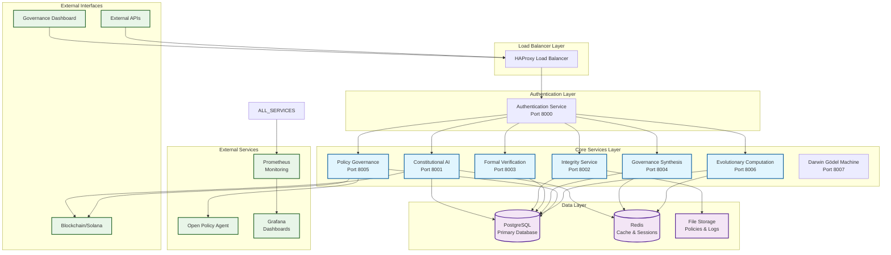
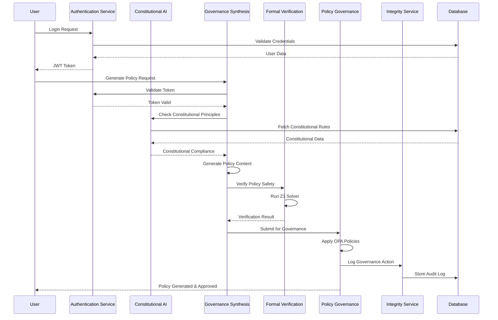
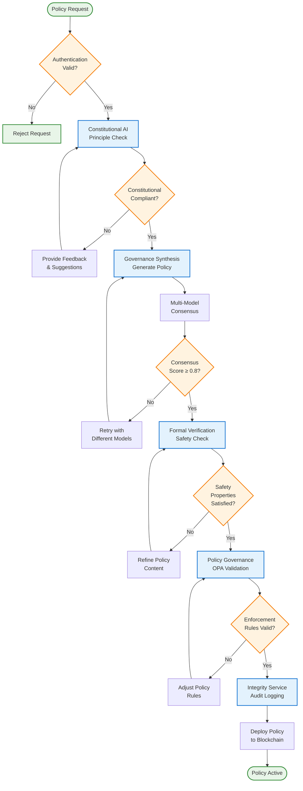
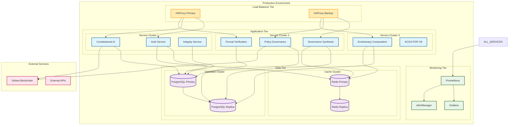
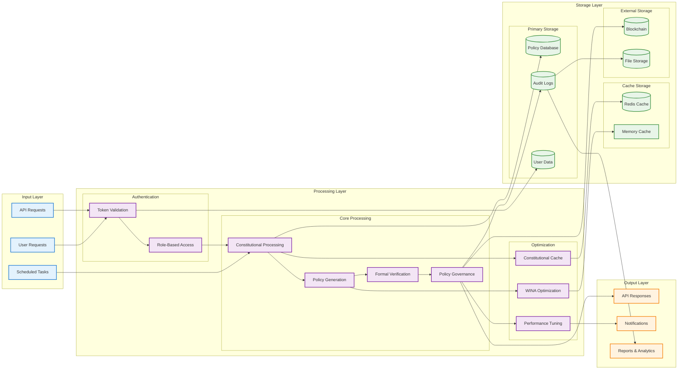
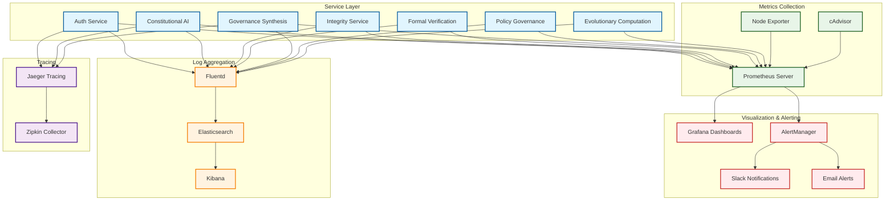
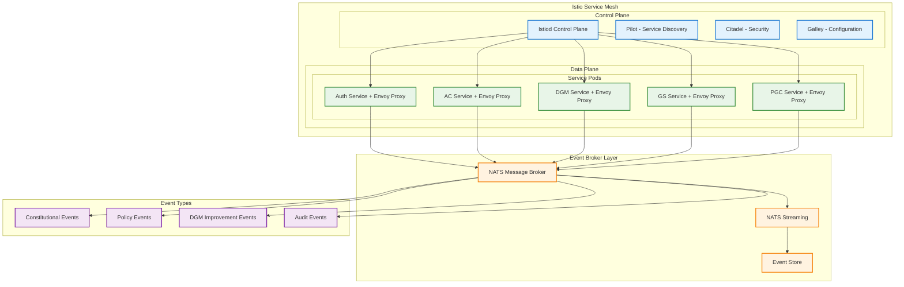
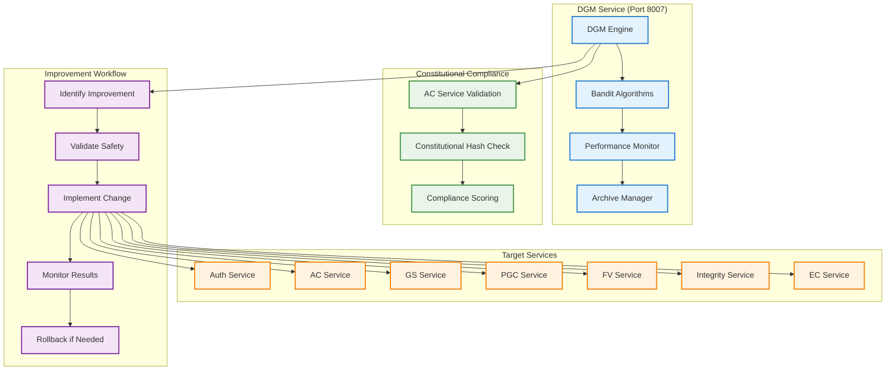

# ACGS-1 Visual Architecture Diagrams

This document contains comprehensive visual diagrams for the ACGS-1 Constitutional Governance System architecture, service interactions, and deployment topologies.

## System Architecture Overview

## Service Interaction Flow

## Constitutional Governance Workflow

## Deployment Architecture

## Data Flow Architecture

## Monitoring and Observability Architecture

## Event-Driven Architecture with Service Mesh

## DGM Self-Improvement Architecture

