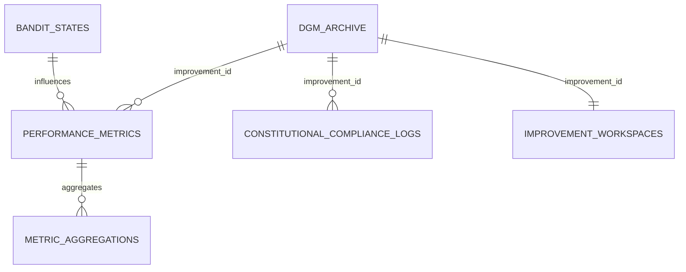

# DGM Database Schema Design

## Overview

The Darwin Gödel Machine (DGM) service requires a comprehensive PostgreSQL database schema to support:

- **Archive Management**: Storing improvement history and rollback data
- **Performance Metrics**: Real-time and aggregated performance tracking
- **Constitutional Compliance**: Governance and compliance validation
- **Bandit Algorithms**: Safe exploration and conservative learning
- **Workspace Management**: Improvement development and testing
- **System Configuration**: Service configuration and settings

## Schema Structure

### Schema: `dgm`

All DGM tables are organized under the `dgm` schema to maintain separation from ACGS core services while enabling cross-service queries.

## Core Tables

### 1. DGM Archive (`dgm.dgm_archive`)

**Purpose**: Central repository for all improvements, their outcomes, and rollback data.

**Key Features**:
- Unique improvement tracking with UUIDs
- Performance before/after comparison
- Constitutional compliance scoring
- Rollback capability with complete state preservation
- Status tracking through improvement lifecycle

**Relationships**:
- Referenced by `performance_metrics` via `improvement_id`
- Referenced by `constitutional_compliance_logs` via `improvement_id`
- Referenced by `improvement_workspaces` via `improvement_id`

### 2. Performance Metrics (`dgm.performance_metrics`)

**Purpose**: Real-time performance data collection and analysis.

**Key Features**:
- Multi-dimensional metric storage (latency, throughput, error rates)
- Service-specific and system-wide metrics
- Experiment and improvement correlation
- Constitutional compliance integration
- Time-series optimization with indexing

**Aggregation Support**:
- Companion table `metric_aggregations` for efficient querying
- Pre-computed aggregations for common time windows
- Reduced query load on high-frequency metrics

### 3. Constitutional Compliance Logs (`dgm.constitutional_compliance_logs`)

**Purpose**: Comprehensive compliance tracking and validation.

**Key Features**:
- Multi-level compliance assessment (critical to exemplary)
- Violation tracking with detailed evidence
- Remediation recommendations
- Assessment method tracking (manual/automated/hybrid)
- Review workflow support

**Integration**:
- Links to specific improvements and services
- Constitutional hash validation
- Audit trail for compliance decisions

### 4. Bandit States (`dgm.bandit_states`)

**Purpose**: State management for conservative bandit algorithms.

**Key Features**:
- Multiple algorithm support (epsilon-greedy, UCB1, Thompson sampling)
- Context-aware arm selection
- Safety threshold enforcement
- Risk tolerance configuration
- Exploration history tracking

**Safety Mechanisms**:
- Conservative exploration parameters
- Safety threshold validation
- Risk tolerance bounds
- Constitutional compliance integration

### 5. Improvement Workspaces (`dgm.improvement_workspaces`)

**Purpose**: Isolated environments for developing and testing improvements.

**Key Features**:
- Complete workspace state management
- Source code and configuration tracking
- Test and validation result storage
- Environment snapshot preservation
- Rollback plan development

**Safety Features**:
- Pre-change environment snapshots
- Comprehensive rollback plans
- Risk assessment integration
- Safety check validation

### 6. System Configuration (`dgm.system_configurations`)

**Purpose**: Centralized configuration management for DGM service.

**Key Features**:
- Type-safe configuration storage
- Sensitive data protection
- Read-only configuration enforcement
- Category-based organization
- Constitutional compliance validation

## Indexing Strategy

### Performance Indexes

```sql
-- Archive performance
CREATE INDEX idx_dgm_archive_status_timestamp
ON dgm.dgm_archive (status, timestamp DESC);

-- Metrics querying
CREATE INDEX idx_performance_metrics_composite
ON dgm.performance_metrics (service_name, metric_type, timestamp DESC);

-- Compliance monitoring
CREATE INDEX idx_compliance_logs_service_level
ON dgm.constitutional_compliance_logs (service_name, compliance_level, assessed_at DESC);

-- Bandit optimization
CREATE INDEX idx_bandit_states_context_arm
ON dgm.bandit_states (context_key, arm_id, last_updated DESC);

-- Workspace management
CREATE INDEX idx_workspaces_status_created
ON dgm.improvement_workspaces (status, created_at DESC);
```

## Constitutional Compliance Integration

### Standard Hash
- All tables include `constitutional_hash` field
- Default value: `"cdd01ef066bc6cf2"` (ACGS standard)
- Enables cross-service compliance validation

### Compliance Scoring
- Numeric scores (0.00 to 1.00) for quantitative assessment
- Categorical levels for qualitative classification
- Evidence storage for audit trails

## Data Relationships



## Migration Strategy

### Phase 1: Schema Creation
1. Create `dgm` schema
2. Install UUID extension
3. Create all tables with proper constraints
4. Create performance indexes

### Phase 2: Data Population
1. Initialize system configurations
2. Set up default bandit states
3. Create baseline performance metrics
4. Establish compliance baselines

### Phase 3: Integration
1. Connect to ACGS core services
2. Enable cross-service queries
3. Implement real-time data flows
4. Activate monitoring and alerting

## Security Considerations

### Access Control
- Schema-level permissions for DGM service
- Read-only access for monitoring services
- Audit logging for all modifications

### Data Protection
- Sensitive configuration encryption
- Constitutional compliance validation
- Audit trail preservation

### Backup and Recovery
- Point-in-time recovery capability
- Archive data preservation
- Rollback state integrity

## Performance Optimization

### Query Optimization
- Composite indexes for common query patterns
- Partitioning for time-series data
- Materialized views for complex aggregations

### Storage Optimization
- JSON field optimization for metadata
- Compression for archive data
- Efficient UUID storage

### Monitoring
- Query performance tracking
- Index usage analysis
- Storage growth monitoring

## Future Considerations

### Scalability
- Horizontal partitioning for large datasets
- Read replicas for analytics workloads
- Archive data lifecycle management

### Integration
- Cross-service foreign key relationships
- Shared configuration management
- Unified audit logging

### Evolution
- Schema versioning strategy
- Backward compatibility maintenance
- Migration automation