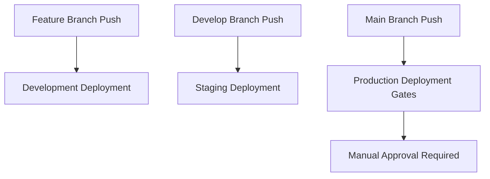

# ACGS-1 Multi-Environment Deployment Guide

This guide covers the comprehensive multi-environment deployment strategy for the ACGS-1 Constitutional Governance System, including development, staging, and production environments with proper promotion gates.

## Overview

The ACGS-1 system uses a three-tier environment strategy:

- **Development**: Local development and feature testing
- **Staging**: Pre-production validation and integration testing
- **Production**: Live system serving government clients

## Environment Architecture

### Development Environment

- **Purpose**: Local development, feature development, debugging
- **Infrastructure**: Docker Compose on local machines
- **Database**: PostgreSQL (development schema)
- **Caching**: Redis (minimal configuration)
- **Monitoring**: Basic health checks only
- **Security**: Relaxed for development productivity

### Staging Environment

- **Purpose**: Pre-production validation, integration testing
- **Infrastructure**: Docker Compose with production-like configuration
- **Database**: PostgreSQL (staging schema with production data structure)
- **Caching**: Redis with production-like configuration
- **Monitoring**: Full monitoring stack (Prometheus, Grafana)
- **Security**: Production-like security configuration

### Production Environment

- **Purpose**: Live system serving government clients
- **Infrastructure**: Kubernetes cluster with high availability
- **Database**: PostgreSQL with read replicas and backup
- **Caching**: Redis cluster with persistence
- **Monitoring**: Full observability stack with alerting
- **Security**: Maximum security configuration

## Deployment Strategies

### Development Deployment

- **Strategy**: Rolling deployment
- **Automation**: Automatic on feature branch pushes
- **Testing**: Unit tests and basic integration tests
- **Approval**: None required

### Staging Deployment

- **Strategy**: Canary deployment
- **Automation**: Automatic on develop branch pushes
- **Testing**: Full test suite including performance tests
- **Approval**: Single reviewer from development team

### Production Deployment

- **Strategy**: Blue-green deployment
- **Automation**: Manual trigger with promotion gates
- **Testing**: Comprehensive test suite + security scans
- **Approval**: Two reviewers (platform team + security team)

## Promotion Gates

### Development → Staging

1. **Automated Testing Gate**

   - Unit tests (>85% coverage)
   - Integration tests
   - API contract tests
   - Security baseline scans

2. **Code Quality Gate**

   - Code review approval
   - Static analysis passing
   - Documentation updated

3. **Manual Approval**
   - Single reviewer from development team

### Staging → Production

1. **Comprehensive Testing Gate**

   - Full test suite (>95% coverage)
   - Performance testing
   - Load testing
   - Security penetration testing

2. **Security Gate**

   - Vulnerability scanning
   - Compliance validation
   - Security review approval

3. **Business Approval Gate**

   - Platform team approval
   - Security team approval
   - Change management approval

4. **Timing Gate**
   - Business hours only (unless hotfix)
   - Change freeze periods respected
   - Maintenance windows scheduled

## Configuration Management

### Environment Variables

Each environment has its own configuration file:

- `config/environments/development.env`
- `config/environments/staging.env`
- `config/environments/production.env`

### Secrets Management

- **Development**: Local environment files (not committed)
- **Staging**: GitHub Environment Secrets
- **Production**: GitHub Environment Secrets + External secret management

### Feature Flags

Environment-specific feature flags allow controlled rollouts:

```bash
# Development
ENABLE_BETA_FEATURES=true
ENABLE_DEBUG_ENDPOINTS=true

# Staging
ENABLE_BETA_FEATURES=true
ENABLE_DEBUG_ENDPOINTS=false

# Production
ENABLE_BETA_FEATURES=false
ENABLE_DEBUG_ENDPOINTS=false
```

## Deployment Workflows

### Automatic Deployments



### Manual Promotions

Use the promotion gates workflow for controlled environment promotions:

```bash
# Promote from development to staging
gh workflow run promotion-gates.yml \
  -f source_environment=development \
  -f target_environment=staging \
  -f promotion_type=standard

# Promote from staging to production
gh workflow run promotion-gates.yml \
  -f source_environment=staging \
  -f target_environment=production \
  -f promotion_type=standard
```

## Monitoring and Observability

### Development

- Basic health checks
- Application logs
- Development metrics dashboard

### Staging

- Full monitoring stack
- Performance metrics
- Integration test results
- Staging-specific alerts

### Production

- Comprehensive observability
- Real-time monitoring
- SLA monitoring
- 24/7 alerting
- Incident response integration

## Rollback Procedures

### Automatic Rollback Triggers

- Health check failures
- Performance degradation
- Error rate spikes
- Security incidents

### Manual Rollback Process

```bash
# Emergency rollback
gh workflow run promotion-gates.yml \
  -f source_environment=production \
  -f target_environment=production \
  -f promotion_type=rollback \
  -f skip_tests=true
```

## Security Considerations

### Environment Isolation

- Network segmentation between environments
- Separate databases and caches
- Environment-specific access controls
- Audit logging for all environments

### Secrets Rotation

- Regular rotation of environment secrets
- Automated secret validation
- Secure secret distribution
- Emergency secret revocation procedures

## Compliance and Governance

### Change Management

- All production changes require approval
- Change documentation and tracking
- Rollback plans for all deployments
- Post-deployment validation

### Audit Requirements

- Deployment audit trails
- Access logging
- Configuration change tracking
- Compliance reporting

## Troubleshooting

### Common Issues

1. **Environment Configuration Mismatch**

   - Verify environment-specific configuration files
   - Check secret availability
   - Validate service dependencies

2. **Promotion Gate Failures**

   - Review test results and logs
   - Check security scan reports
   - Verify approval requirements

3. **Deployment Failures**
   - Check infrastructure health
   - Verify image availability
   - Review deployment logs

### Emergency Procedures

- Hotfix deployment process
- Emergency rollback procedures
- Incident response protocols
- Communication procedures

## Best Practices

1. **Environment Parity**

   - Keep environments as similar as possible
   - Use infrastructure as code
   - Automate environment provisioning

2. **Testing Strategy**

   - Test in production-like environments
   - Automate as much testing as possible
   - Include performance and security testing

3. **Deployment Safety**

   - Use deployment strategies that minimize risk
   - Implement comprehensive monitoring
   - Have rollback plans ready

4. **Security First**
   - Apply security at every layer
   - Regular security assessments
   - Principle of least privilege

## Next Steps

1. Set up GitHub environments and secrets
2. Configure monitoring for each environment
3. Test promotion gates workflow
4. Train team on deployment procedures
5. Establish incident response procedures
