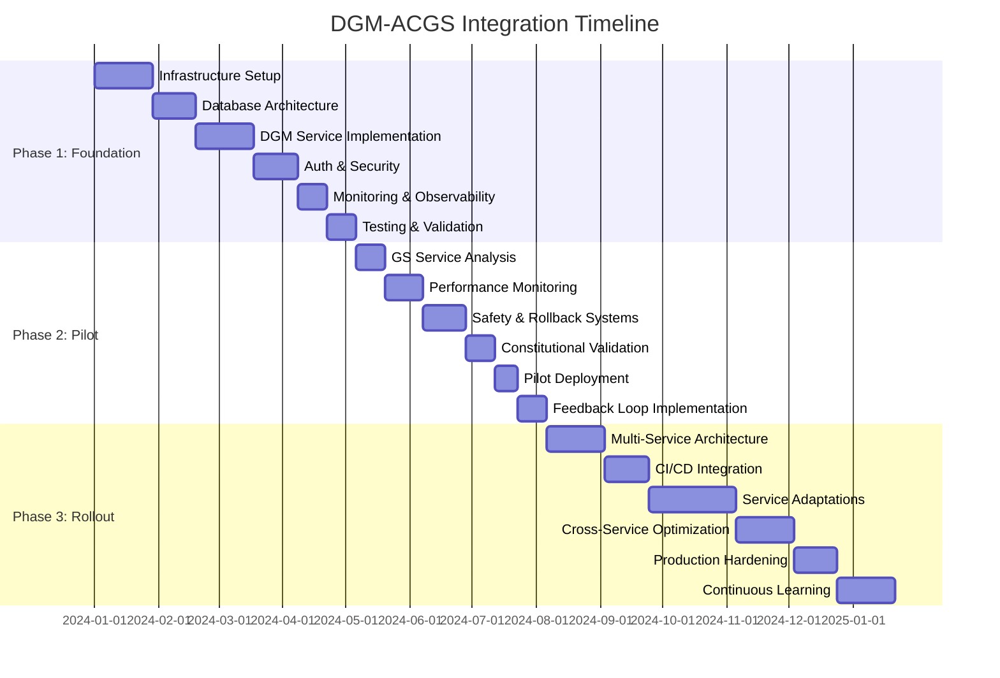

# DGM-ACGS Integration: Implementation Timeline & Resource Allocation

## Executive Summary

This document provides a comprehensive implementation timeline and resource allocation plan for the Darwin Gödel Machine (DGM) integration with the ACGS platform. The project spans 34-44 weeks across three phases, requiring specialized personnel and infrastructure resources.

## Project Timeline Overview

## Detailed Phase Breakdown

### Phase 1: DGM Service Foundation (16 weeks)

#### Week 1-4: Infrastructure Setup

**Objective**: Establish core infrastructure for DGM service
**Key Deliverables**:

- Docker environment with security constraints
- Kubernetes deployment manifests
- Storage architecture (2TB archive, 500GB workspace)
- Network configuration and policies

**Resource Requirements**:

- **Personnel**: 2 DevOps Engineers, 1 Security Engineer
- **Infrastructure**: Kubernetes cluster, storage provisioning
- **Budget**: $15,000 (infrastructure setup)

#### Week 5-7: Database Architecture

**Objective**: Design and implement optimized database layer
**Key Deliverables**:

- PostgreSQL schema with advanced indexing
- Migration framework with rollback capabilities
- Redis caching layer implementation
- Performance optimization and partitioning

**Resource Requirements**:

- **Personnel**: 2 Backend Engineers, 1 Database Specialist
- **Infrastructure**: PostgreSQL 15+ cluster, Redis 7+ cluster
- **Budget**: $8,000 (database infrastructure)

#### Week 8-11: DGM Service Implementation

**Objective**: Develop core DGM service with ACGS adaptations
**Key Deliverables**:

- FastAPI service framework
- DGM core engine integration
- Foundation model integration (Claude 3.5, O1)
- Improvement workflow engine

**Resource Requirements**:

- **Personnel**: 3 Senior Backend Engineers, 1 AI/ML Specialist
- **Infrastructure**: GPU resources for model operations
- **Budget**: $25,000 (LLM API costs, GPU resources)

#### Week 12-14: Authentication & Security

**Objective**: Integrate with ACGS auth and implement security measures
**Key Deliverables**:

- ACGS Auth Service integration
- Role-based access control system
- Constitutional compliance framework
- Security hardening and encryption

**Resource Requirements**:

- **Personnel**: 2 Backend Engineers, 1 Security Engineer, 1 Constitutional Specialist
- **Infrastructure**: Security scanning tools, certificate management
- **Budget**: $5,000 (security tools and certificates)

#### Week 15-16: Monitoring & Observability

**Objective**: Implement comprehensive monitoring stack
**Key Deliverables**:

- Prometheus metrics collection
- Grafana dashboards
- Alerting system configuration
- Structured logging infrastructure

**Resource Requirements**:

- **Personnel**: 1 DevOps Engineer, 1 Backend Engineer
- **Infrastructure**: Monitoring stack deployment
- **Budget**: $3,000 (monitoring infrastructure)

#### Week 17-18: Testing & Validation

**Objective**: Develop comprehensive testing suite
**Key Deliverables**:

- Unit testing suite (>90% coverage)
- Integration testing framework
- Constitutional compliance testing
- Performance testing suite

**Resource Requirements**:

- **Personnel**: 2 QA Engineers, 1 Backend Engineer
- **Infrastructure**: Testing environments
- **Budget**: $4,000 (testing infrastructure)

**Phase 1 Total**: 18 weeks, $60,000 budget

### Phase 2: GS Service Pilot Integration (8 weeks)

#### Week 19-20: GS Service Analysis & Preparation

**Objective**: Comprehensive analysis of GS Service for pilot integration
**Key Deliverables**:

- Performance baseline establishment
- Architecture documentation
- Integration point identification
- Risk assessment and mitigation plan

**Resource Requirements**:

- **Personnel**: 2 Backend Engineers, 1 Constitutional Specialist
- **Infrastructure**: Monitoring and analysis tools
- **Budget**: $3,000 (analysis tools)

#### Week 21-22.5: Performance Monitoring Integration

**Objective**: Implement real-time monitoring with automated triggers
**Key Deliverables**:

- Real-time performance monitoring
- Automated trigger system
- Anomaly detection algorithms
- Dashboard integration

**Resource Requirements**:

- **Personnel**: 2 Backend Engineers, 1 DevOps Engineer
- **Infrastructure**: Enhanced monitoring capabilities
- **Budget**: $4,000 (monitoring enhancements)

#### Week 23-25: Safety & Rollback Systems

**Objective**: Develop comprehensive safety mechanisms
**Key Deliverables**:

- Safety checkpoint system
- Automated rollback mechanisms
- Emergency stop procedures
- Constitutional compliance validation

**Resource Requirements**:

- **Personnel**: 2 Senior Backend Engineers, 1 Security Engineer, 1 Constitutional Specialist
- **Infrastructure**: Backup and recovery systems
- **Budget**: $6,000 (safety infrastructure)

#### Week 26-27: Constitutional Validation Workflows

**Objective**: Implement specialized governance validation
**Key Deliverables**:

- Constitutional validation framework
- Governance principle compliance checking
- Audit trail system
- Human oversight integration

**Resource Requirements**:

- **Personnel**: 1 Backend Engineer, 1 Constitutional Specialist
- **Infrastructure**: Validation and audit systems
- **Budget**: $2,000 (validation tools)

#### Week 27.5-28: Pilot Deployment & Testing

**Objective**: Deploy and validate pilot integration
**Key Deliverables**:

- Pilot deployment to staging
- Comprehensive testing suite execution
- Performance validation
- Safety procedure validation

**Resource Requirements**:

- **Personnel**: 2 DevOps Engineers, 2 QA Engineers
- **Infrastructure**: Staging environment
- **Budget**: $3,000 (deployment and testing)

#### Week 29-30: Feedback Loop Implementation

**Objective**: Implement continuous improvement mechanisms
**Key Deliverables**:

- Feedback collection system
- Learning algorithm implementation
- Performance optimization loops
- Archive update mechanisms

**Resource Requirements**:

- **Personnel**: 2 Backend Engineers, 1 AI/ML Specialist
- **Infrastructure**: Learning and optimization systems
- **Budget**: $4,000 (learning infrastructure)

**Phase 2 Total**: 12 weeks, $22,000 budget

### Phase 3: Full Platform Rollout (20 weeks)

#### Week 31-34: Multi-Service Architecture

**Objective**: Design scalable architecture for all 7 services
**Key Deliverables**:

- Multi-service orchestration framework
- Service-specific adaptation layers
- Cross-service coordination mechanisms
- Unified management interface

**Resource Requirements**:

- **Personnel**: 3 Senior Backend Engineers, 2 DevOps Engineers
- **Infrastructure**: Expanded orchestration capabilities
- **Budget**: $15,000 (orchestration infrastructure)

#### Week 35-37: CI/CD Pipeline Integration

**Objective**: Integrate DGM with existing CI/CD pipelines
**Key Deliverables**:

- CI/CD pipeline modifications
- Automated improvement triggers
- Performance regression detection
- Integration testing framework

**Resource Requirements**:

- **Personnel**: 2 DevOps Engineers, 1 Backend Engineer
- **Infrastructure**: CI/CD pipeline enhancements
- **Budget**: $5,000 (CI/CD tools and infrastructure)

#### Week 38-43: Service-Specific Adaptations

**Objective**: Implement DGM integration for all remaining services
**Key Deliverables**:

- Auth Service (8000) DGM integration
- AC Service (8001) DGM integration
- Integrity Service (8002) DGM integration
- FV Service (8003) DGM integration
- PGC Service (8005) DGM integration
- EC Service (8006) DGM integration

**Resource Requirements**:

- **Personnel**: 4 Backend Engineers, 2 QA Engineers, 1 Constitutional Specialist
- **Infrastructure**: Service-specific monitoring and optimization
- **Budget**: $20,000 (service adaptations)

#### Week 44-47: Cross-Service Optimization

**Objective**: Implement platform-wide optimization capabilities
**Key Deliverables**:

- Cross-service bottleneck analysis
- Platform-wide optimization algorithms
- Dependency management system
- Resource coordination mechanisms

**Resource Requirements**:

- **Personnel**: 2 Senior Backend Engineers, 1 AI/ML Specialist
- **Infrastructure**: Platform optimization systems
- **Budget**: $8,000 (optimization infrastructure)

#### Week 48-50: Production Hardening

**Objective**: Prepare for production deployment
**Key Deliverables**:

- Production security hardening
- Disaster recovery procedures
- Performance optimization
- Operational runbooks

**Resource Requirements**:

- **Personnel**: 2 DevOps Engineers, 1 Security Engineer, 1 Backend Engineer
- **Infrastructure**: Production-grade security and monitoring
- **Budget**: $10,000 (production hardening)

#### Week 51-54: Continuous Learning System

**Objective**: Implement advanced learning and adaptation
**Key Deliverables**:

- Advanced learning algorithms
- Long-term adaptation mechanisms
- Performance prediction models
- Autonomous optimization capabilities

**Resource Requirements**:

- **Personnel**: 2 AI/ML Specialists, 1 Backend Engineer
- **Infrastructure**: Machine learning infrastructure
- **Budget**: $12,000 (ML infrastructure and tools)

**Phase 3 Total**: 24 weeks, $70,000 budget

## Total Project Summary

### Timeline

- **Total Duration**: 54 weeks (approximately 13 months)
- **Phase 1**: 18 weeks (Foundation)
- **Phase 2**: 12 weeks (Pilot)
- **Phase 3**: 24 weeks (Rollout)

### Budget

- **Total Budget**: $152,000
- **Phase 1**: $60,000 (39%)
- **Phase 2**: $22,000 (14%)
- **Phase 3**: $70,000 (46%)

### Personnel Requirements

- **Senior Backend Engineers**: 3-4 FTE
- **DevOps Engineers**: 2 FTE
- **Security Engineers**: 1 FTE
- **QA Engineers**: 2 FTE
- **AI/ML Specialists**: 1-2 FTE
- **Constitutional Governance Specialist**: 1 FTE
- **Database Specialist**: 0.5 FTE
- **Project Manager**: 1 FTE

### Infrastructure Requirements

- **Compute**: 32-64 CPU cores across all phases
- **Memory**: 128-256 GB RAM for operations and caching
- **Storage**: 5-10 TB for archive, logs, and model storage
- **Network**: 10Gbps internal bandwidth
- **GPU**: NVIDIA A100/H100 for model acceleration (optional)

## Risk Mitigation Timeline

### High-Risk Periods

1. **Week 8-11**: DGM core integration - Technical complexity risk
2. **Week 23-25**: Safety system implementation - Operational risk
3. **Week 38-43**: Multi-service rollout - Integration complexity risk
4. **Week 48-50**: Production deployment - Business continuity risk

### Mitigation Strategies

- **Weekly Risk Reviews**: Every Friday during high-risk periods
- **Parallel Development**: Critical path items developed in parallel where possible
- **Rollback Procedures**: Comprehensive rollback plans for each phase
- **Stakeholder Communication**: Daily updates during critical deployments

## Success Metrics & Milestones

### Phase 1 Success Criteria

- [ ] DGM service operational on port 8007
- [ ] Database performance targets met (<100ms query response)
- [ ] Authentication integration functional
- [ ] Monitoring stack operational with <30s alert response
- [ ] Test coverage >90% achieved

### Phase 2 Success Criteria

- [ ] GS Service pilot integration successful
- [ ] Performance monitoring triggers functional
- [ ] Safety rollback procedures validated
- [ ] Constitutional compliance maintained
- [ ] Feedback loops operational

### Phase 3 Success Criteria

- [ ] All 7 services integrated with DGM
- [ ] CI/CD pipeline integration functional
- [ ] Cross-service optimization operational
- [ ] Production deployment successful
- [ ] SLA targets maintained (>99.9% uptime, <500ms response)

## Next Steps

1. **Stakeholder Approval**: Review and approve timeline and budget
2. **Resource Allocation**: Assign personnel and provision infrastructure
3. **Environment Setup**: Prepare development, staging, and production environments
4. **Phase 1 Kickoff**: Begin infrastructure setup and team onboarding
5. **Weekly Reviews**: Establish weekly progress and risk review meetings
