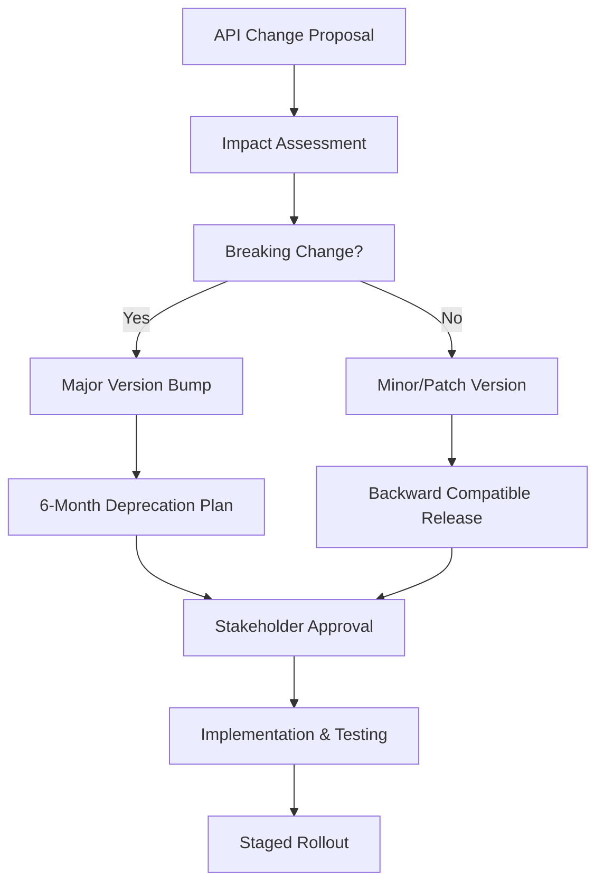

# ACGS-1 API Versioning System - Implementation Validation & Rollout Plan

**Document Version:** 1.0  
**Date:** 2025-06-22  
**Status:** Ready for Implementation  
**Owner:** ACGS-1 Engineering Team

## 🎯 Executive Summary

This document outlines a comprehensive validation and rollout plan for the ACGS-1 API versioning system, ensuring zero-disruption deployment while establishing enterprise-grade operational excellence. The plan is structured in three phases: Immediate Validation (Days 1-7), Long-term Implementation (Days 8-90), and Operational Excellence establishment.

---

## 📅 **PHASE 1: IMMEDIATE VALIDATION (Days 1-7)**

### **1.1 Backward Compatibility Verification**

#### **Objective**

Validate that all 86 existing API endpoints across 8 services continue functioning without breaking changes when the versioning middleware is enabled.

#### **Implementation Steps**

**Day 1-2: Environment Setup & Baseline Testing**

```bash
# 1. Setup validation environment
cd /path/to/acgs-1
python -m venv validation_env
source validation_env/bin/activate
pip install -r requirements.txt

# 2. Run baseline compatibility test
python docs/implementation/validation_scripts/backward_compatibility_test.py

# 3. Generate baseline report
# Expected output: backward_compatibility_report.json
```

**Day 3-4: Versioning Middleware Integration**

```bash
# 1. Enable versioning middleware in staging
export ENABLE_API_VERSIONING=true
export API_VERSION_VALIDATION_MODE=strict

# 2. Run compatibility tests with versioning enabled
python docs/implementation/validation_scripts/backward_compatibility_test.py --with-versioning

# 3. Compare baseline vs versioned results
python tools/versioning/compare_compatibility_reports.py \
  --baseline docs/implementation/reports/baseline_report.json \
  --versioned docs/implementation/reports/versioned_report.json
```

#### **Success Criteria**

- ✅ **Zero Breaking Changes**: All 86 endpoints return same status codes
- ✅ **Performance Impact <5ms**: Average response time increase <5ms
- ✅ **Header Compliance**: All responses include proper version headers
- ✅ **Error Handling**: Graceful degradation for unsupported versions

#### **Risk Mitigation**

- **Rollback Plan**: Immediate middleware disable via feature flag
- **Monitoring**: Real-time error rate and latency monitoring
- **Staged Rollout**: Test on 10% traffic first, then gradual increase

---

### **1.2 Automated Testing Integration**

#### **Objective**

Validate that new versioning test suites integrate properly with existing CI/CD pipeline without conflicts.

#### **Implementation Steps**

**Day 2-3: CI/CD Integration Testing**

```bash
# 1. Run CI integration validation
python docs/implementation/validation_scripts/ci_integration_test.py

# 2. Validate GitHub Actions workflows
gh workflow run api-versioning-ci.yml
gh workflow run api-compatibility-matrix.yml

# 3. Check for test conflicts
python tools/testing/conflict_analyzer.py --test-dirs tests/
```

**Day 4-5: Performance Impact Assessment**

```yaml
# GitHub Actions workflow validation
name: Validate CI Integration
on: [push, pull_request]
jobs:
  validate_integration:
    runs-on: ubuntu-latest
    steps:
      - uses: actions/checkout@v4
      - name: Run integration validation
        run: python docs/implementation/validation_scripts/ci_integration_test.py
      - name: Upload results
        uses: actions/upload-artifact@v4
        with:
          name: ci-integration-report
          path: docs/implementation/reports/ci_integration_report.json
```

#### **Success Criteria**

- ✅ **Existing Tests Pass**: All current tests continue to pass
- ✅ **New Tests Pass**: Versioning tests execute successfully
- ✅ **No Conflicts**: No import, port, or database conflicts
- ✅ **Performance <20%**: CI/CD pipeline overhead <20%

#### **Timeline Estimates**

- **Environment Setup**: 4 hours
- **Test Execution**: 8 hours
- **Conflict Resolution**: 4 hours
- **Documentation**: 2 hours
- **Total**: 18 hours over 4 days

---

### **1.3 Deprecation Process Validation**

#### **Objective**

Test RFC 8594 compliant deprecation headers and sunset mechanisms using controlled scenarios.

#### **Implementation Steps**

**Day 5-6: Deprecation Mechanism Testing**

```bash
# 1. Run deprecation validation tests
python docs/implementation/validation_scripts/deprecation_validation_test.py

# 2. Test controlled deprecation scenario
python tools/versioning/simulate_deprecation.py \
  --version v1.5.0 \
  --deprecation-date 2025-01-01 \
  --sunset-date 2025-07-01

# 3. Validate RFC 8594 compliance
python tools/versioning/rfc_compliance_checker.py \
  --test-server http://localhost:8999
```

**Day 7: End-to-End Validation**

```bash
# 1. Full system validation
python tools/versioning/full_system_validation.py \
  --services constitutional-ai,authentication,formal-verification \
  --versions v1.5.0,v2.0.0,v2.1.0

# 2. Generate comprehensive report
python tools/reporting/generate_validation_report.py \
  --output docs/implementation/reports/phase1_validation_report.pdf
```

#### **Success Criteria**

- ✅ **RFC 8594 Compliance**: Proper Deprecation and Sunset headers
- ✅ **Client Communication**: Clear migration guidance in responses
- ✅ **Timeline Adherence**: 6-month deprecation period enforced
- ✅ **Graceful Degradation**: 410 Gone responses for sunset APIs

---

## 📈 **PHASE 2: LONG-TERM IMPLEMENTATION (Days 8-90)**

### **2.1 Sustainable API Evolution Framework**

#### **Objective**

Define specific procedures for introducing new API versions with approval workflows and migration planning.

#### **Implementation Strategy**

**Week 2-3: Governance Framework**



**Approval Workflow Process:**

1. **Technical Review** (2 days): Architecture team assessment
2. **Impact Analysis** (3 days): Client disruption evaluation
3. **Stakeholder Approval** (5 days): Business and engineering sign-off
4. **Implementation Planning** (7 days): Detailed migration timeline
5. **Testing & Validation** (14 days): Comprehensive testing phase

#### **Breaking Change Assessment Matrix**

| Change Type        | Impact Level | Version Bump | Deprecation Period | Approval Required      |
| ------------------ | ------------ | ------------ | ------------------ | ---------------------- |
| Field Removal      | High         | Major        | 6 months           | CTO + Engineering Lead |
| Field Rename       | Medium       | Major        | 6 months           | Engineering Lead       |
| New Required Field | High         | Major        | 6 months           | CTO + Engineering Lead |
| New Optional Field | Low          | Minor        | None               | Team Lead              |
| Bug Fix            | Low          | Patch        | None               | Code Review            |
| Security Fix       | Critical     | Patch        | Immediate          | Security Team          |

#### **Migration Timeline Planning**

```yaml
# Example migration timeline for v1.x → v2.0
migration_timeline:
  announcement: 'T-180 days' # 6 months notice
  deprecation_start: 'T-180 days'
  migration_guide_release: 'T-150 days'
  sdk_updates_available: 'T-120 days'
  sunset_notice: 'T-30 days'
  version_sunset: 'T-0 days'

communication_milestones:
  - 'T-180': Initial announcement
  - 'T-120': Migration guide and SDK updates
  - 'T-60': Reminder and progress check
  - 'T-30': Final notice and sunset warning
  - 'T-7': Last chance notification
```

---

### **2.2 Client Disruption Minimization**

#### **Objective**

Create comprehensive communication plan for notifying API consumers about version changes.

#### **Communication Strategy**

**Multi-Channel Notification System:**

1. **Email Notifications**

```html
<!-- Email Template: API Deprecation Notice -->
<h2>ACGS-1 API Version Deprecation Notice</h2>
<p><strong>API Version:</strong> v1.5.0</p>
<p><strong>Deprecation Date:</strong> January 1, 2025</p>
<p><strong>Sunset Date:</strong> July 1, 2025</p>

<h3>Action Required</h3>
<ul>
  <li>Review migration guide: <a href="https://docs.acgs.ai/migration/v2.0">Migration Guide</a></li>
  <li>Update to SDK v2.0.0 or later</li>
  <li>Test your integration with v2.0 API</li>
  <li>Complete migration by June 1, 2025</li>
</ul>

<h3>Support</h3>
<p>Contact: <a href="mailto:api-migration@acgs.ai">api-migration@acgs.ai</a></p>
```

2. **In-API Notifications**

```json
{
  "status": "success",
  "data": { ... },
  "metadata": {
    "api_version": "v1.5.0",
    "deprecation": {
      "is_deprecated": true,
      "sunset_date": "2025-07-01T00:00:00Z",
      "migration_guide": "https://docs.acgs.ai/migration/v2.0",
      "days_remaining": 45
    }
  }
}
```

3. **Developer Portal Updates**

- Prominent deprecation banners
- Migration progress tracking
- Interactive migration checklist
- Version compatibility matrix

#### **SDK Migration Guides**

**Python SDK Migration Example:**

```python
# Before (v1.x)
from acgs_sdk.v1 import ACGSClient
client = ACGSClient(api_key="your_key")
principles = client.constitutional_ai.get_principles()

# After (v2.x)
from acgs_sdk import ACGSClient
client = ACGSClient(api_key="your_key", api_version="v2.0.0")
principles = client.constitutional_ai.get_principles()

# Compatibility Mode (temporary)
client = ACGSClient(api_key="your_key", compatibility_mode=True)
```

#### **Client Migration Tracking**

```sql
-- Migration progress tracking
CREATE TABLE api_client_migrations (
    client_id VARCHAR(255),
    current_version VARCHAR(50),
    target_version VARCHAR(50),
    migration_status ENUM('not_started', 'in_progress', 'completed'),
    last_activity TIMESTAMP,
    migration_deadline DATE
);
```

---

### **2.3 Enterprise Compliance Monitoring**

#### **Objective**

Establish metrics and dashboards to track API version usage, deprecation compliance, and migration progress.

#### **Monitoring Infrastructure**

**Grafana Dashboard Configuration:**

```yaml
# API Versioning Dashboard
dashboard:
  title: 'ACGS-1 API Versioning Metrics'
  panels:
    - title: 'Version Usage Distribution'
      type: 'pie'
      query: 'sum by (api_version) (rate(http_requests_total[5m]))'

    - title: 'Deprecated Version Usage'
      type: 'stat'
      query: "sum(rate(http_requests_total{deprecated='true'}[5m]))"
      thresholds:
        - value: 1000
          color: 'yellow'
        - value: 5000
          color: 'red'

    - title: 'Migration Progress'
      type: 'gauge'
      query: |
        (
          sum(rate(http_requests_total{api_version=~"v2.*"}[5m])) /
          sum(rate(http_requests_total[5m]))
        ) * 100
```

**Prometheus Alerts:**

```yaml
# API Versioning Alerts
groups:
  - name: api_versioning
    rules:
      - alert: HighDeprecatedVersionUsage
        expr: |
          (
            sum(rate(http_requests_total{deprecated="true"}[5m])) /
            sum(rate(http_requests_total[5m]))
          ) * 100 > 30
        for: 5m
        labels:
          severity: warning
        annotations:
          summary: 'High usage of deprecated API versions'
          description: '{{ $value }}% of requests are using deprecated versions'

      - alert: SunsetDeadlineApproaching
        expr: |
          (api_version_sunset_timestamp - time()) / 86400 < 30
        labels:
          severity: critical
        annotations:
          summary: 'API version sunset deadline approaching'
          description: 'Version {{ $labels.version }} will be sunset in {{ $value }} days'
```

#### **Compliance Reporting**

```python
# Weekly compliance report generation
def generate_compliance_report():
    return {
        "report_date": datetime.now().isoformat(),
        "version_usage": {
            "v2.1.0": {"requests": 1500000, "percentage": 65.2},
            "v2.0.0": {"requests": 600000, "percentage": 26.1},
            "v1.5.0": {"requests": 200000, "percentage": 8.7}
        },
        "deprecation_compliance": {
            "clients_migrated": 145,
            "clients_pending": 23,
            "migration_rate": 86.3
        },
        "sunset_timeline": {
            "v1.5.0": {
                "sunset_date": "2025-07-01",
                "days_remaining": 45,
                "migration_progress": 78.5
            }
        }
    }
```

---

## 🔧 **PHASE 3: OPERATIONAL EXCELLENCE (Days 30-90)**

### **3.1 Automated Deployment Validation**

#### **Objective**

Verify blue-green deployments for major versions and rolling updates for minor versions work correctly.

#### **Deployment Strategy Validation**

**Blue-Green Deployment Testing:**

```bash
# 1. Setup blue-green environment
kubectl apply -f k8s/blue-green-deployment.yaml

# 2. Deploy new major version to green environment
kubectl set image deployment/acgs-service-green acgs-service=acgs:v2.0.0

# 3. Run health checks
python tools/deployment/health_check.py --environment green --timeout 300

# 4. Switch traffic gradually
python tools/deployment/traffic_switch.py --from blue --to green --percentage 10
python tools/deployment/monitor_deployment.py --duration 600

# 5. Complete switch or rollback
if deployment_healthy:
    python tools/deployment/traffic_switch.py --to green --percentage 100
else:
    python tools/deployment/rollback.py --to blue
```

**Rolling Update Testing:**

```bash
# 1. Deploy minor version update
kubectl set image deployment/acgs-service acgs-service=acgs:v2.1.0
kubectl rollout status deployment/acgs-service --timeout=300s

# 2. Validate deployment
python tools/deployment/validate_rolling_update.py \
  --deployment acgs-service \
  --expected-version v2.1.0 \
  --health-check-timeout 180
```

#### **Success Criteria**

- ✅ **Zero Downtime**: No service interruption during deployment
- ✅ **Health Validation**: All health checks pass before traffic switch
- ✅ **Rollback Capability**: Automatic rollback on failure detection
- ✅ **Performance Maintenance**: Response times within SLA during deployment

---

### **3.2 Comprehensive Monitoring Setup**

#### **Objective**

Configure Grafana dashboards and Prometheus alerts for version-specific metrics and performance monitoring.

#### **Monitoring Stack Configuration**

**Prometheus Configuration:**

```yaml
# prometheus.yml
global:
  scrape_interval: 15s
  evaluation_interval: 15s

rule_files:
  - 'api_versioning_rules.yml'

scrape_configs:
  - job_name: 'acgs-api'
    static_configs:
      - targets: ['acgs-api:8000']
    metrics_path: /metrics
    scrape_interval: 5s
    relabel_configs:
      - source_labels: [__meta_kubernetes_pod_annotation_api_version]
        target_label: api_version
```

**Custom Metrics Collection:**

```python
# API versioning metrics
from prometheus_client import Counter, Histogram, Gauge

# Request counters by version
api_requests_total = Counter(
    'api_requests_total',
    'Total API requests',
    ['api_version', 'endpoint', 'method', 'status_code', 'deprecated']
)

# Response time by version
api_request_duration = Histogram(
    'api_request_duration_seconds',
    'API request duration',
    ['api_version', 'endpoint'],
    buckets=[0.001, 0.005, 0.01, 0.025, 0.05, 0.1, 0.25, 0.5, 1.0, 2.5, 5.0]
)

# Version adoption metrics
api_version_adoption = Gauge(
    'api_version_adoption_percentage',
    'Percentage of requests using each API version',
    ['api_version']
)
```

#### **Alert Configuration**

```yaml
# Critical alerts for API versioning
groups:
  - name: api_versioning_critical
    rules:
      - alert: APIVersionErrorRateHigh
        expr: |
          (
            sum(rate(api_requests_total{status_code=~"5.."}[5m])) by (api_version) /
            sum(rate(api_requests_total[5m])) by (api_version)
          ) * 100 > 5
        for: 2m
        labels:
          severity: critical
        annotations:
          summary: 'High error rate for API version {{ $labels.api_version }}'

      - alert: DeprecatedVersionHighUsage
        expr: |
          sum(rate(api_requests_total{deprecated="true"}[5m])) > 1000
        for: 5m
        labels:
          severity: warning
        annotations:
          summary: 'High usage of deprecated API versions'
```

---

### **3.3 Rollback Capability Testing**

#### **Objective**

Conduct controlled rollback scenarios to ensure automatic rollback mechanisms function correctly.

#### **Rollback Testing Scenarios**

**Scenario 1: Health Check Failure**

```bash
# 1. Deploy version with intentional health check failure
kubectl apply -f test-deployments/failing-health-check.yaml

# 2. Monitor automatic rollback
python tools/testing/monitor_rollback.py \
  --trigger health_check_failure \
  --expected-rollback-time 60 \
  --validation-timeout 300

# 3. Verify system recovery
python tools/testing/verify_system_recovery.py \
  --check-endpoints all \
  --check-performance true
```

**Scenario 2: Performance Degradation**

```bash
# 1. Deploy version with performance issues
kubectl apply -f test-deployments/slow-response.yaml

# 2. Trigger performance-based rollback
python tools/testing/trigger_performance_rollback.py \
  --latency-threshold 500ms \
  --error-rate-threshold 5% \
  --monitoring-duration 300

# 3. Validate rollback effectiveness
python tools/testing/validate_rollback.py \
  --check-latency true \
  --check-error-rate true \
  --check-throughput true
```

#### **Rollback Success Criteria**

- ✅ **Detection Speed**: Issues detected within 2 minutes
- ✅ **Rollback Speed**: Rollback completed within 5 minutes
- ✅ **System Recovery**: Full service restoration within 10 minutes
- ✅ **Data Integrity**: No data loss during rollback process

---

## 📊 **Success Metrics & KPIs**

### **Phase 1 Success Metrics (Days 1-7)**

| Metric                 | Target | Measurement                    |
| ---------------------- | ------ | ------------------------------ |
| Backward Compatibility | 100%   | All 86 endpoints functional    |
| Performance Impact     | <5ms   | Average response time increase |
| Test Integration       | 100%   | All CI/CD tests pass           |
| RFC Compliance         | 100%   | Deprecation headers compliant  |

### **Phase 2 Success Metrics (Days 8-90)**

| Metric                 | Target   | Measurement                               |
| ---------------------- | -------- | ----------------------------------------- |
| Migration Adoption     | >80%     | Clients using latest version              |
| Communication Reach    | 100%     | All registered clients notified           |
| Support Ticket Volume  | <10/week | Migration-related support requests        |
| Documentation Coverage | 100%     | All APIs documented with migration guides |

### **Phase 3 Success Metrics (Days 30-90)**

| Metric                  | Target | Measurement                             |
| ----------------------- | ------ | --------------------------------------- |
| Deployment Success Rate | >99%   | Successful deployments without rollback |
| Monitoring Coverage     | 100%   | All version metrics tracked             |
| Alert Response Time     | <5min  | Time to detect and respond to issues    |
| Rollback Effectiveness  | <10min | Time to complete rollback and recover   |

---

## ⚠️ **Risk Assessment & Mitigation**

### **High-Risk Areas**

1. **Client Integration Failures**

   - **Risk**: Existing clients break with versioning middleware
   - **Mitigation**: Comprehensive backward compatibility testing + feature flags
   - **Contingency**: Immediate rollback capability + client-specific overrides

2. **Performance Degradation**

   - **Risk**: Versioning middleware adds unacceptable latency
   - **Mitigation**: Performance testing + optimization + caching
   - **Contingency**: Middleware bypass for critical endpoints

3. **Migration Timeline Pressure**
   - **Risk**: Clients unable to migrate within deprecation period
   - **Mitigation**: Extended support for critical clients + migration assistance
   - **Contingency**: Sunset date extension for enterprise clients

### **Medium-Risk Areas**

1. **CI/CD Pipeline Disruption**

   - **Risk**: New tests break existing pipeline
   - **Mitigation**: Isolated test environments + gradual integration
   - **Contingency**: Test suite rollback + manual validation

2. **Monitoring Overhead**
   - **Risk**: Excessive monitoring impacts system performance
   - **Mitigation**: Efficient metrics collection + sampling
   - **Contingency**: Monitoring reduction + essential metrics only

---

## 📋 **Implementation Checklist**

### **Pre-Implementation (Day 0)**

- [ ] All validation scripts tested and ready
- [ ] Staging environment configured with versioning
- [ ] Monitoring and alerting systems prepared
- [ ] Rollback procedures documented and tested
- [ ] Team training completed
- [ ] Stakeholder communication plan activated

### **Phase 1 Execution (Days 1-7)**

- [ ] Backward compatibility validation completed
- [ ] CI/CD integration validated
- [ ] Deprecation process tested
- [ ] Performance benchmarks established
- [ ] All success criteria met

### **Phase 2 Execution (Days 8-90)**

- [ ] API evolution framework implemented
- [ ] Client communication system activated
- [ ] Migration tracking system operational
- [ ] Compliance monitoring established
- [ ] Regular progress reviews scheduled

### **Phase 3 Execution (Days 30-90)**

- [ ] Deployment automation validated
- [ ] Comprehensive monitoring operational
- [ ] Rollback procedures tested
- [ ] Performance optimization completed
- [ ] Operational runbooks finalized

---

## 🎯 **Conclusion**

This implementation validation and rollout plan provides a comprehensive, risk-mitigated approach to deploying the ACGS-1 API versioning system. The phased approach ensures:

1. **Zero Disruption**: Existing services continue operating normally
2. **Enterprise Compliance**: RFC standards and governance requirements met
3. **Operational Excellence**: Robust monitoring, alerting, and rollback capabilities
4. **Sustainable Evolution**: Framework for future API development and migration

The plan balances thorough validation with practical implementation timelines, ensuring the ACGS-1 API versioning system delivers on its promise of seamless, enterprise-grade API lifecycle management.

---

**Next Steps**: Execute Phase 1 validation scripts and proceed with staged rollout according to this plan.

**Document Maintenance**: This plan should be updated based on validation results and operational feedback.
