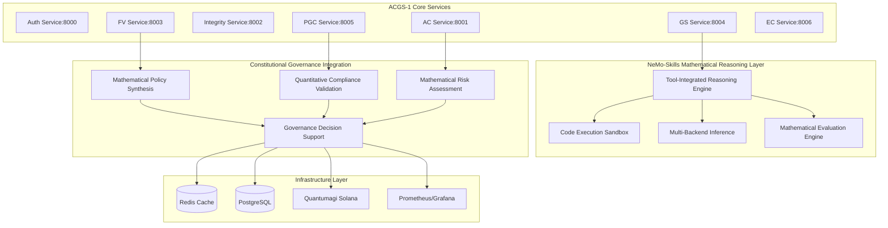

# NeMo-Skills Integration Architecture for ACGS-PGP v8

## System Architecture Overview



## Core Components

### 1. Mathematical Reasoning Service (MRS)

**Location:** `services/core/mathematical-reasoning/mrs_service/`

**Responsibilities:**
- Tool-Integrated Reasoning (TIR) orchestration
- Mathematical problem solving and validation
- Code execution management and security
- Integration with constitutional governance workflows

**API Endpoints:**
```python
# Mathematical reasoning endpoints
POST /math/solve                    # Solve mathematical problems
POST /math/validate                 # Validate mathematical solutions
POST /math/policy-analysis          # Mathematical policy analysis
GET  /math/capabilities             # Available mathematical capabilities
GET  /math/health                   # Service health and metrics
```

**Configuration:**
```yaml
mrs_config:
  service:
    name: "mathematical_reasoning_service"
    host: "0.0.0.0"
    port: 8007
    workers: 4
    timeout_seconds: 60
  
  nemo_skills:
    tir_config:
      max_code_executions: 8
      timeout_ms: 30000
      sandbox_type: "local"
      enable_caching: true
    
    server_backends:
      primary: "vllm"
      fallback: ["trtllm", "sglang"]
      model_name: "meta/llama-3.3-70b-instruct"
    
    evaluation:
      benchmarks: ["gsm8k", "math", "aime24"]
      accuracy_threshold: 0.85
      performance_target_ms: 2000
```

### 2. Constitutional Mathematical Analyzer (CMA)

**Location:** `services/core/constitutional-ai/ac_service/mathematical/`

**Integration Points:**
```python
class ConstitutionalMathematicalAnalyzer:
    """
    Integrates mathematical reasoning with constitutional compliance.
    """
    
    async def analyze_policy_mathematics(
        self,
        policy_content: str,
        mathematical_context: dict,
        compliance_requirements: list[str]
    ) -> MathematicalAnalysisResult:
        """
        Analyze mathematical aspects of policy proposals.
        
        Args:
            policy_content: Policy text to analyze
            mathematical_context: Numerical data and constraints
            compliance_requirements: Constitutional math requirements
            
        Returns:
            Mathematical analysis with compliance scoring
        """
        
    async def validate_quantitative_compliance(
        self,
        governance_decision: dict,
        mathematical_model: str,
        confidence_threshold: float = 0.95
    ) -> QuantitativeComplianceResult:
        """
        Validate governance decisions using mathematical models.
        """
        
    async def generate_mathematical_policy_rules(
        self,
        constitutional_principle: str,
        numerical_constraints: dict,
        optimization_objectives: list[str]
    ) -> list[MathematicalPolicyRule]:
        """
        Generate policy rules with mathematical foundations.
        """
```

### 3. Quantitative Governance Engine (QGE)

**Location:** `services/core/governance-synthesis/gs_service/quantitative/`

**Enhanced Policy Synthesis:**
```python
class QuantitativeGovernanceEngine:
    """
    Enhanced policy synthesis with mathematical reasoning capabilities.
    """
    
    async def synthesize_mathematical_policy(
        self,
        requirements: PolicyRequirements,
        mathematical_constraints: dict,
        optimization_strategy: str = "multi_objective"
    ) -> MathematicalPolicyResult:
        """
        Synthesize policies with mathematical optimization.
        """
        
    async def analyze_policy_impact_quantitatively(
        self,
        policy_proposal: dict,
        stakeholder_data: dict,
        impact_metrics: list[str]
    ) -> QuantitativeImpactAnalysis:
        """
        Quantitative analysis of policy impact using mathematical models.
        """
        
    async def optimize_governance_parameters(
        self,
        current_parameters: dict,
        performance_metrics: dict,
        constraints: dict
    ) -> OptimizationResult:
        """
        Mathematical optimization of governance parameters.
        """
```

## Integration Specifications

### 4. Service Integration Patterns

**Mathematical Reasoning Workflow:**
```python
# Example integration with PGC Service
async def enhanced_policy_compliance_check(
    policy_content: str,
    mathematical_requirements: dict
) -> ComplianceResult:
    
    # Step 1: Extract mathematical components
    math_components = await mrs_service.extract_mathematical_elements(
        policy_content
    )
    
    # Step 2: Validate mathematical consistency
    consistency_result = await mrs_service.validate_mathematical_consistency(
        math_components,
        mathematical_requirements
    )
    
    # Step 3: Constitutional compliance with quantitative analysis
    compliance_result = await ac_service.analyze_mathematical_compliance(
        policy_content,
        math_components,
        consistency_result
    )
    
    # Step 4: Generate compliance report
    return ComplianceResult(
        mathematical_validity=consistency_result.is_valid,
        constitutional_compliance=compliance_result.compliance_score,
        quantitative_analysis=compliance_result.quantitative_metrics,
        recommendations=compliance_result.recommendations
    )
```

### 5. Performance Optimization

**Caching Strategy:**
```python
# Redis caching for mathematical computations
class MathematicalResultCache:
    """
    Intelligent caching for mathematical reasoning results.
    """
    
    async def cache_mathematical_result(
        self,
        problem_hash: str,
        solution: MathematicalSolution,
        ttl_seconds: int = 3600
    ) -> None:
        """Cache mathematical solutions with TTL."""
        
    async def get_cached_result(
        self,
        problem_hash: str
    ) -> Optional[MathematicalSolution]:
        """Retrieve cached mathematical solutions."""
        
    async def invalidate_related_cache(
        self,
        policy_id: str,
        mathematical_context: dict
    ) -> None:
        """Invalidate cache when policies change."""
```

**Database Schema Extensions:**
```sql
-- Mathematical reasoning results storage
CREATE TABLE mathematical_reasoning_results (
    id UUID PRIMARY KEY DEFAULT gen_random_uuid(),
    policy_id UUID REFERENCES policies(id),
    problem_type VARCHAR(100) NOT NULL,
    problem_content TEXT NOT NULL,
    solution_content TEXT NOT NULL,
    mathematical_validity BOOLEAN NOT NULL,
    confidence_score DECIMAL(5,4) NOT NULL,
    execution_time_ms INTEGER NOT NULL,
    created_at TIMESTAMP WITH TIME ZONE DEFAULT NOW(),
    updated_at TIMESTAMP WITH TIME ZONE DEFAULT NOW()
);

-- Mathematical policy rules
CREATE TABLE mathematical_policy_rules (
    id UUID PRIMARY KEY DEFAULT gen_random_uuid(),
    policy_id UUID REFERENCES policies(id),
    rule_type VARCHAR(100) NOT NULL,
    mathematical_expression TEXT NOT NULL,
    constraints JSONB NOT NULL,
    optimization_objectives JSONB NOT NULL,
    validation_status VARCHAR(50) NOT NULL,
    created_at TIMESTAMP WITH TIME ZONE DEFAULT NOW()
);

-- Quantitative compliance metrics
CREATE TABLE quantitative_compliance_metrics (
    id UUID PRIMARY KEY DEFAULT gen_random_uuid(),
    governance_action_id UUID NOT NULL,
    metric_name VARCHAR(100) NOT NULL,
    metric_value DECIMAL(15,6) NOT NULL,
    mathematical_model VARCHAR(200) NOT NULL,
    confidence_interval JSONB NOT NULL,
    calculated_at TIMESTAMP WITH TIME ZONE DEFAULT NOW()
);
```

## Security and Compliance

### 6. Mathematical Code Execution Security

**Sandbox Configuration:**
```yaml
sandbox_security:
  execution_limits:
    timeout_seconds: 30
    memory_limit_mb: 512
    cpu_limit_percent: 50
    network_access: false
    file_system_access: "read_only"
  
  allowed_libraries:
    - "numpy"
    - "scipy"
    - "sympy"
    - "matplotlib"
    - "pandas"
    - "sklearn"
  
  prohibited_operations:
    - "file_write"
    - "network_request"
    - "subprocess_execution"
    - "system_calls"
    - "import_external_modules"
```

**Constitutional Compliance Validation:**
```python
async def validate_mathematical_constitutional_compliance(
    mathematical_solution: MathematicalSolution,
    constitutional_requirements: dict
) -> ComplianceValidationResult:
    """
    Ensure mathematical solutions comply with constitutional principles.
    
    Validation includes:
    - Fairness in mathematical models
    - Transparency in calculations
    - Accountability in decision algorithms
    - Privacy preservation in data analysis
    """
    
    compliance_checks = [
        check_mathematical_fairness(mathematical_solution),
        check_calculation_transparency(mathematical_solution),
        check_algorithmic_accountability(mathematical_solution),
        check_privacy_preservation(mathematical_solution)
    ]
    
    return ComplianceValidationResult(
        overall_compliance=all(check.passed for check in compliance_checks),
        individual_checks=compliance_checks,
        recommendations=generate_compliance_recommendations(compliance_checks)
    )
```

## Monitoring and Observability

### 7. Performance Metrics

**Key Performance Indicators:**
```python
# Mathematical reasoning performance metrics
MATHEMATICAL_REASONING_METRICS = {
    "accuracy_gsm8k": "Accuracy on GSM8K benchmark",
    "accuracy_math": "Accuracy on MATH benchmark", 
    "accuracy_aime": "Accuracy on AIME benchmark",
    "avg_response_time_ms": "Average response time in milliseconds",
    "concurrent_executions": "Number of concurrent mathematical executions",
    "cache_hit_rate": "Mathematical result cache hit rate",
    "constitutional_compliance_rate": "Rate of constitutional compliance",
    "error_rate": "Mathematical reasoning error rate",
    "sandbox_security_violations": "Number of sandbox security violations"
}
```

**Prometheus Metrics Configuration:**
```yaml
prometheus_metrics:
  mathematical_reasoning:
    - name: "acgs_mathematical_accuracy"
      type: "gauge"
      description: "Mathematical reasoning accuracy by benchmark"
      labels: ["benchmark", "model", "configuration"]
    
    - name: "acgs_mathematical_response_time"
      type: "histogram"
      description: "Mathematical reasoning response time distribution"
      buckets: [100, 500, 1000, 2000, 5000, 10000]
    
    - name: "acgs_constitutional_math_compliance"
      type: "gauge"
      description: "Constitutional compliance rate for mathematical decisions"
      labels: ["policy_type", "mathematical_model"]
```

## Deployment Configuration

### 8. Docker Configuration

**Mathematical Reasoning Service Dockerfile:**
```dockerfile
FROM nvidia/cuda:12.1-devel-ubuntu22.04

# Install system dependencies
RUN apt-get update && apt-get install -y \
    python3.11 \
    python3.11-pip \
    git \
    curl \
    && rm -rf /var/lib/apt/lists/*

# Install NeMo-Skills and dependencies
WORKDIR /app
COPY requirements-mathematical.txt .
RUN pip3.11 install -r requirements-mathematical.txt

# Copy NeMo-Skills integration
COPY tools/NeMo-Skills/ ./nemo-skills/
COPY services/core/mathematical-reasoning/ ./

# Security configuration
RUN useradd -m -u 1000 mathuser && chown -R mathuser:mathuser /app
USER mathuser

# Health check
HEALTHCHECK --interval=30s --timeout=10s --start-period=60s --retries=3 \
    CMD curl -f http://localhost:8007/health || exit 1

EXPOSE 8007
CMD ["uvicorn", "app.main:app", "--host", "0.0.0.0", "--port", "8007"]
```

This architecture provides a comprehensive foundation for integrating NeMo-Skills mathematical reasoning capabilities with the ACGS-PGP v8 constitutional governance system while maintaining all security, performance, and compliance requirements.
