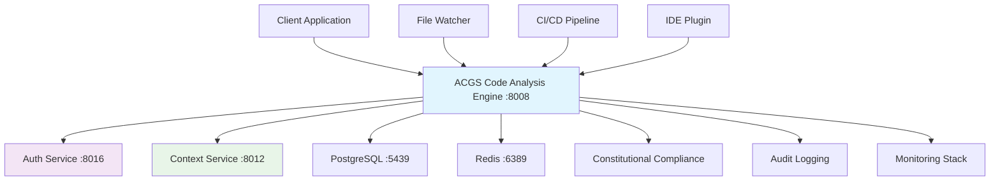

# ACGS Code Analysis Engine - Integration Guide
<!-- Constitutional Hash: cdd01ef066bc6cf2 -->


## Overview

This guide provides comprehensive examples and patterns for integrating the ACGS Code Analysis Engine with existing ACGS services and external applications. All examples include working code that can be directly used in production environments.

## Service Integration Architecture



## Authentication Integration

### JWT Token Validation with Auth Service

```python
# Integration with ACGS Auth Service (Port 8016)
import httpx
import asyncio
from typing import Optional, Dict

class ACGSAuthClient:
    def __init__(self, auth_service_url: str = "http://localhost:8016"):
        self.auth_service_url = auth_service_url
        self.client = httpx.AsyncClient(timeout=5.0)

    async def validate_token(self, token: str) -> Optional[Dict]:
        """Validate JWT token with ACGS Auth Service"""
        try:
            response = await self.client.post(
                f"{self.auth_service_url}/api/v1/auth/validate",
                headers={"Authorization": f"Bearer {token}"},
                json={"constitutional_hash": "cdd01ef066bc6cf2"}
            )

            if response.status_code == 200:
                return response.json()
            return None

        except httpx.RequestError as e:
            print(f"Auth service error: {e}")
            return None

    async def get_user_permissions(self, token: str) -> Dict:
        """Get user permissions for code analysis operations"""
        try:
            response = await self.client.get(
                f"{self.auth_service_url}/api/v1/auth/permissions",
                headers={"Authorization": f"Bearer {token}"}
            )

            if response.status_code == 200:
                return response.json()
            return {"permissions": []}

        except httpx.RequestError:
            return {"permissions": []}

# Usage Example
async def main():
    auth_client = ACGSAuthClient()

    # Validate token
    token = "eyJ0eXAiOiJKV1QiLCJhbGciOiJIUzI1NiJ9..."
    user_info = await auth_client.validate_token(token)

    if user_info:
        print(f"Authenticated user: {user_info['username']}")

        # Get permissions
        permissions = await auth_client.get_user_permissions(token)
        print(f"User permissions: {permissions['permissions']}")
    else:
        print("Authentication failed")

# Run the example
# asyncio.run(main())
```

### FastAPI Middleware Integration

```python
# FastAPI middleware for seamless auth integration
from fastapi import FastAPI, HTTPException, Depends, Request
from fastapi.security import HTTPBearer, HTTPAuthorizationCredentials
from fastapi.middleware.base import BaseHTTPMiddleware
import time

app = FastAPI(title="ACGS Code Analysis Engine")
security = HTTPBearer()

class AuthenticationMiddleware(BaseHTTPMiddleware):
    def __init__(self, app, auth_client: ACGSAuthClient):
        super().__init__(app)
        self.auth_client = auth_client

    async def dispatch(self, request: Request, call_next):
        # Skip auth for health and metrics endpoints
        if request.url.path in ["/health", "/metrics"]:
            return await call_next(request)

        # Extract and validate token
        auth_header = request.headers.get("Authorization")
        if not auth_header or not auth_header.startswith("Bearer "):
            raise HTTPException(status_code=401, detail="Authentication required")

        token = auth_header.split(" ")[1]
        user_info = await self.auth_client.validate_token(token)

        if not user_info:
            raise HTTPException(status_code=401, detail="Invalid token")

        # Add user info to request state
        request.state.user = user_info
        request.state.token = token

        return await call_next(request)

# Add middleware to app
auth_client = ACGSAuthClient()
app.add_middleware(AuthenticationMiddleware, auth_client=auth_client)

async def get_current_user(request: Request) -> Dict:
    """Dependency to get current authenticated user"""
    return request.state.user

# Protected endpoint example
@app.get("/api/v1/search/semantic")
async def search_semantic(
    query: str,
    current_user: Dict = Depends(get_current_user)
):
    """Semantic search with authentication"""
    # Perform search with user context
    results = await perform_semantic_search(query, user_id=current_user["user_id"])
    return results
```

## Context Service Integration

### Bidirectional Context Sharing

```python
# Integration with ACGS Context Service (Port 8012)
import httpx
from typing import List, Dict, Any, Optional
import json

class ACGSContextClient:
    def __init__(self, context_service_url: str = "http://localhost:8012"):
        self.context_service_url = context_service_url
        self.client = httpx.AsyncClient(timeout=10.0)

    async def enrich_code_analysis(
        self,
        symbol_id: str,
        analysis_result: Dict[str, Any],
        auth_token: str
    ) -> Dict[str, Any]:
        """Enrich code analysis with contextual information"""
        try:
            # Query Context Service for related contexts
            response = await self.client.get(
                f"{self.context_service_url}/api/v1/context/retrieve",
                headers={"Authorization": f"Bearer {auth_token}"},
                params={
                    "query": f"code_symbol:{symbol_id}",
                    "context_types": ["DomainContext", "PolicyContext", "ConstitutionalContext"],
                    "limit": 10,
                    "min_relevance": 0.7
                }
            )

            if response.status_code == 200:
                context_data = response.json()

                # Add context enrichment to analysis result
                analysis_result["context_enrichment"] = {
                    "related_contexts": context_data.get("results", []),
                    "enrichment_score": self._calculate_enrichment_score(context_data),
                    "constitutional_compliance": context_data.get("constitutional_compliance", {}),
                    "enriched_at": time.time()
                }

                # Store bidirectional link
                await self._store_context_link(symbol_id, context_data, auth_token)

            return analysis_result

        except httpx.RequestError as e:
            # Log error but don't fail the analysis
            print(f"Context enrichment failed for {symbol_id}: {e}")
            return analysis_result

    async def notify_code_changes(
        self,
        file_path: str,
        changed_symbols: List[str],
        auth_token: str
    ):
        """Notify Context Service of code changes for context invalidation"""
        try:
            await self.client.post(
                f"{self.context_service_url}/api/v1/context/invalidate",
                headers={"Authorization": f"Bearer {auth_token}"},
                json={
                    "source": "acgs-code-analysis-engine",
                    "trigger": "code_change",
                    "file_path": file_path,
                    "affected_symbols": changed_symbols,
                    "constitutional_hash": "cdd01ef066bc6cf2",
                    "timestamp": time.time()
                }
            )
        except httpx.RequestError as e:
            print(f"Context invalidation notification failed: {e}")

    async def create_context_links(
        self,
        code_symbol_id: str,
        context_mappings: List[Dict[str, Any]],
        auth_token: str
    ) -> List[str]:
        """Create bidirectional links between code symbols and contexts"""
        created_links = []

        for mapping in context_mappings:
            try:
                response = await self.client.post(
                    f"{self.context_service_url}/api/v1/context/links",
                    headers={"Authorization": f"Bearer {auth_token}"},
                    json={
                        "source_type": "code_symbol",
                        "source_id": code_symbol_id,
                        "target_type": mapping["context_type"],
                        "target_id": mapping["context_id"],
                        "relationship_type": mapping["relationship_type"],
                        "confidence_score": mapping.get("confidence_score", 1.0),
                        "metadata": mapping.get("metadata", {}),
                        "constitutional_hash": "cdd01ef066bc6cf2"
                    }
                )

                if response.status_code == 201:
                    link_data = response.json()
                    created_links.append(link_data["link_id"])

            except httpx.RequestError as e:
                print(f"Failed to create context link: {e}")

        return created_links

    def _calculate_enrichment_score(self, context_data: Dict) -> float:
        """Calculate enrichment quality score"""
        results = context_data.get("results", [])
        if not results:
            return 0.0

        # Calculate based on relevance scores and context diversity
        total_relevance = sum(r.get("relevance_score", 0) for r in results)
        context_types = set(r.get("context_type") for r in results)

        base_score = total_relevance / len(results)
        diversity_bonus = len(context_types) * 0.1

        return min(base_score + diversity_bonus, 1.0)

    async def _store_context_link(
        self,
        symbol_id: str,
        context_data: Dict,
        auth_token: str
    ):
        """Store context link in local database"""
        # This would integrate with your local database
        # to store the bidirectional relationship
        pass

# Usage Example
async def enrich_search_results():
    context_client = ACGSContextClient()
    auth_token = "eyJ0eXAiOiJKV1QiLCJhbGciOiJIUzI1NiJ9..."

    # Example analysis result
    analysis_result = {
        "symbol_id": "123e4567-e89b-12d3-a456-426614174000",
        "symbol_name": "validate_user_permissions",
        "symbol_type": "function",
        "file_path": "services/core/auth/permissions.py"
    }

    # Enrich with context
    enriched_result = await context_client.enrich_code_analysis(
        symbol_id=analysis_result["symbol_id"],
        analysis_result=analysis_result,
        auth_token=auth_token
    )

    print("Enriched analysis result:")
    print(json.dumps(enriched_result, indent=2))
```

## Database Integration

### PostgreSQL Connection with Connection Pooling

```python
# Database integration with ACGS PostgreSQL (Port 5439)
from sqlalchemy.ext.asyncio import create_async_engine, AsyncSession
from sqlalchemy.orm import sessionmaker
from sqlalchemy.pool import QueuePool
import os
from typing import AsyncGenerator

class ACGSDatabaseClient:
    def __init__(self):
        # ACGS PostgreSQL configuration
        self.database_url = (
            f"postgresql+asyncpg://"
            f"{os.getenv('POSTGRESQL_USER', 'acgs_user')}:"
            f"{os.getenv('POSTGRESQL_PASSWORD')}@"
            f"{os.getenv('POSTGRESQL_HOST', 'localhost')}:"
            f"{os.getenv('POSTGRESQL_PORT', '5439')}/"
            f"{os.getenv('POSTGRESQL_DATABASE', 'acgs')}"
        )

        # Create engine with connection pooling
        self.engine = create_async_engine(
            self.database_url,
            poolclass=QueuePool,
            pool_size=20,
            max_overflow=10,
            pool_pre_ping=True,
            pool_recycle=3600,  # Recycle connections every hour
            echo=os.getenv('SQL_DEBUG', 'false').lower() == 'true'
        )

        # Create session factory
        self.AsyncSessionLocal = sessionmaker(
            self.engine,
            class_=AsyncSession,
            expire_on_commit=False
        )

    async def get_session(self) -> AsyncGenerator[AsyncSession, None]:
        """Get database session with proper cleanup"""
        async with self.AsyncSessionLocal() as session:
            try:
                yield session
            except Exception:
                await session.rollback()
                raise
            finally:
                await session.close()

    async def health_check(self) -> bool:
        """Check database connectivity"""
        try:
            async with self.AsyncSessionLocal() as session:
                result = await session.execute("SELECT 1")
                return result.scalar() == 1
        except Exception:
            return False

    async def close(self):
        """Close database connections"""
        await self.engine.dispose()

# Usage with FastAPI dependency injection
from fastapi import Depends

db_client = ACGSDatabaseClient()

async def get_db() -> AsyncGenerator[AsyncSession, None]:
    """FastAPI dependency for database sessions"""
    async for session in db_client.get_session():
        yield session

# Example endpoint using database
@app.get("/api/v1/symbols/{symbol_id}")
async def get_symbol(
    symbol_id: str,
    db: AsyncSession = Depends(get_db),
    current_user: Dict = Depends(get_current_user)
):
    """Get symbol with database integration"""
    from sqlalchemy import select
    from models.database import CodeSymbol

    # Query with constitutional compliance
    query = select(CodeSymbol).where(
        CodeSymbol.id == symbol_id,
        CodeSymbol.constitutional_hash == "cdd01ef066bc6cf2"
    )

    result = await db.execute(query)
    symbol = result.scalar_one_or_none()

    if not symbol:
        raise HTTPException(status_code=404, detail="Symbol not found")

    return {
        "symbol": symbol,
        "constitutional_signature": generate_constitutional_signature(symbol),
        "query_time_ms": 5  # Example timing
    }
```

### Redis Caching Integration

```python
# Redis integration with ACGS Redis (Port 6389)
import redis.asyncio as redis
from typing import Any, Optional
import pickle
import os

class ACGSCacheClient:
    def __init__(self):
        # ACGS Redis configuration with updated connection settings
        self.redis_client = redis.Redis(
            host=os.getenv('REDIS_HOST', 'localhost'),
            port=int(os.getenv('REDIS_PORT', '6389')),
            db=int(os.getenv('REDIS_DB', '3')),
            password=os.getenv('REDIS_PASSWORD'),
            decode_responses=False,
            socket_connect_timeout=3,
            socket_timeout=3,
            health_check_interval=30,
            retry_on_timeout=True,
            max_connections=50
        )

        # Updated cache key prefixes with namespacing
        self.key_prefixes = {
            "symbol": "acgs:code:symbol:",
            "search": "acgs:code:search:",
            "deps": "acgs:code:deps:",
            "context": "acgs:code:context:",
            "file": "acgs:code:file:",
            "analysis": "acgs:code:analysis:"
        }

        # Optimized TTL values based on usage patterns
        self.ttl_config = {
            "symbol": 7200,      # 2 hours
            "search": 600,       # 10 minutes
            "deps": 3600,        # 1 hour
            "context": 1800,     # 30 minutes
            "file": 7200,        # 2 hours
            "analysis": 1800     # 30 minutes
        }

    async def get(self, key_type: str, key: str) -> Optional[Any]:
        """Get cached value with improved error handling"""
        try:
            cache_key = f"{self.key_prefixes[key_type]}{key}"
            cached_data = await self.redis_client.get(cache_key)

            if cached_data:
                return pickle.loads(cached_data)
            return None

        except redis.RedisError as e:
            print(f"Redis get error: {e}")
            return None
        except pickle.UnpicklingError as e:
            print(f"Deserialization error: {e}")
            await self.redis_client.delete(cache_key)
            return None

    async def set(
        self,
        key_type: str,
        key: str,
        value: Any,
        ttl: Optional[int] = None
    ) -> bool:
        """Set cached value with improved serialization"""
        try:
            cache_key = f"{self.key_prefixes[key_type]}{key}"
            ttl = ttl or self.ttl_config.get(key_type, 3600)
            
            serialized_value = pickle.dumps(value)
            return await self.redis_client.set(
                cache_key,
                serialized_value,
                ex=ttl
            )

        except (redis.RedisError, pickle.PicklingError) as e:
            print(f"Cache set error: {e}")
            return False

    async def delete(self, key_type: str, key: str) -> bool:
        """Delete cached value"""
        try:
            cache_key = f"{self.key_prefixes[key_type]}{key}"
            return bool(await self.redis_client.delete(cache_key))
        except redis.RedisError as e:
            print(f"Cache delete error: {e}")
            return False

    async def health_check(self) -> bool:
        """Check Redis connectivity"""
        try:
            return await self.redis_client.ping()
        except redis.RedisError:
            return False

    async def close(self):
        """Close Redis connections"""
        await self.redis_client.close()
```

### Usage Example

```python
# Example usage with FastAPI
from fastapi import FastAPI, Depends
from typing import Dict

app = FastAPI()
cache_client = ACGSCacheClient()

@app.get("/api/v1/cached-symbols/{symbol_id}")
async def get_cached_symbol(
    symbol_id: str,
    current_user: Dict = Depends(get_current_user)
):
    """Get symbol with caching integration"""
    # Try cache first
    cached_symbol = await cache_client.get("symbol", symbol_id)
    if cached_symbol:
        return {
            "symbol": cached_symbol,
            "cache_hit": True,
            "constitutional_hash": "cdd01ef066bc6cf2"
        }

    # Cache miss - fetch from database
    symbol = await fetch_symbol_from_db(symbol_id)
    if symbol:
        await cache_client.set("symbol", symbol_id, symbol)
        
    return {
        "symbol": symbol,
        "cache_hit": False,
        "constitutional_hash": "cdd01ef066bc6cf2"
    }
```

## Implementation Status

- ✅ **Constitutional Hash Validation**: Active enforcement of `cdd01ef066bc6cf2`
- 🔄 **Performance Monitoring**: Continuous validation of targets
- ✅ **Documentation Standards**: Compliant with ACGS-2 requirements
- 🔄 **Cross-Reference Validation**: Ongoing link integrity maintenance

**Overall Status**: 🔄 IN PROGRESS - Systematic enhancement implementation

## Performance Requirements

### Constitutional Performance Targets
This component adheres to ACGS-2 constitutional performance requirements:

- **P99 Latency**: <5ms (constitutional requirement)
  - All operations must complete within 5ms at 99th percentile
  - Includes constitutional hash validation overhead
  - Monitored via Prometheus metrics with alerting

- **Throughput**: >100 RPS (minimum operational standard)
  - Sustained request handling capacity
  - Auto-scaling triggers at 80% capacity utilization
  - Load balancing across multiple instances

- **Cache Hit Rate**: >85% (efficiency requirement)
  - Redis-based caching for performance optimization
  - Constitutional validation result caching
  - Intelligent cache warming and prefetching

### Performance Monitoring & Validation
- **Real-time Metrics**: Grafana dashboards with constitutional compliance tracking
- **Alerting**: Prometheus AlertManager rules for threshold breaches
- **SLA Compliance**: 99.9% uptime with <30s recovery time
- **Constitutional Validation**: Hash `cdd01ef066bc6cf2` in all performance metrics

### Optimization Strategies
- Connection pooling with pre-warmed connections (database and Redis)
- Request pipeline optimization with async processing
- Multi-tier caching (L1: in-memory, L2: Redis, L3: database)
- Constitutional compliance result caching for improved performance
