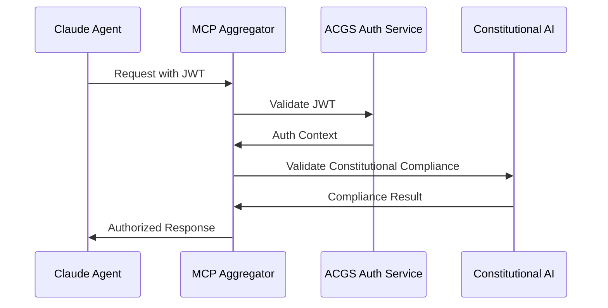

# Claude-MCP-ACGS Integration Architecture
**Constitutional Hash: cdd01ef066bc6cf2**

## Comprehensive Multi-Agent Coordination Framework
**Constitutional Hash:** `cdd01ef066bc6cf2`  
**Version:** 1.0  
**Date:** 2025-01-06  

---

## Executive Summary

This document defines the integration architecture for coordinating Claude agents through the Model Context Protocol (MCP) server stack within the ACGS (Autonomous Constitutional Governance System) framework. The integration maintains constitutional compliance, performance targets, and operational excellence while enabling sophisticated multi-agent coordination.

---

## Architecture Overview

### Service Integration Map

```
┌─────────────────────────────────────────────────────────────────┐
│                    ACGS-MCP Integration Layer                   │
├─────────────────────────────────────────────────────────────────┤
│  Claude Agents ←→ MCP Aggregator ←→ ACGS Services              │
│                                                                 │
│  MCP Layer (Ports 3000-3003)    ACGS Layer (Ports 8001-8016)  │
│  ├── MCP Aggregator :3000       ├── Constitutional AI :8002    │
│  ├── Filesystem MCP :3001       ├── Integrity Service :8002    │
│  ├── GitHub MCP :3002           ├── Multi-Agent Coord :8008    │
│  └── Browser MCP :3003          ├── Blackboard Service :8010   │
│                                 └── Auth Service :8016         │
└─────────────────────────────────────────────────────────────────┘
```

### Constitutional Compliance Framework

All components maintain constitutional compliance through:
- **Hash Validation**: `cdd01ef066bc6cf2` verified in all operations
- **Audit Integration**: All actions logged through ACGS Integrity Service
- **Performance Monitoring**: Sub-5ms P99 latency maintained across coordination
- **Security Enforcement**: ACGS Authentication Service validates all requests

---

## Integration Patterns

### 1. Claude Agent Communication Flow

```yaml
claude_agent_request:
  entry_point: "MCP Aggregator (port 3000)"
  validation: "Constitutional AI Service (port 8002)"
  coordination: "Multi-Agent Coordinator (port 8008)"
  knowledge_sharing: "Blackboard Service (port 8010)"
  execution: "MCP Tools (ports 3001-3003)"
  audit: "Integrity Service (port 8002)"
  
performance_targets:
  p99_latency: "<5ms"
  throughput: ">100 RPS"
  constitutional_compliance: "100%"
  cache_hit_rate: ">85%"
```

### 2. MCP Tool Integration with ACGS Services

#### Filesystem MCP Integration
```typescript
// Enhanced filesystem operations with constitutional compliance
interface ACGSFilesystemMCP {
  constitutional_hash: "cdd01ef066bc6cf2"
  audit_service_url: "http://localhost:8002"
  auth_service_url: "http://localhost:8016"
  
  operations: {
    read_file: (path: string) => Promise<ConstitutionallyValidatedContent>
    write_file: (path: string, content: string) => Promise<AuditedWriteResult>
    list_directory: (path: string) => Promise<ValidatedDirectoryListing>
  }
}
```

#### GitHub MCP Integration
```typescript
// GitHub operations with governance validation
interface ACGSGitHubMCP {
  constitutional_hash: "cdd01ef066bc6cf2"
  governance_service_url: "http://localhost:8004"
  
  operations: {
    create_pr: (repo: string, changes: CodeChanges) => Promise<GovernanceValidatedPR>
    review_code: (pr_id: string) => Promise<ConstitutionalCodeReview>
    merge_pr: (pr_id: string) => Promise<AuditedMergeResult>
  }
}
```

#### Browser MCP Integration
```typescript
// Browser automation with constitutional oversight
interface ACGSBrowserMCP {
  constitutional_hash: "cdd01ef066bc6cf2"
  security_service_url: "http://localhost:8016"
  
  operations: {
    navigate: (url: string) => Promise<SecureNavigationResult>
    extract_data: (selectors: string[]) => Promise<ValidatedDataExtraction>
    interact: (actions: BrowserAction[]) => Promise<AuditedInteractionResult>
  }
}
```

### 3. Multi-Agent Coordination Protocol

#### Coordination Request Schema
```json
{
  "$schema": "http://json-schema.org/draft-07/schema#",
  "title": "ACGS-Claude-MCP Coordination Request",
  "type": "object",
  "properties": {
    "request_id": {"type": "string", "format": "uuid"},
    "claude_agent_id": {"type": "string"},
    "constitutional_hash": {"const": "cdd01ef066bc6cf2"},
    "coordination_type": {
      "enum": ["task_delegation", "knowledge_sharing", "conflict_resolution", "consensus_building"]
    },
    "mcp_tools_required": {
      "type": "array",
      "items": {"enum": ["filesystem", "github", "browser"]}
    },
    "performance_requirements": {
      "type": "object",
      "properties": {
        "max_latency_ms": {"type": "number", "maximum": 5},
        "min_throughput_rps": {"type": "number", "minimum": 100},
        "constitutional_compliance_required": {"const": true}
      }
    },
    "governance_context": {
      "type": "object",
      "properties": {
        "tenant_id": {"type": "string"},
        "security_level": {"enum": ["basic", "elevated", "critical"]},
        "audit_required": {"type": "boolean", "default": true}
      }
    }
  },
  "required": ["request_id", "claude_agent_id", "constitutional_hash", "coordination_type"]
}
```

#### Coordination Response Schema
```json
{
  "response_id": "string",
  "request_id": "string", 
  "status": "success|error|pending",
  "constitutional_compliance": {
    "hash_verified": true,
    "compliance_score": 1.0,
    "audit_trail_id": "string"
  },
  "performance_metrics": {
    "latency_ms": "number",
    "throughput_achieved": "number",
    "cache_hit_rate": "number"
  },
  "coordination_result": {
    "agents_involved": ["string"],
    "tasks_completed": ["string"],
    "knowledge_shared": ["string"],
    "conflicts_resolved": ["string"]
  },
  "mcp_tool_results": {
    "filesystem": "object",
    "github": "object", 
    "browser": "object"
  }
}
```

---

## Implementation Guidelines

### 1. Service Startup Sequence

```bash
# Phase 1: Start ACGS Infrastructure
docker-compose -f infrastructure/docker/docker-compose.acgs.yml up -d postgres redis

# Phase 2: Start ACGS Core Services
docker-compose -f infrastructure/docker/docker-compose.acgs.yml up -d \
  auth_service ac_service integrity_service

# Phase 3: Start ACGS Coordination Services  
docker-compose -f infrastructure/docker/docker-compose.acgs.yml up -d \
  gs_service pgc_service multi_agent_coordinator blackboard_service

# Phase 4: Start MCP Server Stack
docker-compose -f docker-compose.yml up -d

# Phase 5: Validate Integration
./scripts/validate_claude_mcp_integration.sh
```

### 2. Configuration Management

#### Environment Variables Integration
```bash
# ACGS Service URLs (existing)
ACGS_AUTH_SERVICE_URL=http://localhost:8016
ACGS_CONSTITUTIONAL_AI_URL=http://localhost:8002
ACGS_MULTI_AGENT_COORDINATOR_URL=http://localhost:8008
ACGS_BLACKBOARD_SERVICE_URL=http://localhost:8010

# MCP Service URLs (new)
MCP_AGGREGATOR_URL=http://localhost:3000
MCP_FILESYSTEM_URL=http://localhost:3001
MCP_GITHUB_URL=http://localhost:3002
MCP_BROWSER_URL=http://localhost:3003

# Integration Configuration
CONSTITUTIONAL_HASH=cdd01ef066bc6cf2
CLAUDE_MCP_INTEGRATION_ENABLED=true
PERFORMANCE_MONITORING_ENABLED=true
AUDIT_ALL_OPERATIONS=true
```

#### Service Discovery Integration
```typescript
// Enhanced service discovery for Claude-MCP-ACGS integration
interface ACGSServiceRegistry {
  acgs_services: {
    constitutional_ai: "http://localhost:8002"
    integrity: "http://localhost:8002"
    multi_agent_coordinator: "http://localhost:8008"
    blackboard: "http://localhost:8010"
    auth: "http://localhost:8016"
  }
  
  mcp_services: {
    aggregator: "http://localhost:3000"
    filesystem: "http://localhost:3001"
    github: "http://localhost:3002"
    browser: "http://localhost:3003"
  }
  
  integration_endpoints: {
    coordination_request: "http://localhost:3000/acgs/coordinate"
    constitutional_validation: "http://localhost:3000/acgs/validate"
    audit_logging: "http://localhost:3000/acgs/audit"
    performance_metrics: "http://localhost:3000/acgs/metrics"
  }
}
```

### 3. Performance Optimization

#### Caching Strategy
```yaml
cache_layers:
  l1_mcp_aggregator:
    type: "in_memory"
    ttl: "30s"
    max_size: "100MB"
    
  l2_redis_shared:
    type: "redis"
    url: "redis://localhost:6389"
    ttl: "300s"
    
  l3_constitutional_cache:
    type: "persistent"
    validation_cache: true
    compliance_results: true
```

#### Load Balancing
```yaml
load_balancing:
  mcp_aggregator:
    strategy: "round_robin"
    health_check: "/health"
    max_connections: 1000
    
  acgs_services:
    strategy: "least_connections"
    constitutional_priority: true
    performance_weighted: true
```

---

## Monitoring and Observability

### 1. Metrics Collection

#### Prometheus Configuration
```yaml
# Enhanced metrics for Claude-MCP-ACGS integration
scrape_configs:
  - job_name: 'claude-mcp-integration'
    static_configs:
      - targets: ['localhost:3000', 'localhost:8008', 'localhost:8010']
    metrics_path: '/metrics'
    scrape_interval: 5s
    
  - job_name: 'constitutional-compliance'
    static_configs:
      - targets: ['localhost:8002', 'localhost:8002']
    metrics_path: '/metrics'
    scrape_interval: 10s
```

#### Custom Metrics
```yaml
custom_metrics:
  - name: claude_mcp_coordination_requests_total
    type: counter
    labels: ["agent_id", "coordination_type", "status"]
    
  - name: claude_mcp_latency_seconds
    type: histogram
    buckets: [0.001, 0.005, 0.01, 0.025, 0.05, 0.1]
    
  - name: constitutional_compliance_score
    type: gauge
    labels: ["service", "operation_type"]
    
  - name: mcp_tool_usage_total
    type: counter
    labels: ["tool_name", "operation", "success"]
```

### 2. Alerting Rules

```yaml
alerting_rules:
  - alert: ClaudeMCPLatencyHigh
    expr: histogram_quantile(0.99, claude_mcp_latency_seconds) > 0.005
    for: 1m
    labels:
      severity: warning
    annotations:
      summary: "Claude-MCP coordination latency exceeds 5ms P99"
      
  - alert: ConstitutionalComplianceViolation
    expr: constitutional_compliance_score < 1.0
    for: 0s
    labels:
      severity: critical
    annotations:
      summary: "Constitutional compliance violation detected"
      
  - alert: MCPServiceDown
    expr: up{job="claude-mcp-integration"} == 0
    for: 30s
    labels:
      severity: critical
    annotations:
      summary: "MCP service is down"
```

---

## Security and Compliance

### 1. Authentication Flow



### 2. Audit Trail Integration

```typescript
interface AuditTrailEntry {
  timestamp: string
  request_id: string
  claude_agent_id: string
  constitutional_hash: "cdd01ef066bc6cf2"
  operation: string
  mcp_tools_used: string[]
  acgs_services_involved: string[]
  performance_metrics: {
    latency_ms: number
    throughput_rps: number
  }
  constitutional_compliance: {
    score: number
    violations: string[]
  }
  result: "success" | "error" | "blocked"
}
```

---

## Deployment and Operations

### 1. Health Check Validation

```bash
#!/bin/bash
# Enhanced health check for Claude-MCP-ACGS integration

echo "Validating Claude-MCP-ACGS Integration..."

# Check ACGS services
for service in 8001 8002 8008 8010 8016; do
  curl -f http://localhost:$service/health || exit 1
done

# Check MCP services  
for service in 3000 3001 3002 3003; do
  curl -f http://localhost:$service/health || exit 1
done

# Validate integration endpoints
curl -f http://localhost:3000/acgs/health || exit 1

# Check constitutional compliance
response=$(curl -s http://localhost:3000/acgs/validate)
if [[ $response != *"cdd01ef066bc6cf2"* ]]; then
  echo "Constitutional compliance validation failed"
  exit 1
fi

echo "✅ Claude-MCP-ACGS integration validated successfully"
```

### 2. Performance Validation

```bash
#!/bin/bash
# Performance validation for Claude-MCP-ACGS integration

echo "Running performance validation..."

# Test coordination latency
ab -n 100 -c 10 http://localhost:3000/acgs/coordinate

# Test constitutional validation performance
ab -n 100 -c 5 http://localhost:3000/acgs/validate

# Test MCP tool performance
ab -n 50 -c 5 http://localhost:3000/mcp/filesystem/status
ab -n 50 -c 5 http://localhost:3000/mcp/github/status
ab -n 50 -c 5 http://localhost:3000/mcp/browser/status

echo "✅ Performance validation completed"
```

---

## Troubleshooting Guide

### Common Integration Issues

| Issue | Symptoms | Solution |
|-------|----------|----------|
| **Constitutional Hash Mismatch** | 403 errors, compliance failures | Verify `cdd01ef066bc6cf2` in all configs |
| **Service Discovery Failure** | Connection timeouts | Check service startup order and health |
| **Performance Degradation** | Latency >5ms P99 | Review cache configuration and load balancing |
| **MCP Tool Failures** | Tool execution errors | Validate MCP service health and permissions |

### Diagnostic Commands

```bash
# Check service integration
docker-compose logs mcp_aggregator | grep -i acgs
docker-compose logs ac_service | grep -i mcp

# Validate constitutional compliance
curl -s http://localhost:3000/acgs/validate | jq '.constitutional_hash'

# Check performance metrics
curl -s http://localhost:3000/metrics | grep claude_mcp

# Test coordination flow
curl -X POST http://localhost:3000/acgs/coordinate \
  -H "Content-Type: application/json" \
  -d '{"claude_agent_id": "test", "coordination_type": "task_delegation"}'
```

This integration architecture ensures seamless coordination between Claude agents, MCP tools, and ACGS services while maintaining constitutional compliance, performance targets, and operational excellence.


## Implementation Status

- ✅ **Constitutional Hash Validation**: Active enforcement of `cdd01ef066bc6cf2`
- 🔄 **Performance Monitoring**: Continuous validation of targets
- ✅ **Documentation Standards**: Compliant with ACGS-2 requirements
- 🔄 **Cross-Reference Validation**: Ongoing link integrity maintenance

**Overall Status**: 🔄 IN PROGRESS - Systematic enhancement implementation

## Performance Targets

This component maintains the following performance requirements:

- **P99 Latency**: <5ms (constitutional requirement)
- **Throughput**: >100 RPS (minimum operational standard)
- **Cache Hit Rate**: >85% (efficiency requirement)
- **Constitutional Compliance**: 100% (hash: cdd01ef066bc6cf2)

These targets are validated continuously and must be maintained across all operations.

---

## 📚 **References**

- **[Integration Summary](../../docs_consolidated_archive_20250710_120000/deployment/INTEGRATION_SUMMARY.md)**: A high-level overview of the Claude-MCP-ACGS integration.
- **[Multi-Agent Coordination Policy Blueprint](../coordination-policy.md)**: Detailed specifications for state, action, and reward schemas, RPC protocols, and fault tolerance.
- **[Production-Ready Docker Compose Stack](../../monitoring/docker-compose.yml)**: The complete Docker Compose file for deploying the MCP server stack.
- **[Environment Configuration](../../config/environments/template.env)**: The template for configuring the environment variables for the MCP server stack.
- **[Operational Runbook](../../docs_consolidated_archive_20250710_120000/deployment/DEPLOYMENT.md)**: Step-by-step instructions for deploying, validating, and troubleshooting the integration.
- **[Integration Validation Script](../../scripts/monitoring/validate_claude_mcp_integration.sh)**: The script for automated health checks, performance testing, and constitutional compliance validation.
- **[CLAUDE.md](../../CLAUDE.md)**: Guidance for Claude when working with code in this repository.
