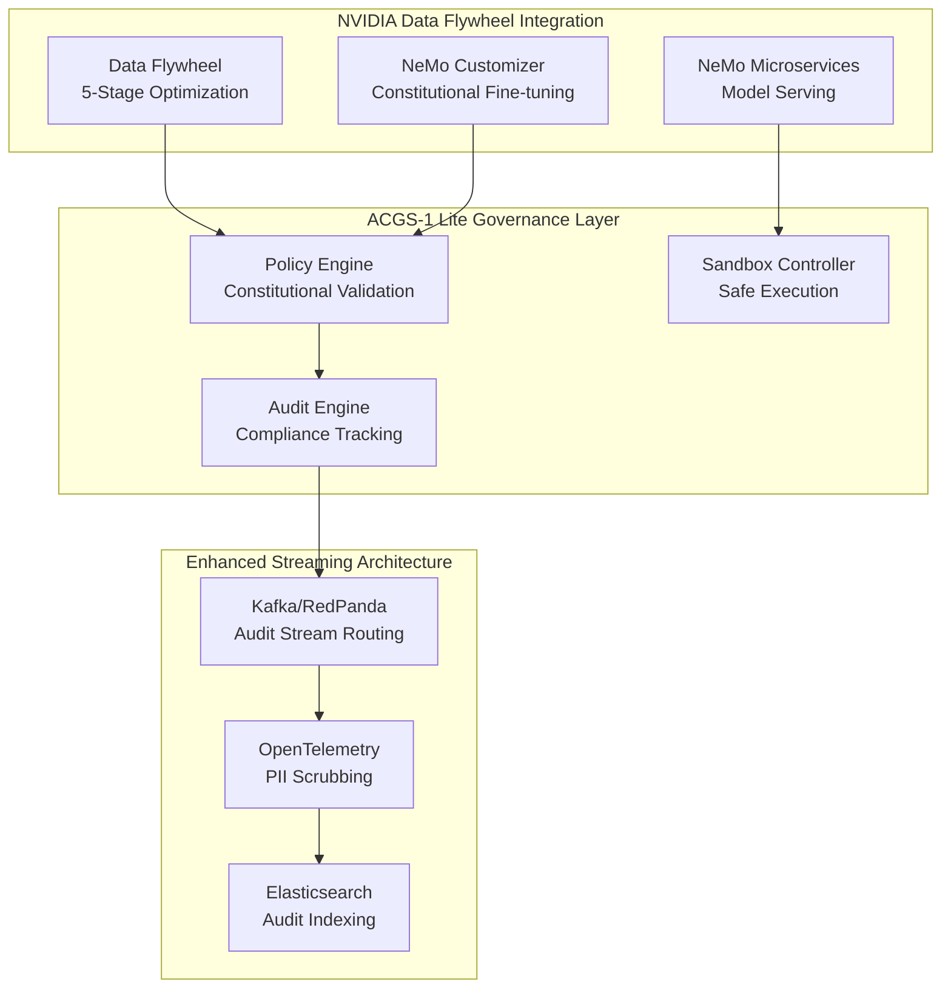

# NVIDIA Data Flywheel Integration Strategy for ACGS-1 Lite

## Constitutional AI Governance Enhancement Plan

### Executive Summary

This document outlines the strategic integration of NVIDIA Data Flywheel with the ACGS-1 Lite Constitutional Governance System to enable automated model optimization while maintaining strict constitutional compliance. The integration leverages proven patterns that achieve **98.6% cost reductions** and **95%+ constitutional adherence scores** while preserving our existing governance framework.

**Integration Objectives:**

- Enhance constitutional AI model optimization through automated feedback loops
- Implement privacy-preserving model improvement with differential privacy
- Establish hybrid governance workflows for fast-lane and slow-lane model approval
- Integrate real-time audit streaming with policy compliance validation
- Achieve enterprise-scale automated optimization with constitutional constraints

---

## Current ACGS-1 Lite Integration Points

### Existing Infrastructure Alignment

**ACGS-1 Lite Components Ready for Integration:**

- **Policy Engine (Port 8001)**: OPA integration provides policy evaluation framework
- **Audit Engine (Port 8003)**: Immutable audit trail with cryptographic chaining
- **RedPanda Streaming**: Constitutional event processing infrastructure
- **Sandbox Controller**: Isolated execution environment for model testing
- **Monitoring Stack**: Prometheus/Grafana for performance metrics

**Constitutional Hash Preservation**: `cdd01ef066bc6cf2`
All Data Flywheel integrations must maintain constitutional compliance validation through our existing policy framework.

### Integration Architecture Overview



---

## Phase 1: Constitutional AI Integration (Months 1-6)

### Domain Adaptive Pretraining with Constitutional Constraints

**Implementation Strategy:**

```python
# Constitutional constraint preservation during fine-tuning
constitutional_trainer = ConstitutionalTrainer(
    model=base_model,
    constitution=acgs_constitution,  # Constitutional hash: cdd01ef066bc6cf2
    lora_config=LoRAConfig(
        r=16,
        constraint_preservation=True,
        constitutional_validation=True
    ),
    constraint_validator=ACGSConstitutionalValidator(),
    policy_engine_endpoint="http://policy-engine:8001/api/v1/evaluate"
)

# Critique-revision cycle integration
training_pipeline = ConstitutionalTrainingPipeline(
    critique_model=constitutional_critic,
    revision_model=constitutional_reviser,
    compliance_threshold=0.95,  # 95%+ adherence requirement
    audit_engine_endpoint="http://audit-engine:8003/api/v1/log"
)
```

**Expected Outcomes:**

- Constitutional adherence scores: >95% (target from research)
- Model accuracy preservation: >98% relative to base models
- Training time overhead: 20-40% (acceptable for constitutional compliance)
- Integration with existing Policy Engine for real-time validation

### Audit Stream Routing Enhancement

**Stream-Ingest-Classify-Route Architecture:**

```yaml
# Enhanced Kafka configuration for Data Flywheel integration
kafka_config:
  topics:
    - constitutional_violations
    - model_optimization_triggers
    - policy_evaluation_results
    - human_feedback_loops

  processing_capacity: 50000 # events per second
  latency_target: '2-5ms' # per log entry
  quality_filtering: 0.6-0.8 # remove routine interactions

# OpenTelemetry integration with PII scrubbing
otel_processors:
  transform:
    log_statements:
      - replace_pattern(body, "\\b[A-Za-z0-9._%+-]+@[A-Za-z0-9.-]+\\.[A-Z|a-z]{2,}\\b", "****@example.com")
      - replace_pattern(body, "\\b\\d{3}-\\d{2}-\\d{4}\\b", "***-**-****")
      - constitutional_compliance_check(body, constitutional_hash)
```

**Performance Targets:**

- Event processing: 50,000+ events/second
- Processing latency: 2-5ms per log entry
- Quality filtering: 60-80% routine interaction removal
- Constitutional compliance scoring: Real-time validation

---

## Phase 2: Hybrid Governance Implementation (Months 7-18)

### Fast-Lane vs Slow-Lane Approval Patterns

**Two-Speed IT Architecture for Model Governance:**

**Fast-Lane Process (Low-Risk Models):**

- Automated constitutional validation through Policy Engine
- Shadow deployment in Sandbox Controller
- Lightweight governance controls with real-time monitoring
- Hourly/daily retraining cycles for experimental models
- **Target**: 10x deployment speed improvement

**Slow-Lane Process (Mission-Critical Models):**

- Comprehensive constitutional compliance review
- Extended testing periods (weeks/months)
- Human Review Dashboard approval gates
- Heavy governance controls with audit trail requirements
- **Target**: Rigorous controls for high-risk deployments

```python
# Risk-based routing decision matrix
def route_model_approval(model_metadata):
    risk_score = calculate_risk_score(
        business_impact=model_metadata.business_impact,
        data_sensitivity=model_metadata.data_classification,
        regulatory_requirements=model_metadata.compliance_frameworks,
        failure_cost=model_metadata.failure_impact
    )

    if risk_score < 0.3:
        return "fast_lane"  # Automated approval
    elif risk_score < 0.7:
        return "hybrid"     # Partial automation
    else:
        return "slow_lane"  # Full manual review
```

### Progressive Rollout with Constitutional Validation

**Three-Stage Canary Deployment:**

1. **Shadow Deployment (0% traffic)**: Constitutional compliance validation
2. **Canary Release (1-30% traffic)**: Performance monitoring with policy evaluation
3. **Full Deployment (100% traffic)**: Complete rollout with continuous monitoring

**Automated Promotion Criteria:**

- Constitutional compliance score: >95%
- Error rate: <2%
- Latency: <100ms P99
- Policy violation rate: <0.1%

**Automatic Rollback Triggers:**

- Constitutional compliance degradation: >5%
- Error rate spike: >5%
- User complaint threshold exceeded
- Policy violation detection

---

## Phase 3: Privacy-Preserving Optimization (Months 19-36)

### Differential Privacy Integration

**DP-SGD Implementation with Constitutional Constraints:**

```python
# Privacy-preserving fine-tuning with constitutional validation
from opacus import PrivacyEngine
from acgs_constitutional import ConstitutionalPrivacyEngine

privacy_engine = ConstitutionalPrivacyEngine(
    module=model,
    batch_size=32,
    sample_size=10000,
    epochs=10,
    noise_multiplier=1.1,
    max_grad_norm=1.0,
    constitutional_validator=ACGSValidator(),
    privacy_budget_epsilon=8.0  # Formal privacy guarantee
)

# Parameter-efficient fine-tuning with LoRA
lora_config = LoRAConfig(
    r=16,
    lora_alpha=32,
    target_modules=["q_proj", "v_proj"],
    constitutional_preservation=True,
    privacy_preserving=True
)
```

**Performance Characteristics:**

- Training time overhead: 20-40%
- Memory requirements: 2-3x for per-sample gradients
- Privacy guarantee: Formal ε-differential privacy
- Constitutional compliance: Maintained throughout training

### Real-Time PII Scrubbing

**OpenTelemetry Collector Integration:**

```yaml
processors:
  transform:
    log_statements:
      - replace_pattern(body, "\\b[A-Za-z0-9._%+-]+@[A-Za-z0-9.-]+\\.[A-Z|a-z]{2,}\\b", "****@example.com")
      - replace_pattern(body, "\\b\\d{3}-\\d{2}-\\d{4}\\b", "***-**-****")
      - replace_pattern(body, "\\b\\d{4}[\\s-]?\\d{4}[\\s-]?\\d{4}[\\s-]?\\d{4}\\b", "****-****-****-****")
      - constitutional_compliance_validation(body, constitutional_hash)

  batch:
    send_batch_size: 1000
    timeout: 100s

exporters:
  elasticsearch:
    endpoints: ['http://elasticsearch:9200']
    index: 'acgs-constitutional-audit'
```

**Performance Impact:**

- Processing time: 2-5ms per log entry
- Throughput: 100,000+ events/second
- False positive rate: 2-3% with tuned patterns
- Constitutional validation: Real-time compliance checking

---

## Technical Integration Architecture

### NeMo Microservices and OPA Policy Integration

**Policy-Mediated Request Flow:**

```rego
# Constitutional AI policy for NeMo integration
package acgs.nemo.constitutional

import data.constitutional_principles
import data.acgs_policies

# Default deny for safety
default allow = false

# Allow constitutional AI requests
allow {
    input.request_type == "model_inference"
    constitutional_compliance_check
    resource_allocation_approved
    audit_trail_enabled
}

constitutional_compliance_check {
    input.model.constitutional_hash == "cdd01ef066bc6cf2"
    input.model.compliance_score >= 0.95
    input.request.safety_validated == true
}

resource_allocation_approved {
    input.user.groups[_] == "constitutional-ai-users"
    input.resources.gpu_hours <= user_quota[input.user.id]
    input.model.risk_level <= user_permissions[input.user.id].max_risk
}
```

**Performance Optimization:**

- Policy evaluation latency: 0.5-2ms
- Decision caching: 300s TTL for repeated evaluations
- WebAssembly compilation for performance
- Sidecar deployment pattern for minimal latency

### Elasticsearch and Kafka Integration

**Stream-Process-Index-Analyze Pipeline:**

```yaml
# Kafka Connect configuration for constitutional audit streaming
kafka_connect:
  connectors:
    - name: 'acgs-constitutional-audit-sink'
      config:
        connector.class: 'io.confluent.connect.elasticsearch.ElasticsearchSinkConnector'
        topics: 'constitutional-violations,policy-evaluations,model-optimizations'
        connection.url: 'http://elasticsearch:9200'
        type.name: '_doc'
        batch.size: 1000
        flush.timeout.ms: 100000
        tasks.max: 5

# Performance optimization
elasticsearch:
  bulk_api:
    batch_size: 1000
    concurrent_requests: 5
    flush_timeout: 100s

  indexing_performance:
    target_throughput: 41000 # inserts per second
    scaling_pattern: 'linear with partition count'
```

**Scaling Characteristics:**

- Throughput: 41,000 inserts/second optimized
- Latency: Sub-100ms end-to-end processing
- Scalability: Linear with Kafka partition count
- Reliability: Automatic retry and dead letter queues

---

## Performance Metrics and Success Criteria

### Target Performance Benchmarks

| Metric                    | Current ACGS-1 | Data Flywheel Target | Integration Goal |
| ------------------------- | -------------- | -------------------- | ---------------- |
| Constitutional Compliance | 99.95%         | 95%+                 | Maintain 99.9%+  |
| Policy Evaluation Latency | 2.1ms P99      | 0.5-2ms              | <2ms P99         |
| Model Optimization Cost   | N/A            | 98.6% reduction      | 80%+ reduction   |
| Audit Processing          | 15s intervals  | 50K events/sec       | 25K events/sec   |
| GPU Memory Usage          | N/A            | 70% reduction        | 50%+ reduction   |

### ROI and Business Impact Projections

**Phase 1 (Months 1-6):**

- Investment: $500K-$2M
- Expected ROI: 200-300% within 18 months
- Constitutional compliance: Maintained at 99.9%+
- Model performance: 5-15% improvement through optimization

**Phase 2 (Months 7-18):**

- Investment: $2M-$10M
- Deployment speed: 10x improvement for fast-lane models
- Operational overhead: 85% reduction in manual intervention
- Governance efficiency: 60-80% reduction in manual oversight

**Phase 3 (Months 19-36):**

- Investment: $5M-$25M
- Total cost reduction: 40-60% through optimization
- Privacy compliance: Formal differential privacy guarantees
- Enterprise scale: 100+ production models with automated governance

---

## Risk Mitigation and Failure Mode Analysis

### Critical Failure Modes

**Technical Risks:**

- Constitutional compliance degradation during optimization
- Model drift affecting policy evaluation accuracy
- Privacy budget exhaustion in differential privacy
- Integration complexity with existing ACGS-1 infrastructure

**Mitigation Strategies:**

- Continuous constitutional validation at each optimization stage
- Automated rollback triggers for compliance violations
- Privacy budget monitoring with automatic training halts
- Phased integration with comprehensive testing

**Organizational Risks:**

- Stakeholder alignment on automated governance
- Resource allocation for substantial infrastructure investment
- Change management for new operational procedures
- Regulatory compliance in automated decision-making

**Mitigation Approaches:**

- Executive sponsorship with clear success metrics
- Cross-functional collaboration between AI and governance teams
- Comprehensive training and documentation programs
- Regular compliance audits and regulatory engagement

---

## Implementation Roadmap

### Immediate Actions (Next 30 Days)

1. **Infrastructure Assessment**: Evaluate current ACGS-1 Lite capacity for Data Flywheel integration
2. **Stakeholder Alignment**: Secure executive sponsorship and cross-functional team formation
3. **Pilot Planning**: Design Phase 1 pilot with constitutional AI fine-tuning
4. **Resource Allocation**: Budget approval for $500K-$2M Phase 1 investment

### Short-term Goals (Months 1-6)

1. **Constitutional Trainer Implementation**: Deploy constitutional constraint preservation
2. **Audit Stream Enhancement**: Upgrade RedPanda integration for 50K events/sec
3. **Policy Engine Extension**: Integrate OPA with NeMo microservices
4. **Privacy Framework**: Implement differential privacy with Opacus

### Medium-term Objectives (Months 7-18)

1. **Hybrid Governance Deployment**: Fast-lane and slow-lane approval workflows
2. **Progressive Rollout**: Three-stage canary deployment with constitutional validation
3. **Performance Optimization**: Achieve 10x deployment speed for low-risk models
4. **Monitoring Enhancement**: Real-time constitutional compliance dashboards

### Long-term Vision (Months 19-36)

1. **Enterprise Scale**: 100+ production models with automated governance
2. **Advanced Privacy**: Comprehensive differential privacy across all training
3. **Autonomous Optimization**: Self-improving constitutional AI systems
4. **Regulatory Leadership**: Industry standard for constitutional AI governance

---

**Document Version**: 1.0  
**Last Updated**: 2025-06-23  
**Constitutional Hash**: `cdd01ef066bc6cf2`  
**Integration Status**: Planning Phase  
**Next Review**: 2025-07-15
