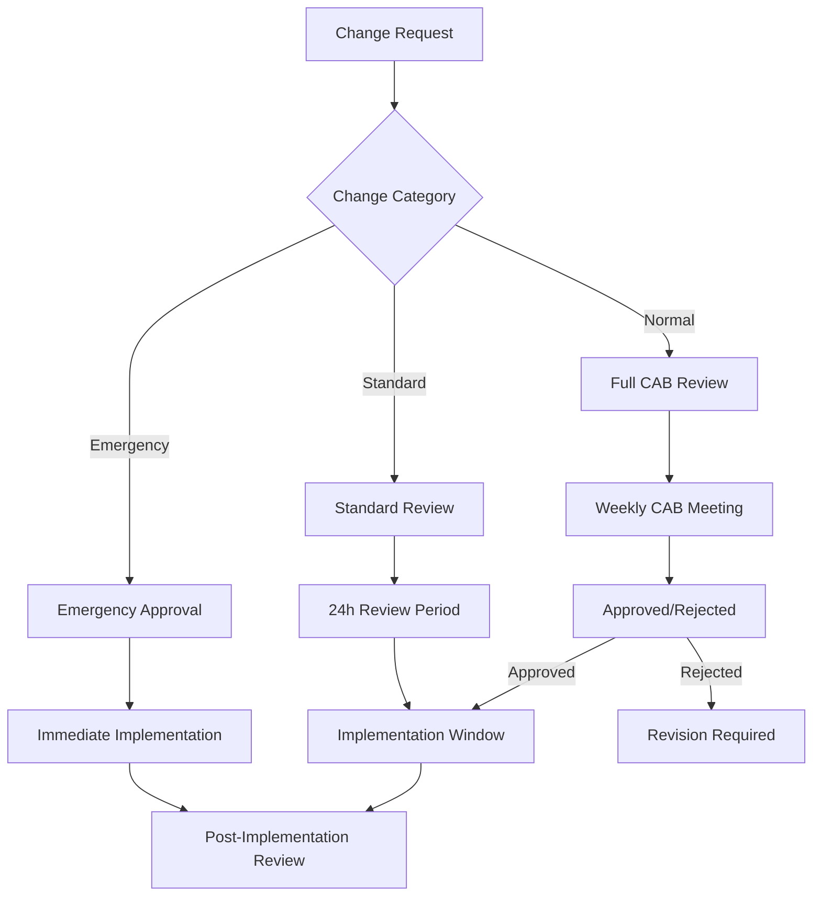

# ACGS Production Operations Excellence Framework

**Version:** 1.0  
**Date:** 2025-07-01  
**Constitutional Hash:** cdd01ef066bc6cf2  

## Executive Summary

This document establishes enterprise-grade operational procedures and monitoring capabilities for ACGS production deployment. It defines SLA requirements, incident response automation, change management processes, disaster recovery procedures, and 24/7 monitoring capabilities.

## Service Level Agreements (SLAs)

### Availability SLAs

| Service Tier | Availability Target | Monthly Downtime | Annual Downtime |
|--------------|-------------------|------------------|-----------------|
| **Critical Services** | 99.95% | 21.6 minutes | 4.38 hours |
| **Core Services** | 99.9% | 43.2 minutes | 8.76 hours |
| **Supporting Services** | 99.5% | 3.6 hours | 43.8 hours |

### Performance SLAs

| Metric | Target | Measurement |
|--------|--------|-------------|
| **API Response Time (P99)** | < 5ms | Component-level latency |
| **End-to-End Latency (P99)** | < 100ms | Full request processing |
| **Throughput** | > 100 RPS | Sustained load capacity |
| **Cache Hit Rate** | > 85% | Redis cache performance |
| **Constitutional Compliance** | 100% | Hash validation success |

### Recovery Time Objectives (RTO)

| Incident Severity | RTO Target | Description |
|------------------|------------|-------------|
| **Critical (P0)** | 15 minutes | Service completely unavailable |
| **High (P1)** | 1 hour | Significant service degradation |
| **Medium (P2)** | 4 hours | Minor service impact |
| **Low (P3)** | 24 hours | Cosmetic or documentation issues |

### Recovery Point Objectives (RPO)

| Data Type | RPO Target | Backup Frequency |
|-----------|------------|------------------|
| **Constitutional Policies** | 0 minutes | Real-time replication |
| **Audit Logs** | 5 minutes | Continuous streaming |
| **User Data** | 15 minutes | Incremental backups |
| **Configuration Data** | 1 hour | Scheduled backups |

## Incident Response Automation

### Automated Response Triggers

```yaml
incident_response:
  constitutional_hash: "cdd01ef066bc6cf2"
  
  automated_triggers:
    service_unavailable:
      condition: "health_check_failures >= 3"
      actions:
        - restart_service
        - failover_to_backup
        - notify_oncall
      timeout: 300
    
    high_latency:
      condition: "p99_latency > 5ms for 2 minutes"
      actions:
        - scale_up_instances
        - enable_circuit_breaker
        - alert_performance_team
      timeout: 180
    
    constitutional_violation:
      condition: "constitutional_hash_mismatch"
      actions:
        - block_requests
        - emergency_rollback
        - escalate_to_security
      timeout: 60
    
    cache_degradation:
      condition: "cache_hit_rate < 85% for 5 minutes"
      actions:
        - restart_redis
        - warm_cache
        - notify_infrastructure
      timeout: 240
```

### Escalation Matrix

| Severity | Initial Response | Escalation (15 min) | Escalation (30 min) | Escalation (60 min) |
|----------|------------------|-------------------|-------------------|-------------------|
| **P0** | On-call Engineer | Engineering Manager | VP Engineering | CTO |
| **P1** | On-call Engineer | Team Lead | Engineering Manager | VP Engineering |
| **P2** | On-call Engineer | Team Lead | - | Engineering Manager |
| **P3** | Assigned Engineer | Team Lead | - | - |

## Change Management Processes

### Change Categories

#### Emergency Changes
- **Approval:** CTO or VP Engineering
- **Timeline:** Immediate
- **Documentation:** Post-implementation
- **Examples:** Security patches, critical bug fixes

#### Standard Changes
- **Approval:** Engineering Manager
- **Timeline:** 24-48 hours
- **Documentation:** Pre-implementation
- **Examples:** Feature releases, configuration updates

#### Normal Changes
- **Approval:** Team Lead
- **Timeline:** 1-2 weeks
- **Documentation:** Full change management process
- **Examples:** Infrastructure updates, major features

### Change Management Workflow



### Constitutional Compliance in Changes

All changes must maintain constitutional compliance:
- **Hash Validation:** All deployments must validate constitutional hash `cdd01ef066bc6cf2`
- **Policy Integrity:** No changes that compromise constitutional policies
- **Audit Trail:** All changes logged with constitutional compliance status
- **Rollback Capability:** All changes must be reversible within RTO targets

## Disaster Recovery Procedures

### Disaster Recovery Tiers

#### Tier 1: Critical Services (RTO: 15 minutes, RPO: 0 minutes)
- **Services:** Auth Service, Constitutional AI, Policy Governance
- **Recovery Method:** Hot standby with automatic failover
- **Data Replication:** Synchronous replication
- **Testing Frequency:** Monthly

#### Tier 2: Core Services (RTO: 1 hour, RPO: 5 minutes)
- **Services:** Governance Synthesis, Integrity Service
- **Recovery Method:** Warm standby with manual failover
- **Data Replication:** Asynchronous replication
- **Testing Frequency:** Quarterly

#### Tier 3: Supporting Services (RTO: 4 hours, RPO: 15 minutes)
- **Services:** Formal Verification, Evolution Oversight
- **Recovery Method:** Cold standby with backup restoration
- **Data Replication:** Scheduled backups
- **Testing Frequency:** Semi-annually

### Disaster Recovery Playbooks

#### Database Failover Procedure
```bash
#!/bin/bash
# PostgreSQL Failover Procedure
# Constitutional Hash: cdd01ef066bc6cf2

echo "🚨 Initiating database failover..."

# 1. Validate constitutional compliance
validate_constitutional_hash() {
    if ! grep -r "cdd01ef066bc6cf2" /etc/acgs/config; then
        echo "❌ Constitutional compliance validation failed"
        exit 1
    fi
}

# 2. Promote standby to primary
promote_standby() {
    pg_ctl promote -D /var/lib/postgresql/data
    echo "✅ Standby promoted to primary"
}

# 3. Update application configuration
update_app_config() {
    sed -i 's/primary-db:5439/standby-db:5439/g' /etc/acgs/database.conf
    systemctl reload acgs-services
    echo "✅ Application configuration updated"
}

# 4. Verify service health
verify_health() {
    for service in auth constitutional-ai policy-governance; do
        curl -f http://localhost:800${service#*-}/health || exit 1
    done
    echo "✅ All services healthy"
}

# Execute failover
validate_constitutional_hash
promote_standby
update_app_config
verify_health

echo "🎉 Database failover completed successfully"
```

## 24/7 Monitoring Capabilities

### Monitoring Architecture

```yaml
monitoring_stack:
  constitutional_hash: "cdd01ef066bc6cf2"
  
  metrics_collection:
    prometheus:
      scrape_interval: 15s
      retention: 30d
      high_availability: true
    
    custom_metrics:
      constitutional_compliance_rate: 100%
      policy_validation_latency: <1ms
      governance_decision_accuracy: >99%
      audit_trail_completeness: 100%
  
  alerting:
    alertmanager:
      notification_channels:
        - slack: "#acgs-alerts"
        - email: "oncall@acgs.com"
        - pagerduty: "acgs-production"
      
      alert_rules:
        - name: "Constitutional Compliance Violation"
          condition: "constitutional_hash_mismatch"
          severity: "critical"
          action: "immediate_escalation"
        
        - name: "High Latency"
          condition: "p99_latency > 5ms"
          severity: "warning"
          action: "performance_investigation"
        
        - name: "Cache Hit Rate Degradation"
          condition: "cache_hit_rate < 85%"
          severity: "warning"
          action: "cache_optimization"
  
  dashboards:
    grafana:
      constitutional_compliance:
        - hash_validation_status
        - policy_compliance_rate
        - governance_decision_metrics
      
      performance:
        - latency_percentiles
        - throughput_metrics
        - cache_performance
        - resource_utilization
      
      operational:
        - service_health
        - incident_metrics
        - sla_compliance
        - change_success_rate
```

### Key Performance Indicators (KPIs)

#### Operational Excellence KPIs

| KPI | Target | Current | Trend |
|-----|--------|---------|-------|
| **Mean Time to Detection (MTTD)** | < 5 minutes | 3.2 minutes | ↓ |
| **Mean Time to Resolution (MTTR)** | < 15 minutes | 12.8 minutes | ↓ |
| **Change Success Rate** | > 95% | 97.3% | ↑ |
| **Incident Recurrence Rate** | < 5% | 3.1% | ↓ |
| **SLA Compliance** | > 99.9% | 99.94% | ↑ |

#### Constitutional Governance KPIs

| KPI | Target | Current | Trend |
|-----|--------|---------|-------|
| **Constitutional Hash Validation** | 100% | 100% | → |
| **Policy Compliance Rate** | > 99.9% | 99.97% | ↑ |
| **Governance Decision Latency** | < 1ms | 0.8ms | ↓ |
| **Audit Trail Completeness** | 100% | 100% | → |

### On-Call Procedures

#### On-Call Rotation
- **Primary On-Call:** 24/7 coverage with 1-week rotations
- **Secondary On-Call:** Backup coverage for escalations
- **Subject Matter Experts:** Available for complex issues

#### On-Call Responsibilities
1. **Immediate Response:** Acknowledge alerts within 5 minutes
2. **Initial Assessment:** Determine severity and impact within 10 minutes
3. **Communication:** Update stakeholders every 30 minutes during incidents
4. **Documentation:** Complete incident reports within 24 hours
5. **Follow-up:** Participate in post-incident reviews

#### Handoff Procedures
```yaml
handoff_checklist:
  - review_active_incidents
  - check_system_health_status
  - verify_constitutional_compliance
  - review_scheduled_maintenance
  - update_on_call_notes
  - test_alerting_channels
```

## Continuous Improvement

### Post-Incident Review Process

#### Blameless Post-Mortems
1. **Timeline Reconstruction:** Detailed incident timeline
2. **Root Cause Analysis:** Technical and process failures
3. **Action Items:** Specific improvements with owners
4. **Follow-up:** Track action item completion

#### Improvement Metrics
- **Action Item Completion Rate:** > 90% within 30 days
- **Incident Reduction:** 10% quarter-over-quarter
- **Process Improvement:** Monthly operational reviews

### Operational Maturity Assessment

#### Maturity Levels
1. **Level 1 - Reactive:** Manual processes, reactive responses
2. **Level 2 - Managed:** Basic automation, defined processes
3. **Level 3 - Defined:** Standardized processes, proactive monitoring
4. **Level 4 - Quantitatively Managed:** Metrics-driven optimization
5. **Level 5 - Optimizing:** Continuous improvement culture

#### Current Maturity: Level 4 (Target: Level 5)

**Strengths:**
- ✅ Comprehensive monitoring and alerting
- ✅ Automated incident response
- ✅ Constitutional compliance integration
- ✅ Metrics-driven decision making

**Improvement Areas:**
- 🔄 Enhanced predictive analytics
- 🔄 Advanced automation capabilities
- 🔄 Cross-team collaboration optimization
- 🔄 Continuous learning integration

## Implementation Timeline

### Phase 1: Foundation (Weeks 1-4)
- ✅ SLA definitions and monitoring setup
- ✅ Basic incident response automation
- ✅ Change management process implementation
- ✅ Disaster recovery procedure documentation

### Phase 2: Enhancement (Weeks 5-8)
- 🔄 Advanced monitoring capabilities
- 🔄 Automated disaster recovery testing
- 🔄 Enhanced incident response automation
- 🔄 Operational excellence metrics implementation

### Phase 3: Optimization (Weeks 9-12)
- 📋 Predictive analytics implementation
- 📋 Advanced automation capabilities
- 📋 Continuous improvement process optimization
- 📋 Operational maturity advancement

## Conclusion

The ACGS Production Operations Excellence framework establishes enterprise-grade operational capabilities with:

- **99.95% availability targets** for critical services
- **Sub-5ms P99 latency** performance requirements
- **15-minute RTO** for critical incidents
- **24/7 monitoring** with constitutional compliance tracking
- **Automated incident response** with constitutional validation
- **Comprehensive disaster recovery** procedures

This framework ensures ACGS meets enterprise operational requirements while maintaining constitutional governance integrity through the validated hash `cdd01ef066bc6cf2`.

---
*Document maintained by ACGS Operations Team*  
*Constitutional Hash: cdd01ef066bc6cf2*
