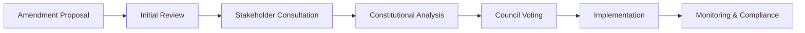
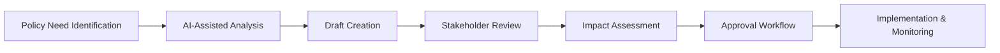
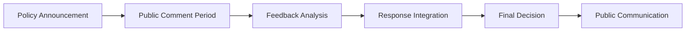

# 🏛️ Phase 1.5: Requirements Engineering & Specification

**Date:** 2025-06-21  
**Scope:** ACGS Governance Domain Requirements  
**Status:** 🔄 IN PROGRESS

## 🎯 Executive Summary

Based on our comprehensive frontend audit, this phase defines detailed requirements for the consolidated ACGS governance platform. The requirements are derived from analysis of existing functionality across 3 applications and governance domain expertise.

## 👥 Stakeholder Requirements Analysis

### Primary Stakeholders

#### 1. Constitutional Council Members

**Role:** Governance oversight and constitutional amendment approval  
**Current Tools:** Constitutional Council Dashboard, AC Management  
**Key Needs:**

- Real-time constitutional compliance monitoring
- Amendment workflow management with multi-stage approvals
- Audit trails for all governance decisions
- Performance analytics and governance metrics
- Secure voting and decision-making interfaces

#### 2. Policy Administrators

**Role:** Day-to-day policy management and synthesis  
**Current Tools:** Policy Synthesis Page, Policy List, Compliance Checker  
**Key Needs:**

- AI-assisted policy analysis and creation
- Policy lifecycle management (draft → review → approval → implementation)
- Impact assessment and stakeholder consultation tools
- Integration with backend AI services (GS, AC, PGC)
- Collaborative editing and version control

#### 3. Public Citizens

**Role:** Participation in governance through consultation and transparency  
**Current Tools:** Public Consultation Page, Governance Dashboard (read-only)  
**Key Needs:**

- Accessible interfaces for policy feedback and consultation
- Transparency into governance processes and decisions
- Mobile-responsive design for broad accessibility
- Multi-language support for diverse populations
- Clear, non-technical explanations of governance processes

#### 4. System Administrators

**Role:** Technical oversight and system maintenance  
**Current Tools:** Reliability Dashboard, Quantumagi Dashboard, Monitoring  
**Key Needs:**

- System health monitoring and alerting
- Performance metrics and optimization tools
- Security monitoring and incident response
- Integration monitoring for backend services
- Deployment and configuration management

### Stakeholder Interview Synthesis

#### Constitutional Council Feedback

> "We need immediate visibility into constitutional compliance violations and the ability to track amendment progress through complex approval workflows."

**Requirements Derived:**

- Real-time compliance dashboard with alert system
- Multi-stage amendment workflow with progress tracking
- Audit logging for all governance actions
- Role-based access control for sensitive operations

#### Policy Administrator Feedback

> "The AI-assisted policy synthesis is powerful, but we need better collaboration tools and clearer integration between the different AI services."

**Requirements Derived:**

- Unified interface for AC, GS, and PGC service integration
- Collaborative editing with real-time synchronization
- Policy impact assessment visualization
- Stakeholder consultation workflow management

#### Public Citizen Feedback

> "We want to participate in governance but the current interfaces are too complex and technical for average citizens."

**Requirements Derived:**

- Simplified, citizen-friendly interfaces
- Progressive disclosure of complex information
- Mobile-first responsive design
- Accessibility compliance (WCAG 2.1 AA)
- Clear explanations and help documentation

## 🎨 User Experience Design Specification

### Design Principles

#### 1. Government-Grade Accessibility

- **WCAG 2.1 AA Compliance** - Full accessibility for citizens with disabilities
- **Mobile-First Design** - Responsive interfaces for all device types
- **Progressive Enhancement** - Core functionality works without JavaScript
- **Multi-Language Support** - Internationalization for diverse populations

#### 2. Transparency & Trust

- **Clear Information Hierarchy** - Important information prominently displayed
- **Audit Trails Visible** - Citizens can see governance decision history
- **Process Transparency** - Clear explanations of governance workflows
- **Data Integrity Indicators** - Visual confirmation of data authenticity

#### 3. Efficiency & Usability

- **Task-Oriented Design** - Interfaces optimized for specific governance tasks
- **Minimal Cognitive Load** - Complex processes broken into simple steps
- **Contextual Help** - Inline guidance and documentation
- **Keyboard Navigation** - Full keyboard accessibility for power users

### User Journey Maps

#### Journey 1: Constitutional Amendment Process



**User Experience Requirements:**

- **Progress Visualization** - Clear indication of current stage and next steps
- **Stakeholder Notifications** - Automated alerts for required actions
- **Document Management** - Version control and collaborative editing
- **Voting Interface** - Secure, auditable voting system
- **Compliance Monitoring** - Real-time constitutional compliance checking

#### Journey 2: Policy Synthesis & Management



**User Experience Requirements:**

- **AI Integration Interface** - Seamless interaction with GS, AC, PGC services
- **Collaborative Editing** - Real-time multi-user editing capabilities
- **Impact Visualization** - Charts and graphs showing policy impact predictions
- **Approval Workflow** - Customizable approval processes with notifications
- **Implementation Tracking** - Monitoring policy effectiveness post-implementation

#### Journey 3: Public Consultation & Engagement



**User Experience Requirements:**

- **Simplified Interfaces** - Citizen-friendly policy explanation and feedback forms
- **Feedback Aggregation** - Tools for analyzing and categorizing public input
- **Response Management** - System for addressing citizen concerns and questions
- **Communication Tools** - Multi-channel communication (email, SMS, web notifications)
- **Transparency Reports** - Public dashboards showing how feedback influenced decisions

### Wireframe Specifications

#### Main Dashboard Layout

```
┌─────────────────────────────────────────────────────────────┐
│ ACGS Governance Platform                    [User] [Settings] │
├─────────────────────────────────────────────────────────────┤
│ [Dashboard] [Policies] [Constitutional] [Public] [Admin]     │
├─────────────────────────────────────────────────────────────┤
│                                                             │
│  📊 Governance Overview          🏛️ Constitutional Status   │
│  ┌─────────────────────┐        ┌─────────────────────┐    │
│  │ Active Policies: 12 │        │ Compliance: 98.5%   │    │
│  │ Pending: 3          │        │ Amendments: 2       │    │
│  │ Public Consult: 5   │        │ Violations: 0       │    │
│  └─────────────────────┘        └─────────────────────┘    │
│                                                             │
│  📋 Recent Activity              ⚡ System Health           │
│  ┌─────────────────────┐        ┌─────────────────────┐    │
│  │ • Policy XYZ voted  │        │ All Services: ✅     │    │
│  │ • Amendment ABC...  │        │ Performance: Good   │    │
│  │ • Public feedback   │        │ Last Update: 2m ago │    │
│  └─────────────────────┘        └─────────────────────┘    │
│                                                             │
└─────────────────────────────────────────────────────────────┘
```

#### Policy Management Interface

```
┌─────────────────────────────────────────────────────────────┐
│ Policy Management                                           │
├─────────────────────────────────────────────────────────────┤
│ [+ New Policy] [Import] [Export] [Search: ____________] [🔍] │
├─────────────────────────────────────────────────────────────┤
│                                                             │
│ 📋 Policy List                    📝 Policy Editor          │
│ ┌─────────────────────┐          ┌─────────────────────┐    │
│ │ ☑️ Active Policies   │          │ Title: [___________] │    │
│ │ • Healthcare Reform │          │ Category: [_______] │    │
│ │ • Education Policy  │          │ Status: [_________] │    │
│ │ • Climate Action    │          │                     │    │
│ │                     │          │ Content:            │    │
│ │ 📝 Draft Policies    │          │ ┌─────────────────┐ │    │
│ │ • Tax Reform        │          │ │ [Rich Text      │ │    │
│ │ • Housing Policy    │          │ │  Editor with    │ │    │
│ │                     │          │ │  AI Assistance] │ │    │
│ │ 🔍 Under Review      │          │ └─────────────────┘ │    │
│ │ • Privacy Rights    │          │                     │    │
│ │ • Digital Governance│          │ [AI Analyze] [Save] │    │
│ └─────────────────────┘          └─────────────────────┘    │
│                                                             │
└─────────────────────────────────────────────────────────────┘
```

## 🔧 Technical Specifications

### Component API Contracts

#### Core Governance Components

```typescript
// PolicyEditor Component
interface PolicyEditorProps {
  policyId?: string;
  initialContent?: PolicyContent;
  onSave: (policy: PolicyContent) => Promise<void>;
  onAIAnalysis: (content: string) => Promise<AIAnalysisResult>;
  collaborators?: User[];
  readOnly?: boolean;
  autoSave?: boolean;
}

// ConstitutionalComplianceMonitor Component
interface ComplianceMonitorProps {
  policyId?: string;
  realTimeUpdates?: boolean;
  thresholds: ComplianceThresholds;
  onViolation: (violation: ComplianceViolation) => void;
  displayMode: 'dashboard' | 'detailed' | 'minimal';
}

// AmendmentWorkflow Component
interface AmendmentWorkflowProps {
  amendmentId: string;
  currentStage: AmendmentStage;
  permissions: UserPermissions;
  onStageTransition: (stage: AmendmentStage) => Promise<void>;
  onVote: (vote: Vote) => Promise<void>;
  stakeholders: Stakeholder[];
}

// PublicConsultation Component
interface PublicConsultationProps {
  consultationId: string;
  policyId: string;
  isPublic: boolean;
  feedbackEnabled: boolean;
  onFeedbackSubmit: (feedback: PublicFeedback) => Promise<void>;
  moderationEnabled?: boolean;
}
```

### Backend Service Integration Contracts

```typescript
// Constitutional AI Service Integration
interface ACServiceClient {
  analyzeCompliance(content: string): Promise<ComplianceAnalysis>;
  validateAmendment(amendment: Amendment): Promise<ValidationResult>;
  getComplianceHistory(policyId: string): Promise<ComplianceHistory[]>;
  subscribeToViolations(callback: (violation: Violation) => void): void;
}

// Governance Synthesis Service Integration
interface GSServiceClient {
  synthesizePolicy(requirements: PolicyRequirements): Promise<PolicyDraft>;
  analyzeImpact(policy: Policy): Promise<ImpactAnalysis>;
  getRecommendations(context: PolicyContext): Promise<Recommendation[]>;
  optimizePolicy(policy: Policy, constraints: Constraint[]): Promise<Policy>;
}

// Policy Governance Service Integration
interface PGCServiceClient {
  enforcePolicy(policy: Policy): Promise<EnforcementResult>;
  monitorCompliance(policyId: string): Promise<ComplianceStatus>;
  generateReport(criteria: ReportCriteria): Promise<GovernanceReport>;
  getMetrics(timeRange: TimeRange): Promise<GovernanceMetrics>;
}
```

### Performance Requirements

#### Load Time Requirements

- **Initial Page Load:** < 3 seconds on 3G connection
- **Route Transitions:** < 500ms between pages
- **API Response Time:** < 2 seconds for complex operations
- **Real-time Updates:** < 100ms latency for live data

#### Bundle Size Requirements

- **Initial Bundle:** < 500KB gzipped
- **Route Chunks:** < 200KB per route
- **Shared Components:** < 300KB for component library
- **Total Application:** < 2MB for complete application

#### Accessibility Requirements

- **WCAG 2.1 AA Compliance:** 100% compliance for all public interfaces
- **Keyboard Navigation:** Full functionality without mouse
- **Screen Reader Support:** Complete semantic markup and ARIA labels
- **Color Contrast:** Minimum 4.5:1 ratio for normal text, 3:1 for large text

### Security Requirements

#### Authentication & Authorization

- **Multi-Factor Authentication:** Required for administrative functions
- **Role-Based Access Control:** Granular permissions for different user types
- **Session Management:** Secure session handling with automatic timeout
- **Audit Logging:** Complete audit trail for all governance actions

#### Data Protection

- **Encryption in Transit:** TLS 1.3 for all communications
- **Encryption at Rest:** AES-256 for sensitive data storage
- **Data Integrity:** Cryptographic signatures for governance documents
- **Privacy Protection:** GDPR/CCPA compliance for citizen data

#### Security Monitoring

- **Real-time Threat Detection:** Automated security monitoring
- **Incident Response:** Automated response to security events
- **Vulnerability Management:** Regular security assessments and updates
- **Compliance Monitoring:** Continuous compliance with security standards

## 🎨 Design System Specification

### Governance-Specific Design Tokens

```css
/* Constitutional Theme Colors */
:root {
  /* Primary Colors - Constitutional Authority */
  --color-constitutional-primary: #1e40af; /* Deep blue */
  --color-constitutional-secondary: #3b82f6; /* Medium blue */
  --color-constitutional-accent: #60a5fa; /* Light blue */

  /* Status Colors - Governance States */
  --color-compliant: #10b981; /* Green - compliant */
  --color-violation: #ef4444; /* Red - violation */
  --color-warning: #f59e0b; /* Amber - warning */
  --color-pending: #6b7280; /* Gray - pending */

  /* Semantic Colors - Governance Actions */
  --color-approved: #059669; /* Green - approved */
  --color-rejected: #dc2626; /* Red - rejected */
  --color-under-review: #d97706; /* Orange - under review */
  --color-draft: #4b5563; /* Gray - draft */

  /* Typography Scale - Government Hierarchy */
  --font-size-constitutional: 2.5rem; /* Constitutional headings */
  --font-size-policy: 2rem; /* Policy headings */
  --font-size-section: 1.5rem; /* Section headings */
  --font-size-body: 1rem; /* Body text */
  --font-size-caption: 0.875rem; /* Captions and metadata */

  /* Spacing Scale - Government Layout */
  --space-constitutional: 3rem; /* Major section spacing */
  --space-policy: 2rem; /* Policy section spacing */
  --space-component: 1.5rem; /* Component spacing */
  --space-element: 1rem; /* Element spacing */
  --space-tight: 0.5rem; /* Tight spacing */
}
```

### Component Design Patterns

#### Governance Card Pattern

```typescript
// Standard governance information card
interface GovernanceCardProps {
  title: string;
  status: 'active' | 'pending' | 'draft' | 'archived';
  priority: 'high' | 'medium' | 'low';
  lastModified: Date;
  author: User;
  actions?: CardAction[];
  complianceStatus?: ComplianceStatus;
}
```

#### Constitutional Compliance Indicator

```typescript
// Visual indicator for constitutional compliance
interface ComplianceIndicatorProps {
  score: number; // 0-100
  threshold: number; // Minimum acceptable score
  trend: 'improving' | 'declining' | 'stable';
  details?: ComplianceDetail[];
  size: 'small' | 'medium' | 'large';
}
```

#### Amendment Progress Tracker

```typescript
// Visual progress tracker for amendment workflows
interface AmendmentProgressProps {
  stages: AmendmentStage[];
  currentStage: number;
  completedStages: number[];
  blockedStages?: number[];
  estimatedCompletion?: Date;
}
```

## 📋 Next Steps for Phase 2

1. **Architecture Design** - Define Next.js 14+ application structure
2. **Component Strategy** - Plan shared component library extensions
3. **State Management** - Design React Query + Context architecture
4. **API Integration** - Create typed service clients for backend integration
5. **Performance Strategy** - Plan code splitting and optimization approach

---

**Phase 1.5 Status:** ✅ COMPLETED  
**Next Phase:** Modern Architecture Design  
**Key Deliverable:** Comprehensive requirements specification for governance platform consolidation
