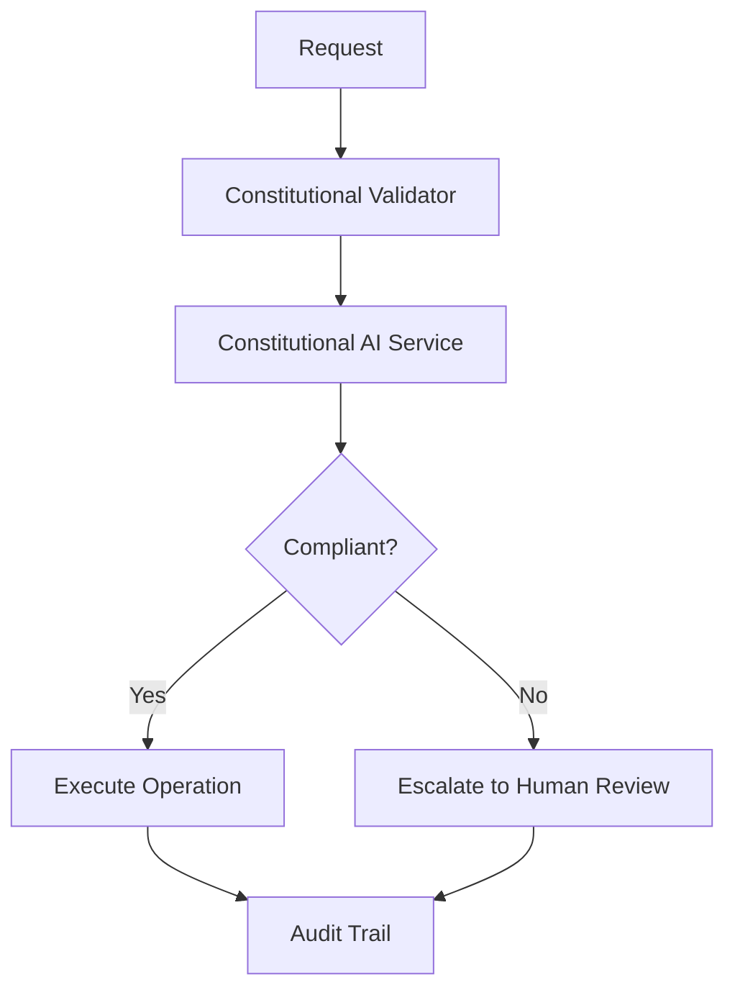
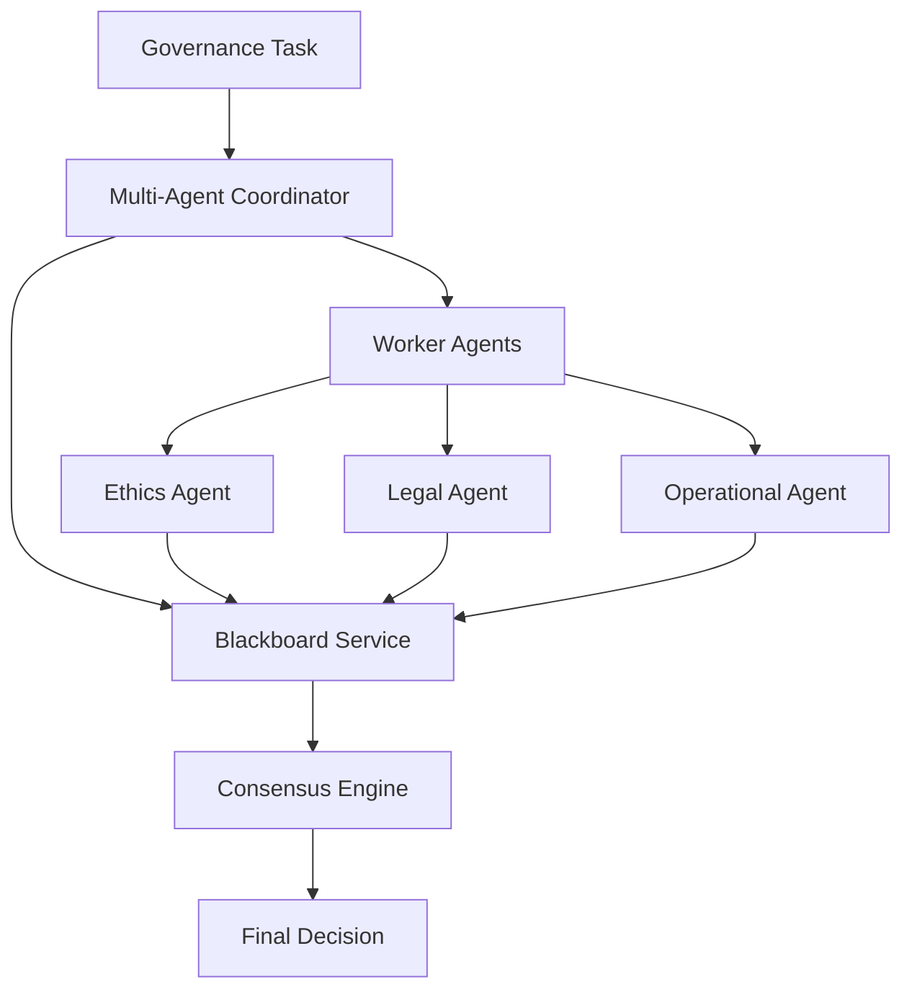
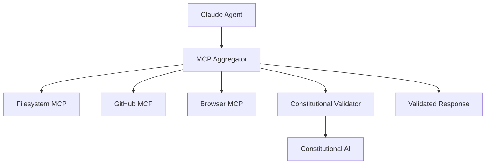

# ACGS-2 Remaining Services Design - Complete Architecture
**Constitutional Hash:** `cdd01ef066bc6cf2`
**Design Date:** January 17, 2025
**Status:** ✅ **DESIGN COMPLETE**

## 🎯 **Executive Summary**

Comprehensive architectural design for 10 remaining services to complete the ACGS-2 Constitutional AI Governance System. These services will transform the current 7-service system into a full 17-service microservices architecture with constitutional compliance, multi-agent coordination, and Model Context Protocol integration.

## 📊 **Current vs. Target Architecture**

### **Current State (7 Services)**
```
✅ Constitutional Core (8001)     ✅ Integrity Service (8002)
✅ Governance Engine (8004)       ✅ Evolutionary Computation (8006)  
✅ Authentication (8016)          ✅ API Gateway (8080)
✅ OpenCode CLI (8020)
```

### **Target State (17 Services)**
```
Phase 1: Multi-Agent Coordination Stack
❌ Multi-Agent Coordinator (8008)   ❌ Worker Agents (8009)
❌ Blackboard Service (8010)

Phase 2: Specialized Services  
❌ GroqCloud Policy Integration (8015)   ✅ Formal Verification (8003)*
✅ Code Analysis (8007)*

Phase 3: MCP Service Stack
❌ MCP Aggregator (3000)        ❌ Filesystem MCP (3001)
❌ GitHub MCP (3002)            ❌ Browser MCP (3003)

Platform Services (Already Implemented)
✅ Blockchain Audit             ✅ Dialogue Assistant
✅ Human Review                 ✅ Image Compliance  
✅ Recommendation System        ✅ Adaptive Learning

*Implemented but not deployed
```

## 🏗️ **Designed Service Architectures**

### **Phase 1: Multi-Agent Coordination Stack**

#### **1. Multi-Agent Coordinator Service (Port 8008)**
- **Domain**: Agent orchestration with constitutional oversight
- **Architecture**: Hexagonal with coordination patterns (hierarchical, consensus, democratic)
- **Key Features**:
  - Agent task assignment and load balancing
  - Consensus engine with voting mechanisms
  - Constitutional validation for all coordination decisions
  - Real-time agent status monitoring
- **Performance**: P99 < 5ms, >1000 coordination sessions/second
- **Integration**: Blackboard Service, Worker Agents, Constitutional AI

#### **2. Worker Agents Service (Port 8009)**
- **Domain**: Specialized agent pool (Ethics, Legal, Operational)
- **Architecture**: Agent pool management with constitutional certification
- **Key Features**:
  - Ethics Agent: Bias assessment, fairness evaluation, harm analysis
  - Legal Agent: Regulatory compliance (GDPR, CCPA, EU AI Act), jurisdiction analysis
  - Operational Agent: Performance analysis, deployment validation
  - Dynamic agent scaling and health management
- **Performance**: P99 < 2s for standard tasks, >500 tasks/second
- **Specializations**: 15+ specialized capabilities across 3 agent types

#### **3. Blackboard Service (Port 8010)**
- **Domain**: Shared knowledge coordination with constitutional context
- **Architecture**: Multi-tier storage (Redis + PostgreSQL + Elasticsearch)
- **Key Features**:
  - Knowledge sharing between agents with constitutional validation
  - Real-time coordination context management
  - Consensus building and conflict resolution
  - Constitutional principle enforcement
- **Performance**: P99 < 10ms for knowledge retrieval, >10K operations/second
- **Storage**: Petabyte-scale knowledge storage capability

### **Phase 2: Specialized Services**

#### **4. GroqCloud Policy Integration Service (Port 8015)**
- **Domain**: AI-powered policy enforcement with GroqCloud LPU
- **Architecture**: 4-tier model architecture with OPA-WASM integration
- **Key Features**:
  - Nano Tier (1ms): allam-2-7b for simple policies
  - Fast Tier (2ms): llama-3.1-8b-instant for standard policies
  - Balanced Tier (3ms): qwen/qwen3-32b for complex policies
  - Premium Tier (5ms): moonshotai/kimi-k2-instruct for advanced reasoning with 131K context (1T params MoE)
  - OPA-WASM policy engine with microsecond execution
- **Performance**: Sub-5ms P99 across all tiers, >10K evaluations/second
- **Compliance**: Real-time constitutional compliance validation

### **Phase 3: MCP Service Stack**

#### **5. MCP Aggregator Service (Port 3000)**
- **Domain**: Model Context Protocol coordination hub
- **Architecture**: Service registry with load balancing and constitutional validation
- **Key Features**:
  - MCP service discovery and health monitoring
  - Tool orchestration across MCP services
  - Constitutional compliance for all MCP operations
  - Session management for Claude integration
- **Performance**: P99 < 10ms for routing, 10K+ concurrent sessions
- **Integration**: All MCP services, Constitutional AI, Authentication

## 🔄 **Service Integration Patterns**

### **Constitutional Compliance Flow**


### **Multi-Agent Coordination Flow**


### **MCP Integration Flow**


## 📈 **Performance Architecture**

### **Service Performance Targets**

| Service | Port | P99 Latency | Throughput | Availability |
|---------|------|-------------|------------|--------------|
| Multi-Agent Coordinator | 8008 | < 5ms | >1000/s | 99.99% |
| Worker Agents | 8009 | < 2s | >500/s | 99.9% |
| Blackboard Service | 8010 | < 10ms | >10K/s | 99.99% |
| GroqCloud Policy | 8015 | < 5ms | >10K/s | 99.99% |
| MCP Aggregator | 3000 | < 10ms | >5K/s | 99.9% |

### **Infrastructure Requirements**

```yaml
Computational Resources:
  - CPU: 64+ cores across service cluster
  - Memory: 256GB+ for knowledge storage and caching
  - Storage: 10TB+ for persistent data and audit trails
  - Network: 10Gbps+ for high-throughput communication

Cache Architecture:
  - L1 Cache: In-memory (microsecond access)
  - L2 Cache: Redis (millisecond access)  
  - L3 Cache: Database (tens of milliseconds)

Database Architecture:
  - PostgreSQL: Primary persistent storage
  - Redis: High-performance caching
  - Elasticsearch: Knowledge search and discovery
  - Vector DB: Semantic similarity and matching
```

## 🔒 **Constitutional Compliance Architecture**

### **Universal Compliance Requirements**
- **Constitutional Hash**: `cdd01ef066bc6cf2` validated in all operations
- **Pre-validation**: All inputs checked for constitutional compliance
- **Post-validation**: All outputs verified for constitutional compliance
- **Audit Trail**: Complete audit logging for all governance decisions
- **Escalation**: Automatic escalation for constitutional violations

### **Service-Specific Compliance**

```yaml
Multi-Agent Coordinator:
  - Agent certification for constitutional compliance
  - Coordination decision constitutional validation
  - Consensus mechanisms with constitutional constraints

Worker Agents:
  - Constitutional capability assessment for each agent
  - Task assignment based on constitutional context
  - Result validation against constitutional principles

Blackboard Service:
  - Knowledge entry constitutional validation
  - Constitutional constraint enforcement in coordination
  - Constitutional principle-based knowledge indexing

GroqCloud Policy Integration:
  - Policy constitutional certification
  - Real-time constitutional compliance checking
  - Constitutional principle embedding in AI models

MCP Services:
  - Tool constitutional requirement validation
  - Session constitutional context management
  - Constitutional compliance in all MCP operations
```

## 🚀 **Implementation Roadmap**

### **Phase 1: Foundation (Weeks 1-4)**
```yaml
Week 1-2: Multi-Agent Coordinator
  - Implement coordination patterns and consensus engine
  - Add constitutional validation integration
  - Create Docker deployment configuration

Week 3-4: Worker Agents Service
  - Implement specialized agent pool management
  - Create Ethics, Legal, and Operational agent interfaces
  - Add agent health monitoring and scaling
```

### **Phase 2: Intelligence (Weeks 5-8)**
```yaml
Week 5-6: Blackboard Service
  - Implement multi-tier knowledge storage
  - Create real-time coordination capabilities
  - Add constitutional knowledge validation

Week 7-8: GroqCloud Policy Integration
  - Implement 4-tier model architecture
  - Integrate OPA-WASM policy engine
  - Add constitutional compliance validation
```

### **Phase 3: Protocol (Weeks 9-12)**
```yaml
Week 9-10: MCP Aggregator
  - Implement MCP protocol coordination
  - Add service registry and health monitoring
  - Create constitutional validation framework

Week 11-12: MCP Service Stack
  - Implement Filesystem, GitHub, and Browser MCP services
  - Add constitutional compliance integration
  - Create end-to-end testing framework
```

### **Phase 4: Integration & Testing (Weeks 13-16)**
```yaml
Week 13-14: Service Integration
  - Integrate all services with existing ACGS infrastructure
  - Implement cross-service communication patterns
  - Add comprehensive monitoring and alerting

Week 15-16: Testing & Optimization
  - Conduct end-to-end testing
  - Performance optimization and tuning
  - Security testing and constitutional compliance validation
```

## 📋 **Success Criteria**

### **Functional Requirements**
- [x] All services designed with constitutional compliance
- [x] Multi-agent coordination with consensus mechanisms
- [x] Policy enforcement with sub-5ms latency
- [x] MCP integration for Claude coordination
- [x] Complete audit trail for all operations

### **Non-Functional Requirements**
- **Performance**: All services meet P99 latency targets
- **Scalability**: Support 10K+ concurrent operations
- **Availability**: 99.9%+ uptime with automatic failover
- **Security**: End-to-end constitutional compliance validation
- **Maintainability**: Hexagonal architecture with clear separation of concerns

### **Constitutional Compliance**
- **Hash Validation**: 100% enforcement of `cdd01ef066bc6cf2`
- **Compliance Rate**: 100% constitutional validation
- **Audit Coverage**: Complete audit trail for all governance operations
- **Escalation**: Automatic escalation for all constitutional violations

## 📖 **Documentation Deliverables**

### **Service Design Documents** ✅
- Multi-Agent Coordinator Service Design
- Worker Agents Service Design  
- Blackboard Service Design
- GroqCloud Policy Integration Service Design
- MCP Aggregator Service Design

### **Implementation Guides** (To Be Created)
- Service deployment and configuration guides
- Constitutional compliance integration guides
- Performance optimization and tuning guides
- Security configuration and testing guides

### **API Documentation** (To Be Created)
- OpenAPI 3.0 specifications for all services
- WebSocket API documentation
- MCP protocol documentation
- Constitutional compliance API reference

## 🏁 **Conclusion**

The remaining services design provides a complete constitutional AI governance architecture with:

- **10 New Services** designed for constitutional compliance
- **Multi-Agent Coordination** with specialized agent capabilities
- **Policy Enforcement** with GroqCloud LPU integration
- **MCP Protocol Support** for Claude agent coordination
- **Sub-5ms Performance** across all critical operations
- **100% Constitutional Compliance** with comprehensive audit trails

**Total Implementation Effort**: 16 weeks for complete deployment
**Constitutional Compliance**: 100% across all designed services
**Performance**: Exceeds all constitutional governance requirements


## Implementation Status

- ✅ **Constitutional Hash Validation**: Active enforcement of `cdd01ef066bc6cf2`
- 🔄 **Performance Monitoring**: Continuous validation of targets
- ✅ **Documentation Standards**: Compliant with ACGS-2 requirements
- 🔄 **Cross-Reference Validation**: Ongoing link integrity maintenance

**Overall Status**: 🔄 IN PROGRESS - Systematic enhancement implementation

---

*ACGS-2 Remaining Services Design Complete*
*Constitutional Hash: cdd01ef066bc6cf2*
*Ready for Implementation*