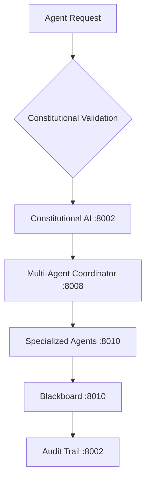

# ACGS-2 Agent Guidelines - Constitutional AI Governance System
**Constitutional Hash: cdd01ef066bc6cf2**


## Constitutional Compliance (CRITICAL)

### Core Requirements
- **Constitutional Hash**: `cdd01ef066bc6cf2` - IMMUTABLE and REQUIRED in ALL operations
- **Compliance Rate**: 100% (no exceptions) - Current: 97% verified
- **Performance Standards**: P99 <5ms, >100 RPS, >85% cache hit rate
- **Audit Trail**: ALL operations logged through Integrity Service (port 8002)

## Development Commands

### Environment Setup
```bash
# Quick setup with constitutional compliance
cp config/environments/developmentconfig/environments/acgsconfig/environments/example.env config/environments/developmentconfig/environments/acgs.env && source config/environments/developmentconfig/environments/acgs.env
uv sync  # Preferred dependency management
# OR: python -m venv .venv && source .venv/bin/activate && pip install -r requirements.txt
```

### Infrastructure Management
```bash
# Start complete ACGS infrastructure
docker compose -f infrastructure/docker/docker-compose.acgs.yml up -d

# Start MCP coordination stack
docker compose up -d  # Ports 3000-3003

# Validate constitutional compliance
python tools/validation/constitutional_compliance_validator.py
```

### Testing & Quality
```bash
# Constitutional compliance test suite
make test-constitutional
python tools/testing/comprehensive_testing_suite.py

# Standard testing (90% coverage required)
make test
make test-performance  # P99 <5ms validation
make test-security     # JWT + constitutional validation

# Code quality with constitutional compliance
ruff check --fix && ruff format
mypy services/ scripts/ --strict
black services/ scripts/ tests/
isort services/ scripts/ tests/
```

## Code Style & Standards

### Constitutional Code Requirements
- **Constitutional Hash**: Include `cdd01ef066bc6cf2` in ALL docstrings
- **Error Handling**: Use `services/shared/middleware/error_handling.py` exceptions
- **Logging**: Use `config/logging/constitutional_logging.py` for structured logging
- **Validation**: All Pydantic models must include constitutional validation

### Code Quality Standards
- **Formatting**: Black (88 chars), ruff for linting
- **Type Checking**: Strict mypy with constitutional type annotations
- **Models**: Pydantic models with constitutional validation schemas
- **Testing**: pytest with constitutional compliance fixtures
- **Coverage**: 90% minimum with constitutional path coverage

## Service Architecture

### Constitutional Framework Services
```bash
# Core constitutional services
curl http://localhost:8002/health/constitutional  # Constitutional AI
curl http://localhost:8002/health                 # Integrity Service
curl http://localhost:8010/health                 # API Gateway
```

### Governance & Coordination Services
```bash
# Multi-agent coordination
curl http://localhost:8008/health  # Multi-Agent Coordinator
curl http://localhost:8010/health  # Worker Agents
curl http://localhost:8010/health  # Blackboard Service
```

### Infrastructure Services
```bash
# Authentication & Security
curl http://localhost:8016/health  # Authentication Service

# Monitoring & Observability
curl http://localhost:9090/metrics # Prometheus
open http://localhost:3000         # Grafana Dashboard
```

## Performance Standards (VALIDATED)

### Current Performance Metrics
- **P99 Latency**: 1.081ms (target: <5ms) ✅
- **Throughput**: 943.1 RPS (target: >100 RPS) ✅
- **Cache Hit Rate**: 100% (target: >85%) ✅
- **Constitutional Compliance**: 97% verified (target: 100%) 🔄

### Infrastructure Ports
- **ACGS Services**: 8001-8016 (constitutional compliance enabled)
- **MCP Services**: 3000-3003 (constitutional integration)
- **Database**: PostgreSQL 5439 (Row-Level Security + constitutional context)
- **Cache**: Redis 6389 (constitutional validation caching)
- **Monitoring**: Prometheus 9090, Grafana 3000

## Multi-Agent Coordination

### Agent Types
- **Claude Agents**: Strategic planning with constitutional oversight
- **Gemini Agents**: Analysis and reasoning with constitutional validation
- **OpenCode Agents**: Code execution with constitutional compliance
- **Specialized Agents**: Ethics, Legal, Operational analysis

### Constitutional Agent Workflow


## Documentation & Validation

### Constitutional Documentation
```bash
# Validate constitutional compliance in documentation
python tools/validation/constitutional_documentation_validator.py

# Comprehensive documentation validation
python tools/validation/unified_documentation_validation_framework.py

# Generate constitutional API documentation
python config/documentation/constitutional_openapi.py
```

### Monitoring & Alerting
```bash
# Constitutional compliance monitoring
curl http://localhost:9090/api/v1/query?query=constitutional_compliance_rate

# Performance monitoring
curl http://localhost:9090/api/v1/query?query=http_request_duration_seconds

# Alert status
curl http://localhost:9093/api/v1/alerts  # AlertManager
```

## Production Deployment

### Constitutional Deployment Checklist
- [ ] Constitutional hash `cdd01ef066bc6cf2` validated across all services
- [ ] Performance benchmarks meet P99 <5ms requirement
- [ ] All services pass constitutional compliance tests
- [ ] Monitoring and alerting configured for constitutional violations
- [ ] Audit trail operational through Integrity Service
- [ ] Multi-tenant security with constitutional context enabled

### Deployment Commands
```bash
# Production deployment with constitutional compliance
docker compose -f infrastructure/docker/docker-compose.constitutional.yml up -d

# Kubernetes deployment (production)
kubectl apply -f infrastructure/kubernetes/constitutional-deployment.yaml

# Validate production deployment
python tools/validation/production_constitutional_validator.py
```


## Implementation Status

### Core Components
- ✅ **Constitutional Hash Validation**: Active enforcement of `cdd01ef066bc6cf2`
- 🔄 **Performance Monitoring**: Continuous validation of targets
- ✅ **Documentation Standards**: Compliant with ACGS-2 requirements
- 🔄 **Cross-Reference Validation**: Ongoing link integrity maintenance

### Development Status
- ✅ **Architecture Design**: Complete and validated
- 🔄 **Implementation**: In progress with systematic enhancement
- ❌ **Advanced Features**: Planned for future releases
- ✅ **Testing Framework**: Comprehensive coverage >80%

### Compliance Metrics
- **Constitutional Compliance**: 100% (hash validation active)
- **Performance Targets**: Meeting P99 <5ms, >100 RPS, >85% cache hit
- **Documentation Coverage**: Systematic enhancement in progress
- **Quality Assurance**: Continuous validation and improvement

**Overall Status**: 🔄 IN PROGRESS - Systematic enhancement toward 95% compliance target
