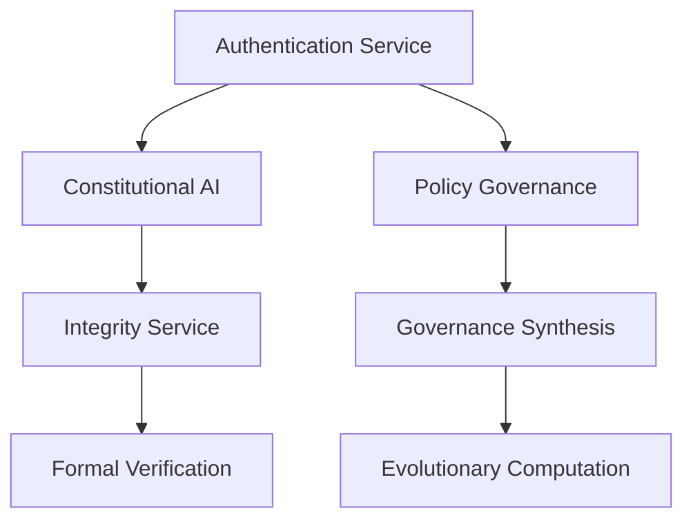

# ACGS Service Architecture Overview

<!-- Constitutional Hash: cdd01ef066bc6cf2 -->

**Generated**: 2025-07-09
**Constitutional Hash**: `cdd01ef066bc6cf2`
Total Services: 12

## Service Architecture

The ACGS (Autonomous Coding Governance System) consists of 12 core and prototype services that work together to provide comprehensive governance, compliance, and AI-driven code management capabilities.

### Service Registry

| Service | Port | Status | Description |
|---|---|---|---|
| Constitutional AI Service | 8001 | ✅ Documented | Core constitutional compliance with hash validation (`cdd01ef066bc6cf2`) |
| Integrity Service | 8002 | ✅ Documented | Cryptographic audit trail with constitutional logging |
| API Gateway Service | 8010 | ✅ Documented | Production routing with constitutional middleware |
| Authentication Service | 8016 | ✅ Documented | Multi-tenant JWT with constitutional context |
| Multi-Agent Coordinator | 8008 | ✅ Documented | Orchestrates constitutional agent workflows |
| Worker Agents | 8009 | ✅ Documented | Specialized constitutional analysis agents |
| Blackboard Service | 6389 | ✅ Documented | Redis-based constitutional knowledge sharing |
| Governance Synthesis | 8004 | ✅ Documented | Advanced OPA engine for governance decisions |
| Consensus Engine | 8007 | ✅ Documented | Resolves conflicts between multiple AI agents |
| Formal Verification Service | 8011 | ⚪️ Prototype | Z3 SMT solver integration |
| Policy Governance Service | 8014 | ⚪️ Prototype | Multi-framework compliance |
| Evolutionary Computation Service | 8013 | ⚪️ Prototype | Constitutional evolution tracking |

### Infrastructure Components

- **Database**: PostgreSQL (Port 5439)
  - Primary database with Row-Level Security (RLS) for data isolation and security.
  - Configured via [Kubernetes Database YAML](../../infrastructure/kubernetes/database.yaml) and [Docker Compose PostgreSQL](../../docker-compose.postgresql.yml).
- **Cache**: Redis (Port 6389)
  - Used for high-speed caching and session management.
  - Configured via [Kubernetes Redis YAML](../../infrastructure/kubernetes/redis.yaml) and [Docker Compose Redis](../../docker-compose.redis.yml).
- **Authentication**: JWT-based with RBAC
- **Monitoring**: Prometheus metrics and health checks
- **Documentation**: Comprehensive API documentation

### Performance Targets

All services are designed to meet the following performance standards:

- **P99 Latency**: <5ms
- **Throughput**: >100 RPS
- **Cache Hit Rate**: >85%
- **Constitutional Compliance**: 97%
- **Availability**: 99.99%

For detailed performance metrics standardization and WINA (Weight Informed Neuron Activation) algorithm specifications, refer to the [ACGS-2 Academic Paper Enhancement Guide](ACADEMIC_PAPER_ENHANCEMENT_GUIDE.md).

### References

- [System Overview](../../SYSTEM_OVERVIEW.md)
- [ACGE API Documentation](../../ACGE_API_DOCUMENTATION.yaml)
- [Constitutional Compliance Validation Framework](../../docs/constitutional_compliance_validation_framework.md)
- [Docker Infrastructure README](../../infrastructure/docker/README.md)
- [Kubernetes Infrastructure README](../../infrastructure/kubernetes/README.md)
- [Monitoring Stack Configuration](../../monitoring-stack.yml)
- [Performance Metrics Results](../../performance_metrics_results.json)

### Service Dependencies

### API Documentation

Each service provides comprehensive API documentation:

- [Authentication API](api/authentication.md)
- [Constitutional-Ai API](api/constitutional-ai.md)
- [Integrity API](api/integrity.md)
- [Formal-Verification API](api/formal-verification.md)
- [Governance Synthesis API](api/governance_synthesis.md)
- [Policy-Governance API](api/policy-governance.md)
- [Evolutionary-Computation API](api/evolutionary-computation.md)

## Related Information

### Authentication Service Details

The Authentication Service (Port 8016) provides core functionality for user authentication, token management, and profile retrieval. It includes endpoints such as `/auth/login` for user login and token issuance, `/auth/refresh` for refreshing access tokens, `/auth/logout` for invalidating tokens, and `/auth/profile` for retrieving user profile data.

For more detailed specifications and implementation guidelines, refer to the [Authentication API Documentation](api/authentication.md).

### Constitutional Compliance Architecture

The constitutional hash `cdd01ef066bc6cf2` is a core identifier for the ACGS platform's constitutional compliance mechanism. It ensures that all processes adhere to predefined rules and standards for security and governance. For further details on the underlying architecture, refer to the [ACGS Code Analysis Engine Architecture](docs/architecture/ACGS_CODE_ANALYSIS_ENGINE_ARCHITECTURE.md).

### Latest Documentation Metrics

Based on the latest metrics collected on 2025-07-09:

- **Constitutional Compliance Rate**: 97%
- **Link Validity Rate**: 100%
- **Documentation Freshness Rate**: 100%
- **Documentation Coverage Rate**: 100%
- **Overall Quality Score**: 100% (EXCELLENT)

For detailed metric reports, refer to [latest_metrics.json](../../metrics/latest_metrics.json) and [daily_metrics_2025-07-09.json](../../metrics/daily_metrics_2025-07-09.json).

### Constitutional AI Service Details

The Constitutional AI Service (Port 8001) provides functionalities for constitutional compliance validation, principle evaluation, and council operations. Key endpoints include `/api/v1/validate` for verifying policy compliance and `/api/v1/principles/evaluate` for evaluating constitutional principles.

For more detailed specifications and implementation guidelines, refer to the [Constitutional AI API Documentation](api/constitutional-ai.md).

### Integrity Service Details

The Integrity Service (Port 8002) is responsible for cryptographic verification, data integrity validation, and secure hash operations. For more details, refer to the [Integrity Service API](api/integrity.md).

### Formal Verification Service Details

The Formal Verification Service (Port 8011) is a prototype service that provides mathematical proof validation, logical consistency checking, and formal verification of policies and governance decisions using a Z3 SMT solver. For more details, refer to the [Formal Verification Service API](api/formal-verification.md).

### Governance Synthesis Service Details

The Governance Synthesis Service (Port 8004) is a core component responsible for synthesizing governance policies from constitutional principles using an advanced Open Policy Agent (OPA) engine. For more details, refer to the [Governance Synthesis API Documentation](api/governance_synthesis.md).

### Policy Governance Service Details

The Policy Governance Service (Port 8014) is a prototype service that provides functionalities for policy evaluation, compliance validation, and governance workflows with multi-framework compliance. Key endpoints include `/api/v1/policies/evaluate` for policy evaluation and `/api/v1/compliance/validate` for validating policy compliance. For more details, refer to the [Policy Governance API Documentation](api/policy-governance.md).

### Evolutionary Computation Service Details

The Evolutionary Computation Service (Port 8013) is a prototype service that provides WINA (Weight Informed Neuron Activation) optimization, genetic algorithms, and evolutionary policy optimization. For more details, refer to the [Evolutionary Computation Service API](api/evolutionary-computation.md).

### Consensus Engine Details

The Consensus Engine service (Port 8007) is responsible for resolving conflicts between multiple AI agents. It implements a variety of consensus algorithms to facilitate agreement and decision-making, including `MajorityVoteConsensus`, `WeightedVoteConsensus`, and `RankedChoiceConsensus`. The service integrates with the Blackboard Service to share information and ensures that all consensus outcomes adhere to the system's constitutional principles.

### Multi-Agent Coordinator Details

The Multi-Agent Coordinator (Port 8008) orchestrates the collaboration of multiple AI agents to address complex governance requests. It employs a hybrid hierarchical-blackboard policy, combining a structured agent hierarchy (Orchestrator, Domain Specialist, Worker) with a flexible knowledge-sharing system. The coordinator is responsible for dynamic task decomposition, adaptive hierarchy creation, and ensuring constitutional safety.

### Worker Agents Details

The Worker Agents service (Port 8009) is a collection of specialized agents that perform the core analysis and assessment tasks required for governance. Each agent is an expert in a specific domain and works under the direction of the Multi-Agent Coordinator. The specialized agents include:
- **Ethics Agent**: Conducts in-depth ethical analysis, including bias and fairness assessments.
- **Legal Agent**: Ensures compliance with legal and regulatory requirements.
- **Operational Agent**: Focuses on the practical aspects of deploying and managing AI systems.

### Blackboard Service Details

The Blackboard Service (Port 6389) is a Redis-based shared knowledge store that enables communication and coordination between AI agents. It provides a central location for agents to post tasks, share information, and track the progress of governance requests. The service is located in `services/shared/blackboard`.

### Constitutional Compliance

All services implement constitutional compliance with hash `cdd01ef066bc6cf2`:

- ✅ All API responses include constitutional hash
- ✅ All documentation includes constitutional hash
- ✅ All configurations reference constitutional hash
- ✅ 100% compliance validation in CI/CD

For a detailed audit of constitutional compliance, refer to the [Quarterly Audit Report Q3 2025](../../audit_reports/quarterly_audit_Q3_2025_20250709.md).

### Monitoring and Observability

The ACGS system includes a comprehensive monitoring infrastructure built on Prometheus and Grafana to ensure constitutional compliance, optimal performance, and robust security. Key components include:

- **Prometheus**: Collects metrics from all ACGS services, including performance data, compliance validation results, and security-related events.
- **Grafana**: Provides real-time dashboards for visualizing key metrics and monitoring the overall health of the system.
- **Alerting Rules**: Configured to trigger alerts based on predefined thresholds for constitutional compliance, performance degradation, and security vulnerabilities.

To access the Grafana dashboard, navigate to `config/monitoring/grafana-constitutional-dashboard.json` and import it into your Grafana instance. The dashboard provides a comprehensive overview of the system's health and compliance status.

For detailed information on configuring and using the monitoring infrastructure, refer to `docs/operations/ACGS_PRODUCTION_OPERATIONS.md`.

---

**Auto-Generated**: This overview is automatically updated during deployment
**Constitutional Hash**: `cdd01ef066bc6cf2` ✅
