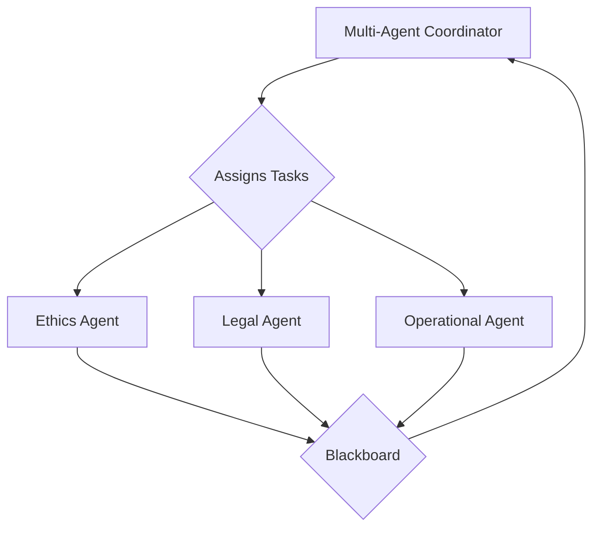

# Worker Agents Service API

<!-- Constitutional Hash: cdd01ef066bc6cf2 -->

## 1. Overview

This document provides comprehensive documentation for the **Worker Agents Service (Port 8009)** API. This service provides specialized constitutional analysis agents.

- **Service Name**: Worker Agents Service
- **Port**: 8009
- **Base URL**: `/api/v1`

## 2. Agent Roles and Responsibilities

The Worker Agents service is a collection of specialized agents that perform the core analysis and assessment tasks required for governance. Each agent is an expert in a specific domain, and they work under the direction of the Multi-Agent Coordinator.

### 2.1. Ethics Agent

- **Responsibilities**: Conducts in-depth ethical analysis, including:
  - **Bias Assessment**: Detecting and evaluating demographic and algorithmic bias.
  - **Fairness Evaluation**: Assessing the fairness of models and their outcomes.
  - **Harm Assessment**: Identifying and analyzing potential harms to individuals and society.

### 2.2. Legal Agent

- **Responsibilities**: Ensures that all activities and decisions comply with legal and regulatory requirements, including:
  - **Regulatory Compliance**: Analyzing compliance with frameworks such as GDPR, CCPA, and the EU AI Act.
  - **Jurisdiction Analysis**: Evaluating legal requirements across different jurisdictions.
  - **Contractual Compliance**: Ensuring adherence to contractual obligations and service level agreements (SLAs).

### 2.3. Operational Agent

- **Responsibilities**: Focuses on the practical aspects of deploying and managing AI systems, including:
  - **Operational Validation**: Verifying that systems meet operational requirements.
  - **Performance Analysis**: Analyzing the performance and efficiency of models and infrastructure.
  - **Implementation Planning**: Creating detailed plans for deployment, monitoring, and rollback.

## 3. Interaction Model

Worker Agents are event-driven and do not expose a traditional REST API. They claim tasks from the **Blackboard Service** and execute them based on their specialization. Their performance and constitutional compliance are measured as part of the overall system's performance and governance framework.

## 4. Error Handling

Standard HTTP status codes are used. All error responses include a constitutional compliance validation status.

- `400 Bad Request`: Invalid request parameters.
- `401 Unauthorized`: Authentication required.
- `403 Forbidden`: Insufficient permissions.
- `404 Not Found`: Resource not found.
- `500 Internal Server Error`: Server error.

## 5. Related Information

- [ACGS Service Architecture Overview](../ACGS_SERVICE_OVERVIEW.md)
- [ACGS System Overview](../../SYSTEM_OVERVIEW.md)
