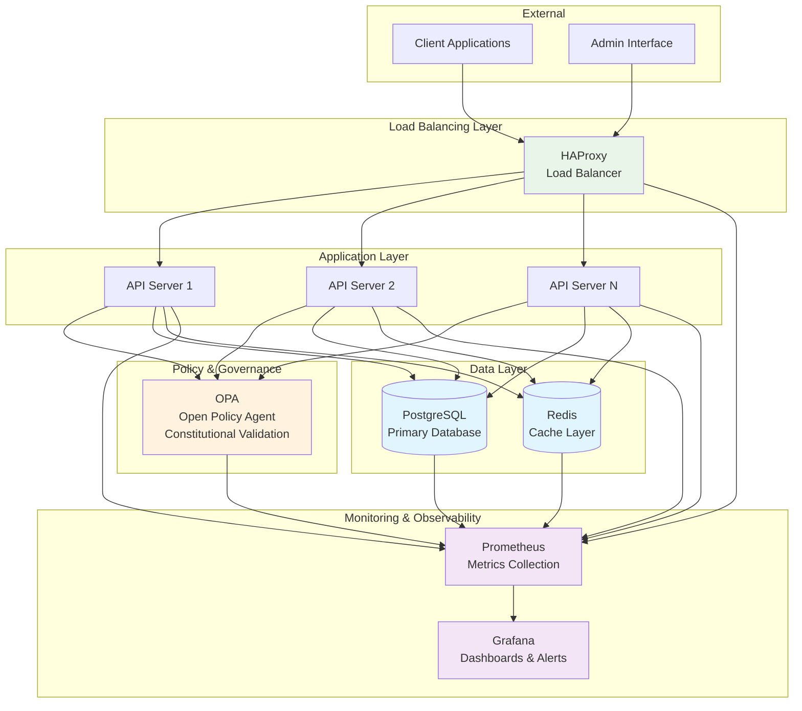

# ACGS-2 Infrastructure Diagram

## High-Level Architecture

## Component Responsibilities

### Load Balancing Layer
- **HAProxy**: Distributes incoming requests across multiple API servers
- Implements health checks and failover mechanisms
- Provides SSL termination and request routing

### Application Layer
- **API Servers**: Handle business logic and request processing
- Implement constitutional validation through OPA integration
- Manage database connections and caching strategies

### Policy & Governance
- **OPA (Open Policy Agent)**: Enforces constitutional guardrails
- Validates all requests against defined policies
- Ensures 100% compliance rate requirement

### Data Layer
- **PostgreSQL**: Primary data persistence with ACID guarantees
- **Redis**: High-performance caching layer for sub-5ms response times

### Monitoring & Observability
- **Prometheus**: Collects and stores metrics from all components
- **Grafana**: Provides real-time dashboards and alerting

## Performance Targets

| Metric | Target | Critical Threshold |
|--------|--------|-------------------|
| P99 Latency | ≤ 5ms | ≤ 2ms (cached) |
| Throughput | ≥ 100 RPS | Goal: 1,000 RPS |
| Cache Hit Rate | ≥ 85% | Must maintain |
| Compliance Rate | 100% | Zero tolerance |

## Constitutional Guardrails

All components must validate against constitutional hash: `cdd01ef066bc6cf2`

- **Zero-tolerance policy violations**: Any compliance failure triggers immediate escalation
- **Performance monitoring**: Continuous validation of latency and throughput targets
- **Audit trail**: Complete traceability of all decisions and actions
- **Fail-safe mechanisms**: Automatic escalation when guardrails are violated
