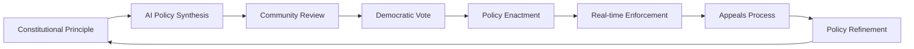

# 🌟 Quantumagi Community Guide

**Welcome to the future of on-chain governance!**

---

## 🎯 **What is Quantumagi?**

Quantumagi is the world's first **on-chain constitutional governance framework** that combines:

- 🏛️ **Constitutional Foundation**: Immutable constitutional principles stored on-chain
- 🤖 **AI-Powered Policy Synthesis**: Advanced algorithms generate policies from principles
- 🗳️ **Democratic Governance**: Community voting on all policy proposals
- ⚡ **Real-time Enforcement**: Instant compliance checking for all actions
- ⚖️ **Fair Appeals Process**: Multi-tier review with human oversight

---

## 🚀 **Getting Started**

### **For Community Members**

#### **1. Understanding the Basics**
- **Constitution**: The foundational document that defines your community's values
- **Policies**: Specific rules derived from constitutional principles
- **Voting**: Democratic process to approve or reject policies
- **Compliance**: Real-time checking that all actions follow active policies
- **Appeals**: Process to challenge policy violations

#### **2. Participating in Governance**

**Voting on Policies:**
```
1. New policy proposed → Community notification
2. Review policy details → Understand implications
3. Cast your vote → "For" or "Against"
4. Policy enacted → If majority approves
```

**Submitting Appeals:**
```
1. Policy violation detected → System notification
2. Believe it's incorrect? → Submit appeal
3. Provide evidence → Support your case
4. Committee review → Fair resolution process
```

### **For DAO Leaders**

#### **1. Setting Up Quantumagi**

**Constitutional Setup:**
1. Draft your community's constitutional principles
2. Hash the document for on-chain storage
3. Initialize the Quantumagi system
4. Set governance parameters

**Policy Development:**
1. Use the GS Engine to synthesize policies from principles
2. Submit policies for community voting
3. Enact approved policies
4. Monitor compliance and appeals

#### **2. Best Practices**

**Constitutional Design:**
- ✅ Keep principles clear and actionable
- ✅ Ensure broad community input
- ✅ Plan for future amendments
- ✅ Balance flexibility with stability

**Policy Management:**
- ✅ Start with essential policies only
- ✅ Test policies in staging environment
- ✅ Provide clear explanations to community
- ✅ Monitor policy effectiveness

---

## 🏛️ **Governance Process**

### **The Quantumagi Governance Cycle**



### **Roles and Responsibilities**

#### **Constitutional Authority**
- Initialize and amend constitution
- Enact approved policies
- Handle emergency situations
- Ensure system integrity

#### **Community Members**
- Vote on policy proposals
- Submit appeals when needed
- Participate in discussions
- Propose constitutional amendments

#### **Appeal Committees**
- Review complex appeals
- Provide expert judgment
- Ensure fair resolution
- Maintain community trust

#### **Developers**
- Integrate Quantumagi with existing systems
- Build governance tools
- Contribute to codebase
- Support community needs

---

## 🗳️ **Voting Guide**

### **How to Vote**

#### **Using the Web Interface**
1. Connect your Solana wallet
2. Navigate to "Active Proposals"
3. Review policy details and implications
4. Click "Vote For" or "Vote Against"
5. Confirm transaction in wallet
6. Track voting progress in real-time

#### **Using the CLI**
```bash
# List active proposals
quantumagi proposals list

# Vote on a proposal
quantumagi vote --policy-id 1 --vote for

# Check your voting history
quantumagi votes history
```

### **Voting Best Practices**

#### **Before Voting**
- 📖 Read the full policy text
- 🤔 Consider long-term implications
- 💬 Participate in community discussions
- 🔍 Check for conflicts with existing policies
- ⚖️ Evaluate fairness and enforceability

#### **Voting Considerations**
- **Safety First**: Prioritize community safety and security
- **Democratic Values**: Respect minority opinions and rights
- **Practical Implementation**: Consider technical feasibility
- **Future Flexibility**: Allow for reasonable amendments
- **Community Consensus**: Seek broad agreement when possible

---

## ⚖️ **Appeals Process**

### **When to Submit an Appeal**

#### **Valid Reasons for Appeals**
- ✅ **System Error**: Technical malfunction caused incorrect violation
- ✅ **New Evidence**: Additional information that changes the situation
- ✅ **Process Error**: Procedural mistakes in policy enforcement
- ✅ **Constitutional Challenge**: Policy conflicts with constitution

#### **Invalid Reasons**
- ❌ **Disagreement with Policy**: Use voting process instead
- ❌ **Convenience**: Appeals aren't for avoiding consequences
- ❌ **Frivolous Claims**: Waste community resources

### **Appeal Process Steps**

#### **1. Submit Appeal**
```
Required Information:
- Policy ID being appealed
- Detailed violation description
- Supporting evidence (documents, screenshots, etc.)
- Appeal type (system error, new evidence, etc.)
```

#### **2. Automated Review**
```
AI Review Process:
- Analyze appeal details
- Check against policy rules
- Evaluate evidence quality
- Generate confidence score
- Recommend: Approve, Reject, or Escalate
```

#### **3. Human Committee Review** (if escalated)
```
Committee Process:
- Expert review of complex cases
- Consider community impact
- Evaluate precedent implications
- Make final binding decision
- Document reasoning for transparency
```

#### **4. Resolution and Enforcement**
```
Possible Outcomes:
- Appeal Approved: Violation overturned
- Appeal Rejected: Original decision stands
- Modified Approval: Partial relief granted
- Policy Update: Rule clarification needed
```

---

## 🛠️ **Tools and Resources**

### **Official Tools**

#### **Quantumagi Dashboard**
- Real-time governance overview
- Policy status and voting progress
- Appeal tracking and management
- Community metrics and analytics

#### **Mobile App** (Coming Soon)
- Vote on proposals from anywhere
- Receive governance notifications
- Quick appeal submission
- Offline policy review

#### **CLI Tools**
```bash
# Install Quantumagi CLI
npm install -g @quantumagi/cli

# Basic commands
quantumagi status          # System overview
quantumagi proposals       # List proposals
quantumagi vote           # Cast votes
quantumagi appeals        # Manage appeals
quantumagi policies       # View active policies
```

### **Community Resources**

#### **Documentation**
- [Developer Guide](./DEVELOPER_GUIDE.md)
- [API Reference](./API_REFERENCE.md)
- [Deployment Guide](./DEPLOYMENT_GUIDE.md)
- [Security Best Practices](./SECURITY.md)

#### **Community Channels**
- 💬 **Discord**: [discord.gg/quantumagi](https://discord.gg/quantumagi)
- 🐦 **Twitter**: [@quantumagi](https://twitter.com/quantumagi)
- 📧 **Newsletter**: [newsletter.quantumagi.org](https://newsletter.quantumagi.org)
- 📺 **YouTube**: [youtube.com/quantumagi](https://youtube.com/quantumagi)

#### **Educational Content**
- 🎓 **Governance Academy**: Learn governance best practices
- 📚 **Case Studies**: Real-world implementation examples
- 🎥 **Video Tutorials**: Step-by-step guides
- 📖 **Whitepapers**: Technical deep dives

---

## 🎓 **Learning Path**

### **Beginner Track**
1. **Introduction to Blockchain Governance** (30 min)
2. **Understanding Constitutional Frameworks** (45 min)
3. **Your First Vote: A Hands-on Tutorial** (20 min)
4. **Appeals Process Walkthrough** (30 min)

### **Intermediate Track**
1. **Policy Analysis and Evaluation** (60 min)
2. **Community Leadership in DAOs** (45 min)
3. **Conflict Resolution Strategies** (40 min)
4. **Governance Token Economics** (50 min)

### **Advanced Track**
1. **Constitutional Design Principles** (90 min)
2. **AI-Assisted Policy Development** (75 min)
3. **Cross-Protocol Governance** (60 min)
4. **Governance Security and Risk Management** (80 min)

---

## 🤝 **Contributing to Quantumagi**

### **Ways to Contribute**

#### **Code Contributions**
- 🔧 Smart contract improvements
- 🌐 Frontend development
- 🐍 Client library enhancements
- 📱 Mobile app development

#### **Community Contributions**
- 📝 Documentation improvements
- 🎨 Design and UX enhancements
- 🌍 Translation and localization
- 🎓 Educational content creation

#### **Governance Contributions**
- 🏛️ Constitutional framework design
- 📋 Policy template development
- ⚖️ Appeal committee participation
- 🔍 Security auditing and testing

### **Getting Involved**

#### **Join the Community**
1. Join our Discord server
2. Introduce yourself in #introductions
3. Read the community guidelines
4. Start participating in discussions

#### **Contribute Code**
1. Fork the repository
2. Create a feature branch
3. Make your changes
4. Submit a pull request
5. Participate in code review

#### **Propose Improvements**
1. Open an issue on GitHub
2. Describe the problem or opportunity
3. Propose a solution
4. Gather community feedback
5. Implement if approved

---

## 🎉 **Success Stories**

### **Case Study: DeFi Protocol Governance**
*"Quantumagi helped us reduce governance disputes by 85% while increasing community participation by 300%."*

**Challenge**: Complex DeFi protocol with frequent governance conflicts
**Solution**: Constitutional framework with clear financial policies
**Results**: Streamlined decision-making and improved community trust

### **Case Study: NFT Community DAO**
*"The appeals process saved our community from a controversial decision that would have split us apart."*

**Challenge**: Contentious policy decision threatening community unity
**Solution**: Fair appeals process with expert committee review
**Results**: Peaceful resolution and stronger governance framework

### **Case Study: Gaming Guild Governance**
*"Real-time compliance checking eliminated 95% of rule violations before they happened."*

**Challenge**: Large gaming community with frequent rule violations
**Solution**: Proactive compliance checking with clear policies
**Results**: Better player experience and reduced moderation burden

---

## 📞 **Support and Help**

### **Getting Help**

#### **Community Support**
- 💬 **Discord #help**: Community-driven support
- 📧 **Email**: support@quantumagi.org
- 📚 **FAQ**: [faq.quantumagi.org](https://faq.quantumagi.org)

#### **Technical Support**
- 🐛 **Bug Reports**: [github.com/quantumagi/issues](https://github.com/quantumagi/issues)
- 🔧 **Developer Support**: dev-support@quantumagi.org
- 📖 **Documentation**: [docs.quantumagi.org](https://docs.quantumagi.org)

#### **Emergency Support**
- 🚨 **Critical Issues**: emergency@quantumagi.org
- 📞 **24/7 Hotline**: +1-555-QUANTUM
- 🔒 **Security Issues**: security@quantumagi.org

---

**🌟 Welcome to the Quantumagi Community!**

*Together, we're building the future of decentralized governance.*

---

*Last Updated: June 7, 2025*  
*Community Guide Version: 1.0.0*
