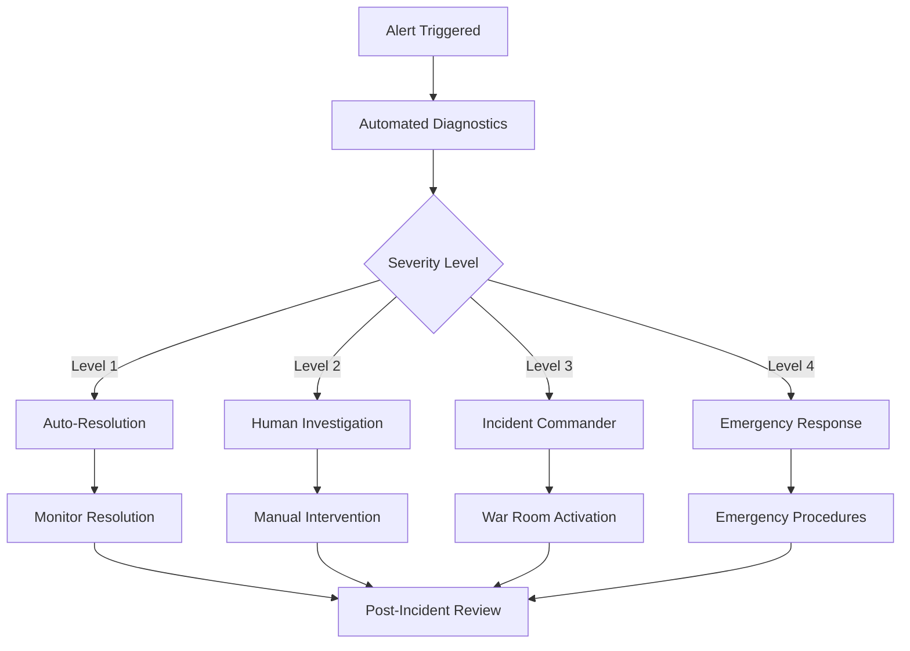

# ACGS-1 Lite Operational Runbook

**Constitutional Hash:** `cdd01ef066bc6cf2`  
**Version:** 1.0.0  
**Target Audience:** Site Reliability Engineers, DevOps Teams, Operations Staff

## 🎯 Overview

This operational runbook provides comprehensive procedures for deploying, monitoring, troubleshooting, and maintaining ACGS-1 Lite in production environments. Follow these procedures to ensure reliable operation and quick incident resolution.

## 📋 Quick Reference

### Emergency Contacts
- **Primary On-Call**: SRE Team
- **Secondary**: Development Team  
- **Escalation**: Technical Lead
- **Security Issues**: Security Team

### Critical Service Information
| Service | Port | Health Check | Restart Command |
|---------|------|-------------|-----------------|
| Policy Engine | 8004 | `GET /v1/data/acgs/main/health` | `docker-compose restart policy-engine` |
| Evolution Oversight | 8002 | `GET /health` | `docker-compose restart evolution-oversight` |
| Audit Engine | 8003 | `GET /health` | `docker-compose restart audit-engine` |
| Sandbox Controller | 8001 | `GET /health` | `docker-compose restart sandbox-controller` |

### Key Metrics Thresholds
- **P99 Latency**: <1ms (Policy Engine), <50ms (Other services)
- **Error Rate**: <0.1%
- **Cache Hit Rate**: >95%
- **CPU Utilization**: <80%
- **Memory Utilization**: <85%

## 🚀 Deployment Procedures

### Standard Deployment

#### Pre-deployment Checklist
```bash
# 1. Verify staging environment
curl -f https://staging.acgs.local/v1/data/acgs/main/health

# 2. Run deployment validation
cd /opt/acgs/services
./run_ci_validation.sh

# 3. Check resource availability
df -h  # Disk space
free -h  # Memory
top  # CPU load

# 4. Backup current state
./scripts/backup.sh

# 5. Notify stakeholders
# Send deployment notification via Slack/email
```

#### Deployment Steps
```bash
# 1. Pull latest code
cd /opt/acgs
git fetch origin
git checkout <release-tag>

# 2. Build new images
cd services
docker-compose -f docker-compose.prod.yml build

# 3. Deploy with rolling update
./scripts/rolling-deploy.sh

# 4. Verify deployment
./scripts/verify-deployment.sh

# 5. Monitor for 15 minutes
./scripts/monitor-post-deployment.sh
```

### Emergency Deployment (Hotfix)

#### Fast-track Deployment
```bash
# 1. Emergency backup
./scripts/emergency-backup.sh

# 2. Deploy critical fix
docker-compose -f docker-compose.prod.yml up -d --force-recreate <service-name>

# 3. Immediate verification
curl -f http://localhost:<port>/health

# 4. Monitor critical metrics
watch -n 5 'curl -s http://localhost:8004/v1/metrics | jq .p99_latency_ms'
```

### Rollback Procedures

#### Immediate Rollback
```bash
# 1. Stop current services
docker-compose -f docker-compose.prod.yml stop

# 2. Restore from backup
./scripts/restore-backup.sh <backup-timestamp>

# 3. Start previous version
docker-compose -f docker-compose.prod.yml up -d

# 4. Verify rollback
./scripts/verify-deployment.sh

# 5. Post-rollback monitoring
./scripts/monitor-post-rollback.sh
```

## 📊 Monitoring and Alerting

### Health Check Procedures

#### Automated Health Checks
```bash
#!/bin/bash
# /opt/acgs/scripts/health-check.sh

services=("policy-engine:8004" "evolution-oversight:8002" "audit-engine:8003" "sandbox-controller:8001")
failed_services=()

for service in "${services[@]}"; do
    name=$(echo $service | cut -d: -f1)
    port=$(echo $service | cut -d: -f2)
    
    if ! curl -sf http://localhost:$port/health > /dev/null; then
        failed_services+=($name)
        echo "❌ $name (port $port) - FAILED"
    else
        echo "✅ $name (port $port) - OK"
    fi
done

if [ ${#failed_services[@]} -gt 0 ]; then
    echo "CRITICAL: ${#failed_services[@]} service(s) failed health check"
    exit 1
else
    echo "All services healthy"
    exit 0
fi
```

#### Manual Health Verification
```bash
# Check all service health endpoints
curl http://localhost:8004/v1/data/acgs/main/health | jq .
curl http://localhost:8002/health | jq .
curl http://localhost:8003/health | jq .
curl http://localhost:8001/health | jq .

# Check infrastructure health
docker-compose ps
docker stats --no-stream
df -h
free -h
```

### Performance Monitoring

#### Key Performance Indicators (KPIs)
```bash
# Policy Engine Performance
curl -s http://localhost:8004/v1/metrics | jq '{
  p99_latency: .percentiles.p99,
  cache_hit_rate: .cache_hit_rate,
  requests_per_second: (.request_count / .uptime_seconds),
  targets_met: .targets_met
}'

# System Resource Usage
docker stats --format "table {{.Container}}\t{{.CPUPerc}}\t{{.MemUsage}}\t{{.NetIO}}\t{{.BlockIO}}"

# Database Performance
docker exec acgs-postgres psql -U acgs -d acgs_audit -c "
SELECT 
  schemaname,
  tablename,
  n_tup_ins as inserts,
  n_tup_upd as updates,
  n_tup_del as deletes
FROM pg_stat_user_tables;
"
```

### Alert Responses

#### High Latency Alert
```bash
# Alert: P99 latency > 5ms
echo "🚨 High Latency Alert Response"

# 1. Check current metrics
curl -s http://localhost:8004/v1/metrics | jq .percentiles

# 2. Check cache hit rate
curl -s http://localhost:8004/v1/metrics | jq .cache_hit_rate

# 3. Warm cache if needed
if [ $(curl -s http://localhost:8004/v1/metrics | jq .cache_hit_rate) < 0.9 ]; then
    curl http://localhost:8004/v1/cache/warm
    echo "Cache warming initiated"
fi

# 4. Check system resources
top -bn1 | head -20
docker stats --no-stream

# 5. Scale if necessary
if [ $(docker stats --format "{{.CPUPerc}}" acgs-policy-engine | sed 's/%//') > 80 ]; then
    docker-compose -f docker-compose.prod.yml up -d --scale policy-engine=3
    echo "Policy engine scaled to 3 replicas"
fi
```

#### Service Down Alert
```bash
# Alert: Service health check failed
echo "🚨 Service Down Alert Response"

# 1. Identify failed service
service_name="$1"  # Passed as parameter

# 2. Check container status
docker-compose ps $service_name

# 3. Check logs for errors
docker-compose logs --tail=50 $service_name

# 4. Attempt restart
docker-compose restart $service_name

# 5. Verify restart success
sleep 30
if curl -sf http://localhost:$(docker-compose port $service_name | cut -d: -f2)/health; then
    echo "✅ $service_name restart successful"
else
    echo "❌ $service_name restart failed - escalating"
    # Trigger escalation
fi
```

#### Constitutional Violation Alert
```bash
# Alert: Multiple constitutional violations detected
echo "🚨 Constitutional Violation Alert Response"

# 1. Query recent violations
curl -s "http://localhost:8003/audit/events?event_type=safety_violation&limit=10" | jq .

# 2. Check violation patterns
curl -s http://localhost:8004/v1/metrics | jq .safety_violations_total

# 3. Review policy engine logs
docker-compose logs --tail=100 policy-engine | grep -i violation

# 4. If systematic violations, implement emergency measures
violation_rate=$(curl -s http://localhost:8004/v1/metrics | jq .safety_violations_per_minute)
if [ "$violation_rate" -gt 10 ]; then
    echo "🚨 High violation rate detected - implementing emergency lockdown"
    # Enable strict mode
    docker-compose exec policy-engine curl -X POST http://localhost:8004/admin/enable-strict-mode
fi
```

## 🔧 Troubleshooting Guide

### Common Issues and Solutions

#### Issue: High Memory Usage
**Symptoms**: Container memory >90%, OOM kills, slow response times

**Diagnosis**:
```bash
# Check memory usage
docker stats --no-stream
docker exec <container> cat /proc/meminfo

# Check for memory leaks
docker exec <container> ps aux --sort=-%mem | head -10

# Check cache size
curl -s http://localhost:8004/v1/metrics | jq .cache_stats
```

**Resolution**:
```bash
# 1. Clear cache if oversized
curl -X POST http://localhost:8004/admin/clear-cache

# 2. Restart service if necessary
docker-compose restart <service-name>

# 3. Scale horizontally if persistent
docker-compose -f docker-compose.prod.yml up -d --scale <service-name>=2

# 4. Adjust memory limits
# Edit docker-compose.prod.yml memory limits
```

#### Issue: Database Connection Failures
**Symptoms**: 500 errors, connection timeouts, "database unavailable"

**Diagnosis**:
```bash
# Check PostgreSQL status
docker-compose ps postgres
docker-compose logs postgres

# Test connection
docker exec acgs-postgres pg_isready -U acgs

# Check connection count
docker exec acgs-postgres psql -U acgs -d acgs_audit -c "
SELECT count(*) as active_connections 
FROM pg_stat_activity 
WHERE state = 'active';
"
```

**Resolution**:
```bash
# 1. Restart PostgreSQL if unhealthy
docker-compose restart postgres

# 2. Kill hanging connections if needed
docker exec acgs-postgres psql -U acgs -d acgs_audit -c "
SELECT pg_terminate_backend(pid) 
FROM pg_stat_activity 
WHERE state = 'idle in transaction' 
AND state_change < current_timestamp - interval '1 hour';
"

# 3. Check and repair corruption if suspected
docker exec acgs-postgres pg_dump -U acgs acgs_audit > /tmp/backup_check.sql
```

#### Issue: Cache Performance Degradation
**Symptoms**: Cache hit rate <90%, increased latency, Redis errors

**Diagnosis**:
```bash
# Check Redis status
docker-compose ps redis
docker-compose logs redis

# Check Redis memory
docker exec acgs-redis redis-cli info memory

# Check cache statistics
curl -s http://localhost:8004/v1/metrics | jq '{
  cache_hit_rate: .cache_hit_rate,
  l1_hit_rate: .l1_hit_rate,
  l2_hit_rate: .l2_hit_rate
}'
```

**Resolution**:
```bash
# 1. Check Redis configuration
docker exec acgs-redis redis-cli config get maxmemory-policy

# 2. Warm cache
curl http://localhost:8004/v1/cache/warm

# 3. Restart Redis if necessary
docker-compose restart redis

# 4. Clear cache if corrupted
docker exec acgs-redis redis-cli flushall
curl http://localhost:8004/v1/cache/warm
```

#### Issue: Sandbox Execution Failures
**Symptoms**: Execution timeouts, permission denied, resource limits exceeded

**Diagnosis**:
```bash
# Check sandbox controller logs
docker-compose logs --tail=100 sandbox-controller

# Check available resources
docker system df
docker system events --since 10m

# Check gVisor/Firecracker status
docker exec acgs-sandbox-controller runsc --version
```

**Resolution**:
```bash
# 1. Clean up old containers
docker container prune -f

# 2. Restart sandbox controller
docker-compose restart sandbox-controller

# 3. Check and adjust resource limits
docker-compose exec sandbox-controller curl -s http://localhost:8001/admin/resource-usage

# 4. Verify runtime availability
docker exec acgs-sandbox-controller runsc list
```

### Escalation Procedures

#### Level 1: Automatic Resolution
- Service restart attempts
- Cache clearing and warming
- Basic resource cleanup

#### Level 2: Human Intervention Required
- Manual troubleshooting required
- Configuration changes needed
- Resource scaling decisions

#### Level 3: Critical Incident
- Multiple service failures
- Security incidents
- Data integrity issues
- Performance SLA violations

#### Level 4: Emergency Response
- System-wide outage
- Security breach
- Data loss scenarios
- Constitutional framework violations

### Incident Response Workflow



## 🔄 Maintenance Procedures

### Daily Maintenance Tasks

#### Automated Daily Tasks (via cron)
```bash
# /etc/cron.d/acgs-daily
0 2 * * * acgs /opt/acgs/scripts/daily-backup.sh
0 3 * * * acgs /opt/acgs/scripts/log-rotation.sh
0 4 * * * acgs /opt/acgs/scripts/cleanup-old-data.sh
0 5 * * * acgs /opt/acgs/scripts/health-check-report.sh
```

#### Manual Daily Checks
```bash
# Check service health
./scripts/health-check.sh

# Review overnight alerts
./scripts/alert-summary.sh

# Check resource utilization trends
./scripts/resource-report.sh

# Verify backup completion
./scripts/backup-status.sh
```

### Weekly Maintenance Tasks

#### Performance Review
```bash
# Generate weekly performance report
./scripts/weekly-performance-report.sh

# Check for performance degradation trends
./scripts/performance-trend-analysis.sh

# Review cache effectiveness
./scripts/cache-performance-review.sh

# Analyze slow queries
./scripts/database-performance-review.sh
```

#### Security Review
```bash
# Run security scans
./scripts/security-scan.sh

# Review audit logs for anomalies
./scripts/audit-log-analysis.sh

# Check for failed authentication attempts
./scripts/security-event-review.sh

# Update security configurations if needed
./scripts/security-update-check.sh
```

### Monthly Maintenance Tasks

#### Capacity Planning
```bash
# Resource utilization analysis
./scripts/capacity-planning-report.sh

# Growth trend analysis
./scripts/growth-trend-analysis.sh

# Cost optimization review
./scripts/cost-optimization-report.sh
```

#### Disaster Recovery Testing
```bash
# Test backup restoration
./scripts/test-backup-restore.sh

# Verify failover procedures
./scripts/test-failover.sh

# Update disaster recovery documentation
./scripts/update-dr-docs.sh
```

## 🚨 Emergency Procedures

### System-wide Outage Response

#### Immediate Actions (First 5 minutes)
```bash
# 1. Assess impact
./scripts/outage-assessment.sh

# 2. Activate incident response
./scripts/activate-incident-response.sh

# 3. Notify stakeholders
./scripts/notify-outage.sh

# 4. Attempt quick recovery
./scripts/emergency-recovery.sh
```

#### Short-term Actions (5-30 minutes)
```bash
# 1. Detailed diagnostics
./scripts/detailed-diagnostics.sh

# 2. Isolate failing components
./scripts/isolate-failures.sh

# 3. Implement workarounds
./scripts/implement-workarounds.sh

# 4. Prepare for extended outage if needed
./scripts/prepare-extended-outage.sh
```

### Security Incident Response

#### Security Breach Detected
```bash
# 1. Immediate containment
./scripts/security-containment.sh

# 2. Preserve evidence
./scripts/preserve-evidence.sh

# 3. Assess impact
./scripts/security-impact-assessment.sh

# 4. Notify security team
./scripts/notify-security-team.sh

# 5. Begin forensic analysis
./scripts/start-forensics.sh
```

#### Constitutional Violation Emergency
```bash
# 1. Enable emergency lockdown mode
curl -X POST http://localhost:8004/admin/emergency-lockdown

# 2. Review violation details
./scripts/analyze-constitutional-violations.sh

# 3. Implement additional safeguards
./scripts/implement-emergency-safeguards.sh

# 4. Notify constitutional oversight team
./scripts/notify-constitutional-team.sh
```

## 📋 Maintenance Checklists

### Pre-deployment Checklist
- [ ] Staging environment tested
- [ ] Performance validation passed
- [ ] Security scan completed
- [ ] Backup created
- [ ] Rollback plan prepared
- [ ] Stakeholders notified
- [ ] Monitoring alerts updated

### Post-deployment Checklist
- [ ] All services healthy
- [ ] Performance within SLOs
- [ ] No error rate spikes
- [ ] Cache hit rates normal
- [ ] Audit trails intact
- [ ] Monitoring functioning
- [ ] Documentation updated

### Monthly Review Checklist
- [ ] Performance trends analyzed
- [ ] Capacity planning updated
- [ ] Security review completed
- [ ] Backup integrity verified
- [ ] DR procedures tested
- [ ] Documentation updated
- [ ] Team training conducted

## 📞 Contact Information

### Emergency Contacts
- **SRE On-Call**: +1-555-SRE-TEAM
- **Development Lead**: +1-555-DEV-LEAD
- **Security Team**: security@company.com
- **Infrastructure Team**: infra@company.com

### Escalation Matrix
| Issue Type | Primary | Secondary | Escalation |
|------------|---------|-----------|------------|
| Performance | SRE Team | Dev Team | CTO |
| Security | Security Team | SRE Team | CISO |
| Constitutional | Legal Team | Dev Team | Chief Ethics Officer |
| Infrastructure | Infra Team | SRE Team | VP Engineering |

---

**Constitutional Hash:** `cdd01ef066bc6cf2`  
**Operational Runbook Version:** 1.0.0  
**Last Updated:** 2024-12-28  
**Next Review Date:** 2025-01-28