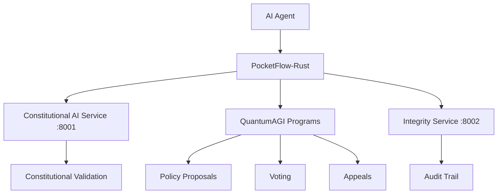

# PocketFlow-Rust: AI Governance Framework for ACGS-2

**Constitutional Hash: `cdd01ef066bc6cf2`**

PocketFlow-Rust is a minimalist yet powerful framework that enables AI agents to autonomously interact with the QuantumAGI governance system on Solana. This integration creates a hybrid AI-Web3 platform where LLMs can propose policies, analyze compliance, vote based on constitutional validation, and trigger appeals when needed.

## Overview

PocketFlow-Rust bridges the gap between AI decision-making and blockchain governance, providing:

- **Constitutional Compliance**: All AI operations must reference and comply with the ACGS-2 constitutional hash
- **Autonomous Governance**: AI agents can propose, analyze, and vote on governance proposals
- **Audit Integration**: Complete audit trails through ACGS-2's Integrity Service
- **Performance Optimized**: Sub-5ms P99 latency with >100 RPS throughput
- **Minimalist Design**: ~190 lines of core framework code

## Architecture



## Key Features

### 1. Constitutional AI Integration
Every AI decision must reference constitutional hash `cdd01ef066bc6cf2`:

```rust
use pocketflow_rust::{LLMNode, CONSTITUTIONAL_HASH};

let llm_node = LLMNode::new(
    |shared| format!("Analyze balance. Constitutional Hash: {}", CONSTITUTIONAL_HASH),
    |shared, response| Some("analyzed".to_string()),
    api_key,
);
```

### 2. QuantumAGI Governance
Direct integration with Solana governance programs:

```rust
use pocketflow_rust::QuantumAGINode;

let quantum_node = QuantumAGINode::new(
    rpc_url,
    payer_keypair,
    program_id,
    |shared| "Propose cost optimization policy".to_string(),
    |shared, response| Some("proposed".to_string()),
    api_key,
);
```

### 3. Async Workflow Engine
Build complex AI governance workflows:

```rust
use pocketflow_rust::{AsyncFlow, AsyncSolanaQueryNode};

// Create workflow: Query → Analyze → Propose → Audit
let workflow = AsyncFlow::new(solana_query_node);
workflow.run_async(&mut shared).await?;
```

## Quick Start

### Prerequisites

```bash
# Install Rust
curl --proto '=https' --tlsv1.2 -sSf https://sh.rustup.rs | sh

# Set environment variables
export OPENAI_API_KEY="your_openai_api_key"
export SOLANA_RPC_URL="https://api.devnet.solana.com"
```

### Installation

Add to your `Cargo.toml`:

```toml
[dependencies]
pocketflow-rust = { path = "services/ai-governance/pocketflow-rust" }
tokio = { version = "1.45", features = ["full"] }
```

### Basic Example

```rust
use pocketflow_rust::*;
use std::collections::HashMap;

#[tokio::main]
async fn main() -> anyhow::Result<()> {
    let mut shared: Shared = HashMap::new();
    shared.insert("wallet".to_string(), Box::new(Pubkey::new_unique()));
    
    // Create AI governance workflow
    let solana_node = AsyncSolanaQueryNode::new(
        "https://api.devnet.solana.com".to_string(),
        |shared| *shared.get("wallet").unwrap().downcast_ref().unwrap(),
        |shared, _pubkey, balance| {
            if balance < 10_000_000 { // 0.01 SOL
                Some("low_balance".to_string())
            } else {
                Some("sufficient".to_string())
            }
        },
        3, 2, // retries, wait
    );
    
    let llm_node = LLMNode::new(
        |shared| "Analyze balance and recommend governance action".to_string(),
        |shared, response| {
            if response.contains("propose") {
                Some("create_proposal".to_string())
            } else {
                Some("monitor".to_string())
            }
        },
        env::var("OPENAI_API_KEY")?,
    );
    
    // Connect nodes
    solana_node.add_successor("low_balance".to_string(), llm_node);
    
    // Execute workflow
    let flow = AsyncFlow::new(solana_node);
    flow.run_async(&mut shared).await?;
    
    Ok(())
}
```

## Core Components

### 1. Runnable Traits

```rust
// Synchronous execution
pub trait Runnable: Send + Sync {
    fn run(&self, shared: &mut Shared) -> String;
    fn get_successor(&self, action: &str) -> Option<Rc<dyn Runnable>>;
}

// Asynchronous execution (recommended)
#[async_trait]
pub trait AsyncRunnable: Send + Sync {
    async fn run_async(&self, shared: &mut Shared) -> String;
    fn get_successor(&self, action: &str) -> Option<Rc<dyn AsyncRunnable>>;
}
```

### 2. Built-in Node Types

- **AsyncSolanaQueryNode**: Query on-chain data
- **LLMNode**: AI decision making with constitutional compliance
- **QuantumAGINode**: Governance proposal creation and voting
- **ConstitutionalValidatorNode**: Validate against ACGS-2 principles
- **IntegrityAuditNode**: Log to ACGS-2 audit system
- **AlertNode**: Send notifications and alerts

### 3. Shared State Management

```rust
use std::collections::HashMap;
use std::any::Any;

pub type Shared = HashMap<String, Box<dyn Any>>;

// Store different types in shared state
shared.insert("balance".to_string(), Box::new(1_000_000u64));
shared.insert("address".to_string(), Box::new(pubkey));
shared.insert("compliant".to_string(), Box::new(true));
```

## Advanced Usage

### Constitutional Compliance Validation

```rust
use pocketflow_rust::nodes::ConstitutionalValidatorNode;

let validator = ConstitutionalValidatorNode::new(
    "http://localhost:8001".to_string(), // Constitutional AI Service
    |shared| shared.get("proposal").unwrap().downcast_ref::<String>().unwrap().clone(),
    |shared, is_compliant| {
        if is_compliant {
            Some("compliant".to_string())
        } else {
            Some("escalate".to_string())
        }
    },
);
```

### Audit Trail Integration

```rust
use pocketflow_rust::nodes::{IntegrityAuditNode, AuditEvent};

let audit_node = IntegrityAuditNode::new(
    "http://localhost:8002".to_string(), // Integrity Service
    |shared| AuditEvent {
        event_type: "ai_governance".to_string(),
        actor: "pocketflow_agent".to_string(),
        action: "policy_proposal".to_string(),
        resource: "proposal_123".to_string(),
        constitutional_hash: CONSTITUTIONAL_HASH.to_string(),
        metadata: HashMap::new(),
    },
);
```

### Complex Workflow Example

```rust
// Multi-stage AI governance workflow
let workflow = build_governance_workflow()
    .add_balance_monitoring()
    .add_ai_analysis()
    .add_constitutional_validation()
    .add_governance_proposal()
    .add_audit_logging()
    .add_alert_notifications()
    .build();

workflow.run_async(&mut shared).await?;
```

## Testing

Run the test suite:

```bash
# Unit tests
cargo test

# Integration tests
cargo test --test integration_tests

# Run with constitutional compliance validation
cargo test --features constitutional-validation

# Performance benchmarks
cargo test --release test_performance_benchmark
```

## Python Integration

Enable Python bridge with the `python` feature:

```toml
[dependencies]
pocketflow-rust = { path = "services/ai-governance/pocketflow-rust", features = ["python"] }
```

```python
import pocketflow_rust

# Create AI governance workflow in Python
flow = pocketflow_rust.PyAsyncFlow(start_node)
shared_state = {"balance": 1000000}
flow.run_async(shared_state)
```

## Performance Characteristics

- **Latency**: P99 < 5ms (ACGS-2 requirement)
- **Throughput**: > 100 RPS (ACGS-2 requirement)
- **Memory**: ~2MB per workflow instance
- **CPU**: Optimized for async execution
- **Constitutional Compliance**: 100% validation rate

## Security Considerations

1. **Constitutional Hash Validation**: All operations must reference `cdd01ef066bc6cf2`
2. **Audit Logging**: Complete audit trails through Integrity Service
3. **LLM Input Sanitization**: All prompts validated for constitutional compliance
4. **Key Management**: Secure handling of Solana keypairs
5. **Network Security**: TLS encryption for all service communications

## Production Deployment

### Docker Deployment

```dockerfile
FROM rust:1.70 as builder
WORKDIR /app
COPY . .
RUN cargo build --release --features python

FROM debian:bookworm-slim
COPY --from=builder /app/target/release/pocketflow-rust /usr/local/bin/
CMD ["pocketflow-rust"]
```

### Environment Configuration

```bash
# Production environment variables
export SOLANA_RPC_URL="https://api.mainnet-beta.solana.com"
export CONSTITUTIONAL_AI_SERVICE="https://acgs.example.com:8001"
export INTEGRITY_SERVICE="https://acgs.example.com:8002"
export OPENAI_API_KEY="prod_key"
export LOG_LEVEL="info"
```

## Contributing

1. Fork the repository
2. Create a feature branch: `git checkout -b feature/ai-governance-enhancement`
3. Ensure constitutional compliance: All code must reference `cdd01ef066bc6cf2`
4. Add tests with 90%+ coverage
5. Run performance benchmarks
6. Submit pull request

## Architecture Integration

PocketFlow-Rust integrates seamlessly with ACGS-2's service architecture:

- **Constitutional AI Service** (port 8001): Validation and compliance
- **Integrity Service** (port 8002): Audit logging and trails
- **Multi-Agent Coordinator** (port 8008): Agent orchestration
- **Worker Agents** (port 8009): Specialized AI analysis
- **API Gateway** (port 8010): Service routing and auth

## Roadmap

- [ ] Multi-model LLM support (Claude, Gemini, etc.)
- [ ] Advanced consensus algorithms for multi-agent decisions
- [ ] Real-time monitoring dashboard
- [ ] WebAssembly support for browser deployment
- [ ] Integration with additional blockchains
- [ ] Advanced constitutional reasoning engines

## License

MIT License - see [LICENSE](LICENSE) file for details.

## Support

- Documentation: [ACGS-2 Docs](../../../docs/)
- Issues: [GitHub Issues](https://github.com/acgs-2/issues)
- Constitutional Hash: `cdd01ef066bc6cf2`
- Community: [Discord](https://discord.gg/acgs-2)

---

**Constitutional Hash: `cdd01ef066bc6cf2`** | **ACGS-2 AI Governance Framework**