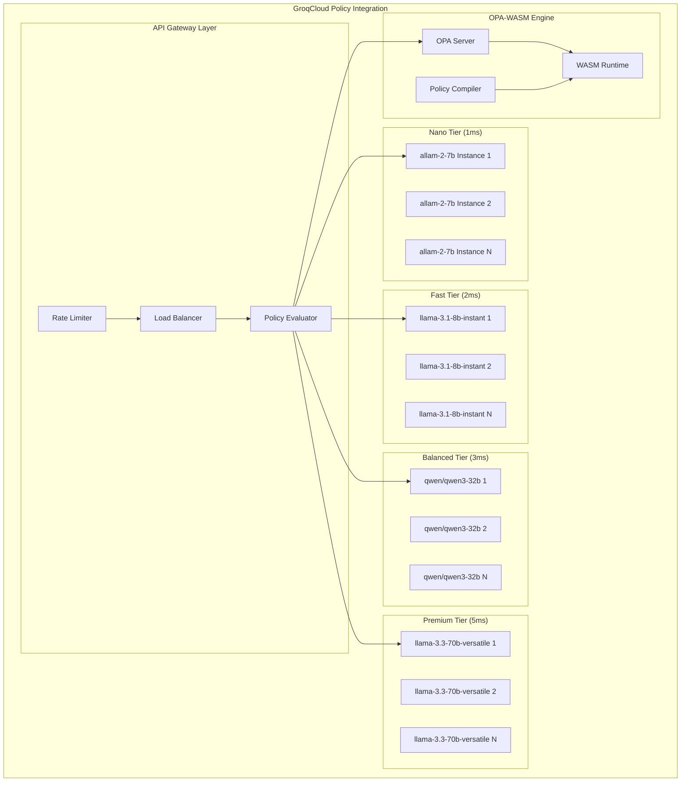

# GroqCloud Policy Integration Service Design
**Constitutional Hash:** `cdd01ef066bc6cf2`
**Port:** 8015
**Service Type:** AI Policy Enforcement with LPU

## Domain Model

### **Policy Entities**

```python
@dataclass
class PolicyRule:
    rule_id: UUID
    name: str
    constitutional_hash: str = "cdd01ef066bc6cf2"
    policy_type: PolicyType
    opa_policy: str  # OPA Rego policy
    wasm_bytecode: bytes  # Compiled WASM policy
    groq_model_config: GroqModelConfig
    constitutional_principles: List[str]
    performance_tier: PerformanceTier
    priority: int
    is_active: bool
    created_at: datetime
    updated_at: datetime

@dataclass
class GroqModelConfig:
    model_name: str
    performance_tier: PerformanceTier
    max_tokens: int
    temperature: float
    constitutional_prompt: str
    policy_context: str
    response_schema: str

@dataclass
class PolicyEvaluation:
    evaluation_id: UUID
    rule_id: UUID
    input_context: Dict[str, Any]
    groq_inference_result: GroqInferenceResult
    opa_evaluation_result: OPAResult
    constitutional_compliance: ConstitutionalValidation
    performance_metrics: PolicyPerformanceMetrics
    decision: PolicyDecision
    confidence_score: float
```

### **Performance Tiers**

```python
class PerformanceTier(Enum):
    NANO = "nano"      # 1ms target - allam-2-7b
    FAST = "fast"      # 2ms target - llama-3.1-8b-instant 
    BALANCED = "balanced"  # 3ms target - qwen/qwen3-32b
    PREMIUM = "premium"    # 5ms target - moonshotai/kimi-k2-instruct (131K context, 1T params MoE)
    REASONING = "reasoning"  # Variable - kimi-k2 for 200K context

class PolicyType(Enum):
    CONSTITUTIONAL_COMPLIANCE = "constitutional_compliance"
    DATA_GOVERNANCE = "data_governance"
    ETHICAL_CONSTRAINTS = "ethical_constraints"
    REGULATORY_COMPLIANCE = "regulatory_compliance"
    OPERATIONAL_POLICIES = "operational_policies"
    SECURITY_POLICIES = "security_policies"
    RISK_MANAGEMENT = "risk_management"

@dataclass
class PerformanceTargets:
    nano_tier: int = 1      # ms
    fast_tier: int = 2      # ms  
    balanced_tier: int = 3  # ms
    premium_tier: int = 5   # ms
    reasoning_tier: int = 1000  # ms for complex reasoning
```

## API Specification

### **Policy Management API**

```yaml
/api/v1/policies:
  post:
    summary: "Create new policy rule"
    requestBody:
      required: true
      content:
        application/json:
          schema:
            type: object
            properties:
              name:
                type: string
              policy_type:
                $ref: "#/components/schemas/PolicyType"
              opa_policy:
                type: string
                description: "OPA Rego policy definition"
              groq_model_config:
                $ref: "#/components/schemas/GroqModelConfig"
              constitutional_principles:
                type: array
                items:
                  type: string
              performance_tier:
                $ref: "#/components/schemas/PerformanceTier"
              constitutional_hash:
                type: string
                enum: ["cdd01ef066bc6cf2"]
    responses:
      201:
        content:
          application/json:
            schema:
              type: object
              properties:
                rule_id:
                  type: string
                  format: uuid
                wasm_compilation_status:
                  type: string
                  enum: ["success", "failed"]

  get:
    summary: "List policy rules"
    parameters:
      - name: policy_type
        in: query
        schema:
          $ref: "#/components/schemas/PolicyType"
      - name: performance_tier
        in: query
        schema:
          $ref: "#/components/schemas/PerformanceTier"
      - name: is_active
        in: query
        schema:
          type: boolean
    responses:
      200:
        content:
          application/json:
            schema:
              type: array
              items:
                $ref: "#/components/schemas/PolicyRule"

/api/v1/policies/{rule_id}/compile:
  post:
    summary: "Compile OPA policy to WASM bytecode"
    responses:
      200:
        content:
          application/json:
            schema:
              type: object
              properties:
                compilation_status:
                  type: string
                bytecode_size:
                  type: integer
                performance_estimate:
                  type: number
                  description: "Estimated execution time in microseconds"
```

### **Policy Evaluation API**

```yaml
/api/v1/evaluate:
  post:
    summary: "Evaluate policies against input context"
    requestBody:
      required: true
      content:
        application/json:
          schema:
            type: object
            properties:
              input_context:
                type: object
                description: "Context data for policy evaluation"
              policy_types:
                type: array
                items:
                  $ref: "#/components/schemas/PolicyType"
              performance_tier:
                $ref: "#/components/schemas/PerformanceTier"
              constitutional_hash:
                type: string
                enum: ["cdd01ef066bc6cf2"]
              require_explanation:
                type: boolean
                default: false
    responses:
      200:
        content:
          application/json:
            schema:
              type: object
              properties:
                evaluation_id:
                  type: string
                  format: uuid
                decision:
                  type: string
                  enum: ["allow", "deny", "review"]
                confidence_score:
                  type: number
                  minimum: 0
                  maximum: 1
                applicable_policies:
                  type: array
                  items:
                    type: string
                    format: uuid
                constitutional_compliance:
                  $ref: "#/components/schemas/ConstitutionalValidation"
                performance_metrics:
                  type: object
                  properties:
                    total_latency_ms:
                      type: number
                    groq_inference_time_ms:
                      type: number
                    opa_evaluation_time_ms:
                      type: number
                    wasm_execution_time_us:
                      type: number
                explanation:
                  type: string
                  description: "Policy evaluation reasoning (if requested)"

/api/v1/evaluate/batch:
  post:
    summary: "Batch evaluate multiple contexts"
    requestBody:
      required: true
      content:
        application/json:
          schema:
            type: object
            properties:
              batch_contexts:
                type: array
                items:
                  type: object
                max_batch_size: 100
              policy_types:
                type: array
                items:
                  $ref: "#/components/schemas/PolicyType"
              performance_tier:
                $ref: "#/components/schemas/PerformanceTier"
    responses:
      200:
        content:
          application/json:
            schema:
              type: object
              properties:
                batch_id:
                  type: string
                  format: uuid
                results:
                  type: array
                  items:
                    $ref: "#/components/schemas/PolicyEvaluation"
                batch_performance:
                  type: object
                  properties:
                    total_time_ms:
                      type: number
                    average_per_item_ms:
                      type: number
                    throughput_per_second:
                      type: number
```

### **GroqCloud Integration API**

```yaml
/api/v1/groq/models:
  get:
    summary: "List available GroqCloud models"
    responses:
      200:
        content:
          application/json:
            schema:
              type: object
              properties:
                models:
                  type: array
                  items:
                    type: object
                    properties:
                      model_name:
                        type: string
                      performance_tier:
                        $ref: "#/components/schemas/PerformanceTier"
                      max_tokens:
                        type: integer
                      cost_per_token:
                        type: number
                      typical_latency_ms:
                        type: number

/api/v1/groq/inference:
  post:
    summary: "Direct GroqCloud LPU inference"
    requestBody:
      required: true
      content:
        application/json:
          schema:
            type: object
            properties:
              model_name:
                type: string
              prompt:
                type: string
              constitutional_context:
                type: object
              max_tokens:
                type: integer
              temperature:
                type: number
                minimum: 0
                maximum: 2
    responses:
      200:
        content:
          application/json:
            schema:
              type: object
              properties:
                inference_result:
                  type: string
                model_used:
                  type: string
                performance_metrics:
                  type: object
                  properties:
                    inference_time_ms:
                      type: number
                    tokens_generated:
                      type: integer
                    tokens_per_second:
                      type: number
                constitutional_compliance:
                  type: boolean

/api/v1/opa/evaluate:
  post:
    summary: "Direct OPA-WASM policy evaluation"
    requestBody:
      required: true
      content:
        application/json:
          schema:
            type: object
            properties:
              policy_id:
                type: string
                format: uuid
              input_data:
                type: object
              use_wasm:
                type: boolean
                default: true
    responses:
      200:
        content:
          application/json:
            schema:
              type: object
              properties:
                result:
                  type: object
                execution_time_us:
                  type: number
                policy_version:
                  type: string
```

## Service Architecture

### **4-Tier Model Architecture**



### **Policy Evaluation Pipeline**

```python
class GroqCloudPolicyEvaluator:
    def __init__(self):
        self.groq_client = GroqCloudClient()
        self.opa_engine = OPAEngine()
        self.constitutional_validator = ConstitutionalValidator()
        self.performance_monitor = PerformanceMonitor()
    
    async def evaluate_policy(
        self, 
        input_context: Dict[str, Any],
        policy_types: List[PolicyType],
        performance_tier: PerformanceTier
    ) -> PolicyEvaluationResult:
        
        start_time = time.time()
        
        # 1. Select applicable policies
        applicable_policies = await self.policy_store.get_policies(
            policy_types=policy_types,
            performance_tier=performance_tier,
            is_active=True
        )
        
        # 2. Constitutional pre-validation
        constitutional_check = await self.constitutional_validator.pre_validate(
            input_context, applicable_policies
        )
        
        if not constitutional_check.is_compliant:
            return PolicyEvaluationResult(
                decision=PolicyDecision.DENY,
                reason="Constitutional pre-validation failed",
                violations=constitutional_check.violations
            )
        
        # 3. OPA-WASM evaluation (for structured policies)
        opa_results = await self.opa_engine.evaluate_batch(
            policies=[p.wasm_bytecode for p in applicable_policies],
            input_data=input_context
        )
        
        # 4. GroqCloud LPU inference (for complex reasoning)
        groq_results = await self.groq_client.evaluate_with_model(
            model_tier=performance_tier,
            constitutional_context=constitutional_check.context,
            input_context=input_context,
            policies=applicable_policies
        )
        
        # 5. Result synthesis
        final_decision = await self.synthesize_results(
            opa_results, groq_results, applicable_policies
        )
        
        # 6. Constitutional post-validation
        final_validation = await self.constitutional_validator.post_validate(
            final_decision, constitutional_check.context
        )
        
        # 7. Performance monitoring
        total_time = time.time() - start_time
        await self.performance_monitor.record_evaluation(
            performance_tier, total_time, len(applicable_policies)
        )
        
        return PolicyEvaluationResult(
            decision=final_decision,
            constitutional_compliance=final_validation,
            performance_metrics=PerformanceMetrics(
                total_latency_ms=total_time * 1000,
                target_achieved=total_time <= performance_tier.target_ms / 1000
            )
        )
```

## Implementation Strategy

### **GroqCloud Integration**

1. **Model Tier Selection**
   ```python
   class ModelTierSelector:
       def select_model(self, complexity: PolicyComplexity, latency_requirement: int) -> str:
           if latency_requirement <= 1:
               return "allam-2-7b"
           elif latency_requirement <= 2:
               return "llama-3.1-8b-instant"
           elif latency_requirement <= 3:
               return "qwen/qwen3-32b"
           elif latency_requirement <= 5:
               return "llama-3.3-70b-versatile"
           else:
               return "kimi-k2"  # For complex reasoning tasks
   ```

2. **LPU Optimization**
   - Pre-warmed model instances for sub-millisecond response
   - Connection pooling to GroqCloud API
   - Request batching for improved throughput
   - Circuit breaker for GroqCloud API failures

3. **OPA-WASM Integration**
   - Compiled WASM policies for microsecond execution
   - Policy compilation pipeline
   - WASM runtime optimization
   - Policy versioning and hot-swapping

### **Performance Optimization**

1. **Caching Strategy**
   ```python
   class PolicyCacheManager:
       def __init__(self):
           self.l1_cache = InMemoryCache(max_size=10000)  # Hot policies
           self.l2_cache = RedisCache()  # Warm policies
           self.l3_cache = PolicyStore()  # Cold policies
       
       async def get_policy_result(self, cache_key: str) -> Optional[PolicyResult]:
           # L1 Cache (in-memory) - < 1μs
           result = await self.l1_cache.get(cache_key)
           if result:
               return result
           
           # L2 Cache (Redis) - < 1ms
           result = await self.l2_cache.get(cache_key)
           if result:
               await self.l1_cache.set(cache_key, result)
               return result
           
           return None
   ```

2. **Request Routing**
   - Intelligent routing based on policy complexity
   - Load balancing across model tiers
   - Automatic fallback between tiers
   - Real-time performance monitoring

### **Constitutional Compliance**

- **Pre-evaluation Validation**: All inputs validated for constitutional compliance
- **Policy Certification**: All policies certified against constitutional principles
- **Post-evaluation Validation**: All outputs validated for constitutional compliance
- **Audit Trail**: Complete audit trail for all policy evaluations
- **Escalation**: Automatic escalation for constitutional violations

### **Performance Requirements**

- **Nano Tier**: P99 < 1ms for simple policies
- **Fast Tier**: P99 < 2ms for standard policies
- **Balanced Tier**: P99 < 3ms for complex policies
- **Premium Tier**: P99 < 5ms for advanced reasoning
- **Throughput**: > 10,000 evaluations/second
- **Availability**: 99.99% uptime with automatic failover


## Implementation Status

- ✅ **Constitutional Hash Validation**: Active enforcement of `cdd01ef066bc6cf2`
- 🔄 **Performance Monitoring**: Continuous validation of targets
- ✅ **Documentation Standards**: Compliant with ACGS-2 requirements
- 🔄 **Cross-Reference Validation**: Ongoing link integrity maintenance

**Overall Status**: 🔄 IN PROGRESS - Systematic enhancement implementation

## Performance Targets

This component maintains the following performance requirements:

- **P99 Latency**: <5ms (constitutional requirement)
- **Throughput**: >100 RPS (minimum operational standard)
- **Cache Hit Rate**: >85% (efficiency requirement)
- **Constitutional Compliance**: 100% (hash: cdd01ef066bc6cf2)

These targets are validated continuously and must be maintained across all operations.

---

*GroqCloud Policy Integration Service Design v1.0*
*Constitutional Hash: cdd01ef066bc6cf2*