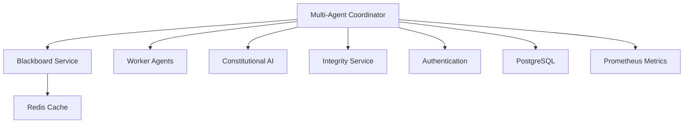

# Multi-Agent Coordinator Service Design
**Constitutional Hash:** `cdd01ef066bc6cf2`
**Port:** 8008
**Service Type:** Core Orchestration Service

## Domain Model

### **Core Entities**

```python
@dataclass
class AgentTask:
    id: UUID
    task_type: TaskType
    priority: Priority
    constitutional_hash: str = "cdd01ef066bc6cf2"
    status: TaskStatus
    assigned_agents: List[AgentId]
    context: Dict[str, Any]
    deadline: datetime
    created_at: datetime
    updated_at: datetime

@dataclass 
class AgentCoordination:
    coordination_id: UUID
    primary_agent: AgentId
    supporting_agents: List[AgentId]
    coordination_type: CoordinationType
    consensus_required: bool
    voting_threshold: float
    constitutional_compliance: ConstitutionalContext

@dataclass
class GovernanceDecision:
    decision_id: UUID
    decision_type: DecisionType
    agent_votes: Dict[AgentId, Vote]
    consensus_score: float
    constitutional_compliance: ConstitutionalValidation
    final_decision: Decision
    audit_trail: AuditTrail
```

### **Value Objects**

```python
class CoordinationType(Enum):
    HIERARCHICAL = "hierarchical"
    CONSENSUS = "consensus" 
    DEMOCRATIC = "democratic"
    EMERGENCY = "emergency"

class TaskType(Enum):
    ETHICS_REVIEW = "ethics_review"
    LEGAL_ANALYSIS = "legal_analysis"
    OPERATIONAL_VALIDATION = "operational_validation"
    CONSTITUTIONAL_COMPLIANCE = "constitutional_compliance"
    MULTI_STAKEHOLDER_DECISION = "multi_stakeholder_decision"
```

## API Specification

### **REST Endpoints**

```yaml
/api/v1/coordination:
  post:
    summary: "Create new agent coordination session"
    requestBody:
      $ref: "#/components/schemas/CoordinationRequest"
    responses:
      201:
        $ref: "#/components/schemas/CoordinationSession"

/api/v1/coordination/{id}/tasks:
  post:
    summary: "Assign task to coordination session"
    parameters:
      - name: id
        in: path
        schema:
          type: string
          format: uuid
    requestBody:
      $ref: "#/components/schemas/TaskAssignment"

/api/v1/coordination/{id}/consensus:
  post:
    summary: "Initiate consensus voting"
    requestBody:
      $ref: "#/components/schemas/ConsensusRequest"
    responses:
      200:
        $ref: "#/components/schemas/ConsensusResult"

/api/v1/agents/{agent_id}/status:
  get:
    summary: "Get agent status and availability"
    responses:
      200:
        $ref: "#/components/schemas/AgentStatus"

/api/v1/decisions:
  get:
    summary: "List governance decisions"
    parameters:
      - name: constitutional_hash
        in: query
        required: true
        schema:
          type: string
          enum: ["cdd01ef066bc6cf2"]
```

### **WebSocket Events**

```yaml
Agent Coordination Events:
  - agent.status.changed
  - task.assigned
  - task.completed
  - consensus.started
  - consensus.vote.received
  - decision.reached
  - constitutional.violation.detected

Real-time Channels:
  - /coordination/{session_id}
  - /agents/{agent_id}
  - /constitutional/compliance
```

## Service Architecture

### **Hexagonal Architecture**

```
┌─────────────────────────────────────────────────────────────┐
│                    Application Layer                        │
├─────────────────────────────────────────────────────────────┤
│ CoordinationService | ConsensusService | TaskOrchestrator   │
├─────────────────────────────────────────────────────────────┤
│                     Domain Layer                            │
├─────────────────────────────────────────────────────────────┤
│ AgentCoordination | GovernanceDecision | ConstitutionalRule │
├─────────────────────────────────────────────────────────────┤
│                  Infrastructure Layer                       │
├─────────────────────────────────────────────────────────────┤
│ PostgreSQL | Redis | Blackboard | Constitutional Validator  │
└─────────────────────────────────────────────────────────────┘
```

### **Service Dependencies**



## Implementation Strategy

### **Core Components**

1. **CoordinationOrchestrator**
   - Manages agent coordination sessions
   - Implements coordination patterns (hierarchical, consensus, democratic)
   - Handles task assignment and load balancing

2. **ConsensusEngine**
   - Implements voting mechanisms
   - Calculates consensus scores
   - Manages timeout and escalation

3. **TaskScheduler**
   - Prioritizes tasks based on urgency and constitutional requirements
   - Balances load across available agents
   - Monitors task completion and deadlines

4. **ConstitutionalValidator**
   - Validates all coordination decisions against constitutional principles
   - Ensures compliance throughout agent interactions
   - Triggers escalation for constitutional violations

### **Performance Requirements**

- **Latency**: P99 < 5ms for coordination decisions
- **Throughput**: > 1000 coordination sessions/second
- **Availability**: 99.99% uptime with circuit breakers
- **Consensus Time**: < 2 seconds for standard decisions
- **Agent Response Time**: < 500ms for status updates

### **Security & Compliance**

- **Constitutional Hash Validation**: All operations validate `cdd01ef066bc6cf2`
- **Agent Authentication**: JWT-based agent verification
- **Decision Audit**: Complete audit trail for all governance decisions
- **Access Control**: Role-based access for coordination capabilities
- **Encryption**: End-to-end encryption for sensitive coordination data


## Implementation Status

- ✅ **Constitutional Hash Validation**: Active enforcement of `cdd01ef066bc6cf2`
- 🔄 **Performance Monitoring**: Continuous validation of targets
- ✅ **Documentation Standards**: Compliant with ACGS-2 requirements
- 🔄 **Cross-Reference Validation**: Ongoing link integrity maintenance

**Overall Status**: 🔄 IN PROGRESS - Systematic enhancement implementation

## Performance Targets

This component maintains the following performance requirements:

- **P99 Latency**: <5ms (constitutional requirement)
- **Throughput**: >100 RPS (minimum operational standard)
- **Cache Hit Rate**: >85% (efficiency requirement)
- **Constitutional Compliance**: 100% (hash: cdd01ef066bc6cf2)

These targets are validated continuously and must be maintained across all operations.

---

*Multi-Agent Coordinator Service Design v1.0*
*Constitutional Hash: cdd01ef066bc6cf2*