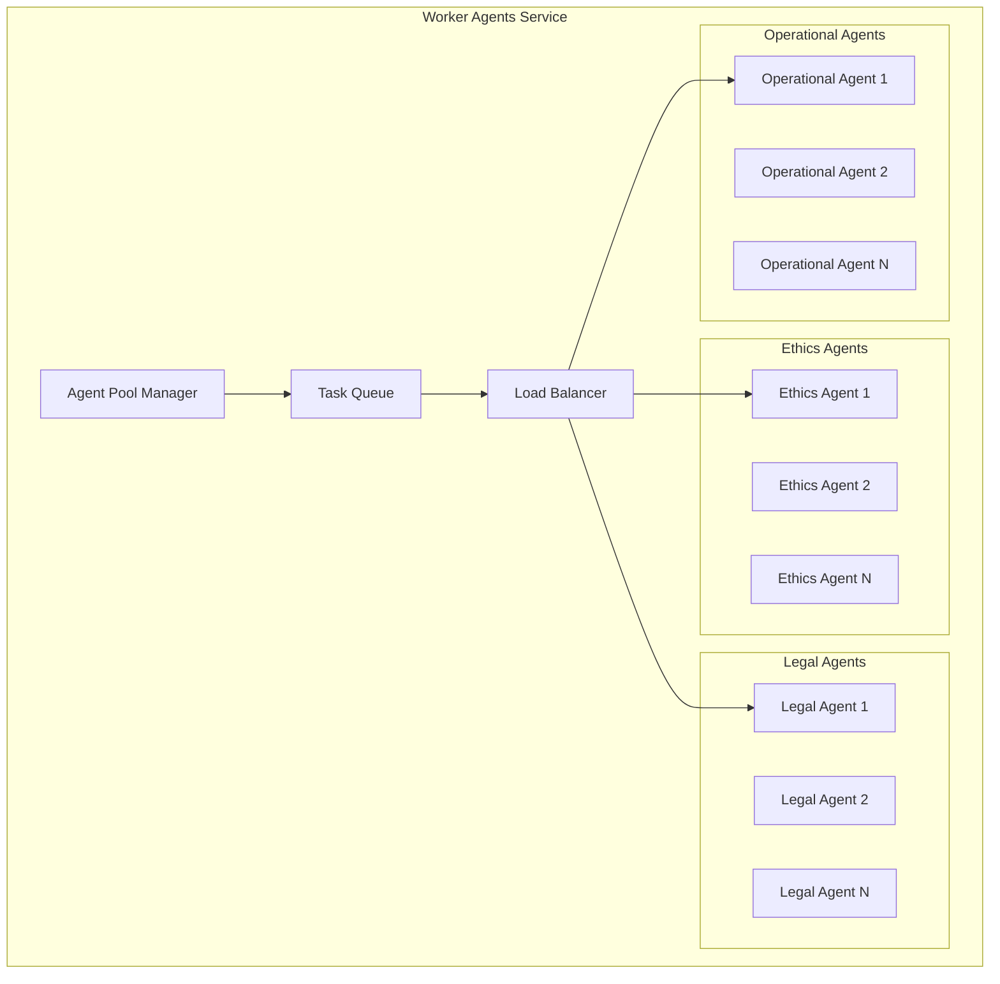

# Worker Agents Service Design
**Constitutional Hash:** `cdd01ef066bc6cf2`
**Port:** 8009
**Service Type:** Specialized Agent Pool

## Domain Model

### **Agent Entities**

```python
@dataclass
class SpecializedAgent:
    agent_id: UUID
    agent_type: AgentType
    specialization: List[str]
    current_capacity: int
    max_capacity: int
    performance_metrics: PerformanceMetrics
    constitutional_compliance_score: float
    status: AgentStatus
    last_activity: datetime

@dataclass
class AgentTask:
    task_id: UUID
    agent_id: UUID
    task_type: str
    constitutional_context: ConstitutionalContext
    input_data: Dict[str, Any]
    expected_output_schema: str
    deadline: datetime
    priority: Priority
    status: TaskStatus
    result: Optional[TaskResult]

@dataclass
class TaskResult:
    result_id: UUID
    task_id: UUID
    agent_id: UUID
    output_data: Dict[str, Any]
    confidence_score: float
    constitutional_compliance: ConstitutionalValidation
    execution_time: timedelta
    error_details: Optional[str]
```

### **Specialized Agent Types**

```python
class AgentType(Enum):
    ETHICS_AGENT = "ethics_agent"
    LEGAL_AGENT = "legal_agent" 
    OPERATIONAL_AGENT = "operational_agent"
    CONSTITUTIONAL_AGENT = "constitutional_agent"
    COMPLIANCE_AGENT = "compliance_agent"
    RISK_ASSESSMENT_AGENT = "risk_assessment_agent"

class EthicsCapabilities(Enum):
    BIAS_ASSESSMENT = "bias_assessment"
    FAIRNESS_EVALUATION = "fairness_evaluation"
    HARM_ANALYSIS = "harm_analysis"
    STAKEHOLDER_IMPACT = "stakeholder_impact"
    CULTURAL_SENSITIVITY = "cultural_sensitivity"

class LegalCapabilities(Enum):
    REGULATORY_COMPLIANCE = "regulatory_compliance"
    GDPR_ANALYSIS = "gdpr_analysis"
    CCPA_COMPLIANCE = "ccpa_compliance"
    EU_AI_ACT = "eu_ai_act"
    JURISDICTION_ANALYSIS = "jurisdiction_analysis"
    CONTRACT_COMPLIANCE = "contract_compliance"

class OperationalCapabilities(Enum):
    PERFORMANCE_ANALYSIS = "performance_analysis"
    SCALABILITY_ASSESSMENT = "scalability_assessment"
    RELIABILITY_EVALUATION = "reliability_evaluation"
    COST_OPTIMIZATION = "cost_optimization"
    DEPLOYMENT_VALIDATION = "deployment_validation"
```

## API Specification

### **Agent Management API**

```yaml
/api/v1/agents:
  get:
    summary: "List all available agents"
    parameters:
      - name: agent_type
        in: query
        schema:
          $ref: "#/components/schemas/AgentType"
      - name: available_only
        in: query
        schema:
          type: boolean
    responses:
      200:
        $ref: "#/components/schemas/AgentList"

/api/v1/agents/{agent_id}:
  get:
    summary: "Get agent details and status"
    responses:
      200:
        $ref: "#/components/schemas/AgentDetails"

/api/v1/agents/{agent_id}/capabilities:
  get:
    summary: "Get agent capabilities and specializations"
    responses:
      200:
        $ref: "#/components/schemas/AgentCapabilities"

/api/v1/tasks:
  post:
    summary: "Submit task to agent pool"
    requestBody:
      $ref: "#/components/schemas/TaskSubmission"
    responses:
      202:
        $ref: "#/components/schemas/TaskAccepted"

/api/v1/tasks/{task_id}:
  get:
    summary: "Get task status and results"
    responses:
      200:
        $ref: "#/components/schemas/TaskStatus"

/api/v1/tasks/{task_id}/results:
  get:
    summary: "Get detailed task results"
    responses:
      200:
        $ref: "#/components/schemas/TaskResult"
```

### **Ethics Agent Specialized API**

```yaml
/api/v1/ethics/bias-assessment:
  post:
    summary: "Perform bias assessment analysis"
    requestBody:
      required: true
      content:
        application/json:
          schema:
            type: object
            properties:
              model_data:
                type: object
              protected_attributes:
                type: array
                items:
                  type: string
              constitutional_hash:
                type: string
                enum: ["cdd01ef066bc6cf2"]
    responses:
      200:
        content:
          application/json:
            schema:
              type: object
              properties:
                bias_score:
                  type: number
                  minimum: 0
                  maximum: 1
                protected_group_analysis:
                  type: object
                recommendations:
                  type: array
                constitutional_compliance:
                  $ref: "#/components/schemas/ConstitutionalValidation"

/api/v1/ethics/fairness-evaluation:
  post:
    summary: "Evaluate fairness across demographic groups"
    requestBody:
      $ref: "#/components/schemas/FairnessRequest"
    responses:
      200:
        $ref: "#/components/schemas/FairnessReport"
```

### **Legal Agent Specialized API**

```yaml
/api/v1/legal/regulatory-compliance:
  post:
    summary: "Analyze regulatory compliance"
    requestBody:
      required: true
      content:
        application/json:
          schema:
            type: object
            properties:
              regulations:
                type: array
                items:
                  type: string
                  enum: ["GDPR", "CCPA", "EU_AI_ACT", "HIPAA"]
              data_processing_description:
                type: string
              jurisdiction:
                type: string
              constitutional_hash:
                type: string
                enum: ["cdd01ef066bc6cf2"]
    responses:
      200:
        content:
          application/json:
            schema:
              type: object
              properties:
                compliance_score:
                  type: number
                violations:
                  type: array
                  items:
                    $ref: "#/components/schemas/ComplianceViolation"
                recommendations:
                  type: array
                  items:
                    type: string

/api/v1/legal/jurisdiction-analysis:
  post:
    summary: "Analyze legal requirements across jurisdictions"
    requestBody:
      $ref: "#/components/schemas/JurisdictionRequest"
    responses:
      200:
        $ref: "#/components/schemas/JurisdictionAnalysis"
```

### **Operational Agent Specialized API**

```yaml
/api/v1/operational/performance-analysis:
  post:
    summary: "Analyze system performance requirements"
    requestBody:
      required: true
      content:
        application/json:
          schema:
            type: object
            properties:
              system_metrics:
                type: object
              performance_targets:
                type: object
                properties:
                  latency_p99_ms:
                    type: number
                    maximum: 5
                  throughput_rps:
                    type: number
                    minimum: 100
              constitutional_hash:
                type: string
                enum: ["cdd01ef066bc6cf2"]
    responses:
      200:
        content:
          application/json:
            schema:
              type: object
              properties:
                performance_score:
                  type: number
                bottlenecks:
                  type: array
                optimization_recommendations:
                  type: array
                constitutional_compliance:
                  type: boolean

/api/v1/operational/deployment-validation:
  post:
    summary: "Validate deployment readiness"
    requestBody:
      $ref: "#/components/schemas/DeploymentRequest"
    responses:
      200:
        $ref: "#/components/schemas/DeploymentValidation"
```

## Service Architecture

### **Agent Pool Management**



### **Task Processing Pipeline**

```python
class TaskProcessor:
    def __init__(self):
        self.constitutional_validator = ConstitutionalValidator()
        self.agent_selector = AgentSelector()
        self.result_aggregator = ResultAggregator()
    
    async def process_task(self, task: AgentTask) -> TaskResult:
        # 1. Constitutional validation
        validation = await self.constitutional_validator.validate(task)
        if not validation.is_compliant:
            raise ConstitutionalViolationError(validation.violations)
        
        # 2. Agent selection
        suitable_agents = await self.agent_selector.select_agents(
            task_type=task.task_type,
            required_capabilities=task.required_capabilities,
            constitutional_context=task.constitutional_context
        )
        
        # 3. Task execution
        agent = await self.select_optimal_agent(suitable_agents)
        result = await agent.execute_task(task)
        
        # 4. Result validation
        result_validation = await self.constitutional_validator.validate_result(result)
        
        # 5. Audit logging
        await self.audit_logger.log_task_execution(task, result, validation)
        
        return result
```

## Implementation Strategy

### **Agent Lifecycle Management**

1. **Agent Registration**
   - Dynamic agent discovery and registration
   - Capability assessment and certification
   - Performance baseline establishment

2. **Task Assignment**
   - Intelligent task routing based on agent specialization
   - Load balancing across agent pool
   - Priority-based task scheduling

3. **Performance Monitoring**
   - Real-time agent performance tracking
   - Constitutional compliance scoring
   - Automatic agent scaling

4. **Agent Health Management**
   - Health check monitoring
   - Automatic failover and recovery
   - Agent capacity management

### **Constitutional Integration**

- **Pre-task Validation**: All tasks validated for constitutional compliance
- **Agent Certification**: Agents certified for constitutional compliance capabilities
- **Result Validation**: All agent outputs validated against constitutional principles
- **Audit Trail**: Complete audit trail for all agent activities

### **Performance Requirements**

- **Task Processing**: P99 < 2 seconds for standard tasks
- **Agent Response**: < 500ms for agent status queries
- **Throughput**: > 500 tasks/second across agent pool
- **Availability**: 99.9% uptime with automatic failover
- **Constitutional Compliance**: 100% task validation


## Implementation Status

- ✅ **Constitutional Hash Validation**: Active enforcement of `cdd01ef066bc6cf2`
- 🔄 **Performance Monitoring**: Continuous validation of targets
- ✅ **Documentation Standards**: Compliant with ACGS-2 requirements
- 🔄 **Cross-Reference Validation**: Ongoing link integrity maintenance

**Overall Status**: 🔄 IN PROGRESS - Systematic enhancement implementation

## Performance Targets

This component maintains the following performance requirements:

- **P99 Latency**: <5ms (constitutional requirement)
- **Throughput**: >100 RPS (minimum operational standard)
- **Cache Hit Rate**: >85% (efficiency requirement)
- **Constitutional Compliance**: 100% (hash: cdd01ef066bc6cf2)

These targets are validated continuously and must be maintained across all operations.

---

*Worker Agents Service Design v1.0*
*Constitutional Hash: cdd01ef066bc6cf2*