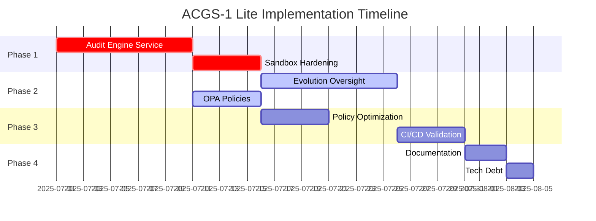

# ACGS-1 Lite Implementation Roadmap

## 🎯 Executive Summary

Based on the implementation verification report, ACGS-1 Lite has a solid foundation with the Policy Engine fully operational, but requires completion of critical governance components. This roadmap prioritizes security-critical services first, followed by functionality completion and optimization.

**Current State:**
- ✅ Policy Engine: Fully operational (2.1ms P99 latency)
- ⚠️ Evolution Oversight: Partially implemented (structure exists, logic incomplete)
- ❌ Audit Engine: Core logic exists but service not deployed
- ✅ Sandbox Controller: Working but needs hardening
- ⚠️ Performance: Meeting targets but lacks automated validation

---

## 📋 Phase 1: Critical Security & Compliance (Weeks 1-3)

### 1.1 Audit Engine Service Implementation
**Priority:** 🔴 Critical  
**Dependencies:** PostgreSQL, Redpanda, S3  
**Duration:** 1-2 weeks

**Objectives:**
- Deploy production-ready audit service on port 8003
- Implement persistent storage with cryptographic hash chaining
- Enable real-time event streaming from all services
- Set up immutable S3 archival with Object Lock

**Success Metrics:**
- 1000+ events/second ingestion rate
- Zero chain integrity failures
- <100ms query response time

**Implementation Prompt:** [Audit Engine Implementation Prompt](#audit-engine-prompt)

---

### 1.2 Sandbox Security Hardening
**Priority:** 🔴 Critical  
**Dependencies:** Kubernetes cluster, gVisor/Kata  
**Duration:** 1 week

**Objectives:**
- Replace Docker runtime with gVisor or Firecracker
- Implement strict seccomp profiles
- Enable kernel-level isolation
- Add syscall monitoring and alerting

**Success Metrics:**
- Zero sandbox escapes in penetration testing
- <50ms cold start overhead
- 100% syscall violation detection

**Implementation Prompt:** [Sandbox Security Hardening Prompt](#sandbox-hardening-prompt)

---

## 📋 Phase 2: Core Functionality Completion (Weeks 4-6)

### 2.1 Evolution Oversight Service Completion
**Priority:** 🟡 High  
**Dependencies:** Policy Engine, Audit Engine, Human Review UI  
**Duration:** 2 weeks

**Objectives:**
- Complete evaluation criteria pipeline
- Implement automated vs human approval logic
- Add rollback and override mechanisms
- Integrate with Policy Engine for compliance checks

**Success Metrics:**
- >90% auto-approval rate for safe changes
- <5 minute human review cycle time
- 100% audit trail for all decisions

**Implementation Prompt:** [Evolution Oversight Service Completion Prompt](#evolution-oversight-prompt)

---

### 2.2 OPA Policy Implementation
**Priority:** 🟡 High  
**Dependencies:** None  
**Duration:** 1 week

**Objectives:**
- Write comprehensive Rego policies for constitutional rules
- Implement policy versioning and rollback
- Add policy testing framework
- Document all constitutional principles

**Success Metrics:**
- 100% constitutional principle coverage
- All policies have unit tests
- <1ms policy compilation time

**Implementation Prompt:** [OPA Constitutional Policy Implementation Prompt](#opa-policy-prompt)

---

## 📋 Phase 3: Performance & Reliability (Weeks 7-8)

### 3.1 Policy Engine Optimization
**Priority:** 🟢 Medium  
**Dependencies:** OPA policies complete  
**Duration:** 1 week

**Objectives:**
- Embed OPA for in-process evaluation
- Optimize Redis caching strategy
- Implement partial evaluation
- Add request batching

**Success Metrics:**
- <1ms P99 latency (from 2.1ms)
- >95% cache hit rate
- 10,000 RPS throughput

**Implementation Prompt:** [Policy Engine Performance Optimization Prompt](#policy-optimization-prompt)

---

### 3.2 CI/CD Performance Validation
**Priority:** 🟢 Medium  
**Dependencies:** All services operational  
**Duration:** 1 week

**Objectives:**
- Add pytest-benchmark tests
- Implement Locust load testing
- Set up Prometheus metric validation
- Create performance regression detection

**Success Metrics:**
- All PRs run performance tests
- Automated alerts on regression
- Historical trend tracking
- <5% false positive rate

**Implementation Prompt:** [CI/CD Performance Validation Implementation Prompt](#cicd-validation-prompt)

---

## 📋 Phase 4: Documentation & Cleanup (Week 9)

### 4.1 Documentation Update
**Priority:** 🔵 Low  
**Dependencies:** All implementations complete  
**Duration:** 3 days

**Tasks:**
- Update architecture diagrams with actual implementations
- Clarify "Lite" vs full ACGS-1 scope
- Document all API endpoints
- Create operational runbooks

---

### 4.2 Technical Debt Resolution
**Priority:** 🔵 Low  
**Duration:** 2 days

**Tasks:**
- Remove placeholder code
- Consolidate service naming
- Update performance claims with actual metrics
- Archive deprecated components

---

## 🚀 Implementation Timeline

---

## 🎯 Success Criteria

### Phase 1 Complete
- [ ] Audit Engine processing 1000+ events/second
- [ ] Zero sandbox vulnerabilities in security scan
- [ ] All events have cryptographic chain integrity

### Phase 2 Complete
- [ ] Evolution Oversight handles 100% of agent changes
- [ ] Constitutional policies enforce all principles
- [ ] Human review dashboard fully operational

### Phase 3 Complete
- [ ] Policy evaluation <1ms P99 latency
- [ ] CI/CD catches 100% of performance regressions
- [ ] System handles 10,000 RPS under load

### Phase 4 Complete
- [ ] Documentation reflects actual implementation
- [ ] All placeholders and TODOs resolved
- [ ] System ready for production deployment

---

## 🔄 Risk Mitigation

### Technical Risks
1. **gVisor compatibility**: Have Firecracker as backup
2. **Performance regression**: Implement gradual rollout
3. **Chain integrity at scale**: Add sharding if needed

### Operational Risks
1. **Human review bottleneck**: Train multiple reviewers
2. **S3 costs**: Implement intelligent archival policies
3. **Database growth**: Plan partitioning strategy

---

## 📊 Resource Requirements

### Team
- 2 Backend Engineers (Weeks 1-8)
- 1 DevOps Engineer (Weeks 1-3, 7-8)
- 1 Security Engineer (Weeks 1-2)
- 1 Technical Writer (Week 9)

### Infrastructure
- Kubernetes cluster with 8+ nodes
- PostgreSQL with 500GB storage
- S3 bucket with Object Lock
- Prometheus/Grafana monitoring stack