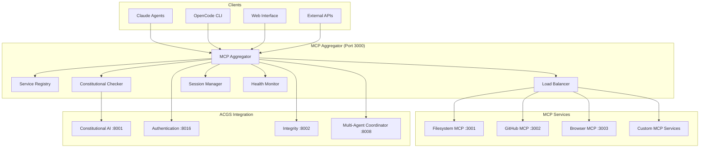

# MCP Aggregator Service Design
**Constitutional Hash:** `cdd01ef066bc6cf2`
**Port:** 3000
**Service Type:** Model Context Protocol Coordination Hub

## Domain Model

### **MCP Protocol Entities**

```python
@dataclass
class MCPService:
    service_id: UUID
    name: str
    mcp_version: str
    constitutional_hash: str = "cdd01ef066bc6cf2"
    capabilities: List[MCPCapability]
    endpoint: str
    port: int
    status: ServiceStatus
    health_check_url: str
    tools: List[MCPTool]
    resources: List[MCPResource]
    prompts: List[MCPPrompt]

@dataclass
class MCPTool:
    tool_id: str
    name: str
    description: str
    input_schema: Dict[str, Any]
    output_schema: Dict[str, Any]
    constitutional_requirements: List[str]
    service_id: UUID
    execution_timeout: int
    requires_human_approval: bool

@dataclass
class MCPSession:
    session_id: UUID
    client_id: str
    active_tools: List[str]
    conversation_context: ConversationContext
    constitutional_compliance: ConstitutionalContext
    created_at: datetime
    last_activity: datetime
    session_metadata: Dict[str, Any]

@dataclass
class MCPRequest:
    request_id: UUID
    session_id: UUID
    method: str
    tool_id: Optional[str]
    parameters: Dict[str, Any]
    constitutional_context: ConstitutionalContext
    timestamp: datetime
    client_info: ClientInfo
```

### **MCP Protocol Types**

```python
class MCPCapability(Enum):
    TOOLS = "tools"
    RESOURCES = "resources"
    PROMPTS = "prompts"
    LOGGING = "logging"
    SAMPLING = "sampling"

class MCPMethod(Enum):
    # Tool methods
    TOOLS_LIST = "tools/list"
    TOOLS_CALL = "tools/call"
    
    # Resource methods
    RESOURCES_LIST = "resources/list"
    RESOURCES_READ = "resources/read"
    RESOURCES_WATCH = "resources/watch"
    
    # Prompt methods
    PROMPTS_LIST = "prompts/list"
    PROMPTS_GET = "prompts/get"
    
    # Sampling methods
    SAMPLING_CREATE_MESSAGE = "sampling/createMessage"
    
    # Constitutional methods
    CONSTITUTIONAL_VALIDATE = "constitutional/validate"
    CONSTITUTIONAL_AUDIT = "constitutional/audit"

class ServiceStatus(Enum):
    HEALTHY = "healthy"
    DEGRADED = "degraded"
    UNHEALTHY = "unhealthy"
    OFFLINE = "offline"
```

## API Specification

### **MCP Protocol API**

```yaml
/mcp/v1/initialize:
  post:
    summary: "Initialize MCP session"
    requestBody:
      required: true
      content:
        application/json:
          schema:
            type: object
            properties:
              clientInfo:
                type: object
                properties:
                  name:
                    type: string
                  version:
                    type: string
              capabilities:
                type: object
                properties:
                  tools:
                    type: object
                  resources:
                    type: object
                  prompts:
                    type: object
              constitutional_hash:
                type: string
                enum: ["cdd01ef066bc6cf2"]
    responses:
      200:
        content:
          application/json:
            schema:
              type: object
              properties:
                session_id:
                  type: string
                  format: uuid
                serverInfo:
                  type: object
                  properties:
                    name:
                      type: string
                      default: "ACGS-2 MCP Aggregator"
                    version:
                      type: string
                capabilities:
                  type: object
                available_services:
                  type: array
                  items:
                    $ref: "#/components/schemas/MCPService"

/mcp/v1/tools/list:
  post:
    summary: "List available tools across all MCP services"
    requestBody:
      required: true
      content:
        application/json:
          schema:
            type: object
            properties:
              session_id:
                type: string
                format: uuid
              filters:
                type: object
                properties:
                  service_type:
                    type: string
                  constitutional_level:
                    type: string
                    enum: ["low", "medium", "high", "critical"]
    responses:
      200:
        content:
          application/json:
            schema:
              type: object
              properties:
                tools:
                  type: array
                  items:
                    type: object
                    properties:
                      name:
                        type: string
                      description:
                        type: string
                      inputSchema:
                        type: object
                      service_id:
                        type: string
                      constitutional_requirements:
                        type: array
                        items:
                          type: string

/mcp/v1/tools/call:
  post:
    summary: "Execute tool via appropriate MCP service"
    requestBody:
      required: true
      content:
        application/json:
          schema:
            type: object
            properties:
              session_id:
                type: string
                format: uuid
              name:
                type: string
              arguments:
                type: object
              constitutional_context:
                type: object
    responses:
      200:
        content:
          application/json:
            schema:
              type: object
              properties:
                content:
                  type: array
                  items:
                    type: object
                    properties:
                      type:
                        type: string
                        enum: ["text", "image", "resource"]
                      text:
                        type: string
                      data:
                        type: string
                        format: byte
                isError:
                  type: boolean
                constitutional_compliance:
                  $ref: "#/components/schemas/ConstitutionalValidation"

/mcp/v1/resources/list:
  post:
    summary: "List available resources across all MCP services"
    responses:
      200:
        content:
          application/json:
            schema:
              type: object
              properties:
                resources:
                  type: array
                  items:
                    type: object
                    properties:
                      uri:
                        type: string
                      name:
                        type: string
                      description:
                        type: string
                      mimeType:
                        type: string
                      service_id:
                        type: string

/mcp/v1/resources/read:
  post:
    summary: "Read resource content via appropriate MCP service"
    requestBody:
      required: true
      content:
        application/json:
          schema:
            type: object
            properties:
              session_id:
                type: string
                format: uuid
              uri:
                type: string
              constitutional_context:
                type: object
    responses:
      200:
        content:
          application/json:
            schema:
              type: object
              properties:
                contents:
                  type: array
                  items:
                    type: object
                    properties:
                      uri:
                        type: string
                      mimeType:
                        type: string
                      text:
                        type: string
                      blob:
                        type: string
                        format: byte
                constitutional_compliance:
                  type: boolean
```

### **Service Discovery & Health API**

```yaml
/api/v1/services:
  get:
    summary: "Get all registered MCP services"
    responses:
      200:
        content:
          application/json:
            schema:
              type: object
              properties:
                services:
                  type: array
                  items:
                    $ref: "#/components/schemas/MCPService"

  post:
    summary: "Register new MCP service"
    requestBody:
      required: true
      content:
        application/json:
          schema:
            type: object
            properties:
              name:
                type: string
              endpoint:
                type: string
              port:
                type: integer
              capabilities:
                type: array
                items:
                  $ref: "#/components/schemas/MCPCapability"
              constitutional_hash:
                type: string
                enum: ["cdd01ef066bc6cf2"]
    responses:
      201:
        content:
          application/json:
            schema:
              type: object
              properties:
                service_id:
                  type: string
                  format: uuid
                registration_status:
                  type: string

/api/v1/services/{service_id}/health:
  get:
    summary: "Get service health status"
    responses:
      200:
        content:
          application/json:
            schema:
              type: object
              properties:
                status:
                  $ref: "#/components/schemas/ServiceStatus"
                last_check:
                  type: string
                  format: date-time
                response_time_ms:
                  type: number
                error_rate:
                  type: number

/api/v1/constitutional/validate:
  post:
    summary: "Validate MCP operation for constitutional compliance"
    requestBody:
      required: true
      content:
        application/json:
          schema:
            type: object
            properties:
              operation:
                type: string
              context:
                type: object
              tool_name:
                type: string
              constitutional_hash:
                type: string
                enum: ["cdd01ef066bc6cf2"]
    responses:
      200:
        content:
          application/json:
            schema:
              type: object
              properties:
                is_compliant:
                  type: boolean
                compliance_score:
                  type: number
                  minimum: 0
                  maximum: 1
                violations:
                  type: array
                  items:
                    type: string
                recommendations:
                  type: array
                  items:
                    type: string
```

## Service Architecture

### **MCP Service Coordination**



### **Request Processing Pipeline**

```python
class MCPAggregator:
    def __init__(self):
        self.service_registry = ServiceRegistry()
        self.constitutional_validator = ConstitutionalValidator()
        self.session_manager = SessionManager()
        self.load_balancer = LoadBalancer()
        self.health_monitor = HealthMonitor()
    
    async def handle_mcp_request(self, request: MCPRequest) -> MCPResponse:
        # 1. Session validation
        session = await self.session_manager.get_session(request.session_id)
        if not session or not session.is_valid():
            raise InvalidSessionError("Session expired or invalid")
        
        # 2. Constitutional pre-validation
        constitutional_check = await self.constitutional_validator.validate_request(
            request, session.constitutional_compliance
        )
        
        if not constitutional_check.is_compliant:
            return MCPResponse.create_error(
                "Constitutional compliance violation",
                constitutional_check.violations
            )
        
        # 3. Service selection and routing
        target_service = await self.service_registry.find_service_for_tool(
            request.tool_id or request.method
        )
        
        if not target_service:
            return MCPResponse.create_error(
                f"No service available for {request.tool_id or request.method}"
            )
        
        # 4. Health check
        if not await self.health_monitor.is_healthy(target_service.service_id):
            # Try fallback services or return error
            fallback_service = await self.service_registry.find_fallback_service(
                target_service.service_id
            )
            target_service = fallback_service or target_service
        
        # 5. Load balancing and request forwarding
        service_instance = await self.load_balancer.select_instance(target_service)
        response = await self.forward_request(service_instance, request)
        
        # 6. Constitutional post-validation
        final_validation = await self.constitutional_validator.validate_response(
            response, constitutional_check.context
        )
        
        if not final_validation.is_compliant:
            return MCPResponse.create_error(
                "Response failed constitutional validation",
                final_validation.violations
            )
        
        # 7. Audit logging
        await self.audit_logger.log_mcp_operation(
            request, response, constitutional_check, final_validation
        )
        
        return response
    
    async def forward_request(
        self, 
        service_instance: ServiceInstance, 
        request: MCPRequest
    ) -> MCPResponse:
        """Forward MCP request to appropriate service instance"""
        
        try:
            # Create service-specific request
            service_request = self.adapt_request_for_service(request, service_instance)
            
            # Forward to service
            async with aiohttp.ClientSession() as session:
                async with session.post(
                    f"{service_instance.endpoint}/mcp/{request.method}",
                    json=service_request.to_dict(),
                    timeout=aiohttp.ClientTimeout(total=30)
                ) as response:
                    response_data = await response.json()
                    return MCPResponse.from_dict(response_data)
        
        except aiohttp.ClientError as e:
            await self.health_monitor.mark_unhealthy(
                service_instance.service_id, str(e)
            )
            raise ServiceUnavailableError(f"Service {service_instance.name} unavailable")
```

## Implementation Strategy

### **Service Registry**

```python
class ServiceRegistry:
    def __init__(self):
        self.services: Dict[UUID, MCPService] = {}
        self.tool_mappings: Dict[str, UUID] = {}
        self.capability_index: Dict[MCPCapability, List[UUID]] = {}
    
    async def register_service(self, service: MCPService) -> bool:
        """Register new MCP service with constitutional validation"""
        
        # Validate constitutional compliance
        if service.constitutional_hash != "cdd01ef066bc6cf2":
            raise ConstitutionalComplianceError("Invalid constitutional hash")
        
        # Health check
        if not await self.verify_service_health(service):
            raise ServiceRegistrationError("Service health check failed")
        
        # Register service
        self.services[service.service_id] = service
        
        # Index tools
        for tool in service.tools:
            self.tool_mappings[tool.tool_id] = service.service_id
        
        # Index capabilities
        for capability in service.capabilities:
            if capability not in self.capability_index:
                self.capability_index[capability] = []
            self.capability_index[capability].append(service.service_id)
        
        return True
    
    async def find_service_for_tool(self, tool_id: str) -> Optional[MCPService]:
        """Find service that provides specific tool"""
        service_id = self.tool_mappings.get(tool_id)
        return self.services.get(service_id) if service_id else None
```

### **Constitutional Integration**

```python
class MCPConstitutionalValidator:
    def __init__(self):
        self.constitutional_ai_client = ConstitutionalAIClient()
        self.policy_engine = PolicyEngine()
    
    async def validate_request(
        self, 
        request: MCPRequest, 
        context: ConstitutionalContext
    ) -> ConstitutionalValidation:
        """Validate MCP request for constitutional compliance"""
        
        # 1. Tool-level validation
        tool_validation = await self.validate_tool_access(
            request.tool_id, context
        )
        
        # 2. Parameter validation
        param_validation = await self.validate_parameters(
            request.parameters, request.tool_id
        )
        
        # 3. Context-based validation
        context_validation = await self.constitutional_ai_client.validate_context(
            request.constitutional_context
        )
        
        return ConstitutionalValidation.combine([
            tool_validation, param_validation, context_validation
        ])
    
    async def validate_tool_access(
        self, 
        tool_id: str, 
        context: ConstitutionalContext
    ) -> ConstitutionalValidation:
        """Validate access to specific tool based on constitutional context"""
        
        # Get tool configuration
        tool_config = await self.get_tool_constitutional_config(tool_id)
        
        # Check constitutional requirements
        for requirement in tool_config.constitutional_requirements:
            if not await self.check_constitutional_requirement(requirement, context):
                return ConstitutionalValidation(
                    is_compliant=False,
                    violations=[f"Constitutional requirement not met: {requirement}"]
                )
        
        return ConstitutionalValidation(is_compliant=True, violations=[])
```

### **Performance Requirements**

- **Request Routing**: P99 < 10ms for service selection and routing
- **Health Monitoring**: < 5 second health check intervals
- **Session Management**: Support 10,000+ concurrent sessions
- **Service Discovery**: < 1ms for service lookup
- **Constitutional Validation**: < 50ms for compliance checking

### **Security & Compliance**

- **Constitutional Hash Validation**: All services must validate `cdd01ef066bc6cf2`
- **Service Authentication**: Mutual TLS for service-to-service communication
- **Session Security**: Encrypted session storage with timeout management
- **Audit Trail**: Complete audit trail for all MCP operations
- **Tool Access Control**: Role-based access control for MCP tools


## Implementation Status

- ✅ **Constitutional Hash Validation**: Active enforcement of `cdd01ef066bc6cf2`
- 🔄 **Performance Monitoring**: Continuous validation of targets
- ✅ **Documentation Standards**: Compliant with ACGS-2 requirements
- 🔄 **Cross-Reference Validation**: Ongoing link integrity maintenance

**Overall Status**: 🔄 IN PROGRESS - Systematic enhancement implementation

## Performance Targets

This component maintains the following performance requirements:

- **P99 Latency**: <5ms (constitutional requirement)
- **Throughput**: >100 RPS (minimum operational standard)
- **Cache Hit Rate**: >85% (efficiency requirement)
- **Constitutional Compliance**: 100% (hash: cdd01ef066bc6cf2)

These targets are validated continuously and must be maintained across all operations.

---

*MCP Aggregator Service Design v1.0*
*Constitutional Hash: cdd01ef066bc6cf2*