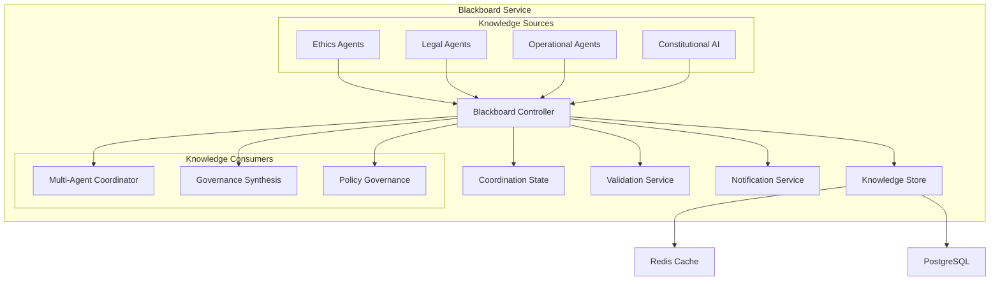

# Blackboard Service Design
**Constitutional Hash:** `cdd01ef066bc6cf2`
**Port:** 8010
**Service Type:** Shared Knowledge Coordination

## Domain Model

### **Knowledge Entities**

```python
@dataclass
class KnowledgeEntry:
    entry_id: UUID
    knowledge_type: KnowledgeType
    content: Dict[str, Any]
    constitutional_hash: str = "cdd01ef066bc6cf2"
    source_agent: AgentId
    confidence_level: float
    expiration: Optional[datetime]
    created_at: datetime
    access_control: AccessControl

@dataclass
class CoordinationContext:
    context_id: UUID
    coordination_session: UUID
    participants: List[AgentId]
    shared_knowledge: List[UUID]  # Knowledge entry IDs
    coordination_state: CoordinationState
    consensus_requirements: ConsensusRequirements
    constitutional_constraints: List[ConstitutionalConstraint]

@dataclass
class AgentContribution:
    contribution_id: UUID
    agent_id: AgentId
    knowledge_entry_id: UUID
    contribution_type: ContributionType
    validation_status: ValidationStatus
    peer_reviews: List[PeerReview]
    constitutional_compliance: ConstitutionalValidation
```

### **Knowledge Types**

```python
class KnowledgeType(Enum):
    CONSTITUTIONAL_PRINCIPLE = "constitutional_principle"
    LEGAL_PRECEDENT = "legal_precedent"
    ETHICAL_GUIDELINE = "ethical_guideline"
    OPERATIONAL_PROCEDURE = "operational_procedure"
    RISK_ASSESSMENT = "risk_assessment"
    STAKEHOLDER_FEEDBACK = "stakeholder_feedback"
    GOVERNANCE_DECISION = "governance_decision"
    POLICY_RECOMMENDATION = "policy_recommendation"
    COMPLIANCE_REQUIREMENT = "compliance_requirement"

class ContributionType(Enum):
    NEW_KNOWLEDGE = "new_knowledge"
    KNOWLEDGE_UPDATE = "knowledge_update"
    KNOWLEDGE_REFINEMENT = "knowledge_refinement"
    PEER_VALIDATION = "peer_validation"
    CONSTITUTIONAL_VERIFICATION = "constitutional_verification"
    KNOWLEDGE_SYNTHESIS = "knowledge_synthesis"

class CoordinationState(Enum):
    INITIALIZING = "initializing"
    KNOWLEDGE_GATHERING = "knowledge_gathering"
    CONSENSUS_BUILDING = "consensus_building"
    DECISION_SYNTHESIS = "decision_synthesis"
    VALIDATION = "validation"
    COMPLETED = "completed"
    ESCALATED = "escalated"
```

## API Specification

### **Knowledge Management API**

```yaml
/api/v1/knowledge:
  post:
    summary: "Add knowledge entry to blackboard"
    requestBody:
      required: true
      content:
        application/json:
          schema:
            type: object
            properties:
              knowledge_type:
                $ref: "#/components/schemas/KnowledgeType"
              content:
                type: object
              source_agent:
                type: string
                format: uuid
              confidence_level:
                type: number
                minimum: 0
                maximum: 1
              constitutional_hash:
                type: string
                enum: ["cdd01ef066bc6cf2"]
              access_control:
                $ref: "#/components/schemas/AccessControl"
    responses:
      201:
        content:
          application/json:
            schema:
              type: object
              properties:
                entry_id:
                  type: string
                  format: uuid
                validation_status:
                  type: string

  get:
    summary: "Query knowledge entries"
    parameters:
      - name: knowledge_type
        in: query
        schema:
          $ref: "#/components/schemas/KnowledgeType"
      - name: agent_id
        in: query
        schema:
          type: string
          format: uuid
      - name: constitutional_hash
        in: query
        required: true
        schema:
          type: string
          enum: ["cdd01ef066bc6cf2"]
      - name: min_confidence
        in: query
        schema:
          type: number
          minimum: 0
          maximum: 1
    responses:
      200:
        content:
          application/json:
            schema:
              type: object
              properties:
                entries:
                  type: array
                  items:
                    $ref: "#/components/schemas/KnowledgeEntry"

/api/v1/knowledge/{entry_id}:
  get:
    summary: "Get specific knowledge entry"
    responses:
      200:
        $ref: "#/components/schemas/KnowledgeEntry"
  
  put:
    summary: "Update knowledge entry"
    requestBody:
      $ref: "#/components/schemas/KnowledgeUpdate"
    responses:
      200:
        $ref: "#/components/schemas/KnowledgeEntry"

/api/v1/knowledge/{entry_id}/validate:
  post:
    summary: "Validate knowledge entry for constitutional compliance"
    responses:
      200:
        content:
          application/json:
            schema:
              type: object
              properties:
                is_compliant:
                  type: boolean
                validation_details:
                  $ref: "#/components/schemas/ConstitutionalValidation"
```

### **Coordination API**

```yaml
/api/v1/coordination:
  post:
    summary: "Create coordination context"
    requestBody:
      required: true
      content:
        application/json:
          schema:
            type: object
            properties:
              participants:
                type: array
                items:
                  type: string
                  format: uuid
              coordination_type:
                type: string
                enum: ["consensus", "hierarchical", "democratic"]
              constitutional_constraints:
                type: array
                items:
                  $ref: "#/components/schemas/ConstitutionalConstraint"
              consensus_threshold:
                type: number
                minimum: 0.5
                maximum: 1.0
    responses:
      201:
        $ref: "#/components/schemas/CoordinationContext"

/api/v1/coordination/{context_id}/knowledge:
  get:
    summary: "Get shared knowledge for coordination context"
    responses:
      200:
        content:
          application/json:
            schema:
              type: object
              properties:
                shared_knowledge:
                  type: array
                  items:
                    $ref: "#/components/schemas/KnowledgeEntry"
                coordination_state:
                  $ref: "#/components/schemas/CoordinationState"

  post:
    summary: "Contribute knowledge to coordination context"
    requestBody:
      required: true
      content:
        application/json:
          schema:
            type: object
            properties:
              knowledge_entry_id:
                type: string
                format: uuid
              contribution_type:
                $ref: "#/components/schemas/ContributionType"
              agent_id:
                type: string
                format: uuid
    responses:
      201:
        $ref: "#/components/schemas/AgentContribution"

/api/v1/coordination/{context_id}/consensus:
  get:
    summary: "Get current consensus status"
    responses:
      200:
        content:
          application/json:
            schema:
              type: object
              properties:
                consensus_score:
                  type: number
                  minimum: 0
                  maximum: 1
                participating_agents:
                  type: array
                convergence_metrics:
                  type: object
                constitutional_compliance:
                  type: boolean

  post:
    summary: "Submit consensus vote or position"
    requestBody:
      required: true
      content:
        application/json:
          schema:
            type: object
            properties:
              agent_id:
                type: string
                format: uuid
              position:
                type: object
              confidence:
                type: number
                minimum: 0
                maximum: 1
    responses:
      200:
        content:
          application/json:
            schema:
              type: object
              properties:
                updated_consensus_score:
                  type: number
                consensus_reached:
                  type: boolean
```

### **Real-time Coordination API**

```yaml
WebSocket Endpoints:
  /ws/coordination/{context_id}:
    description: "Real-time coordination updates"
    events:
      - knowledge.added
      - knowledge.updated
      - agent.joined
      - agent.left
      - consensus.updated
      - decision.reached
      - constitutional.violation

  /ws/knowledge/{knowledge_type}:
    description: "Knowledge stream by type"
    events:
      - entry.created
      - entry.validated
      - entry.expired
      - entry.challenged

  /ws/constitutional/compliance:
    description: "Constitutional compliance monitoring"
    events:
      - violation.detected
      - compliance.verified
      - escalation.triggered
```

## Service Architecture

### **Blackboard Pattern Implementation**



### **Knowledge Processing Pipeline**

```python
class BlackboardController:
    def __init__(self):
        self.knowledge_store = KnowledgeStore()
        self.constitutional_validator = ConstitutionalValidator()
        self.consensus_engine = ConsensusEngine()
        self.notification_service = NotificationService()
    
    async def add_knowledge(self, entry: KnowledgeEntry) -> KnowledgeValidationResult:
        # 1. Constitutional validation
        validation = await self.constitutional_validator.validate_knowledge(entry)
        if not validation.is_compliant:
            await self.handle_constitutional_violation(entry, validation)
            return KnowledgeValidationResult(False, validation.violations)
        
        # 2. Store knowledge
        stored_entry = await self.knowledge_store.store(entry)
        
        # 3. Index for search and retrieval
        await self.knowledge_store.index(stored_entry)
        
        # 4. Notify interested parties
        await self.notification_service.notify_knowledge_added(stored_entry)
        
        # 5. Update coordination contexts
        await self.update_coordination_contexts(stored_entry)
        
        return KnowledgeValidationResult(True, [])
    
    async def coordinate_agents(self, context: CoordinationContext) -> CoordinationResult:
        # 1. Initialize coordination session
        session = await self.initialize_coordination(context)
        
        # 2. Gather relevant knowledge
        relevant_knowledge = await self.knowledge_store.query_relevant(
            context.constitutional_constraints,
            context.coordination_type
        )
        
        # 3. Facilitate knowledge sharing
        await self.share_knowledge_with_participants(session, relevant_knowledge)
        
        # 4. Monitor consensus building
        consensus_result = await self.consensus_engine.monitor_consensus(session)
        
        # 5. Validate constitutional compliance
        final_validation = await self.constitutional_validator.validate_coordination_result(
            consensus_result
        )
        
        return CoordinationResult(
            consensus_result,
            final_validation,
            session.audit_trail
        )
```

## Implementation Strategy

### **Core Components**

1. **Knowledge Store**
   - Redis for high-performance caching and real-time access
   - PostgreSQL for persistent storage and complex queries
   - Elasticsearch for knowledge search and discovery
   - Vector database for semantic knowledge matching

2. **Coordination Engine**
   - Real-time coordination state management
   - WebSocket-based agent communication
   - Consensus algorithm implementation
   - Conflict resolution mechanisms

3. **Constitutional Validator**
   - Real-time knowledge validation
   - Constitutional principle checking
   - Compliance scoring and reporting
   - Violation detection and escalation

4. **Notification System**
   - Event-driven notifications
   - Agent subscription management
   - Real-time updates via WebSocket
   - Integration with monitoring systems

### **Data Storage Strategy**

```yaml
Redis (Cache Layer):
  - Active coordination sessions
  - Real-time agent status
  - Knowledge entry cache
  - Consensus state

PostgreSQL (Persistent Layer):
  - Knowledge entries
  - Coordination history
  - Agent contributions
  - Audit trails

Elasticsearch (Search Layer):
  - Knowledge discovery
  - Semantic search
  - Content indexing
  - Analytics

Vector Database:
  - Semantic similarity
  - Knowledge clustering
  - Constitutional principle matching
```

### **Performance Requirements**

- **Knowledge Access**: P99 < 10ms for knowledge retrieval
- **Real-time Updates**: < 100ms for coordination notifications
- **Throughput**: > 10,000 knowledge operations/second
- **Coordination Sessions**: Support 1,000+ concurrent sessions
- **Storage**: Petabyte-scale knowledge storage capability

### **Security & Compliance**

- **Constitutional Hash Validation**: All knowledge validated with `cdd01ef066bc6cf2`
- **Access Control**: Role-based access to knowledge and coordination
- **Encryption**: End-to-end encryption for sensitive knowledge
- **Audit Trail**: Complete audit trail for all knowledge operations
- **Data Retention**: Configurable retention policies for knowledge entries


## Implementation Status

- ✅ **Constitutional Hash Validation**: Active enforcement of `cdd01ef066bc6cf2`
- 🔄 **Performance Monitoring**: Continuous validation of targets
- ✅ **Documentation Standards**: Compliant with ACGS-2 requirements
- 🔄 **Cross-Reference Validation**: Ongoing link integrity maintenance

**Overall Status**: 🔄 IN PROGRESS - Systematic enhancement implementation

## Performance Targets

This component maintains the following performance requirements:

- **P99 Latency**: <5ms (constitutional requirement)
- **Throughput**: >100 RPS (minimum operational standard)
- **Cache Hit Rate**: >85% (efficiency requirement)
- **Constitutional Compliance**: 100% (hash: cdd01ef066bc6cf2)

These targets are validated continuously and must be maintained across all operations.

---

*Blackboard Service Design v1.0*
*Constitutional Hash: cdd01ef066bc6cf2*